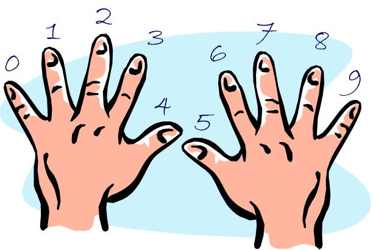
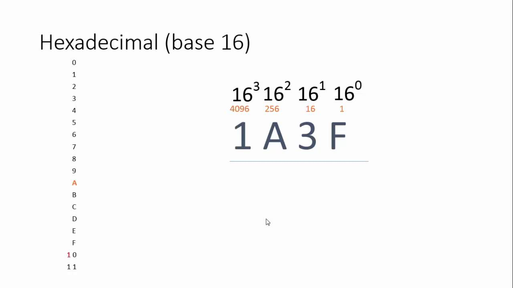
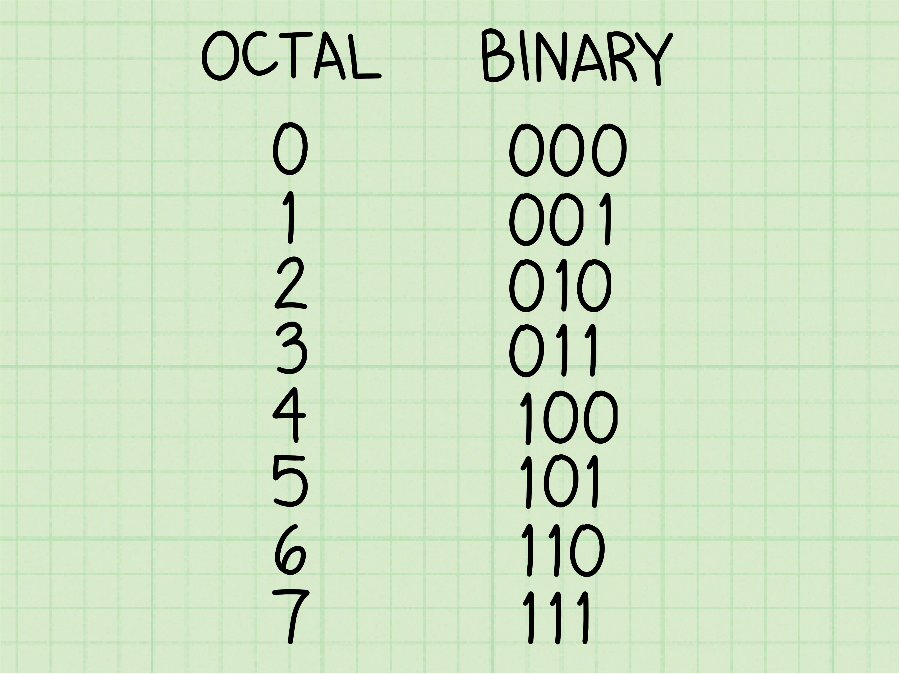

# Anexo 1: Sistemas Numéricos (Binario, Decimal, Hexadecimal y Octal)

Si vienes de lenguajes de alto nivel como Python, probablemente has vivido tu vida entera en **Base 10** (Decimal). Es natural, es lo primero que aprendemos y aparte, tenemos 10 dedos (La mayoría al menos). Pero si quieres inmiscuirte dentro del mundo de C, es necesario que conozcas los otros sistemas numéricos que usamos en computación, cada uno tiene cierto uso y ventajas con respecto a otros. Tarde o temprano te darás cuenta de que al PC le importa muy poco cuántos dedos tienes; ella solo entiende de transistores encendidos o apagados. 

Para sobrevivir en C (y sobre todo cuando llegues a los módulos de **Punteros** y **Operaciones a Nivel de Bits**), tienes que dominar los tres sistemas numéricos sagrados: **Binario (Base 2)**, **Hexadecimal (Base 16)** y nuestro viejo amigo **Decimal (Base 10)**.

De igual forma haremos un paso por el Octal para entender mejor las bases de los sistemas numéricos posiciónales.

---

## 1. Decimal (Base 10) - El aburrido

<p align="center"></p>

Ya lo conoces. Usa 10 símbolos: `0, 1, 2, 3, 4, 5, 6, 7, 8, 9`. 
Cada posición a la izquierda multiplica su "peso" por 10.

Por ejemplo, el número `425` es en realidad:
- `5 * 10^0 = 5`
- `2 * 10^1 = 20`
- `4 * 10^2 = 400`
- **Suma = 425**

Fácil, ¿verdad? El problema es que a nivel de hardware esto es un dolor de cabeza de usar, por eso los computadores usan otro sistema numérico.

---

## 2. Binario (Base 2) - El idioma de la máquina

<p align="center"></p>

Las computadoras operan con interruptores microscópicos. Un interruptor tiene dos estados: apagado (`0`) o encendido (`1`). Esto es el sistema binario. Usa solo 2 símbolos: `0` y `1`. 

Cada posición a la izquierda multiplica su peso por 2. Por lo tanto, los pesos posiciónales de derecha a izquierda son las potencias de 2: `1, 2, 4, 8, 16, 32, 64, 128...`

> A un solo `0` o `1` se le llama **Bit** (Binary Digit).
> Un grupo de 8 bits forma un **Byte**.

### ¿Cómo leer Binario?
Tomemos el número binario de 8 bits (1 byte): `01101011`

Colócalo debajo de los "pesos" (potencias de 2):
| 128 | 64 | 32 | 16 | 8  | 4  | 2  | 1  |
| --- | -- | -- | -- | -- | -- | -- | -- |
| 0   | 1  | 1  | 0  | 1  | 0  | 1  | 1  |

Para convertirlo a decimal, solo sumas los pesos donde haya un `1`:
`64 + 32 + 8 + 2 + 1 = 107`

```c
int número = 0b01101011; // Esto es exactamente igual a escribir 107
```

¡Felicidades! Ahora entiendes cómo funciona el binario. Vamos a ahondar un poco más en esto, analizando cómo es el proceso estándar para pasar de binario a decimal y viceversa.

### Conversión Binario a Decimal

Para pasar de un número binario a decimal, necesitamos primero que nada asignar una posición a cada dígito binario, empezando desde la derecha con la posición 0 y aumentando en 1 por cada dígito binario hacia la izquierda.

Tomemos un ejemplo sencillo, supongamos que tenemos el número binario `1010`.

Asignamos las posiciones de derecha a izquierda:

| Dígito binario | Posición |
| --- | --- |
| 0 | 0 |
| 1 | 1 |
| 0 | 2 |
| 1 | 3 |

Ahora como sabemos, estamos en base 2, por lo tanto, cada dígito binario multiplica su peso por 2. Entonces, para convertir ese número en binario a decimal, multiplicamos cada dígito binario por su peso correspondiente y sumamos los resultados.


$$
0 * 2^0 + 1 * 2^1 + 0 * 2^2 + 1 * 2^3 = 0 * 1 + 1 * 2 + 0 * 4 + 1 * 8 = 0 + 2 + 0 + 8 = 10
$$


Otro ejemplo: convertir el número binario $1101$ a decimal.

Asignamos las posiciones de derecha a izquierda:

| Dígito binario | Posición |
| --- | --- |
| 1 | 0 |
| 0 | 1 |
| 1 | 2 |
| 1 | 3 |

Ahora multiplicamos cada dígito binario por su peso correspondiente y sumamos los resultados.


$$
1 * 2^0 + 0 * 2^1 + 1 * 2^2 + 1 * 2^3 = 1 * 1 + 0 * 2 + 1 * 4 + 1 * 8 = 1 + 0 + 4 + 8 = 13
$$


Como puedes ver el proceso es siempre el mismo, recuerda que siempre contamos la posición 0 como la de más a la izquierda, esto funciona muy bien para números enteros, sin embargo la cosa cambia un poco con los números flotantes y demás pero lo veremos en otro módulo.

De lo anterior podemos desglosar la siguiente fórmula para cada entero sin signo:


$$
D = \sum_{i=0}^{n} b_i \cdot 2^i
$$


O de forma expandida:


$$
D = (b_n \cdot 2^n) + (b_{n-1} \cdot 2^{n-1}) + \dots + (b_1 \cdot 2^1) + (b_0 \cdot 2^0)
$$


**Donde:**
- $D$: Es el valor decimal final.
- $b_i$: Es el valor numérico del bit en la posición $i$ (siempre será 0 o 1).
- $2^i$: Es el peso o multiplicador asociado a esa posición.
- $n$: Es el índice de la posición del bit más significativo (a la izquierda). Como las posiciones se cuentan desde cero, $n$ es igual al número total de bits menos uno.

### De decimal a binario

Ahora que sabes como desglosar un número binario en decimal, vamos a hacerlo al revés, de decimal a binario. El proceso es el siguiente:

El método estándar que vamos a aplicar es el conocido como el "método de la división", el cual consiste en hacer divisiónes sucesivas por 2 y tomar los **cocientes** y **residuos**.

Tomemos como ejemplo el número decimal $132$. 

1. Vamos a dividir $132$ entre $2$. y guardamos el residuo: $132 \div 2 = 66$ con resto $0$. 
2. Luego hacemos lo mismo con el número entero que nos quedó: $66 \div 2 = 33$ con resto $0$.    
3. Seguimos con el número entero que nos quedó: $33 \div 2 = 16$ con resto $1$. 
4. Seguimos con el número entero que nos quedó: $16 \div 2 = 8$ con resto $0$. 
5. Seguimos con el número entero que nos quedó: $8 \div 2 = 4$ con resto $0$. 
6. Seguimos con el número entero que nos quedó: $4 \div 2 = 2$ con resto $0$. 
7. Seguimos con el número entero que nos quedó: $2 \div 2 = 1$ con resto $0$. 
8. Seguimos con el número entero que nos quedó: $1 \div 2 = 0$ con resto $1$. 

Ahora que tenemos todo los restos, si te das cuenta estos siempre oscilarán entre 0 y 1, los restos en orden son los siguientes (empezando desde el primero): 

$0, 0, 1, 0, 0, 0, 0, 1$ 

Para obtener el número binario, simplemente tenemos que invertir el orden de los restos y listo, en nuestro ejemplo el número binario es: 


$$
10000011_2
$$


Otro ejemplo, vamos a convertir el número decimal $200$ a binario. 

1. Dividimos $200$ entre $2$. y guardamos el residuo: $200 \div 2 = 100$ con resto $0$. 
2. Hacemos lo mismo con el número entero que nos quedó: $100 \div 2 = 50$ con resto $0$. 
3. Seguimos con el número entero que nos quedó: $50 \div 2 = 25$ con resto $0$. 
4. Seguimos con el número entero que nos quedó: $25 \div 2 = 12$ con resto $1$. 
5. Seguimos con el número entero que nos quedó: $12 \div 2 = 6$ con resto $0$. 
6. Seguimos con el número entero que nos quedó: $6 \div 2 = 3$ con resto $0$. 
7. Seguimos con el número entero que nos quedó: $3 \div 2 = 1$ con resto $1$. 
8. Seguimos con el número entero que nos quedó: $1 \div 2 = 0$ con resto $1$. 

Ahora que tenemos todo los restos, si te das cuenta estos siempre oscilarán entre 0 y 1, los restos en orden son los siguientes (empezando desde el primero): 

$0, 0, 0, 1, 0, 0, 1, 1$ 

Para obtener el número binario, simplemente tenemos que invertir el orden de los restos y listo, en nuestro ejemplo el número binario es: 


$$
11001000_2
$$


Como puedes notar es un proceso bastante sencillo, simplemente hay que saber bien las potencias de 2, es todo.


Si no me crees toma cualquiera de los números y haz el proceso inverso, ahí verás que efectivamente funciona.

Otra cosa importante, para saber cuántos bits o sea, cuántos "0" y "1" necesitas para representar un número, puedes hacer la siguiente operación matemática:


$$
b = \lfloor \log_2(N) \rfloor + 1
$$


Toma el logaritmo en base de 2 de cualquier número entero sin signo, por ejemplo, del número decimal $132$: 

$log₂(132) ≈ 7.044

Floor nos da el "piso" o redondeamos hacia abajo, así que floor(7.044) = 7$. 

Sumamos 1 y obtenemos: 8 bits.

Lo que significa que necesitamos al menos 8 bits para representar el número decimal 132 en binario.

Ahora hagamos lo mismo con el número 200:


$$
log_2(200) \approx 7.644
$$


Floor nos da el "piso", así que $floor(7.644) = 7$. 

Sumamos 1 y obtenemos: 8 bits.

Lo que significa que necesitamos al menos 8 bits para representar el número decimal 200 en binario.

Como puedes ver, esta fórmula nos da el número de bits mínimos necesarios para representar un número entero sin signo, si "el resultado no es entero", o sea, si es un número decimal como 7.044 o 7.644, entonces simplemente tomamos el "piso" y le sumamos 1, esto funciona perfectamente para números enteros sin signo además del 0.


---

## 3. Hexadecimal (Base 16) - El salvavidas de los programadores.

<p align="center"></p>

Leer secuencias gigantescas de 0s y 1s es inhumano. Imagina tener que leer una dirección de memoria de 64 bits en binario:
`1111111111111111111111111111111111111111111111111111111111111111` 
Te sangrarían los ojos. Aquí es donde el **Hexadecimal** entra como una suerte de salvador.

El sistema Hexadecimal usa 16 símbolos:
`0, 1, 2, 3, 4, 5, 6, 7, 8, 9, A, B, C, D, E, F`
Donde `A`=10, `B`=11, `C`=12, `D`=13, `E`=14 y `F`=15.

### Agrupación Perfecta
La razón de existir del hexadecimal en informática es que **1 dígito hexadecimal equivale EXACTAMENTE a 4 bits (un Nibble)**. Es decir, `2^4 = 16`. Esto significa que puedes comprimir código binario directamente y sin pensar en matemáticas complejas, solo mapeando.

| Hex | Decimal | Binario | | Hex | Decimal | Binario |
| --- | ------- | ------- |-| --- | ------- | ------- |
| 0   | 0       | 0000    | | 8   | 8       | 1000    |
| 1   | 1       | 0001    | | 9   | 9       | 1001    |
| 2   | 2       | 0010    | | A   | 10      | 1010    |
| 3   | 3       | 0011    | | B   | 11      | 1011    |
| 4   | 4       | 0100    | | C   | 12      | 1100    |
| 5   | 5       | 0101    | | D   | 13      | 1101    |
| 6   | 6       | 0110    | | E   | 14      | 1110    |
| 7   | 7       | 0111    | | F   | 15      | 1111    |

Por ejemplo, si tienes el byte `11000110`, lo divides en dos bloques de 4:
`1100` y `0110`.
Buscas en la tabla:
- `1100` = `C`
- `0110` = `6`
Tu número es `C6`.

En C, el hexadecimal se escribe con el prefijo `0x`.
```c
int num = 0xC6; // Esto es igual a 0b11000110 o 198 en decimal
```

Las direcciones de memoria que verás con punteros (ej. `0x7ffee23b`) siempre estarán en Hexadecimal para que sean legibles y compactas.

### De Decimal a Hexadecimal
Para pasar de decimal a hexadecimal, hacemos lo mismo que en el método de división, pero en vez de dividir entre 2, dividimos entre 16.

Por ejemplo, vamos a pasar el decimal 132 a hexadecimal:

1. Dividimos 132 entre 16. y guardamos el residuo: $132 \div 16 = 8$ con resto $4$.
2. Luego hacemos lo mismo con el número entero que nos quedó: $8 \div 16 = 0$ con resto $8$.
3. Seguimos con el número entero que nos quedó: $0 \div 16 = 0$ con resto $0$.

Ahora que tenemos todo los restos, si te das cuenta estos siempre oscilarán entre 0 y 15, los restos en orden son los siguientes (empezando desde el primero): 


$$
4, 8, 0
$$


Para obtener el número hexadecimal, simplemente tenemos que invertir el orden de los restos y listo, en nuestro ejemplo el número hexadecimal es: 


$$
0x84
$$


Otro ejemplo, vamos a pasar el decimal 200 a hexadecimal: 

1. Dividimos 200 entre 16. y guardamos el residuo: $200 \div 16 = 12$ con resto $8$. 
2. Luego hacemos lo mismo con el número entero que nos quedó: $12 \div 16 = 0$ con resto $12$. 
3. Seguimos con el número entero que nos quedó: $0 \div 16 = 0$ con resto $0$. 

Ahora que tenemos todo los restos, si te das cuenta estos siempre oscilarán entre 0 y 15, los restos en orden son los siguientes (empezando desde el primero): 

$8, 12, 0$ 

Como 12 es mayor a 10, lo convertimos a hexadecimal, en este caso 12 es igual a "C". 

Para obtener el número hexadecimal, simplemente tenemos que invertir el orden de los restos y listo, en nuestro ejemplo el número hexadecimal es: 


$$
0xC8
$$


### Hexadecimal a Decimal

Para hacer el camino inverso y convertir un número hexadecimal a decimal, el proceso es idéntico al que usamos con el binario, pero en lugar de multiplicar por potencias de 2, multiplicaremos por **potencias de 16**.

Tomemos como ejemplo el número hexadecimal `0xC8`. 

Al igual que antes, asignamos posiciones de derecha a izquierda:

| Dígito Hexadecimal | Valor Decimal ($h_i$) | Posición ($i$) | Multiplicador ($16^i$) |
| --- | --- | --- | --- |
| 8 | 8 | 0 | $16^0 = 1$ |
| C | 12 | 1 | $16^1 = 16$ |

Ahora multiplicamos cada valor por su peso correspondiente y sumamos:


$$
12 * 16^1 + 8 * 16^0 = 12 * 16 + 8 * 1 = 192 + 8 = 200
$$


Y eso es todo, así obtenemos el número $200$ en decimal.

De esto podemos extraer la fórmula general para la conversión de Hexadecimal a Decimal:


$$
D = \sum_{i=0}^{n} h_i \cdot 16^i
$$


O de forma expandida:


$$
D = (h_n \cdot 16^n) + (h_{n-1} \cdot 16^{n-1}) + \dots + (h_1 \cdot 16^1) + (h_0 \cdot 16^0)
$$


**Donde:**
- $D$: Es el valor decimal final.
- $h_i$: Es el valor decimal del dígito hexadecimal en la posición $i$ (desde $0$ para '0' hasta $15$ para 'F').
- $16^i$: Es el peso o multiplicador asociado a esa posición.
- $n$: Es el índice de la posición del dígito más significativo (a la izquierda).


---

## 4. Octal (Base 8) - El sistema olvidado

<p align="center"></p>

El sistema Octal (Base 8) usa los dígitos del `0` al `7`. Así como el hexadecimal agrupa de a 4 bits, el octal **agrupa de a 3 bits** (`2^3 = 8`). 

En los albores de la computación, cuando las arquitecturas de 12, 24 o 36 bits eran comunes, agrupar de a 3 bits era perfecto. Hoy en día, en un mundo gobernado por procesadores de 32 o 64 bits (múltiplos de 4), el Octal ha quedado casi obsoleto, excepto para cosas muy específicas como los permisos de archivos en UNIX/Linux (ej. `chmod 777`).

**La correspondencia Octal a Binario (agrupación de 3 bits):**
- `0` = `000`
- `1` = `001`
- `2` = `010`
- `3` = `011`
- `4` = `100`
- `5` = `101`
- `6` = `110`
- `7` = `111`

### Decimal a Octal

Para pasar de decimal a octal, aplicamos exactamente el mismo "método de la división", pero esta vez dividiendo sucesivamente entre **8**.

Por ejemplo, vamos a convertir el número decimal $132$ a octal:

1. Dividimos 132 entre 8. $132 \div 8 = 16$ con resto **$4$**.
2. Dividimos el cociente (16) entre 8. $16 \div 8 = 2$ con resto **$0$**.
3. Dividimos el cociente (2) entre 8. $2 \div 8 = 0$ con resto **$2$**.

Los restos siempre estarán entre $0$ y $7$. En orden de obtención tenemos: $4, 0, 2$.

Si invertimos el orden de los restos, obtenemos nuestro número octal:

$$
0204_8 \text{ (o simplemente } 204_8)
$$

### Octal a Decimal

Para el camino inverso, usamos los multiplicadores de posición, donde cada peso es una **potencia de 8**.

Tomemos nuestro ejemplo $204_8$:

| Dígito Octal ($o_i$) | Posición ($i$) | Multiplicador ($8^i$) |
| --- | --- | --- |
| 4 | 0 | $8^0 = 1$ |
| 0 | 1 | $8^1 = 8$ |
| 2 | 2 | $8^2 = 64$ |

Multiplicamos cada valor por su peso y sumamos:

$$
2 * 8^2 + 0 * 8^1 + 4 * 8^0 = 2 * 64 + 0 * 8 + 4 * 1 = 128 + 0 + 4 = 132
$$


Y eso es todo, volvemos a nuestro número $132$ en decimal. 

De esto podemos extraer la fórmula general para la conversión de Octal a Decimal:


$$
D = \sum_{i=0}^{n} o_i \cdot 8^i
$$


O de forma expandida:


$$
D = (o_n \cdot 8^n) + (o_{n-1} \cdot 8^{n-1}) + \dots + (o_1 \cdot 8^1) + (o_0 \cdot 8^0)
$$


**Donde:**
- $D$: Es el valor decimal final.
- $o_i$: Es el valor del dígito octal en la posición $i$ (desde $0$ hasta $7$).
- $8^i$: Es el peso o multiplicador asociado a esa posición.
- $n$: Es el índice de la posición del dígito más significativo.

### ATENCIÓN
En C, el octal se denota con un **cero a la izquierda**. Si a cualquier número le pones un `0` al inicio, el compilador automáticamente lo leerá como Octal, así que ten cuidado con eso.

```c
int trampa = 010; // Si crees que esto es 10... te equivocas.
printf("%d", trampa); 
```
El código de arriba imprimirá **`8`** porque `010` en octal equivale a `8` en decimal (`1 * 8^1 + 0 * 8^0`). 

> [!WARNING]
> Nunca escribas variables numéricas enteras "rellenando" con ceros a la izquierda para que se vean alineadas, a menos que quieras perder la cabeza haciendo debugging. C asumirá que estás escribiendo en Base 8.

### Resumen Visual

| Código C | Base | Prefijo | Lo que realmente ve C | Uso principal / ¿Para qué sirve? |
| --- | --- | --- | --- | --- |
| `int a = 42;` | Decimal | Ninguno | 42 | Interacción humana estándar, contadores comunes y matemáticas de alto nivel. |
| `int b = 0b101010;` | Binario | `0b` | 42 | Hardware puro, manipulación de estados lógicos individuales, banderas (flags) y máscaras de bits. |
| `int c = 0x2A;` | Hexadecimal| `0x` | 42 | Direcciones de memoria (punteros), representación compacta de bytes (códigos de color, criptografía). |
| `int d = 052;` | Octal | `0` (el cero inicial) | 42 | Prácticamente obsoleto hoy en día. Su uso actual se reduce casi en exclusiva a los permisos de archivos en UNIX/Linux (ej. `chmod 777`). |

Todas esas variables contienen exactamente el mismo valor. Es solo una convención visual para el programador. C transformará todo a binario de todas formas cuando llegue al ensamblador.

---

<div align="center">
  <a href="../Modulos/16_GUI_SDL/16_GUI_SDL.md">⬅️ Retroceder</a> | 
  <a href="./README.md">💻 Ir a Códigos</a> | 
  <a href="02_Complemento_a_2.md">Avanzar ➡️</a>
</div>
