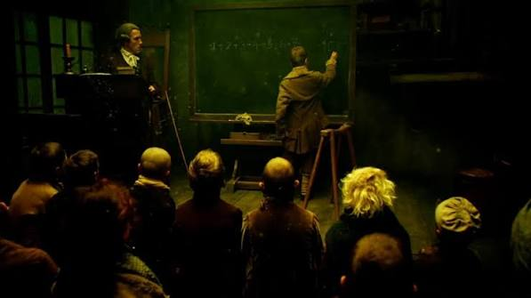
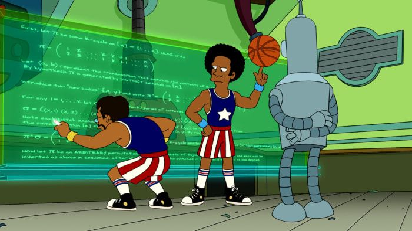

# Anexo 2: Complemento a 2 (La magia negra de los números negativos)

Si ya leíste el **Anexo 1**, sabes cómo las computadoras representan números enteros positivos usando binario. Pero, ¿qué pasa cuando queremos representar deudas, temperaturas bajo cero o cosas por el estilo? Para ello usamos **números negativos**.

El problema es que en el hardware de una computadora no existe un símbolo mágico de `-` (menos). Solo tenemos interruptores de `0` y `1`. Así que, históricamente, los ingenieros tuvieron que inventar trucos para que esos mismos ceros y unos representaran números negativos. 

Aquí te cuento la historia de cómo fallaron rotundamente un par de veces antes de dar con la solución definitiva que usamos hoy en día: **El Complemento a 2**.

---

## 1. El Problema: La necesidad de representar el signo

<p align="center"></p>

Antes de llegar a la solución, veamos cómo los primeros ingenieros intentaron (y fracasaron al) resolver este problema.

### Intento Fallido #1: Signo y Magnitud

La idea más intuitiva humana es: *"Usemos el primer bit de la izquierda como si fuera el símbolo de menos"*. 
A este bit se le llamó **Bit de Signo**, donde `0` significa Positivo (+) y `1` significa Negativo (-). El resto de los bits representan la magnitud (el valor).

En un sistema de 4 bits:
- `0011` = $+3$
- `1011` = $-3$

**¿Por qué fracasó miserablemente?**
1. **El problema del doble cero:** En este sistema, `0000` es $+0$, pero `1000` es $-0$. Matemáticamente, tener dos ceros es una abominación que arruina la lógica comparativa en el hardware (¿es `+0` igual a `-0`? El procesador tenía que gastar tiempo verificándolo).
2. **Circuitos separados:** Intentar sumar `0011 (+3)` y `1011 (-3)` de forma directa daba `1110 (-6)`, lo cual es falso (la respuesta es 0). Para que esto funcionara, el procesador necesitaba un circuito entero dedicado a sumar y *otro circuito completamente distinto* y complejo dedicado a restar. Costoso y lento.

### Intento Fallido #2: Complemento a 1 (A1)

Para arreglar la matemática, alguien sugirió: *"Si queremos el negativo de un número, simplemente invirtamos todos sus bits"*. 
A esto se le conoce como **Complemento a 1**.

En un sistema de 4 bits:
- `0011` = $+3$
- Negativo de 3 = Invertimos todo = `1100` ($-3$ en Complemento a 1)

Esto mejoró la lógica de las sumas. Si sumabas `0011 (+3)` + `1100 (-3)` te daba `1111`. Y como el primer bit es `1`, sabías que era un número negativo, y al invertirlo de vuelta te daba `0000` (cero). 

**¿Por qué también fracasó?**
¡Porque seguimos teniendo dos ceros!
- `0000` = $+0$
- Invertir todo = `1111` = $-0$

El hardware seguía odiando tener que lidiar con dos representaciones para la nada absoluta.

---

## 2. La Solución Definitiva: El Complemento a 2

<p align="center"></p>

Finalmente, los ingenieros lograron dar con la solución definitiva. Una forma de representar negativos que:
1. Destruye la aberración del "doble cero".
2. Permite que la suma y la resta se calculen **usando exactamente el mismo circuito**.

Bienvenido al **Complemento a 2 (A2)**, el estándar absoluto en todas las arquitecturas modernas.

### El Algoritmo de Conversión
Para conseguir el número negativo de cualquier positivo, el proceso es simple, aunque un poco confuso al inicio:

1. Tomas el número positivo en binario.
2. Inviertes todos los bits (igual que en el Complemento a 1).
3. **Le sumas 1 al resultado.**

**Ejemplo: Convertir $3$ a $-3$ (en 4 bits)**
1. El número $+3$: `0011`
2. Invertimos todo (Complemento a 1): `1100`
3. Le sumamos $1$: `1100 + 1 = 1101`

Por lo tanto, en Complemento a 2, **`-3` es `1101`**.

> [!NOTE]
> ¡El bit más a la izquierda sigue funcionando como Bit de Signo! Si empieza con `1` es negativo, si empieza con `0` es positivo. 

¿Qué pasa si intentamos encontrar el negativo del cero?
1. Número $+0$: `0000`
2. Invertimos: `1111`
3. Sumamos $1$: `1111 + 1 = 10000`
Como solo tenemos 4 bits, el quinto bit (`1`) se desborda y se pierde. Nos quedamos con `0000`. 
El negativo de 0 es 0, **Hemos eliminado el doble cero (como debía ser en un inicio)**.

Para que entiendas un poco mejor esto de las sumas, vamos a explicarte cómo es que se suma en binario.

Esto principalmente porque 0 + 0 = 0 y 1 + 0 = 1,  pero 1 + 1 = 10 y 1 + 1 + 1 = 11. 

Vamos desglosando estas reglas:

La suma binaria funciona exactamente igual que la suma decimal que aprendiste en la escuela primaria, solo que en lugar de "llevarte una" (el famoso acarreo o *carry*) cuando llegas a 10, te llevas una en cuanto pasas de 1.

**Las 4 reglas básicas:**
- `0 + 0 = 0`
- `1 + 0 = 1`
- `0 + 1 = 1`
- `1 + 1 = 10` (Escribes el `0` y te llevas `1` a la siguiente columna).

**La regla especial (cuando ya traes un acarreo):**
- `1 + 1 + 1 = 11` (Escribes el `1` y te llevas `1`).

#### Ejemplo 1: Suma simple
Vamos a sumar $2 + 3$ en binario (`0010` + `0011`):
```text
  0010  (2)
+ 0011  (3)
-------
  0101  (5)
```
**Paso a paso (de derecha a izquierda):**
1. Columna 1: `0 + 1 = 1`
2. Columna 2: `1 + 1 = 10` (Escribes `0` y te llevas `1`)
3. Columna 3: `0 + 0 + 1 (acarreo) = 1`
4. Columna 4: `0 + 0 = 0`

#### Ejemplo 2: Suma con reacción en cadena
Sumemos $7 + 1$ (`0111` + `0001`):
```text
  111   <-- Acarreos invisibles
  0111  (7)
+ 0001  (1)
-------
  1000  (8)
```
**Paso a paso (de derecha a izquierda):**
1. Columna 1: `1 + 1 = 10` (Escribes `0` y te llevas `1`)
2. Columna 2: `1 + 0 + 1 (acarreo) = 10` (Escribes `0` y te llevas `1`)
3. Columna 3: `1 + 0 + 1 (acarreo) = 10` (Escribes `0` y te llevas `1`)
4. Columna 4: `0 + 0 + 1 (acarreo) = 1`

¡Y así llegas al resultado! Por eso, cuando hace rato sumamos `1111` + `1`, el acarreo viajó como un efecto dominó hasta el quinto bit formando el famoso `10000` (del cual descartamos el `1` final).

Si te quedaron dudas con esto, échale un vistazo otra vez, es un poco complicado cambiar el chip con el que se piensa cuando sumamos.


### El Círculo del A2 (La analogía del reloj)

Piensa en los números de 4 bits (del `0000` al `1111`) como las horas en un reloj analógico.
Tienes 16 combinaciones posibles. En lugar de ir del $0$ al $15$, el reloj se divide por la mitad:
- La mitad derecha (que empieza con bit `0`) cuenta del $0$ al $7$ positivos.
- La mitad izquierda (que empieza con bit `1`) cuenta del $-1$ al $-8$ negativos.

Si estás en el $0$ (`0000`) y restas $1$, giras hacia la izquierda y llegas a `1111` ($-1$). 
Es un sistema circular perfecto. 

### Cálculo de Rangos

Gracias a que perdimos el "-0", ganamos un espacio extra del lado de los negativos.
En un sistema de $n$ bits, la fórmula general para saber el rango de valores representables en Complemento a 2 es:

$$
\text{Desde } -2^{n-1} \text{ hasta } 2^{n-1}-1
$$

**Ejemplo en 8 bits (un `char` en C):**
- $n = 8$
- Rango: $-2^7$ hasta $2^7-1$
- **Rango:** $-128$ a $127$ (¡Por eso un `signed char` en C llega hasta 127 y no 128!)

---

## 3. Operaciones Aritméticas

<p align="center"></p>

Este es el punto donde entiendes por qué el A2 es tan importante.

### La resta es una suma disfrazada
Para el procesador (la ALU), la operación de "Resta" matemáticamente no existe. 
Hacer $A - B$ es literalmente procesado como **$A + (-B)$**. Y como conseguir el negativo ($-B$) es tan fácil como invertir y sumar 1, el hardware vuela.

### Suma Unificada: El mismo circuito para todo
Sumemos $3$ y $-2$ en 4 bits. Debería dar $1$.
- $+3$ es `0011`
- $-2$ es `1110` (calculado con el algoritmo: $+2$ es `0010` -> invierte `1101` -> suma 1 = `1110`)

Hacemos suma binaria normal:
```
  0011  (+3)
+ 1110  (-2)
-------
 10001
```
Como estamos en un sistema de 4 bits, el quinto bit de acarreo (`1`) de la izquierda **se descarta**. El resultado es `0001` (que es $+1$).
El procesador acaba de sumar un positivo con un negativo y dio la respuesta correcta **usando el mismo chip que suma dos positivos**. ¿Loco, verdad?

### Desbordamiento (Overflow)
La única trampa del Complemento a 2 es el **Overflow**. 
Como la capacidad es limitada, ¿qué pasa si en 4 bits sumamos $7 + 1$?
- $+7$: `0111`
- $+1$: `0001`
- Suma = `1000`

Un momento... `1000` empieza con el bit `1`, por lo tanto el procesador lo interpreta como un número negativo (específicamente, $-8$). 
Sumaste dos números positivos y te dio negativo. Esto es el famoso *Integer Overflow*.

> [!WARNING]
> Regla del hardware: Ocurre Overflow si sumas dos positivos y te da negativo, o si sumas dos negativos y te da positivo. Sumar un positivo y un negativo **nunca** genera Overflow.

---

## 4. Aplicaciones Prácticas y Avanzadas

<p align="center"></p>

El Complemento a 2 no solo sirve para guardar números, es la base de varios trucos de la arquitectura del hardware.

### Extensión de Signo (Sign Extension)
Imagina que tienes un número de 8 bits (como un `char`) y quieres meterlo en una variable de 16 bits (como un `short`). 
Si el número es $+5$ (`00000101`), solo agregas ceros a la izquierda: `0000000000000101`. Sigue siendo $+5$.

Pero si es $-5$ (`11111011`), y le agregas ceros a la izquierda, te queda `0000000011111011`... que al empezar con cero, ahora es un número positivo gigante.
Para solucionarlo, el procesador hace **Extensión de Signo**: toma el bit más significativo y lo copia en todos los espacios nuevos.
`-5` extendido a 16 bits es `1111111111111011`. Matemáticamente, en A2, sigue valiendo exactamente $-5$.

### Impacto en Algoritmos de Hardware (El Algoritmo de Booth)
El A2 revolucionó la forma de crear procesadores. Métodos avanzados de multiplicación en hardware, como el famoso **Algoritmo de Booth**, dependen intrínsecamente del Complemento a 2 para multiplicar números negativos de forma fluida. 
Antes de esto, el hardware tenía que verificar los signos, separarlos, multiplicar las magnitudes en positivo y luego volver a pegarles el signo. Con Booth y A2, el hardware simplemente opera la multiplicación en crudo y el signo se resuelve solo.

### Perspectiva en Ensamblador (Arquitectura ARM)
Cuando programas a nivel de ensamblador (por ejemplo, en procesadores ARM o x86), la CPU tiene un registro especial llamado `CPSR` (Current Program Status Register) que guarda "Banderas" (Flags) después de cada operación matemática.
Las flags más comunes son:
- **N (Negative):** Se enciende si el resultado fue negativo (básicamente copia el bit más significativo del A2).
- **Z (Zero):** Se enciende si el resultado fue exactamente `0`.
- **V (o O) (Overflow):** Se enciende si el A2 falló catastróficamente (lo que vimos de sumar dos positivos y que dé negativo).

El procesador ni siquiera sabe qué intentabas calcular, solo mira el resultado en A2 y enciende lucecitas (flags). Tú, como programador, usas instrucciones como "Salta si la flag Z está encendida" (`JZ` o `BEQ`). Todo tu código condicional en C (`if (a == b)`) depende, en el fondo, de la belleza del Complemento a 2.


