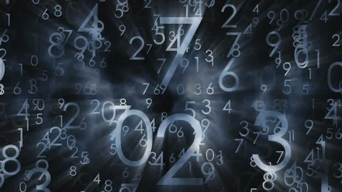
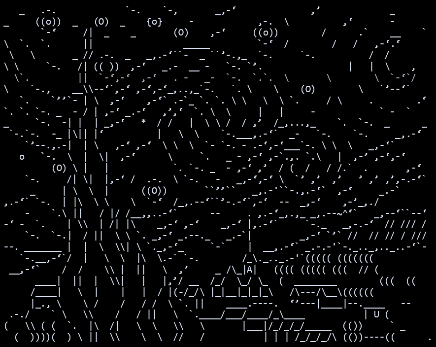
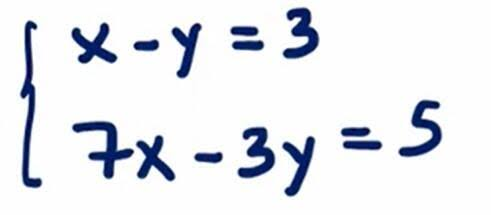
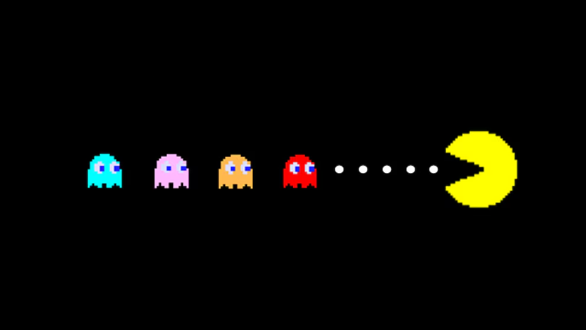
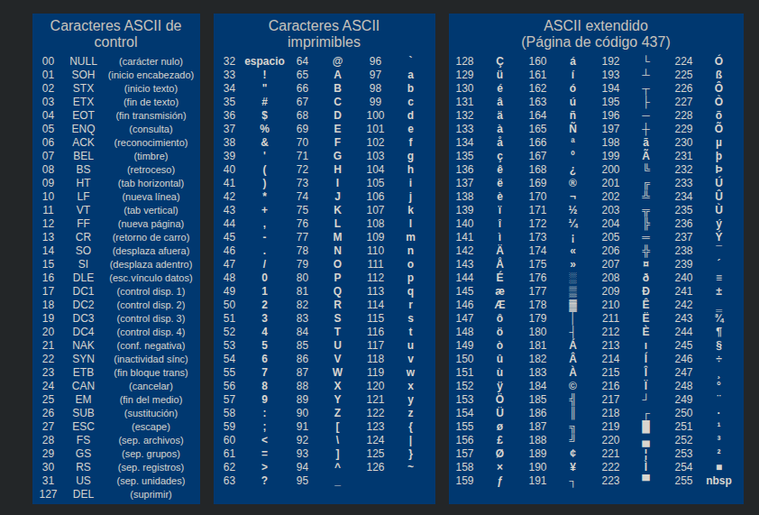

# Anexo 3: La Tabla ASCII (Porque las computadoras no saben leer)

Si has prestado atención hasta ahora, sabes que el procesador solo entiende de voltajes, transistores, ceros y unos. Entonces, ¿cómo es posible que estés leyendo este texto en tu pantalla? ¿Cómo entiende C lo que es una letra `'A'` o un símbolo de interrogación `?`?

La respuesta es simple: **No lo entiende.** 
Para la computadora, las letras no existen. Todo es una gigantesca ilusión óptica creada por un diccionario de traducción llamado **Tabla ASCII** (*American Standard Code for Information Interchange*).

---

## 1. Todo es un maldito número

<p align="center"></p>

En C, el tipo de dato `char` (character) no guarda una letra. Guarda un número entero pequeño (de 8 bits, es decir, de -128 a 127). 

Cuando escribes en tu código:
```c
char letra = 'A';
```
El compilador se ríe, busca en la tabla ASCII qué número le corresponde a la `'A'`, y guarda un **65** en la memoria. 
Es decir, hacer `char letra = 'A';` y hacer `char letra = 65;` es **exactamente lo mismo** para C. El que decide si eso se imprime como un `65` o como una letra `'A'` eres tú, al usar `%d` o `%c` en el `printf`.

---

## 2. Índices útiles de la tabla ASCII

<p align="center"></p>

No necesitas aprenderte la tabla entera (para eso existe Google), pero sí o sí debes conocer de memoria los inicios de estos tres bloques fundamentales:

1. **El cero numérico (`'0'`):** Empieza en el **48**.
   - Por tanto, `'1'` es 49, `'2'` es 50, etc.
2. **Las mayúsculas (`'A'`):** Empiezan en el **65**.
   - Por tanto, `'B'` es 66, `'C'` es 67, etc.
3. **Las minúsculas (`'a'`):** Empiezan en el **97**.
   - Por tanto, `'b'` es 98, `'c'` es 99, etc.

> [!NOTE]
> Observa la diferencia matemática entre las mayúsculas y las minúsculas: `97 - 65 = 32`. 
> En binario, el número 32 es el sexto bit (`00100000`). Esto fue diseñado a propósito en los años 60, para convertir una letra mayúscula a minúscula a nivel de hardware, solo tenían que encender un bit.

---

## 3. Matemáticas con letras (Aritmética de Caracteres)

<p align="center"></p>

Como C sabe que los `char` son solo enteros disfrazados, te permite sumar y restar letras como si fueran matemática básica. Esto es increíblemente útil.

### Truco 1: Convertir un texto a número real
Si lees un carácter `'5'` desde el teclado, su valor real en memoria es 53. Si lo usas para matemáticas, todo explotará. ¿Cómo sacas el valor real 5? Le restas el carácter `'0'`:
```c
char entrada = '5';       // En realidad vale 53
int numero_real = entrada - '0'; // 53 - 48 = 5
```

### Truco 2: Pasar de minúscula a mayúscula
Sabiendo la distancia de 32 que mencionamos arriba:
```c
char minuscula = 'h'; 
char mayuscula = minuscula - 32; // Le restas 32 y se convierte en 'H'
```
*(Aunque en la vida real, mejor usa la función `toupper()` de `<ctype.h>` para no reinventar la rueda).*

---

## 4. Los fantasmas (Caracteres No Imprimibles)

<p align="center"></p>

La tabla ASCII tradicional tiene 128 valores (del 0 al 127). Los primeros 32 valores (del 0 al 31) son los **Caracteres de Control**. 
No los puedes ver impresos en la pantalla, pero gobiernan cómo se comporta el texto. 

Los más importantes para tu supervivencia en C:
- **`0` (El carácter Nulo, `\0`):** El asesino silencioso. Se usa para indicar dónde termina una cadena de texto (*String*). Sin él, C seguirá leyendo basura en la memoria hasta crashear (Segmentation Fault).
- **`10` (Salto de línea, `\n`):** Equivalente a presionar "Enter".
- **`9` (Tabulación, `\t`):** Un espacio largo.

> [!WARNING]
> Nunca confundas el número entero `0` con el carácter `'0'`.
> El entero `0` es el carácter nulo (`\0`). El carácter `'0'` es el número entero 48. Confundirlos es una de las formas más rápidas de arruinar tu código.

## 5. Versiones Extendidas (ISO-8859 y Unicode)

La tabla ASCII original fue diseñada en Estados Unidos para el inglés. Como solo necesitaban letras sin tildes, números y un par de símbolos, les bastó con **7 bits** (del 0 al 127).

Pero como los programadores odian desperdiciar espacio, y en la memoria el `char` ocupa **8 bits** (1 byte completo), sobraba 1 bit. Eso permitía tener 128 valores extra (del 128 al 255). 

A estos valores adicionales se les llamó **ASCII Extendido** (el estándar clásico de IBM/MS-DOS es el Code Page 437). Aquí es donde viven nuestra querida `ñ`, las vocales con tilde (`á, é, í, ó, ú`), y símbolos como `¿` y `¡`.

> [!NOTE]
> Con el tiempo, 256 caracteres no fueron suficientes para el mundo (japoneses, árabes, y por supuesto, los emojis 💩). Para resolverlo nació **Unicode (UTF-8)**, que usa múltiples bytes para representar millones de caracteres. Pero para C, un `char` sigue siendo solo 1 byte. ¡Por eso manipular texto en C hoy en día requiere cuidado extra!

### La Tabla Completa (0 - 255)

<p align="center"></p>
