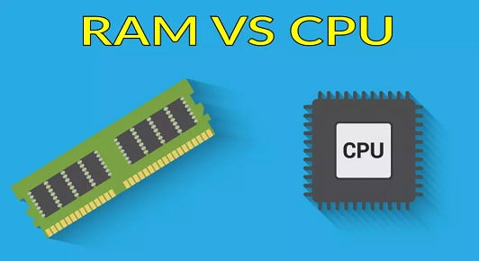
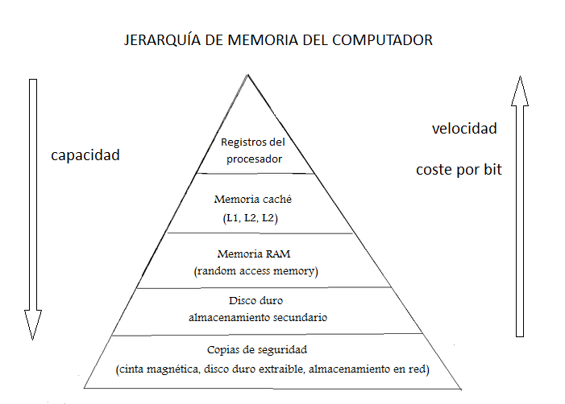
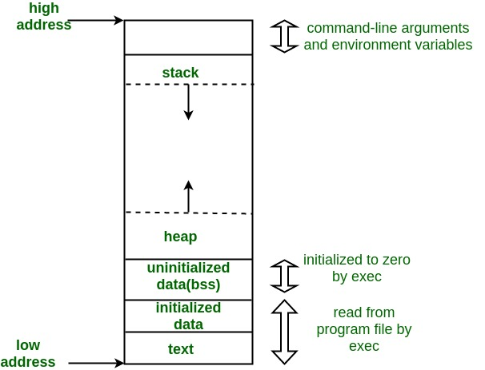
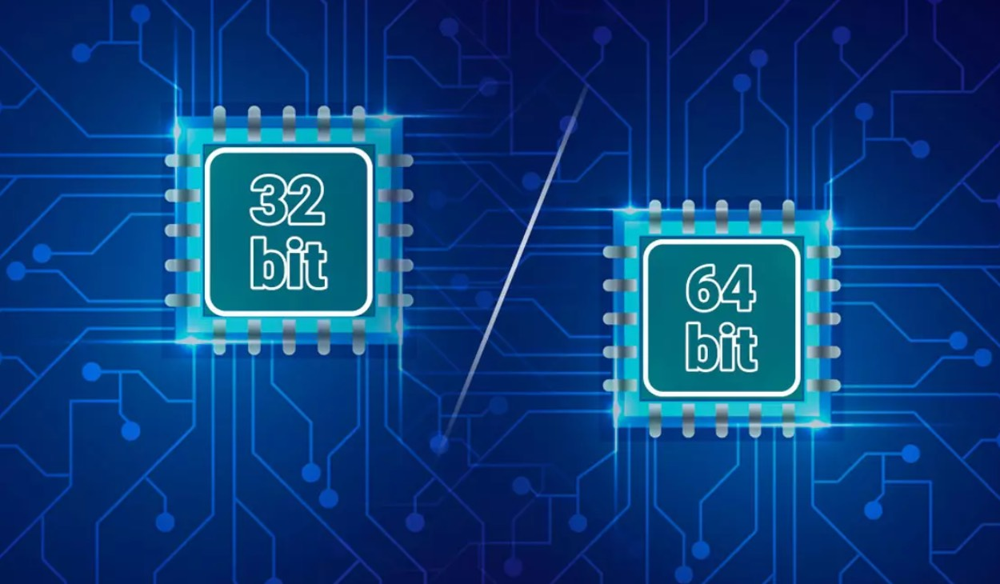

# Anexo 4: Arquitectura Básica (Cómo piensa tu hardware)

Para entender a C, tienes que pensar como una computadora. C no es como Python o JavaScript, donde vives en un paraíso aislado y la memoria se limpia sola. En C, tú eres el arquitecto, el fontanero y el conserje. 

Si no entiendes al menos un poco de cómo funciona el hardware real que hay debajo de tu código, pasarás la mitad de tu vida sufriendo y la otra mitad persiguiendo **violaciones de segmento**. Este anexo te dará el mapa para entender qué pasa físicamente en tu máquina cuando ejecutas un programa.

---

## 1. La CPU y la RAM (El oficinista y su archivero)

La arquitectura de casi cualquier computadora moderna se basa en el modelo de von Neumann, que divide el hardware en dos componentes principales:

1. **La CPU (El Procesador):** Imagínalo como un oficinista hiperactivo que trabaja a la velocidad de la luz, pero que sufre de amnesia severa. La CPU hace todos los cálculos matemáticos (con la ALU) y toma las decisiones lógicas, pero **no tiene dónde guardar datos a largo plazo**. Solo tiene unos pequeños bolsillos llamados **Registros**, donde puede guardar unos cuantos números momentáneamente.
2. **La RAM (La Memoria Principal):** Imagínalo como un gigantesco cuarto lleno de archiveros. Puede almacenar millones de datos e instrucciones. Sin embargo, en comparación con la CPU, la RAM es *dolorosamente lenta*. 

**¿Qué hace tu código en C?** 
Todo tu programa consiste básicamente en darle instrucciones a la CPU para que vaya a la RAM (archivero), saque un dato (variable), lo guarde en su bolsillo (Registro), haga una suma, y corra de vuelta a guardarlo a la RAM. 

---

## 2. La Jerarquía de Memoria (El secreto de la velocidad)

Dado que la CPU es muy rápida y la RAM es muy lenta, el hardware hace trampa para no perder tiempo. Existe una pirámide de memorias basadas en el costo y la velocidad:

1. **Registros:** (Dentro de la CPU). Ultrarrápidos, pero minúsculos (unos pocos bytes).
2. **Memoria Caché (L1, L2, L3):** (Dentro o pegada a la CPU). Es la "mesa de trabajo" del oficinista. En lugar de ir hasta el archivero (RAM) por un solo papel, la CPU se trae una carpeta entera y la deja en su escritorio por si necesita leer los papeles contiguos.
3. **RAM:** El archivero principal. Grande (GigaBytes), pero a la CPU le toma "siglos" llegar allí.
4. **Disco Duro / SSD:** El almacén al otro lado de la ciudad. Terabytes de espacio, pero extremadamente lento en tiempos de procesador.

> [!TIP]
> **¿Por qué C es el rey del rendimiento?** 
> Al aprender C, aprenderás a iterar arreglos y matrices de manera secuencial en memoria (usando índices o punteros ordenados). Al leer datos contiguos, la CPU copia bloques enteros de la RAM a la Caché. Cuando pides el siguiente dato de tu `array`, la CPU ya lo tiene en su escritorio (Caché). Esto evita viajes a la RAM (un *Cache Miss*) y hace que tu código vuele.

---

## 3. El Layout de Memoria de un Programa en C

Cuando ejecutas tu programa compilado (el `.out` o `.exe`), el sistema operativo le asigna un terreno gigantesco de RAM virtual para él solo. Este "terreno" se divide en diferentes distritos, y cada distrito tiene sus propias reglas:

### A. Text Segment (Código)
Aquí vive el binario compilado de tu programa, o sea, las instrucciones puras que la CPU va a ejecutar. 
Es de **Solo Lectura (Read-Only)**. Si mediante un puntero loco intentas sobrescribir esta zona, el Sistema Operativo entrará en pánico y matará tu programa instantáneamente con un hermoso `Segmentation Fault`.

### B. Data & BSS Segment (Datos Globales)
Aquí se guardan tus **variables globales** y **estáticas** (las que viven durante toda la ejecución del programa). 
- **Data:** Variables globales ya inicializadas (ej. `int global = 42;`).
- **BSS:** Variables globales sin inicializar (ej. `int contador;`). El sistema operativo es amable y rellena el BSS con ceros antes de arrancar.

### C. El Stack (La Pila)
Esta zona es para la gestión automática. Aquí viven las **variables locales** y la información de cada **llamada a función**. 
Funciona como una pila de platos (LIFO: El último en entrar es el primero en salir). Cuando llamas a una función, sus variables se "apilan" encima. Cuando la función termina un `return`, ese plato se "desapila" y la memoria se libera sola. Por eso las variables locales desaparecen.

> [!WARNING]
> **El Stack Overflow:** La Pila tiene un tamaño limitado (suele ser de unos pocos MegaBytes). Si creas arreglos estáticos gigantes (`int gigante[1000000];`) o haces una **recursividad infinita** (una función que se llama a sí misma para siempre), la pila de platos llegará al techo de la memoria y colapsará. A este colapso se le llama *Stack Overflow*.

### D. El Heap (El Montículo)
El salvaje oeste. Aquí es donde ocurre la **Asignación Dinámica de Memoria** usando `malloc()`, `calloc()` o `realloc()`. 
A diferencia de la Pila, el Heap es gigante (casi toda tu RAM disponible) y no tiene un orden automático. Si tú pides memoria aquí, la memoria **es tuya para siempre** hasta que tú mismo decidas liberarla manualmente.

> [!CAUTION]
> **El Memory Leak:** Si pides bloques de memoria en el Heap con `malloc()` y tu programa termina perdiendo el puntero a esos bloques sin antes haber llamado a `free()`, esa memoria quedará "zombie". Nadie puede usarla, ni tú ni el sistema operativo, hasta que cierres tu programa. A esto se le conoce como fuga de memoria.

---

## 4. 32 bits vs 64 bits (¿De qué tamaño es tu puntero?)

Siempre escuchas que una PC o un programa es "de 32 bits" o "de 64 bits". A nivel de C, esto se reduce casi enteramente a una pregunta: **¿Qué tan grande es tu registro y, por ende, tus punteros?**

Como vimos, el programa pide a la CPU que vaya a la RAM a buscar un dato. Para llegar allí, necesita la dirección de memoria exacta. 

- **En 32 bits:** La CPU puede manejar direcciones numéricas de 32 ceros y unos. El número más grande que puedes representar con 32 bits es **$4,294,967,295$**. Eso equivale a **4 GigaBytes**. Por eso los sistemas viejos no reconocían más de 4GB de RAM. Un puntero en C en 32 bits siempre pesará `4 bytes` (usando `sizeof`).
- **En 64 bits:** La CPU usa 64 ceros y unos para crear sus direcciones. Ese número es astronómicamente grande (dieciséis exabytes). Un puntero en una arquitectura de 64 bits ocupa `8 bytes`.

Por este motivo, tipos de datos como el `long int` o los punteros cambian de tamaño dependiendo de si compilas tu código en una tostadora del año 2005 o en una laptop moderna. Nunca asumas un tamaño, **usa siempre `sizeof`**

Todos los conceptos que te hayan parecido extraños, los iremos profundizando a medida que avancemos en el curso, no te preocupes. 

---

  <a href="03_Tabla_ASCII.md">⬅️ Retroceder</a> | 
  <a href="./README.md">💻 Ir a Códigos</a> | 
  <a href="../Modulos/00_Introduccion/00_Introduccion.md">Avanzar ➡️</a>

