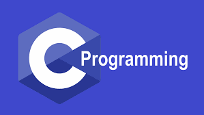
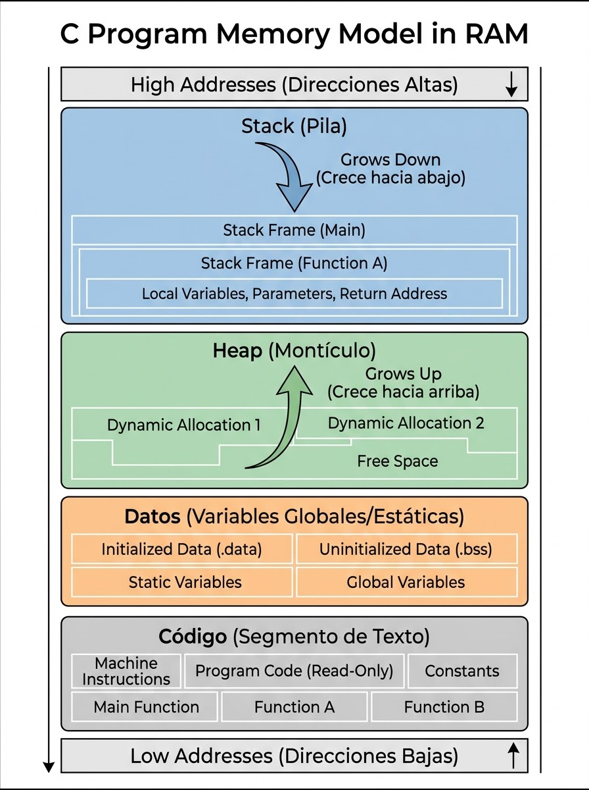
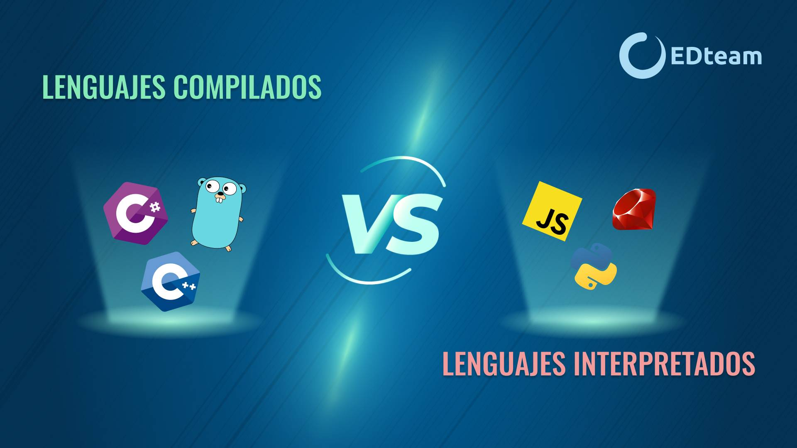

# Introducción
Bienvenidos a uno de los lenguajes de programación más poderosos y más viejos dentro del ámbito; probablemente vengas de un lenguaje como Python, muy de alto nivel, con gestión automática de memoria, donde no tienes que definir tipos de datos, los strings funcionan como objetos y, en general, todo funciona mejor.  

C es un terreno distinto: puede que le tengas miedo al inicio y, en realidad, deberías. Lidiarás con punteros, memoria dinámica, tipos de datos definidos, los famosos `;` que siempre vas a olvidar colocar, entre otras cosas, pero todo a su debido tiempo. Aprender C no es solo aprender una sintaxis nueva; en realidad, aprenderás más sobre cómo funciona tu computador que sobre el lenguaje en sí. XD.   

Es una transición fundamental para entender cómo interactúa tu software con el hardware del sistema. Si no me crees, pregúntale a mi tío **Linus Torvalds**. Comenzaremos explicando la filosofía de C y su modelo de ejecución compilado. Ya que si C es un lenguaje compilado, a diferencia de Python, que es un lenguaje interpretado, para no hacer esto tan largo, comencemos con un poco de teoría y cosas que deberías saber de antemano.

<div align="center">
  
</div>

--- 

## 1. La Filosofía de C: Un gran poder conlleva una gran responsabilidad.

C es un lenguaje de propósito general caracterizado por su economía en expresión, control de flujo y poseer un conjunto óptimo de operadores.  

Un concepto clave que define a C es que no es un lenguaje "de muy alto nivel" ni un lenguaje "Grande"; no está especializado en ninguna área en particular. Fue diseñado originalmente por Dennis Ritchie para el sistema operativo UNIX sobre la computadora DEC PDP-11, lo que significa que nació con una relación íntima con el hardware.  

A diferencia de Python, donde el lenguaje intenta proteger al programador de cometer errores graves (ocultando punteros, controlando los límites de un arreglo y automatizando la memoria), C asume que no eres estúpido, al menos no del todo. Una de las grandes ventajas del lenguaje es que asume que **el programador sabe exactamente lo que está haciendo y por qué**.

Esto lleva a C a ser un lenguaje un poco intimidante. Al no llevarte de la mano ni cubrir tus errores, puedes tener control completo sobre el sistema que estás armando, lo que puede ser muy bueno o muy malo; esto dependerá de tus habilidades. Algunas características importantes de C pueden ser cosas como:  

- **Sin red de seguridad:** En C no hay comprobación en tiempo de ejecución de si estás accediendo a una posición fuera de los límites de un arreglo.
- **Sin abstracciones mágicas:** No existen los tipos de datos dinámicos de alto nivel integrados como listas que crecen solas; cosas como **list.append()** aquí no funcionan.
- **Acceso directo a memoria:** C te permite leer y escribir en direcciones físicas de memoria, lo que te otorga un poder inmenso pero también el riesgo de, bueno, matar el sistema.

---

## 2. El Modelo de Memoría: Stack, Heap y la Ausencia del recolector de basura.  

En lenguajes como Python, cuando creas una variable u objeto, un mecanismo interno llamado **recolector de basura** monitorea si el objeto sigue en uso, esto con el fin de optimizar el programa y deshacerte de él en caso de no ser usado, para liberar memoria y cosas por el estilo. Pronto aprenderás que los informáticos estamos obsesionados con la eficiencia.  

En C, sin embargo, **la gestión es manual**. La memoria del programa se divide principalmente en 3 áreas:

### A. Variables Automáticas (El "Stack" o pila)  

Las variables declaradas dentro de una función como estas:
```
int main(){
    int whisky = 0;
    int gin = 1;
    int vodka = 2;
}
```
Son locales y pertenecen a la clase de almacenamiento automática.

- **Ciclo de vida:** Estas variables nacen (se les asigna espacio) cuando la función es llamada, y "desaparecen" de forma automática cuando la función termina su ejecución.
- **El peligro de la "basura":** Si no inicializas explícitamente una variable automática, como de esta forma:
```
int main(){
    int whisky;
}
```
Dicha variable tendrá un valor indefinido; es decir, **contiene "basura"** (los datos residuales que hubiese en esa dirección de memoria física antes de asignarse). En C, **todas las variables deben declararse antes de ser usadas**.

### B. Variables Externas y Estáticas (Memoria Estática)  

Las variables declaradas fuera de cualquier función son **externas** o denominadas como (globales).

```
int cigarros = 20;  // Variable global
int whisky;
void fumar(){
    cigarros--;
}

int main(){
    fumar();
}
```
- **Ciclo de vida:** Permanecen en existencia durante toda la ejecución del programa, reteniendo sus valores entre llamadas a funciones.  
- **Inicialización por defecto:** Notaste que no inicialicé la variable `whisky`; esto se debe a que, a diferencia de las automáticas, las variables externas y estáticas se inicializan automáticamente a **cero** si no se les asigna un valor explícito.

### C. Memoria Dinámica (El "Heap" o Montículo)  

Cuando necesitas que un bloque de memoria sobreviva a la ejecución de la función que lo creó, pero no quieres que sea global, debes recurrir a la asignación dinámica utilizando funciones de la biblioteca estándar como **malloc()** y **free()**; pero las iremos viendo a su debido tiempo. No te exaltes; por mientras, algunas consideraciones:
- En C, tú pides la memoria al sistema operativo y **estás obligado a devolverla** explícitamente con **free()**.
- Olvidar liberar la memoria genera un **Memory Leak** o fuga de memoria, lo que eventualmente consumirá toda la memoria del sistema. 

Esto, en programas grandes, es estrictamente necesario. En sistemas pequeños, una vez termine la ejecución del programa, liberará automáticamente la memoria pedida de forma automática; de igual forma, es una buena práctica hacerlo en el código.  

<div align="center">
    
</div>

---

## 3. Modelo de Ejecución: Interpretado vs. Compilado  

<p align="center">
  
</p>

Anteriormente te comenté que C es un lenguaje **compilado** y que Python es un lenguaje **interpretado**. Probablemente no sepas de qué demonios estoy hablando, pero bueno, cálmate y déjame explicarte.  

El flujo de trabajo al desarrollador y la ejecución del software son radicalmente diferentes en C frente a lenguajes interpretados como Python. Hasta ahora, en Python simplemente presionabas el **botón de play** y tu programa funcionaba. En C, tenemos algo como esto:

```
[Código fuente.c] --> (Compilador: gcc) --> [Ejecutable (a.out)] --> Ejecución directa en CPU
```
Un poco confuso, ¿verdad? Bueno, vamos a lo básico: ¿qué diablos es un compilador? Imagínate que estás de vacaciones en Francia y conoces a alguien que te interesa en un bar: chico o chica, no importa, solo quiero que captes el ejemplo. Digamos que hay atracción mutua, pero sorpresa: ella o él no habla francés, y tú con suerte hablas español. Entonces te das cuenta de que el barman habla perfectamente español y francés, y lo usas como intermediario para hablar con la persona. Bueno, esta situación probablemente no te va a pasar en la vida, pero es exactamente lo que hace un compilador: no es más que un traductor que hace que tu máquina pueda entender el código que escribiste.  

Basicamente, compiladores como `gcc` hacen lo siguiente de forma conceptual:  
```
Código en C --> Assembly --> Binario
```
Transforman tu código en C a ASM (ensamblador) y luego a binario, porque como sabrás, tu PC solo entiende **0s** y **1s**.

Para que lo sepas, Python y C funcionan así a grandes rasgos:

**Python (Interpretado / Bytecode)**  

Python lee el código fuente, lo traduce a un formato intermedio llamado bytecode **(.pyc)** y una Máquina Virtual de Python (PVM) interpreta y ejecuta esas instrucciones al momento. El código es portable porque la máquina virtual actúa como intermediario.

**C (Compilado de forma nativa)**  

C se traduce directamente a instrucciones binarias de lenguaje máquina que el procesador de tu computador ejecuta directamente, sin intermediarios.

A continuación te muestro un ejemplo de compilación simple de un programa, porque sí, a partir de ahora lo harás por terminal (para que la uses alguna vez en tu vida).

**Compilación básica**
```
gcc ludopatia.c      // Para compilar
./a.out              // Para ejecutar
```
**Compilación con un nombre distinto** 
```
gcc ludopatia.c -o AllInRed    // Para compilar
./AllInRed                     // Para ejecutar 
```

**Compilación con advertencias (MUY RECOMENDADO)**
```
gcc -Wall ludopatia.c -o AllInRed
```

> Usar `-Wall` (Warnings All) obliga al compilador a mostrarte advertencias sobre posibles errores en tu código antes de que ocurran. Como C no te protege de tus propios errores, activar los *warnings* es la mejor práctica que puedes adoptar.

La única diferencia entre ambas es que, con la segunda opción, puedes ponerle el nombre que quieras al ejecutable de tu programa. Por defecto, `gcc` genera una salida llamada **a.out**, para que lo tengas en consideración.

- **Portabilidad:** C es portátil en el sentido de que un código bien escrito puede compilarse y ejecutarse sin cambios en prácticamente cualquier computadora. Sin embargo, el archivo compilado generado en una arquitectura Intel de 64 bits **no funcionará** en un procesador ARM, como por ejemplo en un teléfono o una Raspberry Pi, ni en un sistema operativo diferente sin volverlo a compilar desde el código fuente.

Por ende, voy a decir esto para que quede claro de una vez: cuando alguien te pida tu código en C:

> [!WARNING]
> NO MANDES TU .EXE, POR FAVOR. ENVÍA TU .C

Con esto claro, vamos a terminar con una pequeña cita del libro __C Programming Language__.

---

## 4. Estilo y sencillez de C 

C es un lenguaje pequeño. Como bien señalan Kernighan y Ritchie: **"C no es un lenguaje grande, y no le sirve un libro grande"**. Su verdadero poder y elegancia no provienen de tener cientos de palabras clave o funciones mágicas integradas, sino de su flexibilidad y la forma limpia en que permite combinar un pequeño grupo de bloques de construcción.  

A lo largo de este mini curso, aprenderás a dominar estos bloques de construcción desde sus cimientos más profundos. Toma un descanso, un cigarro, un trago o no sé, apuesta un rato. Esto se viene largo, pero después de todos estos módulos, sentirás que sabes infinitamente más que hace 2 días.
