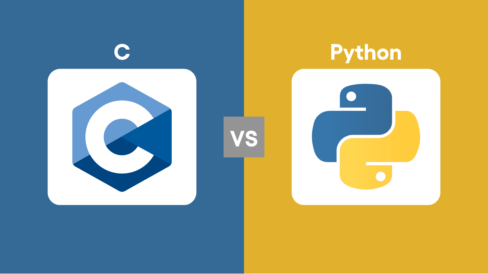
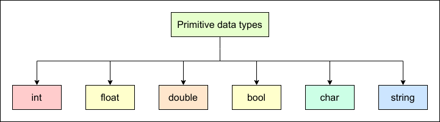
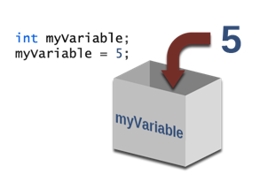
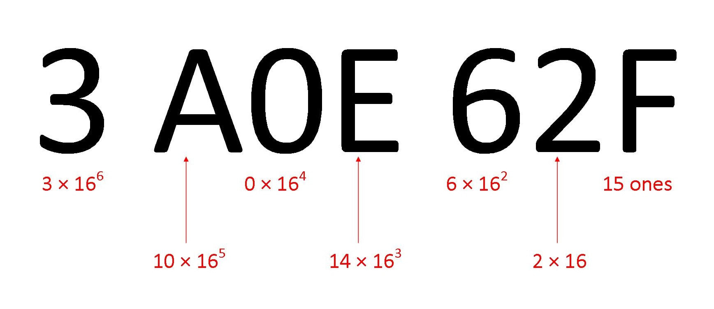
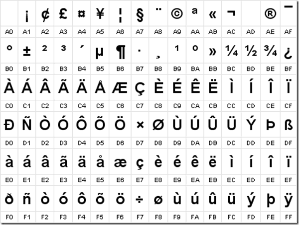

# Módulo 01: Tipos de datos y Variables en C

En un lenguaje de alto nivel y tipado dinámico como Python, las variables son simplemente etiquetas o referencias a objetos alojados en el heap. No tienes que preocuparte por cuántos bits ocupa un número entero o si este va a desbordar la memoria física; sin embargo, **en C la realidad es drásticamente diferente.**

Este módulo aborda los cimientos del sistema de tipado estático de C y cómo este se conecta directamente con el hardware, basándose en estándares técnicos. Sin nada más que agregar, comencemos.

## 1. Python vs C  

<div align="center">
  
</div>  


Para un programador que viene de Python, entender variables en C requiere cambiar el chip con el que piensas: 

| **Concepto** | **Python** | **C** |  
|     ---      |     ---    | ---   |    
| **Tipado**   | **Dinámico:** Las variables no tienen tipo; los objetos a los que apuntan si. Una variable puede almacenar un string y luego int si se quiere | **Estático:** Toda variable tiene un tipo fijo y explícito definido en su declaración|
|**Modelo de Variable**| **Referencias:** La variable es un puntero a un objeto en memoria que contiene metadatos| **Cajas de memoria:** La variable es directamente una dirección física de memoria con un tamaño fijo en bytes asignado en el `stack`|
|**Aritmética y desbordes**| **Precisión arbitraria:** Los enteros crecen automáticamente para evitar desbordes; puedes llegar a $2^{100}$ sin problemas | **Precisión fija:** Los tipos de datos numéricos tienen límites estrictos impuestos por el hardware; si superas ese límite, ocurre un desbordamiento silencioso u `overflow`.|
|**Inicialización**|**Obligatoria:** No puedes usar una variable sin haberle asignado un valor previamente. | **Manual:** Si no inicializas una variable local, esta contendrá "basura"|

---

## 2. Tipos de datos Primitivos y sus Tamaños

<div align="center">
  
</div>


En C, los tipos de datos determinan el conjunto de valores válidos que un objeto puede almacenar y las operaciones válidas permitidas sobre él. Existen 4 tipos de **datos básicos.**

- ```char```: Un solo byte, capaz de contener un carácter
- ```int```: Un número entero, típicamente del tamaño natural de la arquitectura de la máquina huésped; por lo general ocupa 4 bytes
- ```float``` : Un número real o denominado flotante en computación de precisión simple
- ```double```: Un número flotante de precisión doble

**Modificadores y Calificadores**

Para adaptar estos tipos de datos a necesidades específicas de precisión o rango, se aplican modificadores:

 - **Tamaño:** ```short``` y ```long```: se aplican a enteros; suele omitirse la palabra `int` y se define la variable directamente con el modificador.
 - **Signo:** ```signed``` y ```unsigned```: se aplican a caracteres o a cualquier entero y sirven para modificar la forma en la que presentamos el rango de valores. Un tipo `signed` podrá alcanzar menos valores positivos que un `unsigned`, ya que este último emplea esos bytes para aumentar su rango de representación.

Para una arquitectura de 64 bits, por ejemplo x86-64 con GCC en Linux, puedes usar esta tabla como referencia:

|**Tipo** | **Tamaño** | **Rango** |
|   ---   |    ---     |    ---    |
| `char` | 1 byte (8 bits) | -128 a 127|
| `unsigned char` | 1 byte (8 bits) | 0 a 255|
| `short` | 2 bytes (16 bits) | -32.768 a 32.767|
| `unsigned short` | 2 bytes (16 bits) | 0 a 65.535|
| `int` | 4 bytes (32 bits) | -2.147.483.648 a 2.147.483.647 |
| `unsigned int` | 4 bytes (32 bits) | 0 a 4.294.967.295 |
| `long` | 8 bytes (64 bits) | -9.223.372.036.854.775.808 a 9.223.372.036.854.775.807|
| `unsigned long` | 8 bytes (64 bits) | 0 a 18.446.744.073.709.551.615|
| `float` | 4 bytes (32 bits) | aprox ±3.4 x $10^{38}$|
| `double` | 8 bytes (64 bits) | aprox ±1.7 x $10^{308}$|
| `bool` | 1 byte (8 bits) | 0 o 1|

> [!WARNING]
> \***El tipo `bool` no es nativo por defecto**. A diferencia de Python donde usas `True` o `False` directamente, en C debes incluir la cabecera `<stdbool.h>` al principio de tu archivo para poder usar las palabras clave `bool`, `true` y `false`.

### Un poco de arquitectura de computadores

Bastante información, ¿verdad? Bueno, en vez de que tengas que memorizar toda esa tabla, te voy a enseñar a calcular esos valores, así que vamos a ello.

### 1. Bit

Un **bit** (Binary Digit) es la unidad mínima de información, dicho bit solo puede representar el **0** y el **1**.

Por lo tanto un bit puede representar: $2^1 = 2$ valores diferentes.

### 2. Varios bits

Cuando tenemos varios bits, cada bit puede tomar independientemente **0** o **1**. Por ejemplo con 2 bits:
- 00
- 01
- 10
- 11

Tenemos: $2^2 = 4$ valores posibles.

Entonces por regla general tenemos que:

Cantidad de valores = $2^{n}$, donde **n** es la cantidad de bits.

### 3. Byte

En C, un **byte** tiene como mínimo 8 bits. En las arquitecturas modernas utilizamos la equivalencia:

<div align="center" style="user-select: none; -webkit-user-select: none;">
1 byte = 8 bits
</div>

Con 8 bits podemos representar $2^8 = 256$ valores diferentes.


<div align="center" style="user-select: none; -webkit-user-select: none;">
00000000<br>
    00000001<br>
    00000010<br>
    ...<br>
11111111<br>
</div>

Hay exactamente **256 combinaciones.**

### 4. De bytes a bits

Para calcular cuántos bits tiene un tipo:
<div align="center" style="user-select: none; -webkit-user-select: none;">
bits = bytes x 8
</div>

Por ejemplo, si un **int** ocupa 4 bytes:
<div align="center" style="user-select: none; -webkit-user-select: none;">
4 x 8 = 32 bits
</div>

Y esos 32 bits permiten: $2^{32}$ combinaciones diferentes.

### 5. Enteros sin signo

Un entero **sin signo** utiliza todos sus bits para representar valores positivos.

Si tenemos **n** bits:

$0 \le x \le 2^n - 1$

¿Por qué el -1?

Básicamente, porque empezamos desde el 0.

Con 3 bits tenemos $2^3 = 8$ valores.

<div align="center" style="user-select: none; -webkit-user-select: none;">
000 → 0<br>
001 → 1<br>
010 → 2<br>
011 → 3<br>
100 → 4<br>
101 → 5<br>
110 → 6<br>
111 → 7<br>
</div>

El último valor es 7, por ende:

$0 ... 2^n - 1$

### 6. Enteros con signo

En C, los enteros con signo modernos utilizan normalmente **complemento a dos**, no es necesario que entiendas esto por ahora aunque sería bueno que lo investigaras.


En este caso, un entero de n bits puede representar:

$-2^{n-1} \le x \le 2^{n-1} - 1$

Se utiliza un bit para determinar la representación del signo mediante complemento a dos.

Por ejemplo, con 8 bits:

$n = 8$

Entonces:

**Mínimo** --> $-2^{8-1} = -2^7 = -128$

**Máximo** --> $2^{8-1} = 2^7 = 127$

### 7. Ejemplo con int

Supongamos que tenemos:

```c
int x;
```

En una plataforma donde `int` ocupa 4 bytes:

#### Paso 1 -- Bytes a bits

4 bytes x 8 = 32 bits

#### Paso 2 -- Cantidad de combinaciones

$2^{32} = 4.294.967.296$ combinaciones diferentes.

Si es un `unsigned int`, el rango es $0$ ... $2^{32} - 1$.

Es decir 0.. 4.294.967.295.

Si es `int`:

El rango es $-2^{31}$ ... $2^{31} - 1$.

Es decir -2.147.483.648 ... 2.147.483.647.

### 8. Tabla general

| Bytes | Bits | Valores posibles | unsigned | signed |
| --- | --- | --- | --- | --- |
| 1 | 8 | 2⁸ | 0 ... 2⁸−1 | −2⁷ ... 2⁷−1 |
| 2 | 16 | 2¹⁶ | 0 ... 2¹⁶−1 | −2¹⁵ ... 2¹⁵−1 |
| 4 | 32 | 2³² | 0 ... 2³²−1 | −2³¹ ... 2³¹−1 |
| 8 | 64 | 2⁶⁴ | 0 ... 2⁶⁴−1 | −2⁶³ ... 2⁶³−1 |

Esta tabla permite calcular rápidamente el rango de prácticamente cualquier entero estándar.

### 9. Aplicado a tipos de datos

En una configuración común Linux x86-64:

| Tipo | Bytes | Bits | unsigned | signed |
| --- | --- | --- | --- | --- |
| char | 1 | 8 | 0 ... 2⁸−1 | −2⁷ ... 2⁷−1* |
| short | 2 | 16 | 0 ... 2¹⁶−1 | −2¹⁵ ... 2¹⁵−1 |
| int | 4 | 32 | 0 ... 2³²−1 | −2³¹ ... 2³¹−1 |
| long | 8 | 64 | 0 ... 2⁶⁴−1 | −2⁶³ ... 2⁶³−1 |
| long long | 8 | 64 | 0 ... 2⁶⁴−1 | −2⁶³ ... 2⁶³−1 |

char puede ser signed o unsigned dependiendo de la implementación. Si quieres controlar esto explícitamente, utiliza signed char o unsigned char

### 10. Cadena de cálculo

La forma más importante es entenderlo de esta forma:

Bytes x 8 ---> bits ---> $2^n$ ---> Cantidad de valores ---> Rango


Y finalmente, como regla fundamental:

Para un tipo entero de N bytes:

$$
\text{bits} = N \times 8
$$

$$
\text{valores} = 2^{\text{bits}}
$$

Para **unsigned**:

0... $2^{\text{bits}} - 1$

Para **signed** en complemento **a dos**:

$-2^{\text{bits} - 1} \ldots 2^{\text{bits} - 1} - 1$

Muy bien: con esa ensalada de información tendrás para un buen rato. Buena suerte.

Ahora veremos un poco cómo podemos declarar variables, asignarles valores y actualizarlos. Echa un vistazo al archivo `sintaxis.c` de este módulo para ver ejemplos de código.

--- 

## 3. Declaraciones, asignaciones y actualizaciones

<div align="center">
  
</div>

En C, todas las variables deben declararse explícitamente antes de ser utilizadas. Una declaración anuncia las propiedades de una variable (su tipo y nombre) al compilador, pero no necesariamente reserva almacenamiento físico (eso lo hace una definición).

### Reglas para nombrar variables
A diferencia de Python, C tiene reglas muy estrictas para nombrar tus variables:
- **Solo pueden contener** letras (a-z, A-Z), números (0-9) y guiones bajos (`_`).
- **No pueden empezar con un número** (ej: `1alcohol` es inválido, pero `alcohol1` sí).
- **No pueden contener espacios ni caracteres especiales** (como `@`, `#`, `-`).
- **Es sensible a mayúsculas y minúsculas**: `Variable` y `variable` son dos cosas distintas.
- Acostúmbrate a usar convenciones estándar de la industria como `snake_case` o `camelCase`.
- Combinando espacios y guiones bajos para reemplawlzar los espacios.

```
int main(){
int IronMaiden, SOAD, Metallica;  // Declaramos 3 variables enteras.

int IronMaiden; // Hacerlo de esta forma es una manera equivalente.
int SOAD;
int Metallica;


char c; // Declaramos un carácter

}

```
Luego para darles algun valor debemos hacer una asignacion. 

```
int main(){

int IronMaiden = 1; 
int SOAD = 2;
int Metallica = 3;
char c = 'r'; 

}
```

// Podemos hacer la asignación apenas declaramos o después, como en este caso

```
int main(){

int IronMaiden; 
int SOAD;
int Metallica;
char c; 

IronMaiden = 1;
SOAD = 2;
Metallica = 3;
c = 'r';

}

```

Muy importante que si vamos a darle un valor más tarde, no volver a poner la palabra que representa al tipo de dato, ya que la estaríamos declarando otra vez y esto producirá un error de compilación.

Para actualizar las variables que creamos podemos usar los operadores que conocemos de Python, como lo son: 
- \+ para sumar
- \- para restar
- \/ para dividir
- \* para multiplicar 
- \% para obtener el módulo (o resto) de una división entera. ¡Ojo! En C el operador `%` solo funciona con tipos enteros (`int`, `char`, etc.), no con flotantes.

También tenemos unos operadores que probablemente no conozcas, los cuales son:

- \++ Incrementa en 1
- \-- Decrementa en 1

De igual forma las equivalencias como:

- \+=
- \-=

Siguen presentes.

### L-values y R-values (El lado izquierdo y derecho)

Cuando hablamos de asignaciones en C, es crucial entender dos conceptos fundamentales que el compilador utiliza constantemente: **lvalue** y **rvalue**. 

- **lvalue (Locator Value):** Es una expresión que hace referencia a una ubicación de memoria física y persistente que tiene un identificador (un nombre) y puede almacenar datos. Se llama "lvalue" porque habitualmente va en el lado izquierdo (Left) de una asignación (`=`). Por ejemplo, una variable `int edad;` es un lvalue.
- **rvalue (Read Value):** Es un valor temporal que no tiene un espacio de memoria persistente asignado en tu código. Son datos crudos, cálculos temporales o literales. Suelen ir en el lado derecho (Right) de una asignación. Un número como `5` o el resultado de `2 + 3` son rvalues.

```c
int a = 5;      // 'a' es lvalue, '5' es rvalue
a = a + 10;     // 'a' es lvalue, 'a + 10' es un rvalue temporal
// 10 = a;      // ERROR de compilación: '10' es un rvalue, no puede ir a la izquierda.
```
En resumen, un *lvalue* es "un recipiente", y un *rvalue* es "el contenido". No puedes meter un recipiente dentro de un contenido.

### Conversión de Tipos (Type Casting)

Algo fundamental al cambiar de Python a C es cómo se manejan los tipos al operar con ellos. En Python, si divides `5 / 2`, obtienes `2.5`. En C, si divides dos enteros (`5 / 2`), el resultado es **siempre un entero** (el compilador trunca el decimal y te da `2`).

Para obtener el resultado correcto, debes usar el *Type Casting* (conversión de tipos), que le dice al compilador "trata a este valor como si fuera de otro tipo temporalmente". Se hace poniendo el tipo deseado entre paréntesis antes del valor:

```c
int a = 5;
int b = 2;
// Casteo explícito: Convertimos 'a' a float antes de dividir. 
// Esto hace que la división sea flotante (5.0 / 2 = 2.5).
float resultado = (float) a / b; 
```

---

## 4. Representación de Constantes 

<div align="center">
  
</div>

C permite expresar valores constantes de manera muy especifica en el código para forzar su tipo:

### Constantes enteras

- **Decimales:** Escritas de forma directa (ej: 1234)
- **Octales:** Llevan un cero a la izquierda (ej: 037, equivalente a 31 en decimal)
- **Hexadecimales:** Comienzan con **0x** o **0X** (ej: **0x1F** equivalente a 31 en decimal)
- **Sufijos**
  -  **L** o **l** fuerza que la constante sea interpretado como un **long** (ej: **123456789L**)
  -  **U** o **u** la convierte en unsigned (ej: **123u**)

### Constantes Punto Flotante

Se escriben con punto decimal (ej:**123.4**)

- Para forzar un tipo de dato a **float**, se agrega el sufijo **F** o **f** (ej: **32.0f**)
- Para forzar un long double usamos el sufijo **L** o **l** (ej: **3.1415926535L**)

### Constantes de caracter

¿Alguna vez pensaste que una letra también puede ser un número y viceversa? Pues puede.

Se escriben entre comillas simples (ej: **'x'**). Internamente, **una constante de carácter es un número entero**, cuyo valor es igual al valor numérico asignado en el conjunto de caracteres de la máquina; por lo general se usa la tabla ASCII para esto. Por ejemplo, el carácter '0' es 48 en la tabla y 'A' es 65. Debido a esto, las constantes de carácter pueden participar de manera directa en expresiones aritméticas comunes.

```
int num = c - '0'; // Obtiene el valor numérico real si el char c contiene un dígito.

```

### Secuencias de Escape

C utiliza secuencias de escape que se visualizan como 2 caracteres pero representan únicamente a uno:

- **\n** Salto de línea
- **\t** Tabulador horizontal
- **\0** Carácter nulo (su valor numérico es 0)

Existen algunas más pero estas 3 son importantes por ahora.

---

## 5. Caracteres

<div align="center">
  
</div>

Por ahora no vamos a ahondar mucho en esto, ya que lo veremos a fondo en el módulo de strings. Así que, por ahora, lo único que tienes que saber es que un `string` en C no es más que un arreglo de caracteres y se declara de esta forma:

```
char invitacion[20] = "Vamos a tomar"; // Reserva 20 espacios de memoria, ideal si vas a modificar o rellenar el texto depues

char invitacion[] = "Vamos a tomar"; // El compilador calcula el tamaño exacto segun el texto.

```

---

## 6. Variables constantes (const)

<div align="center">
  
</div>

El calificador **const** puede aplicarse a la declaración de cualquier variable para anunciar que su valor no será modificado durante su ejecución.

```
const double pi = 3.141592653589793;
```
Si el código intenta modificar una variable marcada como **const**, el compilador emitirá un error de diagnóstico durante el proceso de compilación. Al igual que con los tipos, este calificador sirve para que el compilador optimice el código de manera eficiente y prevenga errores lógicos humanos.

Bien. Espero hayas entendido algo; esto está siendo más complicado de lo que pensé. Echa un vistazo al archivo `sintaxis.c` de este módulo para que veas un poco de código.


