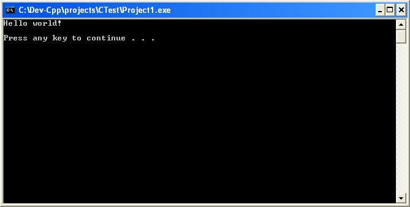
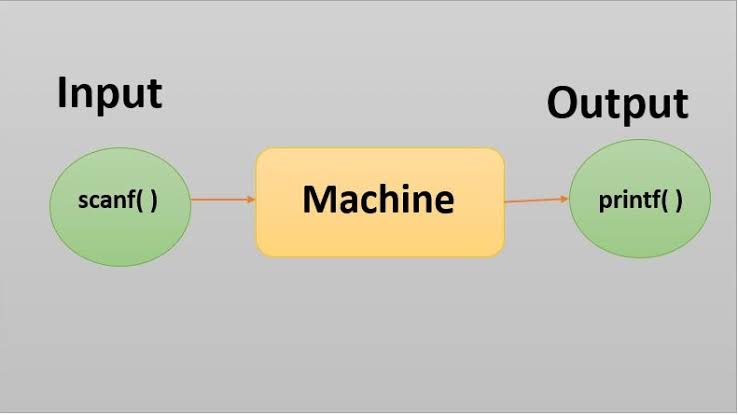
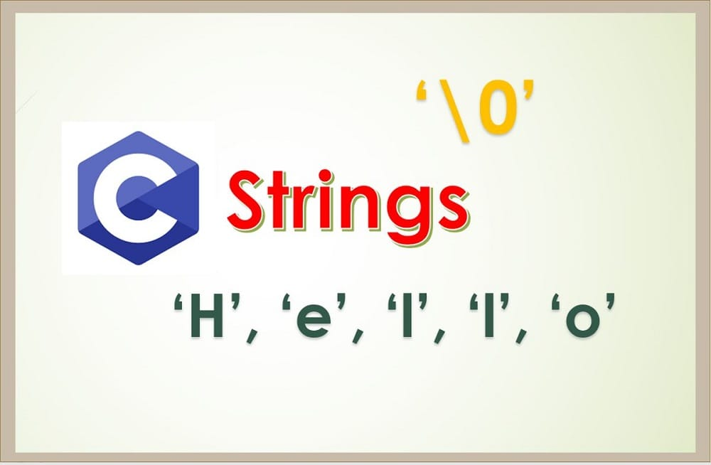
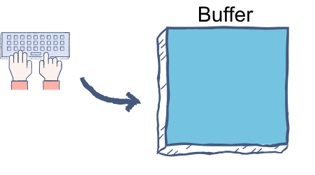
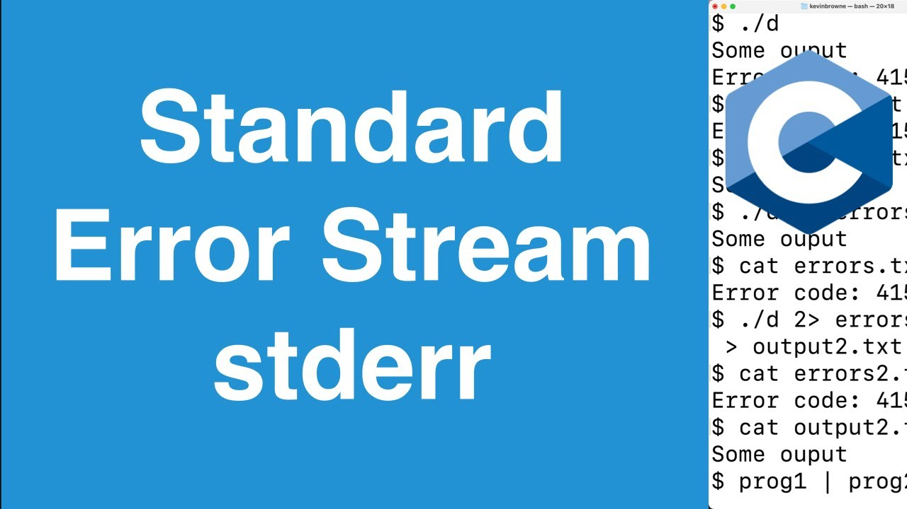

# Módulo 02: Input, Output y el caos del Buffer

Hasta este punto, hemos declarado variables, les hemos asignado valores y hemos hecho operaciones con ellas en la memoria. Pero tus programas han estado sordos y casi mudos. En Python, estabas acostumbrado a usar `print()` e `input()` de forma casi mágica: Python se encargaba de formatear todo, de gestionar la memoria y de entender qué tipo de dato era cada cosa.

En C, la realidad es distinta. Como Kernighan y Ritchie afirman en *The C Programming Language*: **"Las facilidades de entrada y salida no forman parte del lenguaje C en sí"**. C es un lenguaje tan pequeño y cercano al hardware que delega estas tareas a funciones de su biblioteca estándar (`<stdio.h>`). Al usar I/O (Input/Output) en C, literalmente estás llamando a funciones del sistema operativo para que escriban en la pantalla o lean del teclado. 

Y créeme, si no entiendes cómo C lee lo que escribes, las cosas van a salir muy mal. Comencemos.

---

## 1. Salida de Datos (Output)

<div align="center">
  
</div>

La función reina para mostrar cosas por pantalla es `printf` (Print Formatted). No es solo imprimir texto, es un motor de formateo.

### Uso básico y secuencias de escape
Para imprimir texto simple, le pasamos una cadena de caracteres. C soporta secuencias de escape para caracteres especiales:
- `\n`: Salto de línea (Nueva línea).
- `\t`: Tabulador horizontal.
- `\\`: Imprime una barra invertida `\`.
- `\"`: Imprime comillas dobles `"` dentro de un string.

```c
printf("Hola Mundo\n");
printf("Me llamo \"C\" y uso una barra \\.\n");
```

### Acentos y la letra 'ñ' (El problema del idioma)
Si intentas imprimir "Año" o "Canción" en C, probablemente veas caracteres extraños en la consola (como `Ao` o peor). Esto pasa porque C, por defecto, usa la configuración de idioma mínima (el "C" locale), que asume que el mundo entero habla inglés estándar donde no existen las tildes.

Para que la terminal reconozca el español y renderice correctamente las tildes y las eñes, debes importar la librería `<locale.h>` y usar la función `setlocale` al inicio de tu programa:

```c
#include <stdio.h>
#include <locale.h> // 1. Importar la libreria de localizacion

int main() {
    // 2. Forzamos a C a utilizar codificación UTF-8 (español) para soportar caracteres especiales
    setlocale(LC_ALL, "es_ES.UTF-8"); // También puedes usar "en_US.UTF-8" o "" según tu sistema
    
    printf("¡Año exitoso, misión cumplida y canción cantada!\n");
    return 0;
}
```

### Especificadores de formato
En Python podías hacer `print(f"Mi edad es {edad}")`. En C, `printf` usa "marcadores" o **especificadores de formato** dentro del texto, seguidos de las variables correspondientes en orden:

| Especificador | Tipo de Dato |
| --- | --- |
| `%d` o `%i` | Enteros (`int`, `short`) |
| `%u` | Enteros sin signo (`unsigned int`) |
| `%ld` | Enteros largos (`long int`) |
| `%lld` | Enteros muy largos (`long long int`) |
| `%f` | Flotantes (`float`) |
| `%lf` | Flotantes de doble precisión (`double`) |
| `%Lf` | Flotantes de precisión extendida (`long double`) |
| `%c` | Carácter (`char`) |
| `%s` | Cadena de texto (String) |

```c
int edad = 25;
float peso = 70.5;
printf("Tengo %d años y peso %f kg\n", edad, peso);
```

### Formateo de precisión y alineación
`printf` es increíblemente poderoso para crear tablas o alinear textos matemáticos. 

- **Control de decimales:** `%.2f` limita a 2 decimales.
- **Relleno y ancho:** `%5d` obliga al número a ocupar 5 espacios (alineado a la derecha). `%-5d` lo alinea a la izquierda.
- **Relleno con ceros:** `%05d` rellena con ceros a la izquierda (ej: `00042`).

```c
printf("Precio: $%.2f\n", 19.999); // Imprime $20.00
printf("ID: [%04d]\n", 7);         // Imprime [0007]
printf("Alineado: [%-10s]\n", "C"); // Imprime [C         ]
```

### Impresión de números en otras bases
`printf` también te permite imprimir enteros en distintas representaciones numéricas, lo cual es muy útil trabajando cerca del hardware:
- `%x` o `%X`: Imprime en Hexadecimal (letras minúsculas o mayúsculas).
- `%o`: Imprime en Octal.
*(Nota: El estándar C no tiene un especificador nativo universal para binario como `%b` hasta versiones muy modernas, generalmente se hace a mano o con macros).*

```c
int numero = 255;
printf("Hexadecimal: %X, Octal: %o\n", numero, numero); // Imprime FF, 377
```

### Alternativas simples: puts() y putchar()
Si no necesitas formatear variables y solo quieres imprimir texto directo, `printf` es un exceso.
- `puts("Hola");` -> Imprime la cadena y añade un salto de línea (`\n`) automáticamente.
- `putchar('A');` -> Imprime un único carácter en pantalla.

---

## 2. Entrada Básica de Datos (Input)

<div align="center">
  
</div>

Para capturar datos usamos `scanf` (Scan Formatted). Es la contraparte de `printf`.

```c
int edad;
float altura;
scanf("%d", &edad);
```

### El misterioso operador `&`
¿Por qué ponemos un `&` (ampersand) antes de la variable `edad`? En Python, las funciones devuelven valores. En C, cuando llamas a `scanf`, le estás pidiendo a la función que vaya a la memoria física y guarde lo que el usuario tipeó **directamente en tu variable**. 
Para que `scanf` sepa a dónde ir, tienes que pasarle la **dirección de memoria** de tu variable, no su valor actual. El operador `&` significa "la dirección de". 

> [!NOTE]
> **Excepción:** Si estás capturando una cadena de texto (un arreglo de caracteres `char nombre[20]`), **NO** usas el `&`. En C, el nombre de un arreglo ya es en sí mismo un puntero a su dirección de memoria base. `scanf("%s", nombre);` es correcto, aunque más información al respecto la veremos en el módulo de punteros.

### Lectura múltiple
Puedes capturar varios datos en una sola línea. `scanf` ignorará automáticamente los espacios y saltos de línea entre números.
```c
int a;
float b;
printf("Ingresa un entero y un flotante separados por espacio: ");
scanf("%d %f", &a, &b);
```

### Validación (Evitando el desastre)
C no tiene "Excepciones" (no hay `try/catch`). Si haces `scanf("%d", &edad)` y el usuario escribe `"Hola"`, el programa fallará silenciosamente, dejando `edad` con basura. 
¿La solución? **`scanf` retorna un número entero**: la cantidad de variables que logró leer con éxito.
```c
if (scanf("%d", &edad) != 1) {
    printf("¡Error! No ingresaste un número.\n");
    // Manejar el error
}
```

---

## 3. Captura de Cadenas con Espacios (Strings)

<div align="center">
  
</div>

Aquí es donde C separa a los niños de los adultos.

### El problema de scanf
Si intentas leer un nombre completo con `scanf`:
```c
char nombre[50];
scanf("%s", nombre); // Si escribo "Alcoholico Anormal"
```
`scanf` **se detiene al encontrar el primer espacio en blanco**. Solo guardará "Alcoholico". 

### La prohibición de gets()
Hace mucho tiempo existía una función llamada `gets(nombre)` que leía toda la línea. **¡NO LA USES NUNCA!** `gets()` no tiene forma de saber de qué tamaño es tu arreglo. Si tu arreglo es de 20 caracteres y el usuario ingresa 500, `gets()` sobrescribirá la memoria adyacente de tu programa (Buffer Overflow). Es tan peligrosa que fue eliminada del estándar C11.

### La solución estándar: fgets()
La forma profesional y segura de leer cadenas es usar `fgets`.
```c
char nombre[50];
fgets(nombre, sizeof(nombre), stdin);
```
- `nombre`: Dónde guardarlo.
- `sizeof(nombre)`: El tamaño máximo que puede leer (evita el buffer overflow).
- `stdin`: De dónde leer (el teclado, Standard Input).

**El efecto secundario:** `fgets` es tan literal que **también guarda el salto de línea `\n`** en tu cadena si cabe. Si escribes "Juan", tu cadena será `"Juan\n"`. Para limpiarlo, usamos `<string.h>`:
```c
#include <string.h>
// Busca el \n y lo reemplaza por el carácter nulo \0 (fin de cadena)
nombre[strcspn(nombre, "\n")] = '\0';
```

### La solución rápida: Scansets
Puedes usar una expresión regular simple dentro de `scanf` para decirle "lee todo hasta que encuentres un salto de línea".
```c
char nombre[50];
scanf("%[^\n]", nombre); // Lee la línea completa con espacios
```

---

## 4. Gestión del Buffer de Entrada (stdin)

<div align="center">
  
</div>

Este es el culpable del 90% de los dolores de cabeza de los principiantes en C.

**¿Qué es el buffer?** Es una memoria intermedia. Cuando presionas las teclas, van a un buffer del sistema operativo. Tu programa en C no lee el teclado directamente, lee ese buffer.

### El problema del `\n` residual
Imagina este código:
```c
int edad;
char inicial;
scanf("%d", &edad);
scanf("%c", &inicial);
```
Si el usuario ingresa `25` y presiona ENTER. En el buffer queda: `25\n`. 
El primer `scanf` se lleva el `25`. En el buffer queda: `\n`.
El segundo `scanf` va a leer un carácter. Ve el `\n` que sobró en el buffer y **lo lee instantáneamente**, sin pedirle al usuario que escriba su inicial. Tu programa parece "saltarse" pasos.

### Lo que NO se debe hacer
En muchos tutoriales viejos de Windows verás `fflush(stdin);` para limpiar el buffer. **NO LO HAGAS**. El estándar de C (y el libro de K&R) establecen que usar `fflush` en flujos de entrada (`stdin`) es comportamiento indefinido. Funciona en Windows (a veces), pero fallará horriblemente en Linux y Mac.

### Las soluciones correctas

**Solución 1 (La más fácil):** Añadir un espacio en blanco antes del `%c` o string en el `scanf`. El espacio le dice a C: "Ignora cualquier basura o salto de línea que haya quedado antes de leer".
```c
scanf(" %c", &inicial); // Nota el espacio antes del %c
```

**Solución 2 (La profesional):** Un bucle que devore toda la basura del buffer hasta encontrar el salto de línea.
```c
int c;
while ((c = getchar()) != '\n' && c != EOF); // Limpia el buffer manualmente
```

---

## 5. Flujos de Consola Avanzados (fprintf)

<div align="center">
  
</div>

En UNIX y C, todo es un archivo. La consola donde escribes y lees también está tratada como "archivos" virtuales o **flujos de datos (streams)**. C abre 3 por defecto:
- `stdin`: Standard Input (Entrada normal, el teclado).
- `stdout`: Standard Output (Salida normal, la pantalla).
- `stderr`: Standard Error (Salida de errores, la pantalla, pero sin almacenamiento en buffer o separable).

### La equivalencia real
`printf` es en realidad una versión simplificada de su hermano mayor `fprintf` (File Print Formatted).
```c
printf("Hola\n"); 
// Es exactamente igual a:
fprintf(stdout, "Hola\n");
```

### Manejo de errores profesional
Si tu programa detecta que el usuario ingresó algo inválido, no deberías usar `printf`. Deberías enviar ese texto por el canal de errores `stderr`. Así, si alguien ejecuta tu programa en Linux y redirige el output normal a un archivo, los mensajes de error seguirán apareciendo en su pantalla de forma independiente.
```c
if (scanf("%d", &edad) != 1) {
    fprintf(stderr, "Error fatal: No se ingresó un número válido.\n");
}
```

### El puente hacia el manejo de archivos
¿Por qué te explico esto ahora? Porque si dominas `fprintf` usando `stdout` o `stderr`, ya sabes escribir en archivos de texto!
En el futuro, cuando quieras guardar cosas en el disco duro, harás exactamente lo mismo, solo cambiarás `stdout` por el archivo que abriste:
```c
// fprintf(mi_archivo_de_texto, "Tengo %d años\n", edad);
```

Bien, eso es mucha teoría. Respira profundo. Ahora vamos a ver cómo se ve esto en código real. (Revisa el archivo `sintaxis.c` de este mismo directorio).
