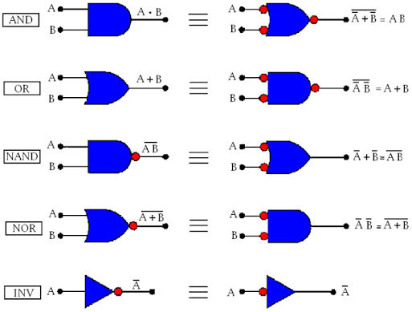
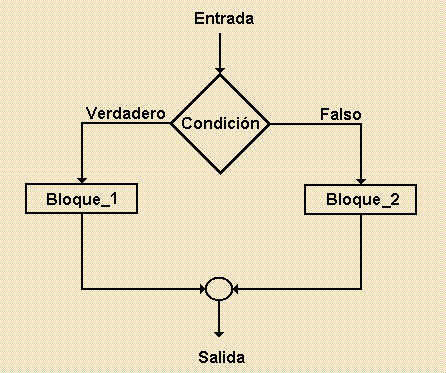
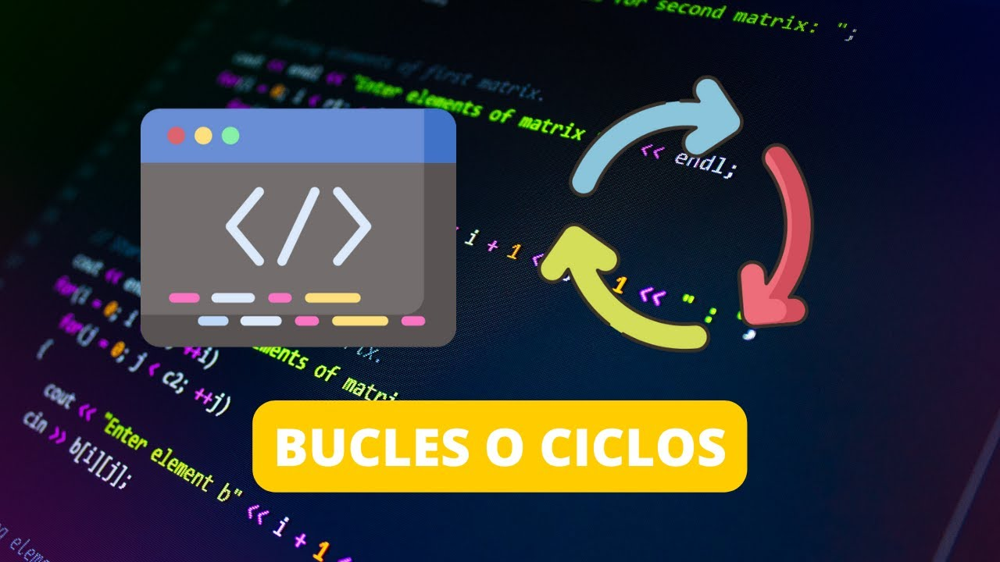
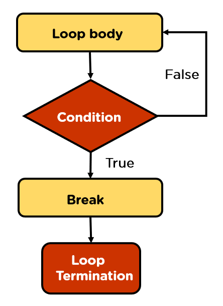
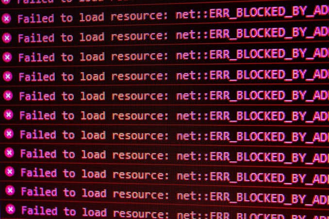

# Módulo 03: Control de Flujo (O cómo evitar que tu programa vaya en línea recta al precipicio)

Si has sobrevivido hasta aquí, felicidades. Ya sabes declarar variables y hacer que la consola escupa datos. Pero un programa que solo se ejecuta de arriba hacia abajo sin tomar decisiones es como un ascensor que solo va al sótano: inútil y un poco deprimente.

En Python, estabas acostumbrado a usar indentación mágica para decirle a tu código qué estaba dentro de un `if` o un `for`. En C, al compilador le da absolutamente igual si usas espacios, tabuladores o si escribes todo tu código en una sola línea. C usa **llaves `{}`** para definir bloques. Acostúmbrate.

Nuevamente citando a mis tíos, Kernighan y Ritchie (K&R): *"Las sentencias de control de flujo de un lenguaje especifican el orden en el que se realizan los cálculos"*. Así que vamos a aprender a manejar estas cosas.

---

## 1. Operadores y Lógica Básica (La verdad absoluta, según C)

<div align="center">
  
</div>

En Python tenías `True` y `False`. C, en sus orígenes, era demasiado "rústico" para tener tipos booleanos nativos. Para C, la verdad es estrictamente matemática.

* **Verdad y Falsedad en C:** En C, el número `0` es Falso. **Cualquier otro número** (1, 100, -42) es Verdadero. Es así de simple. Aunque desde el estándar C99 (porque la gente lloraba mucho), puedes incluir la librería `<stdbool.h>` para usar `true` y `false`, pero bajo el capó siguen siendo 1 y 0.
* **Operadores Relacionales:** Los clásicos de siempre: `==` (igual a), `!=` (distinto de), `<` (menor), `>` (mayor), `<=` (menor o igual), `>=` (mayor o igual).
* **Operadores Lógicos:** 
    * `&&` (AND - "Y"): Para que todo el bloque sea verdad, ambas partes deben serlo.
    * `||` (OR - "O"): Con que una parte sea verdad, basta.
    * `!` (NOT - "NO"): Invierte la verdad. Si era 1 (verdadero), lo hace 0 (falso). Si era 0, lo hace 1.

### El Arte del Cortocircuito Lógico
K&R nos enseñan algo vital sobre `&&` y `||`: **se evalúan estrictamente de izquierda a derecha y la evaluación se detiene tan pronto como se conoce el resultado final**.
Si tienes `if (A && B)` y resulta que `A` es falso (`0`), C no se molesta en absoluto en evaluar `B`. Ya sabe que toda la condición va a ser falsa. Esto se llama *cortocircuito*. Es muy útil para evitar desastres, como verificar si un valor es válido antes de hacer una división por cero en la parte derecha de la condición. Les dejo un ejemplo para que puedan entenderlo:

```c
int divisor = 0;
int dividendo = 10;

// Si divisor es 0, la primera condición (divisor != 0) es Falsa.
// Gracias al cortocircuito, C omite evaluar la segunda parte.
// ¡Nos acabamos de salvar de una división por cero que habría crasheado el programa!
if (divisor != 0 && (dividendo / divisor > 1)) 
{
    printf("El resultado es mayor a 1\n");
} 
else 
{
    printf("El divisor era 0, pero el programa sigue vivo.\n");
}
```

---

## 2. Condicionales (Toma de decisiones)

<div align="center">
  
</div>

### La estructura `if / else`
No hay mucho misterio aquí. Si la expresión entre paréntesis es "verdadera" (distinta de cero), se ejecuta el bloque del `if`. Si es falsa, pasa al `else`.

```c
if (edad >= 18) 
{
    printf("Puedes pasar.\n");
} 
else 
{
    printf("Vete a casa, niño.\n");
}
```

### El uso (moralmente obligatorio) de las llaves `{}`
Técnicamente, si tu `if` o `else` solo tiene una línea de código, el lenguaje te permite omitir las llaves. **¡NO LO HAGAS!** o sí, en realidad depende del contexto, pero hace tiempo Apple tuvo una falla de seguridad masiva en iOS (el infame bug "goto fail") precisamente por omitir llaves en condicionales y añadir líneas después sin querer. Usa las llaves siempre para evitar errores más grandes de los que cometo yo mismo al intentar explicar esta porquería de lenguaje (En realidad lo amo). El compilador no te cobra por usarlas así que, adelante.

### Condicionales anidados
Para múltiples opciones secuenciales, encadenamos con `else if` (en Python era `elif`, aquí escribimos las palabras completas porque no somos flojos, al menos no tanto, mal que mal estás leyendo esto en vez de pedirle a una IA la misma información):

```c
if (nota >= 90) 
{
    printf("Excelente\n");
} 
else if (nota >= 70) 
{
    printf("Aprobaste, a duras penas\n");
} 
else 
{
    printf("Nos vemos en verano\n");
}
```

### El Operador Ternario (`? :`)
Para los amantes de la brevedad. Es un `if-else` comprimido en una sola expresión. Su estructura es `(condición) ? valor_si_verdadero : valor_si_falso`.
```c
int mayor = (a > b) ? a : b; 
// Si 'a' es mayor que 'b', devuelve 'a', de lo contrario devuelve 'b'.
```

Otro ejemplo:
```c
int edad = 25;
// Evaluamos la edad para decidir qué servirle al invitado:
char* bebida = (edad >= 18) ? "Cerveza" : "Cerveza sin alcohol";
printf("%s\n", bebida);
```

---

## 3. Selección Múltiple (`switch`)

<div align="center">
  
</div>

Cuando tienes una horda de `else if` comprobando la **misma** variable contra distintos valores, es hora de usar un estilo de condicional que se llama `switch`. K&R lo describen como *"una forma especial de decisión múltiple que comprueba si una expresión coincide con uno de varios valores constantes enteros"*.

* **Restricción de tipos:** A diferencia de otros lenguajes modernos donde el switch acepta strings u objetos, en C el switch **solo acepta enteros (`int`) y caracteres (`char`)**.

### La trampa mortal: El comportamiento "Fall-Through"
Observa bien el `break;`. En C, si olvidas poner `break;` al final de un `case`, el programa no sale del switch; **continuará ejecutando las instrucciones de los casos siguientes de largo**, cayendo en cascada e ignorando si coinciden o no. A esto se le llama *fall-through*.

```c
int opcion = 1;
switch (opcion) 
{
    case 1:
        printf("Elegiste 1\n");
        // ¡Se me olvidó el break!
    case 2:
        printf("También ejecuto el 2 sin querer, help\n");
        break;
    default:
        printf("Opción inválida\n");
        break;
}
```

### Agrupación de casos
Podemos usar ese mismo *fall-through* a nuestro favor para que varios casos distintos ejecuten un mismo bloque de código (apilándolos):
```c
char tecla = 'w';
switch(tecla) 
{
    case 'w':
    case 'W':
        printf("Avanzar personaje\n");
        break; // Tanto 'w' como 'W' ejecutan esto
}
```

---

## 4. Bucles (Repetición de tareas)

<div align="center">
  
</div>

Para obligar a la computadora a trabajar duro por ti.

### `while` (Mientras)
Evalúa la condición **antes** de entrar al bloque. Si la condición es falsa desde el primer instante, el código de adentro no se ejecutará **nunca**.
```c
while (energia > 0) 
{
    // Haz algo mientras la condición sea distinta de 0
    energia--;
}
```

### `do-while` (Hacer - Mientras)
Evalúa la condición **al final** del bloque. Esto garantiza que el código se ejecute **al menos una vez**, pase lo que pase. Es el rey indiscutible para hacer menús interactivos o validar que el usuario ingrese un dato correcto.
```c
int num;
do 
{
    printf("Ingresa un número positivo: ");
    scanf("%d", &num);
} while (num <= 0); // Repite el ciclo si el estúpido usuario ingresa un negativo
```

### `for` (Para)
El bucle `for` de C es una obra de arte y el estándar de la industria. Consta de tres partes separadas por punto y coma:
1. **Inicialización:** Se ejecuta una sola vez al arrancar el bucle, aunque puedes usar una variable previamente inicializada.
2. **Condición:** Se evalúa antes de cada iteración (si es falsa, el bucle termina).
3. **Incremento (o actualización):** Se ejecuta al final de cada iteración.

```c
for (int i = 0; i < 10; i++) 
{
    printf("Iteración %d\n", i);
}
```
*Dato curioso de K&R:* Cualquier bucle `for` puede reescribirse matemáticamente como un `while`. Además, las 3 partes del `for` son opcionales. `for(;;)` es un bucle infinito perfectamente válido en C.

### Anidamiento
Puedes meter bucles dentro de bucles. Esto es muy usado para recorrer matrices bidimensionales (como un tablero de ajedrez) o para volverte loco tratando de entender por qué tu programa tarda 5 años en terminar de ejecutarse debido a una complejidad $O(n^3)$.
Pero esto creo que quizás no lo entiendas, al menos no ahora, así que cuando me den ganas de crear módulos de análisis de algoritmos, puede que te lo explique con más detalle. Mientras tanto, un ejemplo visual:

```c
for (int fila = 1; fila <= 3; fila++) 
{
    for (int col = 1; col <= 3; col++) 
    {
        printf("[%d,%d] ", fila, col);
    }
    printf("\n"); // Salto de línea por cada fila
}
```

---

## 5. Modificadores de Flujo

<div align="center">
  
</div>

A veces necesitas alterar el comportamiento normal y lineal de un bucle.

* **`break`:** Funciona dentro de bucles y en `switch`. Causa una salida **inmediata** y forzada del bucle actual, abortando la misión. Ojo: si estás en bucles anidados, el `break` solo te saca del bucle más interno en el que estés metido.
```c
for (int i = 0; i < 100; i++) 
{
    if (i == 3) 
    {
        printf("Me aburrí, adiós.\n");
        break; // Rompe el bucle en i=3
    }
}
```

¿Qué pasa si tienes bucles anidados? El `break` es miope y solo rompe la jaula más pequeña (el bucle más interno) en la que se encuentra:
```c
for (int externo = 1; externo <= 3; externo++) 
{
    for (int interno = 1; interno <= 3; interno++) 
    {
        if (interno == 2) 
        {
            break; // ¡Solo escapa del bucle 'interno'!
        }
        printf("Ext: %d, Int: %d\n", externo, interno);
    }
    // El 'break' nos lanza aquí, así que el bucle 'externo' sigue vivo y sigue iterando.
}
// Salida esperada:
// Ext: 1, Int: 1
// Ext: 2, Int: 1
// Ext: 3, Int: 1
```

* **`continue`:** Detiene la ejecución del bloque actual y avanza directamente a la **siguiente iteración** del bucle. Es útil para ignorar ciertos casos sin romper o abandonar todo el bucle completo.
```c
for (int i = 0; i < 5; i++) 
{
    if (i == 2) 
    {
        continue; // Salta el resto del código y pasa directo al i=3
    }
    printf("Iteración %d\n", i); // Imprimirá 0, 1, 3, 4
}
```

* **`goto`:** Te permite hacer un salto incondicional a cualquier etiqueta en tu código. **K&R dedican una sección entera a decirte que rara vez se necesita y que produce código incomprensible y propenso a errores (el infame "código espagueti").** Finge que no existe. Si lo usas, un programador senior perderá sus alas.
```c
// Ejemplo de lo prohibido:
goto escape;
printf("El compilador ignora esto vilmente.\n");
escape:
printf("Aterrizamos en la etiqueta escape.\n");
```

---

## 6. Errores Comunes de Sintaxis (Las trampas de osos de C)

<div align="center">
  
</div>

Si vienes de lenguajes de alto nivel más "amigables", C te va a tender estas trampas. Caen todos. Tú también caerás, pero hagamos un inútil intento por evitarlo.

### Asignación vs Comparación (El clásico indiscutible)
```c
int x = 0;
if (x = 5) // ERROR LÓGICO CATASTRÓFICO
{
    printf("Esto siempre se imprimirá.\n");
}
```
¡En C, la asignación `x = 5` es una expresión que devuelve un valor (el propio 5)! Como 5 no es cero, el `if` lo evalúa como **Verdadero**. Acabas de sobreescribir `x` y meterte en un bloque `if` sin querer. Usa siempre `==` para comparar.

### Puntos y comas accidentales
Un error de principiante, indetectable a simple vista, que te dejará rascándote la cabeza por horas:
```c
if (edad >= 18); // <-- ESTE PUNTO Y COMA ES UN BLOQUE VACÍO
{
    printf("Eres mayor de edad\n");
}
```
Al poner un `;` justo después del `if`, C asume que la sentencia terminó ahí (básicamente lee un `if` que no hace absolutamente nada). El bloque de llaves de abajo ya no pertenece al `if` y se ejecutará **siempre**, sin importar la edad. Lo mismo pasa si lo pones al final de un `for(;;);`.

### Olvidar las llaves (La ilusión óptica)
Si omites las llaves, C asume que **solo la primera línea inmediatamente inferior** pertenece al condicional o al bucle. Recuerda: a C no le importa tu indentación bonita.
```c
if (saldo > 0)
    printf("Transacción aprobada.\n");
    saldo = saldo - 100; // ¡CUIDADO! Esta línea se ejecuta SIEMPRE, sin importar el saldo.
```
Visualmente parece que ambas líneas dependen del `if`, pero el compilador ve el `saldo = saldo - 100;` como totalmente independiente y fuera del condicional. Por esto es que te dije más arriba que usar llaves siempre te salva la vida (y el trabajo).

La forma correcta, para que ambas líneas se ejecuten solo si el saldo es mayor a `0`, es usar las llaves así:
```c
if (saldo > 0)
{
    printf("Transacción aprobada.\n");
    saldo = saldo - 100; 
}
```
Otra cosa: Sé una persona normal y abre llaves seguido del bloque de código que estás realizando, en realidad no importa pero, tu código puede ser bonito además de eficiente, hazlo así:
```c
if (saldo > 0){
    printf("Transacción aprobada.\n");
    saldo = saldo - 100; 
}
```
### Bucles infinitos (El agujero negro)
Ocurre cuando olvidas actualizar la variable que controla el bucle (`i++` o `contador--`) o cuando tu condición de salida está mal diseñada y nunca llegará a ser falsa. Tu programa se colgará y el ventilador de tu PC empezará a sonar como turbina de avión. (Usa `Ctrl + C` en tu terminal para matar a tu creación aberrante).

---

Con esto, ya puedes controlar el destino de tu programa. Nuevamente revisa el sintaxis.c que está en el directorio actual para ver cómo se usan estas sentencias.
