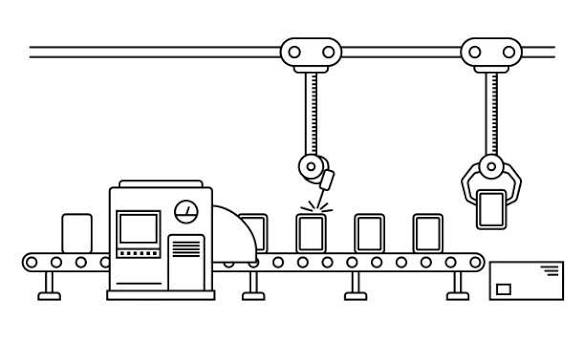
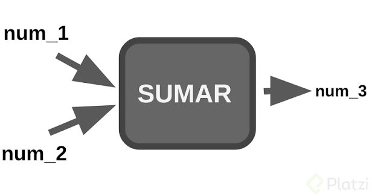
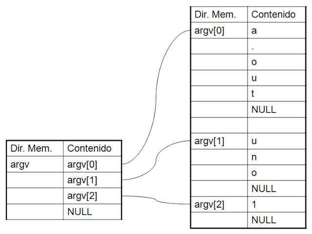

# Módulo 04: Funciones en C

Bienvenidos al maravilloso submundo de las funciones, donde por fin vas a dejar de escribir todo tu código amontonado dentro de `main()` como si fuera un basurero. Si vienes de Python, seguro estás acostumbrado a usar `def` para todo sin pensar mucho. Bueno, en C, las funciones requieren un poco más de protocolo, pero a cambio te dan un control absoluto.

---

## 1. Conceptos Básicos y Modularidad

<div align="center">
  
</div>

### El Principio de Modularidad
Imagina que estás armando un mueble sin instrucciones (algo que seguro has hecho). Si todas las piezas vinieran pegadas en un solo bloque gigantesco, sería imposible de manejar. **La modularidad** consiste en dividir un programa grande y complejo en bloques de código pequeños, independientes y reutilizables. Básicamente, aislar las tareas para que si algo explota, sepas exactamente en qué bloque fue y no tengas que leer 2000 líneas de código para encontrar el error.

### Anatomía de una Función
Toda función en C tiene una estructura muy rígida (nada de improvisar aquí):
- **Tipo de retorno**: ¿Qué tipo de dato va a escupir la función cuando termine? (`int`, `float`, `char`, etc.)
- **Nombre**: Cómo vas a llamar a la función. (Usa nombres descriptivos, por favor, nada de `funcion1` o `cosita`).
- **Parámetros (argumentos)**: Lo que la función necesita para trabajar. Se pasan entre paréntesis `()`.
- **Cuerpo `{ }`**: Las llaves contienen el código, la magia, o el desastre que vas a escribir.

```c
int sumar(int a, int b){
    int resultado = a + b;
    return resultado;
}
```

### Funciones `void`
¿Y qué pasa si tu función no necesita devolver nada y solo está ahí para hacer su trabajo sucio en silencio? Para eso usamos `void` (vacío). Son funciones operativas que ejecutan tareas (como imprimir en pantalla) pero no le devuelven ningún valor útil al sistema.

```c
void insultar_usuario(void){
    printf("Escribiste mal el comando, inútil.\n");
    // No hay return, porque no devuelve nada.

    // O si necesitas salir de la función, puedes usar un return sin nada de esta forma
    return;
}
```

---

## 2. Declaración vs. Definición (Prototipos)

<div align="center">
  
</div>

### El orden de lectura de C
El compilador de C es como un burócrata muy estricto y de mente cerrada: lee el archivo de arriba hacia abajo, línea por línea. Si intentas invocar una función que está escrita *debajo* de donde la llamas, el compilador entrará en pánico diciendo algo como "Ni puta idea que es esto bro". Necesita "conocer" la función antes de usarla.

### Los Prototipos (Firmas)
Para calmar al compilador sin tener que poner todas tus funciones amontonadas arriba de `main()`, usamos **Prototipos**. Un prototipo es simplemente la declaración de la función (su firma) que le dice al compilador: "Oye, relájate, más adelante te voy a explicar cómo funciona esto, pero confía en que existe y recibe estos parámetros". Se colocan antes del `main`.

Dichas definiciones por lo general se encuentran en archivos .h, los cuales ya has visto antes; por ahora solo tienes que saber que son como una especie de contrato o "ADT" (Abstract Data Type), los cuales definen qué es lo que hace una función pero no cómo lo hace. Por ejemplo, no le dirían al compilador "suma dos números", sino que simplemente le dirían "toma dos números y devuélvenos el resultado", sin importar si es mediante la suma o cualquier otro método que se te ocurra.

Sirven para que precisamente el compilador sepa qué es lo que hace una función y pueda compilar sin problemas.

### La Implementación (Definición)
Es el desarrollo completo del bloque de código. Generalmente, ponemos los prototipos arriba, el `main()` en el medio, y las implementaciones bien ordenadas abajo.

Aunque por ahora, puedes escribir la función completa antes del bloque main y no pasa nada. No es estrictamente necesario usar prototipos en tus inicios, pero sí es una buena práctica para aprender a crear un código ordenado y modular.

```c
#include <stdio.h>

// 1. PROTOTIPO (El compilador se tranquiliza)
int multiplicar(int x, int y);

int main(){
    // Invocamos la función. El compilador ya la conoce gracias al prototipo.
    int resultado = multiplicar(5, 4); 
    printf("Resultado: %d\n", resultado);
    return 0;
}

// 2. IMPLEMENTACIÓN (El trabajo real, escondido abajo)
int multiplicar(int x, int y){
    return x * y;
}
```

---

## 3. Retorno de Valores

<div align="center">
  
</div>

### La sentencia `return`
La palabra mágica `return` hace dos cosas:
1. Devuelve el resultado prometido (del tipo declarado) a quien llamó a la función.
2. **Asesina** la ejecución de la función. Cualquier línea de código que pongas debajo de un `return` jamás se ejecutará. Es un billete de solo ida.

### Retorno único
A diferencia de Python o Go, donde puedes devolver tuplas o múltiples valores alegremente, **C es estricto: una función estándar solo puede retornar un único dato**. Si necesitas devolver más cosas, vas a tener que usar punteros o structs (lo veremos en otros módulos, así que tú tranquilo yo nervioso).

### Captura del resultado
Cuando una función retorna un valor, no puedes dejarlo caer al vacío. El código que la llama debe "atrapar" ese valor, ya sea en una variable, usarlo en un condicional, o imprimirlo directamente. Ojo que si no lo atrapas este se pierde para siempre.

```c
int obtener_edad(){
    return 25;
}

int main(){
    // Atrapando el valor en una variable
    int mi_edad = obtener_edad(); 
    
    // Usándolo directamente
    if (obtener_edad() >= 18){
        printf("Eres legal.\n");
    }
    return 0;
}
```

---

## 4. Paso de Parámetros: Copia vs. Referencia

<div align="center">
  
</div>

Aquí es donde C separa a los niños de los adultos (otra vez). Presta atención.

### Paso por Copia (Valor)
Es el estándar de C. Cuando le pasas una variable a una función, **la función recibe un clon exacto** de esa variable. Cualquier tortura o modificación que la función le haga al clon, muere dentro de la función. La variable original, allá en su casita (`main`), queda completamente intacta.

```c
void intentar_hackear(int dinero){
    dinero = 999999; // Modificamos el clon
}

int main(){
    int mi_cuenta = 10;
    intentar_hackear(mi_cuenta);
    printf("%d", mi_cuenta); // Imprime 10. Estás pobre. El original ni se enteró.
    return 0;
}
```

### Paso por Referencia (Punteros al rescate)
¿Qué pasa si realmente *queremos* modificar la original? Tenemos que decirle a la función **dónde vive** la variable. Usamos la dirección de memoria (`&`) y punteros (`*`) para que la función vaya hasta la casa de la variable y la modifique directamente. (Tranquilo, profundizaremos en punteros luego, pero este es su uso más básico).

```c
void hackear_de_verdad(int *dinero){
    *dinero = 999999; // Vamos a la dirección y modificamos el valor real
}

int main(){
    int mi_cuenta = 10;
    hackear_de_verdad(&mi_cuenta); // Le pasamos la dirección de memoria (&)
    printf("%d", mi_cuenta); // Imprime 999999. ¡Felicidades!
    return 0;
}
```

### Paso de Arreglos (Arrays): La gran excepción
Los arreglos son especiales. **Un arreglo NUNCA se copia al pasarlo a una función.** Sería demasiado costoso en memoria copiar 1000 elementos solo para pasarlos. En su lugar, C implícitamente pasa el arreglo *por referencia* (envía la dirección de su primer elemento). Si modificas un arreglo dentro de una función, estás modificando el original. Cuidado con eso.

---

## 5. Ámbito de las Variables (Scope)

<div align="center">
  
</div>

El "scope" o ámbito dicta dónde vive y respira una variable. Si no entiendes esto, te la pasarás peleando con errores de "variable undeclared".

### Variables Locales
Son las que defines dentro de las llaves `{ }` de una función. Nacen cuando la función se ejecuta y **mueren trágicamente** cuando la función termina. El resto del programa ni siquiera sabe que existieron.

### Variables Globales
Se declaran fuera de todas las funciones (usualmente arriba de todo). Son visibles y modificables por *cualquier* función en el archivo.
> [!WARNING]
> **Son una terrible práctica en diseño modular.** Crean dependencias ocultas, "efectos secundarios" impredecibles y hacen que tu código sea un infierno de depurar. Si usas variables globales sin justificación, alguien llorará, y probablemente seas tú dentro de poco tiempo.

### Variables Estáticas (`static`)
Son un híbrido bizarro. Son locales (solo la función puede verlas), pero **no mueren** cuando la función termina. "Recuerdan" su último valor entre diferentes llamadas a la misma función. Útiles para contadores internos.

```c
void contador_persistente(){
    static int llamadas = 0; // Se inicializa solo la primera vez
    llamadas++;
    printf("Me has llamado %d veces\n", llamadas);
}
// Si la llamas 3 veces, imprimirá 1, luego 2, luego 3.
```

---

## 6. Enfoques de Resolución: Iterativo vs. Recursivo

<div align="center">
  
</div>

Hay dos formas principales de hacer que una función repita cosas. 

### Implementación Iterativa
Resolver problemas repitiendo instrucciones usando bucles clásicos (`for`, `while`). Es el enfoque directo, aburrido pero increíblemente sólido. Suele ser **más eficiente en memoria y velocidad** porque no implica el costo oculto de estar llamando a funciones una y otra vez.

```c
int factorial_iterativo(int n){
    int resultado = 1;
    for (int i = 1; i <= n; i++){
        resultado *= i;
    }
    return resultado;
}
```

### Implementación Recursiva
El *Inception* de la programación. Funciones que se llaman a sí mismas para resolver un problema, dividiéndolo en versiones más pequeñas. Es matemáticamente elegante (ideal para calcular factoriales, Fibonacci, o recorrer árboles).

### El Caso Base
Si una función se llama a sí misma infinitamente... bueno, tu RAM no es infinita. O más bien, tu programa explota. **Toda recursión necesita una condición de parada obligatoria**, conocida como "El Caso Base".

```c
int factorial_recursivo(int n){
    // EL CASO BASE (Parada de emergencia)
    if (n == 0 || n == 1){
        return 1;
    }
    // RECURSIÓN (Llamándose a sí misma)
    return n * factorial_recursivo(n - 1); 
}
```

### Comparativa y Riesgos (Stack Overflow)
Como puedes ver en los ejemplos anteriores, ambas funciones (`factorial_iterativo` y `factorial_recursivo`) hacen exactamente lo mismo: calculan el factorial de un número, solo que lo abordan desde ángulos completamente distintos.

El código recursivo suele ser muy elegante y corto. **PERO**, cada vez que una función se llama a sí misma, gasta memoria en la pila del sistema (`stack`). Si te olvidas del caso base, o si la recursión es demasiado profunda, agotarás esa memoria y el sistema operativo aniquilará tu programa con el famoso error **Stack Overflow** (desbordamiento de pila). El enfoque iterativo no tiene este riesgo ya que solo actualiza una variable dentro de un bucle. Úsala con sabiduría.

---

## 7. Argumentos desde la Consola (Pasando datos al main)

<div align="center">
  
</div>

¿Te has preguntado por qué el `main` a veces tiene cosas raras adentro de los paréntesis? Hasta ahora hemos usado `int main()`, o `int main(void)`, que significa que nuestro programa arranca sin recibir nada del exterior. Pero podemos hacer que reciba datos *justo cuando el usuario lo ejecuta desde la terminal*.

### La firma completa del `main`
Pasamos de `int main()` a:
```c
int main(int argc, char *argv[])
```
Sí, da un poco de miedo, pero vamos a desmenuzarlo:

### `argc` (Argument Count)
Es un entero que literalmente cuenta cuántas "palabras" o argumentos se enviaron al programa al ejecutarlo.
Ojo: El nombre del programa en sí mismo cuenta como el primer argumento. Así que `argc` siempre vale al menos `1`.

### `argv` (Argument Vector)
Es un arreglo de cadenas de texto (strings). Contiene las palabras exactas que el usuario tecleó.
- `argv[0]` es el nombre del programa (ej: `./mi_programa`).
- `argv[1]` es la primera palabra que le pasaron.
- Y así sucesivamente.

### Uso práctico
Esto es súper útil para hacer programas reales de terminal, pasándoles configuraciones o archivos de entrada directamente antes de arrancar; muy usado en scripts para ejecutar múltiples pruebas de un algoritmo o para comparar resultados.

```c
// Compila esto y ejecútalo como: ./programa archivo.txt 42
int main(int argc, char *argv[]) 
{
    printf("Has pasado %d argumentos en total.\n", argc);
    
    printf("El nombre del programa es: %s\n", argv[0]);
    
    if (argc > 1) 
    {
        printf("El primer argumento real es: %s\n", argv[1]);
    }
    
    return 0;
}
```

Bien, eso es suficiente por ahora. Ya tienes las herramientas para dejar de escribir código espagueti. Aprovéchalo, crea módulos limpios, y por favor, no te olvides del caso base en tus recursiones.
Consulta el archivo `sintaxis.c` de esta sección para ver diferentes implementaciones de funciones y la sintaxis correspondiente en cada caso.
---

<div align="center">
  <a href="../03_Control_de_Flujo/03_Control_de_Flujo.md">⬅️ Retroceder</a> | 
  <a href="./Codigo/">💻 Ir a Códigos</a> | 
  <a href="../05_Arreglos_y_Matrices/05_Arreglos_y_Matrices.md">Avanzar ➡️</a>
</div>
