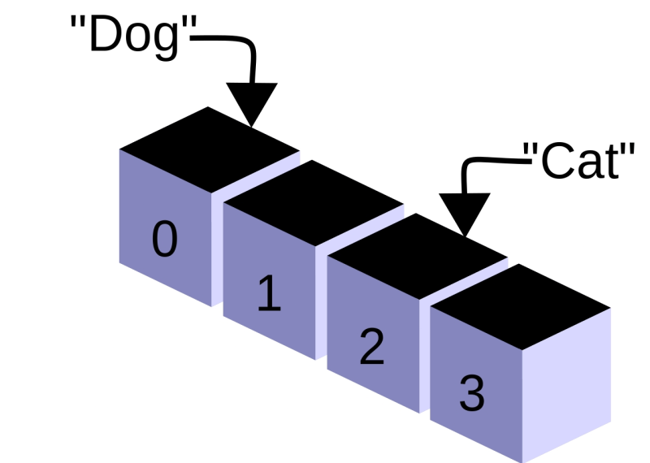
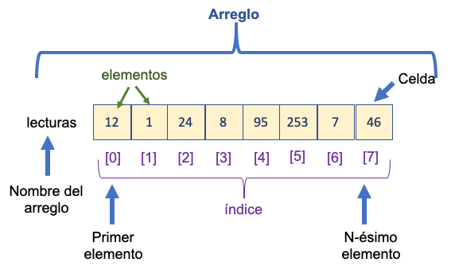
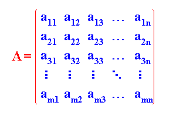

# Módulo 5: Arreglos y Matrices (Arrays)

Bienvenidos a los Arreglos, el momento donde te das cuenta de que crear 100 variables individuales (`int nota1, nota2... nota100;`) es un insulto a la inteligencia humana y un boleto de ida al síndrome del túnel carpiano. C te ofrece una forma de agrupar estos datos. Pero cuidado, C te dará un revólver cargado: te permite gestionar esta información con muchísima eficiencia, pero si no sabes dónde terminan tus arreglos, terminarás pintando tu techo con las pocas neuronas que te quedaban y además terminarás corrompiendo la memoria.

---

## 1. Introducción a los Arreglos (1D)

<p align="center">
  
</p>

### Concepto Fundamental
Un arreglo (o *array*) es básicamente una colección de múltiples variables **del mismo tipo de dato** que se almacenan de forma secuencial bajo un único nombre. Piensa en ellos como un casillero gigante donde cada compartimento tiene un número de serie.

### Declaración e Inicialización
Para declarar un arreglo estático, necesitas tres cosas: el tipo, el nombre y el tamaño entre corchetes `[]`.

```c
// Sintaxis estática: Reserva el espacio para 5 enteros, pero contiene basura de memoria
int edades[5]; 

// Asignación rápida: Declaras e inicializas al mismo tiempo. 
// No necesitas poner el tamaño, el compilador sabe contar.
int numeros[] = {10, 20, 30}; 

// Si le das tamaño y menos elementos, el resto se inicializa en 0
int notas[5] = {1, 2}; // El arreglo contiene {1, 2, 0, 0, 0}
```

### El Índice Cero: La Regla de Oro
En C, **el primer elemento SIEMPRE está en la posición 0**, no en la 1. Si tu arreglo tiene tamaño $N$, el último elemento vivirá en la posición $N - 1$. Acostúmbrate; si no, tus programas te vomitarán el famoso "Segmentation Fault".

### Acceso y Actualización de Valores
Los corchetes `[]` son mágicos: sirven tanto para leer como para escribir (acceso aleatorio en tiempo constante $O(1)$).

* **Lectura (Acceso):** Extraer un valor para usarlo.
  ```c
  int x = numeros[2]; // 'x' ahora vale 30 (el tercer elemento)
  ```
* **Escritura (Actualización):** Sobreescribir el valor exacto en esa posición.
  ```c
  numeros[0] = 999; // Ahora el arreglo es {999, 20, 30}
  ```

---

## 2. Gestión en Memoria y la "Trampa de los Límites"

<p align="center">
  
</p>

### Memoria Contigua
Cuando pides un arreglo, C va a la RAM y reserva un bloque *continuo* de memoria. Los elementos se guardan uno exactamente al lado del otro. Si tienes un `int` de 4 bytes, el elemento 0 está en la dirección de memoria `X`, el elemento 1 en `X + 4`, y así sucesivamente. Esta es la razón principal de su increíble velocidad y eficiencia.

### El Operador `sizeof`
Como en C los arreglos son bastante crudos y no "guardan" su propio tamaño de forma intrínseca, puedes usar `sizeof` para calcular cuántos elementos tienen dinámicamente. *(Nota: esto solo funciona en el mismo scope/función donde se declaró el arreglo).*

```c
int arreglo[10];
// sizeof(arreglo) da el tamaño total en bytes (10 * 4 = 40 bytes)
// sizeof(arreglo[0]) da el tamaño de un elemento (4 bytes)
int longitud = sizeof(arreglo) / sizeof(arreglo[0]); // Resultado: 10
```
Esto vendría a reemplazar a la clásica función `len()` que usábamos en Python. Un poco engorroso, lo sé, pero nadie dijo que C sería fácil.


### El Desbordamiento (Out of Bounds)
Aquí viene la trampa mortal. **C NO COMPRUEBA LOS LÍMITES.** Si tienes un arreglo de tamaño 5 y decides guardar algo en la posición 10, C no te va a decir que no puedes, te lo permitirá y escribirá en esa memoria sin preguntar nada.
Esto corrompe la memoria de otras variables o de tu propio programa, y si tienes suerte, el Sistema Operativo matará tu proceso regalándote un hermoso **Segmentation Fault (Core Dumped)**.

```c
int arr[5];
arr[10] = 666; // C te lo permite, pero tu programa probablemente explotará.
```

---

## 3. Iteración y Operaciones Básicas (1D)

<p align="center">
  
</p>

### El Combo Arreglo + Bucle `for`
Son como uña y mugre. Usas la variable de control del bucle (`i`) como tu índice dinámico para recorrer el arreglo de principio a fin sin esfuerzo.

```c
int notas[5] = {10, 8, 9, 7, 10};
for (int i = 0; i < 5; i++){
    printf("Nota %d: %d\n", i, notas[i]);
}
```

### Llenado de Datos
Puedes pedirle datos al usuario con `scanf` para rellenar tu arreglo paso a paso. Solo recuerda pasarle la dirección de memoria con `&` al elemento específico.

```c
int edades[3];
for (int i = 0; i < 3; i++){
    printf("Ingresa la edad %d: ", i);
    scanf("%d", &edades[i]); // ¡El & es vital aquí!
}
```

### Algoritmos Esenciales
Todo programador en C necesita saber cómo hacer estas operaciones básicas:

* **Sumar todo y Promedio:**
  ```c
  int suma = 0;
  for (int i = 0; i < 3; i++){
      suma += edades[i];
  }

  float promedio = (float)suma / 3;
  ```
* **Encontrar el Mayor (o Menor):**
  ```c
  int mayor = edades[0]; // Asumes que el primero es el mayor
  for (int i = 1; i < 3; i++){
      if (edades[i] > mayor){
          mayor = edades[i]; // Hay un nuevo mayor
      }
  }
  ```

---

## 4. Arreglos Multidimensionales (Matrices, Cubos y N-Dimensiones)

<p align="center">
  
</p>

### Concepto Escalable
Si un arreglo 1D es una fila, un 2D es un "arreglo de arreglos" (una tabla o matriz). Un 3D es un arreglo de tablas (un cubo o un libro). Y sí, C soporta $N$ dimensiones, solo sigue agregando corchetes.

### Declaración y Acceso
* **Sintaxis:**
  ```c
  int matriz[3][4];  // 3 Filas y 4 Columnas
  int cubo[2][3][4]; // Profundidad (Z), Filas (Y), Columnas (X)
  ```
* **Lectura/Actualización:** Necesitas dar una coordenada exacta por cada dimensión que posea el arreglo.
  ```c
  cubo[1][2][0] = 99; // Profundidad 1, fila 2, columna 0
  ```

### Recorrido de N-Dimensiones
* **La Regla de los Bucles:** Necesitas un bucle anidado por cada dimensión. 2 dimensiones = 2 bucles `for`. 3 dimensiones = 3 bucles `for`.
* **Orden de Recorrido ("Row-major order"):** En la memoria RAM no existen las dimensiones, todo es una sola línea plana contigua. C ordena las matrices por filas. **El bucle más profundo (el que está más adentro) debe iterar siempre sobre la última dimensión**. Si no lo haces así, destruirás el rendimiento de la caché del procesador porque estarás saltando por toda la memoria.

```c
int matriz[3][4];
// 'i' itera sobre las filas (primera dimensión)
for (int i = 0; i < 3; i++){
    // 'j' itera sobre las columnas (última dimensión)
    for (int j = 0; j < 4; j++){
        matriz[i][j] = 0; // Recorrido correcto, amigable con la caché
    }
}
```

---

## 5. Paso de Arreglos (de cualquier dimensión) a Funciones

<p align="center">
  
</p>

### Referencia Implícita
A diferencia de variables normales (que se pasan por valor), **los arreglos nunca se copian al pasarlos a una función**. C es extremadamente eficiente; simplemente envía un *puntero* (la dirección de memoria) al primer elemento. 
Esto significa que **si actualizas un valor dentro de la función, estás alterando el arreglo original directamente**.

### Arreglos 1D como Parámetros
Al pasarse como puntero, la función pierde el superpoder de usar `sizeof` para calcular su longitud. Por lo tanto, **es tu obligación sagrada enviar siempre el tamaño (`size`) como un parámetro extra** para saber cuándo detenerte.

```c
// El 'size' es indispensable para no iterar a ciegas
void imprimirArreglo(int arr[], int size){
    for (int i = 0; i < size; i++){
        printf("%d ", arr[i]);
    }
}
```

### Arreglos Multidimensionales como Parámetros
C es estricto aquí: necesita saber cómo hacer el salto matemático para encontrar los elementos en la memoria plana. Por lo tanto, la regla es clara: **al recibir un arreglo de múltiples dimensiones, todas las dimensiones excepto la primera deben especificarse obligatoriamente** en los corchetes.

```c
// Tienes que especificar la segunda dimensión (columnas) obligatoriamente
void procesarMatriz(int matriz[][5], int filas){
    // Lógica para matriz 2D
}

// Para un cubo: [Indefinido][10][5]
void procesarCubo(int cubo[][10][5], int profundidad){
    // Lógica para matriz 3D
}
```

---

## 6. Arreglos de Longitud Variable (VLAs)

<p align="center">
  
</p>

### El Estándar C99
Antes del estándar C99, el tamaño de un arreglo tenía que ser estrictamente una constante macro (`#define` o constante mágica). Con C99, se permitió declarar un arreglo usando una variable ingresada por el usuario en tiempo de ejecución.

```c
int n;
printf("¿De qué tamaño quieres el arreglo? ");
scanf("%d", &n);

// Esto es un VLA (Variable Length Array)
int arr[n]; 
```

### Riesgos (El Lado Oscuro de los VLAs)
1. **Stack Overflow:** Los VLAs se alojan en la memoria temporal de funciones llamada *pila* (Stack), que tiene un límite de memoria bastante bajo (algunos Megabytes). Si el usuario introduce `n = 100000000`, colapsarás la pila de memoria temporal y el programa morirá (Stack Overflow). Si necesitas manejar tamaños masivos, es obligatorio usar memoria dinámica (concepto que veremos más adelante).
2. **Sin Inicialización Rápida:** No puedes inicializar los VLAs en la misma línea que los declaras (hacer `int arr[n] = {0};` no está permitido). Tendrás que llenarlos elemento a elemento usando un bucle `for` o funciones especializadas.

---
