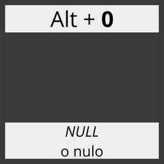
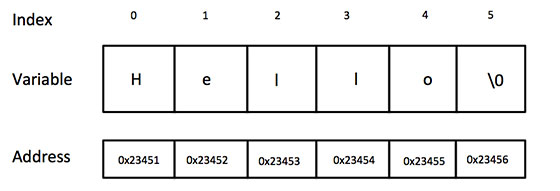
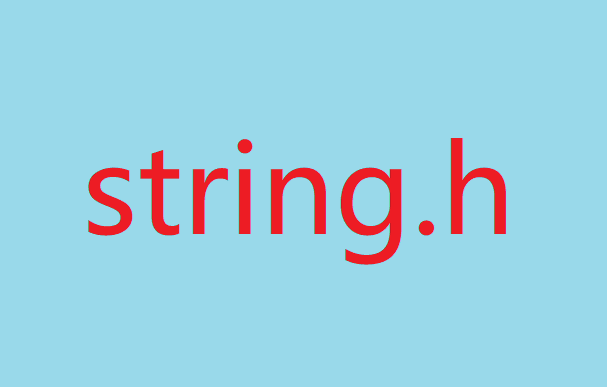
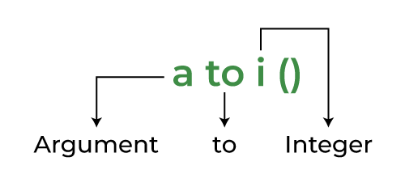
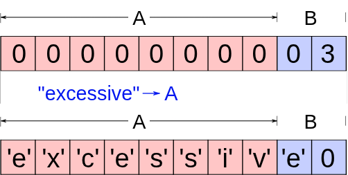

# Módulo 6: Strings (Cadenas de Caracteres)

Llegamos a los tan lindos Strings, cadenas de caracteres que en Python tienen su clase propia. Aquí sin embargo es un poco distinto. En C, los strings no existen como un tipo de dato nativo. Pero no te preocupes, cuando domines los strings aquí, entenderás realmente cómo funciona la memoria y por qué el resto del mundo prefirió crear lenguajes de más alto nivel para evitar lidiar con esto.

---

## 1. El Concepto Fundamental y el Carácter Nulo (`\0`)

<p align="center">
  
</p>

### La Ilusión del String
En C, un string es simplemente un **arreglo unidimensional de tipo `char`**. Punto. No hay un tipo `String` mágico. Es solo una fila continua de letras guardadas en la memoria que, por convención, decidimos que forman palabras.

### El Carácter Nulo (`\0`): El terminador invisible
Este es **el concepto más importante de todo el módulo**. Como a C le da igual si tu arreglo de 50 letras contiene la palabra "Hola" o el guion entero de Reservoir Dogs (Buena pelicula por cierto...), necesita una forma de saber dónde termina exactamente tu texto útil. 

Aquí entra el carácter nulo (`\0`). Es una marca invisible (valor ASCII 0) que se pone al final de tu texto. Básicamente le dice a las funciones de C: *"Aquí termina la palabra, el resto es basura, deja de leer"*.

### Tamaño físico vs. Longitud útil
Tienes que entender la diferencia entre lo que reservas y lo que usas:
* **Tamaño físico:** Cuánta memoria reservaste. Ejemplo: Un casillero `char palabra[50];` tiene capacidad para 50 caracteres.
* **Longitud útil:** Cuántas letras realmente estás usando para formar tu texto. Si guardas "Hola", estás usando 4 letras reales + 1 espacio obligatorio para el `\0`. Total ocupado = 5 espacios. Te sobran 45 que están llenos de basura que será ignorada.

---

## 2. Declaración e Inicialización

<p align="center">
  
</p>

### Asignación literal (Sintaxis rápida)
La forma más amigable y recomendada para inicializar un string al momento de declararlo.

```c
// El compilador calcula el tamaño y añade el '\0' al final automáticamente.
char saludo[] = "Hola"; 
```

### Asignación carácter por carácter
Esta es la versión cruda, para que veas que por debajo no es más que un arreglo de letras.

```c
// Si lo haces a mano, es tu responsabilidad agregar el '\0' al final, de otra forma no será reconocido como un string.
char saludo[5] = {'H', 'o', 'l', 'a', '\0'}; 
```

### Literales de solo lectura (Advertencia Mortal)
Probablemente veas esta sintaxis usando punteros:

```c
char *texto = "Hola";
```

**ADVERTENCIA:** Aunque funciona, el texto literal se guarda en un área de **memoria de solo lectura** (Read-Only). Si en el futuro intentas cambiar una letra (ej. `texto[0] = 'h';`), el sistema operativo te castigará asesinando tu programa de un tiro con un hermoso **Segmentation Fault**. Usa arreglos (`char texto[] = "Hola";`) si planeas modificar el texto.

---

## 3. Entrada y Salida (Integración del Módulo I/O)

<p align="center">
  
</p>

### Impresión
Tienes las herramientas clásicas de `printf` usando el formato `%s` y la función rápida `puts`.

```c
char cadena[] = "I need a drink.";
printf("Mensaje: %s\n", cadena);

// puts imprime el string y automáticamente añade un salto de línea (\n)
puts(cadena);
```

### Captura segura
**Olvídate de usar `scanf("%s", cadena);`**. Aunque funciona para leer una palabra, a la función `scanf` no le importan los límites y desbordará tu arreglo si el texto es muy largo, además de que se detiene en el primer espacio (solo leerá "Hola", no "Hola mundo"). La herramienta definitiva para atrapar strings desde la consola es `fgets`:

```c
char nombre[50];
// fgets(donde_guardar, max_caracteres, origen_de_datos);
fgets(nombre, 50, stdin);
```

### Limpieza del `\n` (El salto de línea no deseado)
`fgets` es muy seguro, pero tiene un pequeño defecto: guarda el `\n` (cuando presionas Enter) dentro de tu string. Para eliminarlo elegantemente, prepararemos el terreno usando `strcspn` de `<string.h>`:

```c
#include <string.h>

char nombre[50];
fgets(nombre, sizeof(nombre), stdin);

// Buscamos el '\n' y lo reemplazamos por el terminador '\0'
nombre[strcspn(nombre, "\n")] = '\0'; 
```

---

## 4. Manipulación de bloques de texto: La librería `<string.h>`

<p align="center">
  
</p>

Como los strings son arreglos, **los operadores matemáticos no funcionan**. No puedes usar `=`, `+` ni `==`. Hacer `cadena1 = cadena2;` es un error tonto, porque estarías intentando cambiar la dirección de memoria de un arreglo constante, no copiando el texto. Para trabajar con ellos dependemos de las funciones que nos regala `<string.h>`.

### Medir (`strlen`)
Calcula la cantidad de caracteres **reales** de una cadena antes de llegar al `\0`. No cuenta el espacio que ocupa el nulo.

```c
char texto[50] = "Hola";
// strlen(texto) devuelve 4
// sizeof(texto) devuelve 50 (memoria total reservada)
int longitud = strlen(texto); 
```

### Copiar (`strcpy` y `strncpy`)
Copia el texto de una cadena y lo pega dentro de otra. 
*   **`strcpy(destino, origen)`**: Copia todo hasta encontrar el `\0` del origen. Es peligrosa si el origen es más grande que el destino (Buffer Overflow).
*   **`strncpy(destino, origen, n)`**: La versión segura. Solo copia un máximo de `n` caracteres. Si el origen es muy largo, se detiene a tiempo para no desbordar la memoria.

```c
char origen[] = "Secreto super clasificado";
char destino[10];

// strcpy(destino, origen); // ERROR MORTAL: destino solo tiene espacio para 10.
strncpy(destino, origen, 9); // Seguro: Copiamos maximo 9 para dejar lugar al '\0'
destino[9] = '\0'; // strncpy no añade el nulo automáticamente si se llega al límite
```

### Comparar (`strcmp` y `strncmp`)
Compara dos cadenas alfabéticamente. El clásico error de novato es usar `if (cadena1 == cadena2)`. Eso compara si ambos arreglos viven en la misma dirección de RAM, no si tienen el mismo texto.
*   **`strcmp(cadena1, cadena2)`**: Compara ambas cadenas completas hasta el `\0`.
*   **`strncmp(cadena1, cadena2, n)`**: Compara solamente los primeros `n` caracteres. Muy útil si solo te interesa verificar un prefijo (ej. verificar si una palabra empieza con "Auto").

```c
// Compara solo los primeros 4 caracteres
if (strncmp("Automovil", "Autobus", 4) == 0){
    puts("Ambas palabras empiezan con 'Auto'");
}
```

### Concatenar (`strcat` y `strncat`)
Concatena (pega) una cadena al final de otra existente.
*   **`strcat(destino, origen)`**: Pega todo el origen al final del destino. Si el destino no tiene espacio de sobra, corromperás la memoria.
*   **`strncat(destino, origen, n)`**: Pega un máximo de `n` caracteres del origen.

```c
char saludo[15] = "Hola, "; // Tiene espacio para 15 letras total
char nombre[] = "Mundo cruel";

// strcat(saludo, nombre); // ERROR: 6 (saludo) + 11 (nombre) = 17. Se pasa de 15.
strncat(saludo, nombre, 8); // Seguro: Pega hasta 8 letras (strncat siempre añade el '\0')
```

### Buscar caracteres perdidos (`strcspn` y `strchr`)
* `strcspn`: Calcula cuántos caracteres hay antes de encontrar un carácter específico. Como vimos antes, es ideal para buscar y borrar el `\n` que deja `fgets`.
* `strchr`: Busca la primera aparición de una letra específica dentro del texto y devuelve un puntero a esa posición (o `NULL` si no la encuentra).

```c
char correo[] = "usuario@gmail.com";
char *arroba = strchr(correo, '@');

if (arroba != NULL){
    puts("Es un correo válido (bueno, al menos tiene arroba).");
}
```

---

## 5. Análisis y modificación carácter por carácter: La librería `<ctype.h>`

<p align="center">
  
</p>

Es el complemento perfecto para analizar y modificar strings letra por letra. Típicamente lo usas dentro de un bucle que recorre el string hasta chocar con el nulo: `while(cadena[i] != '\0')`.

### Evaluación de caracteres
* `isalpha(c)`: Evalúa si el carácter es una letra del alfabeto (A-Z, a-z).
* `isdigit(c)`: Evalúa si el carácter es un número (del '0' al '9').
* `isalnum(c)`: Evalúa si el carácter es letra o número (alfanumérico).
* `isspace(c)`: Evalúa si el carácter es un espacio en blanco, una tabulación o un salto de línea.

```c
char pass[] = "Pass123";
if (isdigit(pass[4])){
    puts("La quinta letra es un número.");
}
```

### Conversión de capitalización
* `toupper(c)`: Convierte una letra minúscula a su versión en MAYÚSCULA.
* `tolower(c)`: Convierte una letra mayúscula a su versión en minúscula.

**Ejercicio clásico: Convertir todo a mayúsculas:**

```c
#include <ctype.h>
#include <stdio.h>

char grito[] = "no me grites";
for (int i = 0; grito[i] != '\0'; i++){
    grito[i] = toupper(grito[i]);
}
// grito ahora es "NO ME GRITES"
```

---

## 6. Conversión de texto a números: La librería `<stdlib.h>`

<p align="center">
  
</p>

A veces tendrás strings que en realidad son números disfrazados, como `"42"` o `"3.14"`. No puedes simplemente sumarles `5`. Tienes que convertirlos al tipo de dato numérico correspondiente usando `<stdlib.h>`.

### Las funciones básicas (Rápidas pero un poco peligrosas)
Estas funciones convierten directamente, pero si le pasas basura como `"hola"`, te devuelven un triste `0` sin avisarte del error.
* `atoi`: (ASCII to Integer) Convierte directamente un string en un número entero (`int`).
* `atof`: (ASCII to Float) Convierte un string en un número decimal (`double`).

```c
#include <stdlib.h>

char edad_texto[] = "25";
int edad = atoi(edad_texto); // Ahora es un entero real
```

### Las funciones robustas (Para código a prueba de balas)
Son más seguras porque permiten detectar si hubo letras inválidas durante la conversión usando punteros.
* `strtol`: Convierte un string a entero largo (`long`), detectando errores.
* `strtod`: Convierte un string a decimal (`double`), también con capacidad de detectar formato incorrecto.

```c
char texto[] = "42abc";
char *resto;
long numero = strtol(texto, &resto, 10); // Base 10

// numero = 42
// resto apuntará a "abc", así que sabemos que hubo basura al final.
```

---

## 7. Las "Trampas Clásicas" de los Strings

<p align="center">
  
</p>

### El Desbordamiento por el `\0` (Olvido Mortal)
¿Qué pasa si declaras esto?

```c
char nombre[4] = "Juan";
```

Aquí empacaste 4 letras en 4 espacios. No hay lugar para el `\0`. C no te avisará, pero cuando uses `printf` o `strlen`, estas funciones leerán la palabra "Juan" y **seguirán leyendo y escupiendo basura de la memoria** hasta encontrar un `\0` por puro accidente en otra parte de la RAM. Nunca olvides reservar al menos `tamaño + 1`.

### Uso de funciones "inseguras"
Las funciones originales de `<string.h>` (`strcpy`, `strcat`, `strcmp`) asumen ciegamente que tú hiciste bien los cálculos de espacio. Si te equivocas, causarás un **Buffer Overflow** (Desbordamiento de búfer), que es el vector de ataque número uno para hackear sistemas escritos en C.

Hoy en día, la industria (y cualquier programador con sentido de autopreservación) prefiere usar las **versiones con límite de tamaño**, conocidas como las funciones "n":

* `strncpy(destino, origen, max_caracteres);`
* `strncat(destino, origen, max_caracteres);`
* `strncmp(cadena1, cadena2, max_caracteres);`

Estas funciones te permiten establecer un límite máximo de caracteres a procesar, evitando que tu programa explote si recibe textos más grandes de lo esperado. Usa protección.
