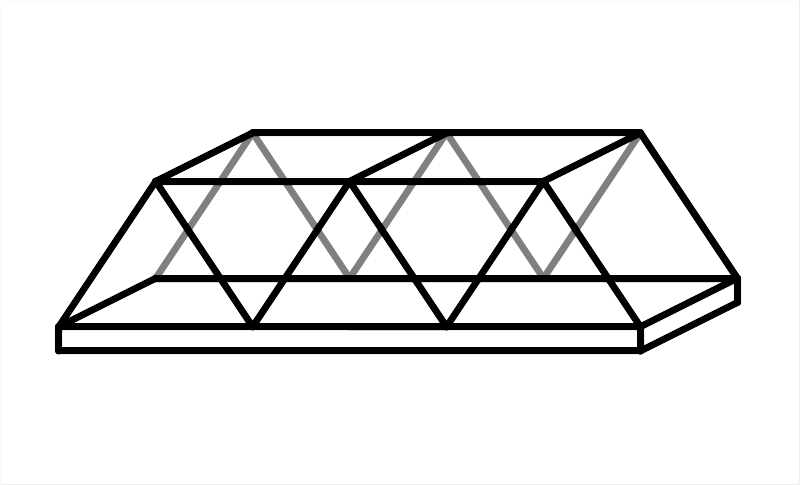
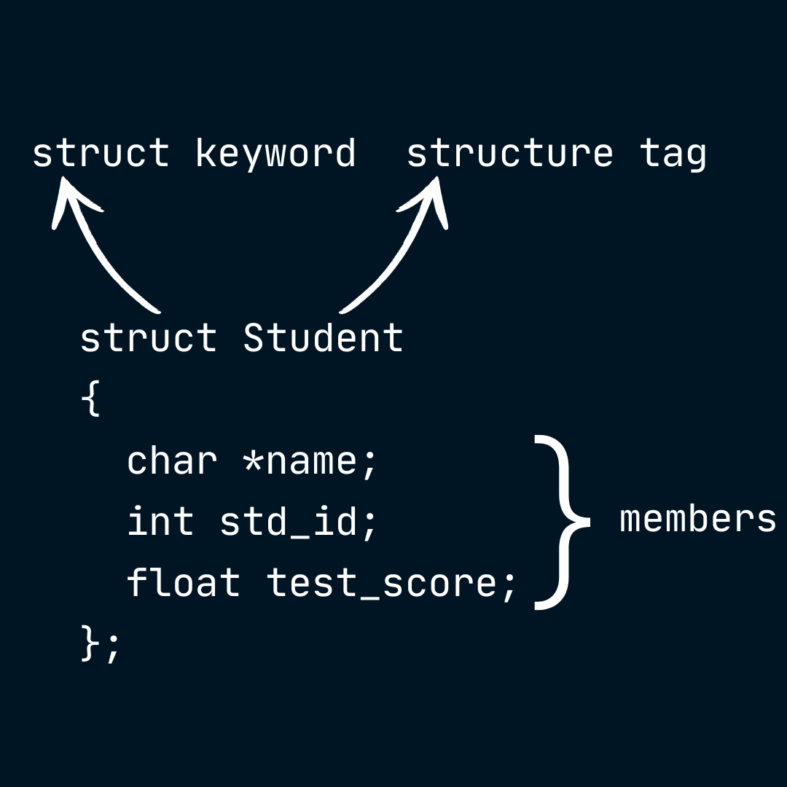
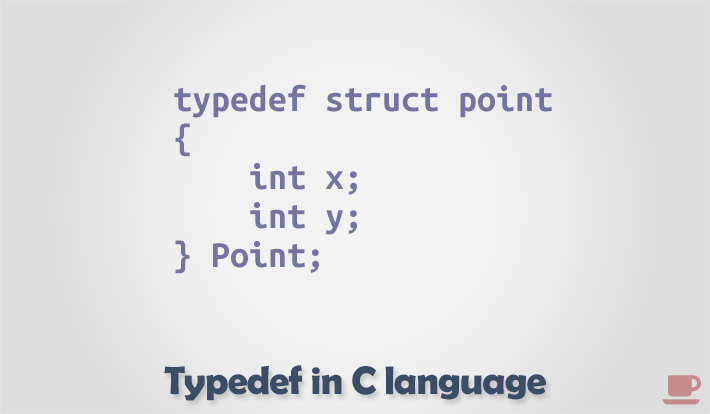
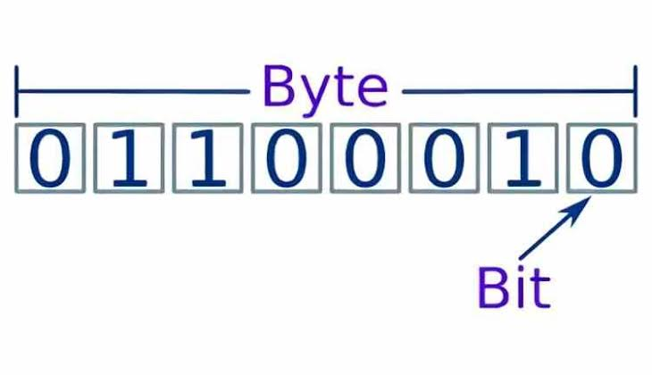

# Módulo 7: Structs y Unions

Si llegaste hasta acá, ya podemos empezar a ver C de verdad. Superaste datos, funciones, sintaxis, y ahora vamos a lo realmente interesante: ahora es cuando C por fin te da las herramientas para crear tus propios tipos de datos. Hasta ahora, si querías modelar a un empleado, tenías que crear un arreglo de `char` para el nombre, un `int` para la edad, y un `float` para el salario... todos sueltos y desparramados por la memoria. Los **Structs y Unions** vienen a poner orden en ese caos, permitiéndote empaquetar variables relacionadas bajo un mismo techo.

---

## 1. Introducción a las Estructuras (`struct`)

<p align="center">
  
</p>

### El Concepto
Una estructura (`struct`) es como una caja o un molde. Te permite agrupar variables de **diferentes tipos de datos** bajo un solo nombre. Es lo más cercano a la Programación Orientada a Objetos (como las clases) que vas a encontrar en C puro, pero sin métodos; aquí solo guardamos datos, la lógica va por separado.

### Declaración Global: El Molde
Las estructuras suelen definirse en el ámbito global (antes del `main` o en un archivo `.h`) para que todas tus funciones sepan qué forma tiene esta caja. Estás creando un molde, no estás ocupando memoria todavía.

```c
// Definimos cómo se ve un 'struct Empleado'
struct Empleado {
    char nombre[50];
    int edad;
    float salario;
}; // No olvides el punto y coma al final.
```

### Creación de variables (Instanciación)
Una vez creado el molde, puedes empezar a fabricar empleados de verdad dentro de tus funciones.

```c
int main() {
    // Le decimos al compilador que reserve memoria para un empleado.
    struct Empleado emp1;
    return 0;
}
```

---

## 2. Acceso e Inicialización

<p align="center">
  
</p>

### El Operador Punto (`.`)
Para entrar a la caja y manipular lo que hay adentro, usamos el sagrado operador punto. Si `emp1` es el dueño, `.edad` es su propiedad.

```c
emp1.edad = 30;
emp1.salario = 1500.50;
// Para los strings no podemos usar '=', recuerda usar strcpy
strcpy(emp1.nombre, "John Doe"); 
```

### Inicialización rápida
Escribir campo por campo es tedioso. Puedes inicializar todo el `struct` al momento de crearlo, usando llaves `{}`, siguiendo el mismo orden en que los definiste en el molde.

```c
struct Empleado emp2 = {"Jane Doe", 28, 2100.75};
```

### Copia directa
Una de las maravillas ocultas de C: si tienes dos structs **del mismo tipo**, puedes copiar todos los datos de uno hacia el otro con un simple `=`. El compilador se encarga de clonar bloque a bloque (incluso copia los arreglos internos, como el nombre).

```c
struct Empleado emp_clon;
emp_clon = emp2; // Ahora emp_clon tiene los datos de Jane Doe
```

---

## 3. Simplificación con `typedef`

<p align="center">
  
</p>

### El Problema
Escribir la palabra `struct` cada vez que vas a declarar una variable, un parámetro, o un arreglo es un dolor de cabeza (`struct Empleado e1; struct Empleado e2;`). 

### La Solución
La palabra reservada `typedef` te permite crear un **alias**. Básicamente le dices a C: *"A partir de ahora, cada vez que yo escriba esta palabra, tú la reemplazas mentalmente por toda esta otra definición"*. Convierte a tu `struct` en un tipo de dato nativo (como un `int` o un `float`), pero ahora es uno que tú mismo defines. Veamos un ejemplo:

### Sintaxis estándar de la industria
Combinamos la creación del struct con el `typedef` en un solo bloque.

```c
// "Define este struct anónimo como el nuevo tipo 'Producto'"
typedef struct {
    char nombre[30];
    float precio;
    int stock;
} Producto; 

int main() {
    // Ahora en vez de crear 'struct Producto p1 = ...', estamos creando un tipo Producto
    // de forma similar a como creamos un int o un float.
    Producto p1 = {"Laptop", 999.99, 10}; 
}
```

---

## 4. Arreglos de Estructuras (Bases de datos en RAM)

<p align="center">
  
</p>

### El Concepto
En el mundo real no vas a procesar un solo empleado o producto, vas a procesar cientos. Para eso creamos arreglos de estructuras. Cada elemento del arreglo es un registro completo.

```c
Producto inventario[100]; // 100 cajas completas en memoria contigua
// Recuerda que el tipo de dato del arreglo es Producto, que a su vez es un struct.
// Tal y como definías arreglos de enteros o de cualquier otro tipo de dato.
```

### Sintaxis Combinada
Mezclamos los corchetes de los arreglos con el operador punto. Siempre se lee de afuera hacia adentro: del arreglo al índice, del índice al campo.

```c
// Leemos el precio para el producto en la posicion 'i'
scanf("%f", &inventario[i].precio); 
```

### Algoritmia con Structs

*   **Búsqueda:** Iteras con un `for` usando `strcmp` para comparar strings (como el nombre), o un simple `==` para los IDs numéricos.
*   **Ordenamiento y el poder del Swap:** Si quieres ordenar tu arreglo por precio (ej. de menor a mayor), puedes comparar `inventario[j].precio > inventario[j+1].precio`. Y si necesitas intercambiarlos, **puedes intercambiar el struct completo de una vez** usando una variable temporal del tipo del struct, en lugar de copiar campo por campo.
*   **Control Lógico:** Declarar un arreglo de tamaño 100 no significa que los 100 estén ocupados. Siempre se utiliza un contador entero (ej. `int cantidad_actual = 0;`) que te dice hasta qué índice la información es válida, ignorando la basura de la memoria en las posiciones vacantes. Así que calcula bien el tamaño de tu arreglo de structs, puesto que cada struct ocupa espacio en memoria equivalente a la suma de los tamaños de sus campos. Por lo tanto, el tamaño del arreglo de structs será equivalente a la suma de los tamaños de todos los structs, algo que fácilmente se te puede ir de las manos sin las precauciones necesarias.

---

## 5. Structs y Funciones: El Operador Flecha (`->`)

<p align="center">
  
</p>

### Paso por Valor (La pesadilla de la RAM)
Si le pasas un struct a una función como lo harías con un `int`, C lo **copia entero**. Si tu struct pesa 2 Megabytes (porque tiene un arreglo muy grande adentro, por ejemplo), cada vez que llamas a la función, C duplica esos 2 Megabytes de RAM y quema ciclos de CPU a lo tonto. Además, la función original nunca recibirá las modificaciones.

### Paso por Referencia (El camino del sabio)
En su lugar, le enviamos a la función **la dirección de memoria** (un puntero) donde vive el struct original. Es decir, pesará solo 4 u 8 bytes independientemente de cuán grande sea tu estructura, y los cambios sí afectarán a la variable original directamente.

### El Operador Flecha (`->`)
Pero, hay una pequeña trampa. Cuando tienes un puntero a un struct (ej. `Producto *p`), no puedes usar el operador punto (`p.precio`). La sintaxis real sería muy fea: `(*p).precio`. 
Para salvarnos, los creadores de C inventaron **el operador flecha (`->`)**.

**Regla de Oro:** 
*   Si la variable es un struct normal: Usa **punto (`.`)**.
*   Si la variable es un puntero a struct: Usa **flecha (`->`)**.

```c
// Recibe un puntero, por ende, es obligatorio usar la flecha
void aplicarDescuento(Producto *p, float descuento) {
    p->precio = p->precio - descuento; 
}

int main() {
    Producto p1 = {"Teclado", 50.0, 20};
    aplicarDescuento(&p1, 5.0); // Le pasamos la direccion de memoria (&)
}
```

---

## 6. Uniones (`union`): Compartiendo la Memoria

<p align="center">
  
</p>

### El Concepto Diferenciador
La sintaxis de un `union` es un calco a la del `struct`, pero mecánicamente hacen lo contrario. Mientras el `struct` reserva memoria para **TODAS** sus variables, el `union` hace que **TODOS sus miembros compartan exactamente el mismo bloque de memoria**.

### El Tamaño Físico
El peso en bytes de un `struct` es la suma de sus elementos **más el padding de alineación** (que veremos en la siguiente sección). El peso de un `union` lo dicta **únicamente su miembro más grande**.

```c
union Datos {
    int i;        // Pesa 4 bytes
    float f;      // Pesa 4 bytes
    char str[20]; // Pesa 20 bytes
}; // El union completo solo pesa 20 bytes, no 28.
```

### Sobrescritura Mortal
Como todo vive en el mismo piso, **solo un valor es válido a la vez**. Si escribes el `int`, y luego escribes el `float`, la memoria entera se corrompe adaptándose al `float`. Tu `int` original muere irremediablemente.

### Aplicaciones Prácticas
En programas convencionales es poco usado y, la verdad, yo nunca los he tocado. Tuve que investigar para escribir sobre esto, aunque aquí te van algunas aplicaciones prácticas:

*   **Ahorro extremo de RAM:** Ideal en sistemas embebidos donde la memoria se cuenta con cuentagotas.
*   **Type Punning (¡Peligro!):** Antiguamente se usaban las uniones para guardar un dato (ej. `float`) y leerlo como otro (ej. `int`) para inspeccionar sus bytes. En el C moderno (C99/C11) esto es considerado **comportamiento indefinido** y puede corromper la memoria u optimizaciones de tu compilador, excepto si el tipo de destino es estrictamente un arreglo de `char` o `unsigned char` (ya que los caracteres tienen un permiso especial en C para inspeccionar la memoria byte por byte). Para cualquier otra conversión de tipos incompatibles a nivel de bits, la única forma estándar y segura de hacer type punning es usando la función `memcpy`.

### Uniones Discriminadas (Tagged Unions)
Como el `union` por sí solo no sabe cuál de sus variables es la que está activa actualmente, el patrón de diseño clásico es encapsularlo dentro de un `struct` junto con una etiqueta (una variable) que nos avise qué guardar adentro.

```c
typedef struct {
    int tipo_dato; // 1 para int, 2 para float, 3 para string
    union {
        int i;
        float f;
        char str[20];
    } contenido; 
} Variable;
```

---

## 7. Padding y Alineación de Memoria (Avanzado)

<p align="center">
  
</p>

### La Sorpresa del `sizeof`
La intuición dice que si tu struct tiene un `char` (1 byte) y un `int` (4 bytes), su tamaño usando `sizeof()` debería ser 5 bytes. 
Inténtalo, y verás que mágicamente C te dice que pesa 8 bytes. ¿De dónde salieron esos 3 bytes fantasmas?

### Padding y Alineación
Los procesadores modernos detestan leer la memoria en bloques irregulares; ellos leen en pedazos grandes y ordenados (ej. de a 4 u 8 bytes). 
Para evitar que el procesador tenga que hacer malabares leyendo a medias, **el compilador de C mete basura de forma intencionada** entre las variables de tu struct para que queden matemáticamente alineadas. A esto se le llama **Padding** (Relleno).

Gastas un poco más de RAM (esos bytes de relleno están desperdiciados), pero a cambio tu programa se ejecuta muchísimo más rápido a nivel hardware. Una transacción justa.

### Cómo ver el tamaño real en código
Para descubrir el tamaño final de tu struct (incluyendo esos bytes de padding invisibles), simplemente usas el operador `sizeof`. Nunca intentes adivinar o sumar los bytes a mano. Si quieres un tamaño no aproximado, tendrás que hacer `sizeof` de cada elemento del struct e irlos sumando, aunque es un proceso tedioso si tu struct es muy grande.

```c
#include <stdio.h>

struct Ejemplo {
    char letra; // 1 byte
    int numero; // 4 bytes
}; // Tamaño lógico = 5 bytes

int main() {
    // Probablemente imprima 8 bytes debido al padding (relleno de 3 bytes vacíos tras 'letra')
    printf("El tamano real del struct en memoria es: %lu bytes\n", (unsigned long)sizeof(struct Ejemplo));
    return 0;
}
```

---

## 8. Enumeraciones (enums)

<p align="center">
  
</p>

### El Concepto
Un `enum` (enumeración) es, en el fondo, un tipo de dato entero (`int`) disfrazado con nombres bonitos. Sirve para definir un conjunto de constantes relacionadas. 
¿Por qué usarlo? Porque el código `if (estado == 1)` es críptico y propenso a errores (un "Magic Number"). En cambio, `if (estado == ACTIVO)` es código que se explica a sí mismo.

### Sintaxis y Valores por Defecto
Por defecto, el primer elemento vale `0`, el segundo `1`, y así sucesivamente. Sin embargo, puedes forzar el valor inicial.

```c
// Si no pusiéramos '= 1', MENU valdría 0.
typedef enum {
    MENU = 1,
    JUGANDO,   // Automáticamente vale 2
    GAMEOVER   // Automáticamente vale 3
} EstadoJuego;
```

### Integración con Structs
Los `enum` brillan cuando los usas como propiedades dentro de un `struct`, definiendo estados, roles o categorías.

```c
typedef enum { ORCO, GOBLIN, TROLL } TipoEnemigo;

typedef struct {
    char nombre[20];
    int vida;
    TipoEnemigo tipo; // Usamos nuestro propio enum
} Enemigo;
```

### El Poder del Switch
Cuando combinas un `enum` con un bloque `switch`, tu código se vuelve una obra de arte legible y robusta.

```c
Enemigo jefe = {"Grommash", 100, ORCO};

switch (jefe.tipo) {
    case ORCO:
        printf("¡Por la horda!\n");
        break;
    case GOBLIN:
        printf("¡El tiempo es oro, amigo!\n");
        break;
    case TROLL:
        printf("¡Dingo!\n");
        break;
}
```
Con esto, tu código no solo es más claro para los humanos, sino que muchos compiladores te advertirán si se te olvida incluir un `case` para alguno de los valores del `enum`.

---

<div align="center">
  <a href="../06_Strings/06_Strings.md">⬅️ Retroceder</a> | 
  <a href="./Codigo/">💻 Ir a Códigos</a> | 
  <a href="../08_Punteros/08_Punteros.md">Avanzar ➡️</a>
</div>
