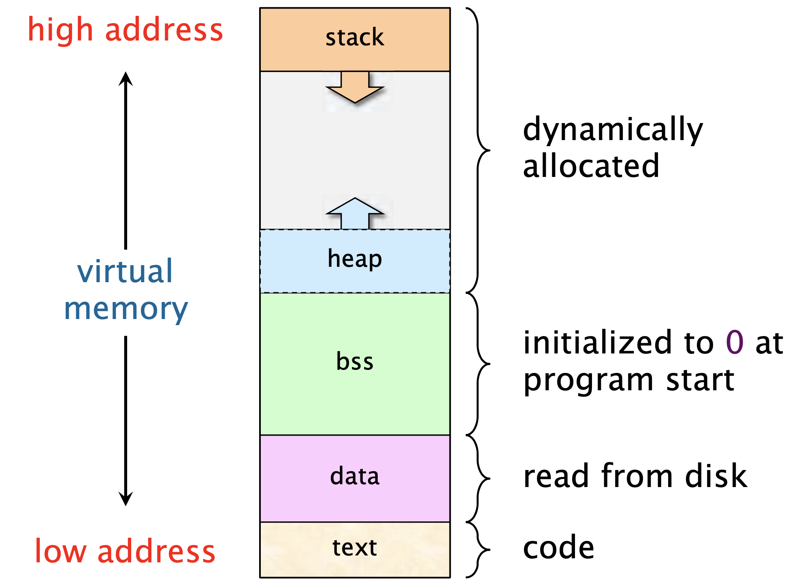

# Módulo 09: Memoria Dinámica (Dominando el Heap)

La memoria dinámica es el corazón de C y una de las utilidades más importantes de los punteros. Hasta ahora, el compilador y el sistema operativo te han llevado de la mano. Han decidido cuánta memoria necesitas y cuándo destruirla. Eso se acabó. A partir de hoy, tú eres el jefe de la memoria, con todos los privilegios y todas las desastrosas responsabilidades que ello conlleva.

## 1. Arquitectura de Memoria: Stack vs. Heap

<p align="center">
  
</p>

Antes de escribir código, debes entender en detalle dónde están viviendo tus datos.

### El Stack (La Pila)
* **Naturaleza:** Memoria estática y automática. Es rápida, ordenada y segura, pero **muy limitada** (suele rondar unos pocos megabytes por programa).
* **Residentes:** Aquí viven las variables locales y los arreglos normales que has usado hasta ahora (`int x = 5;`, `char nombre[20];`).
* **Ciclo de vida:** Se limpia sola. Apenas el programa sale de la función donde se crearon, el Stack hace un barrido y las aniquila de forma automática.

Dato curioso: Un también stack es una estructura de datos que funciona con el principio LIFO (Last In, First Out), es decir, el último elemento que entra es el primero que sale. No confundir el Stack de la memoria con la estructura de datos Stack. Son diferentes en naturaleza pero idénticas en lógica.

Si quieres profundizar en esos temas, dentro de poco estaré trabajando en un repositorio acerca de estructuras de datos y algoritmos.

Mantente atento a futuras actualizaciones.


### El Heap (El Montículo)
* **Naturaleza:** El "salvaje oeste", de la memoria. Es un espacio gigantesco (tierra de nadie), administrado por el Sistema Operativo, limitado prácticamente solo por la memoria RAM física de tu computadora.
* **Regla de oro:** Aquí la memoria es cien por ciento manual: **solo existe si tú la pides, y solo se borra si tú la liberas**.

**¿Por qué necesitamos usar el Heap?**
1. Para pedir volúmenes inmensos de memoria (megabytes o gigabytes, como grandes bases de datos en RAM) que destruirían el Stack y causarían un `Stack Overflow`.
2. Para que las variables **sobrevivan** incluso después de que termine la función que las creó, permitiéndote compartir esa información con el resto del programa.

## 2. Asignación y Liberación Básica (`malloc` y `free`)

<p align="center">
  
</p>

Este es el ciclo de vida fundamental de la memoria manual. Todo empieza y termina aquí (recuerda importar `<stdlib.h>`).

### `malloc` (Memory Allocation)
Pide prestada memoria al Sistema Operativo.

```c
int *ptr = malloc(sizeof(int));
```
**El uso de `sizeof`:** `malloc` es bruto; solo entiende de "bytes crudos". No le puedes decir "dame espacio para un entero", debes decirle "dame `x` cantidad de bytes". Por ello **siempre** debe ir acompañado de `sizeof()`, para pedir la cantidad exacta según la arquitectura de la PC en la que se compile.

**Validación de NULL (La regla inquebrantable):**
El Sistema Operativo puede decirte "No, estoy lleno" y negarte la memoria. Si eso pasa, `malloc` devolverá `NULL`. Siempre debes verificar si te dieron la memoria antes de usarla, de lo contrario tu programa explotará al instante (Segfault).
```c
if (ptr == NULL) {
    // Maneja el error como adulto
    printf("Error: No hay memoria suficiente.\n");
    return 1; 
}
```

### `free` (La devolución)
Cuando dejas de usar la memoria, debes devolverla. Obligatoriamente. Sobre todo si estás trabajando con bloques que piden memoria constantemente, de todas formas cuando tu programa termina, el sistema operativo se encarga de liberar la memoria.

Si tu programa está en un while pidiendo memoria una y otra vez sin liberarla, estarás causando una "fuga de memoria".
```c
free(ptr);
```
**Importante:** `free` no borra ni resetea el puntero `ptr` en sí. Su única función es avisarle al OS: "Ya no uso esta casa, puedes dársela a otro programa". El puntero seguirá guardando la dirección vieja, por lo que usarlo después de un `free` es suicidio.

Recuerda resetear el puntero a `NULL` después de usar `free` para evitar usarlo de nuevo.
```c
free(ptr);
ptr = NULL;
```

De esta forma puedes usar el puntero `ptr` en otro lado del programa sin problemas.

## 3. Alternativas de Asignación (`calloc` y `realloc`)

<p align="center">
  
</p>

Las herramientas finas para gestionar bloques de datos y crecer sobre la marcha.

### `calloc` (Contiguous Allocation)
Diferencia principal con `malloc`: `calloc` "limpia" la casa antes de entregártela, inicializando todos los bits en cero absoluto. Con `malloc`, te entregan la memoria con la basura que haya dejado el programa anterior, `calloc` te evita ese problema, pero a cambio, es un poco más lento que `malloc`.

**Sintaxis (2 parámetros):** `calloc(cantidad_elementos, tamaño_elemento)`
```c
int *ptr = calloc(5, sizeof(int)); // Pide 5 enteros y los deja listos en 0
```

### `realloc` (Re-allocation)
Usar `realloc` es una técnica que permite cambiar el tamaño de un bloque de memoria sobre la marcha.
Esto es muy útil, por ejemplo, cuando estás implementando un arreglo dinámico y te quedas sin espacio.
Lo mejor de `realloc` es que preserva intactos tus datos viejos.

**La Trampa de `realloc`:**
**Nunca hagas esto (O sí, en realidad no me importa):**
```c
ptr = realloc(ptr, nuevo_tamano); // PÉSIMA IDEA
```
Si `realloc` falla (devuelve `NULL` por falta de espacio), acabas de sobrescribir tu puntero original con `NULL`. Acabas de perder la dirección de tus datos viejos y causaste una fuga de memoria catastrófica. 

**La forma correcta siempre usa un puntero temporal:**
```c
int *temp = realloc(ptr, nuevo_tamano);
if (temp != NULL) {
    ptr = temp; // Todo salió bien, actualizamos el puntero original
} else {
    // Manejar el error, tus datos en 'ptr' siguen a salvo
    }
```

Vamos con unos ejemplos prácticos y buenas prácticas para usar de forma correcta la memoria dinámica.

## 4. Arreglos Dinámicos (1D)

<p align="center">
  
</p>

La aplicación más común. Te permite crear arreglos cuyo tamaño es decidido por el usuario en tiempo de ejecución.

```c
int n;
printf("¿Cuántos elementos quieres? ");
scanf("%d", &n);

int *arreglo = malloc(n * sizeof(int)); // pedimos n espacios de memoria para enteros
```

¿Es lo mismo escanear un n y asignarlo directamente al array?

Sí y no, depende.

Si lo haces de esa forma, no podrás redimensionar el array si es necesario. Además dicho array solo vivirá en el ambiente donde fue declarado, por eso para arreglos dinámicos y que usaremos en varios lugares, usar memoria dinámica es la mejor opción.

**El milagro de la aritmética:** Gracias a la aritmética de punteros que vimos, puedes usar este bloque de memoria cruda exactamente con la misma sintaxis de corchetes que un arreglo normal:
```c
arreglo[0] = 42;
arreglo[1] = 99;
// ...y cuando termines:
free(arreglo);
```

## 5. Matrices Dinámicas (Punteros a Punteros `**`)

<p align="center">
  
</p>

El jefe final del módulo. Construir estructuras multidimensionales en el Heap no es tan directo como un `matriz[3][3]`.

**El concepto del arreglo de punteros:**
Una matriz en el Heap no es un bloque cuadrado perfecto de memoria. Es, en realidad, un arreglo dinámico principal (que representa las filas), donde cada casilla guarda **otro puntero** hacia un nuevo arreglo dinámico individual (las columnas).

**Construcción (De afuera hacia adentro):**
```c
// 1. Pedir el arreglo principal (las filas, que guardan punteros int *)
int **matriz = malloc(filas * sizeof(int *));

// 2. Hacer un bucle for para asignar las columnas a cada fila
for (int i = 0; i < filas; i++) {
    matriz[i] = malloc(columnas * sizeof(int));
}
```

**Destrucción (De adentro hacia afuera):**
La lección más importante aquí: **no puedes hacer un simple `free(matriz)`**. Si liberas el arreglo principal primero, pierdes el acceso a todas las filas individuales y se fugarán para siempre. Debes destruir en orden inverso.
```c
for (int i = 0; i < filas; i++) {
    free(matriz[i]); // Liberar cada fila individualmente
}
free(matriz); // Liberar la columna vertebral principal
```

## 6. Memoria Dinámica con Structs (El puente a Estructuras de Datos)

<p align="center">
  
</p>

Este es el puente que te prepara para Estructuras de Datos más avanzadas como Listas Enlazadas o Árboles, cosas que por ahora son ajenas y en realidad no lo veremos acá y en realidad para eso se usa C++ y en realidad no sé por qué lo mencioné, bueno, en fin, que sepas que igual se pueden hacer.

**Un solo Struct Dinámico:**
```c
struct Alumno *a = malloc(sizeof(struct Alumno));
```
Al igual que con los arreglos, la ventaja de esto es que ahora tu struct vivirá fuera del rango donde fue declarado.

**El Operador Flecha (`->`) en acción:**
Confirmarás por qué este operador es obligatorio. Al trabajar exclusivamente con punteros a un struct en el Heap, ya no puedes usar el simple punto (`.`). El operador `->` es tu pase de acceso.
```c
a->edad = 20; // Correcto (equivalente interno a (*a).edad = 20)
```

**El "Deep Free" (Liberación Profunda):**
Si un struct dinámico contiene, a su vez, punteros a otras variables dinámicas (ej. un `char *nombre` guardado en el Heap), **hay que liberar el texto interno antes de liberar el struct exterior**.
```c
free(a->nombre); // 1. Liberar los órganos internos primero
free(a);         // 2. Liberar el cuerpo exterior
```
Ten estas consideraciones al liberar memoria para evitar **memory leaks** y **dangling pointers**.


## 7. Vulnerabilidades Clásicas y Herramientas (Debugging)

<p align="center">
  
</p>

Ahora que tienes el poder, aquí está la lista de crímenes que puedes cometer contra tu propia máquina.

### Memory Leaks (Fugas de Memoria)
¿Qué ocurre si un puntero se sobrescribe, o si la función termina sin que hayas hecho `free`?
Ese bloque de memoria queda secuestrado por tu programa. Se convierte en un "zombie". Nadie tiene su dirección, nadie puede usarlo, pero consume RAM infinitamente hasta que reinicies la PC o mates el proceso.

### Dangling Pointers (Punteros Colgantes)
El error catastrófico de hacer `free(ptr)` y luego intentar leer o escribir en `ptr`. La memoria ya fue entregada a otro inquilino, meterte ahí es corrupción pura.

**Mitigación (El Hábito Industrial):**
Acostúmbrate a esterilizar el puntero inmediatamente después de liberarlo:
```c
free(ptr);
ptr = NULL; // Ahora el puntero puede ser usado sin problemas
```

### Valgrind (La herramienta definitiva)
Los errores de memoria son invisibles. El programa compila, se ejecuta y parece funcionar... hasta que colapsa aleatoriamente en producción.
Para esto se inventó **Valgrind**, la herramienta reina en Linux. Corres tu programa envuelto en Valgrind, y él auditará cada byte de memoria manual que tocaste. Al finalizar, te dará un reporte indicando si se fugó un solo byte o si leíste fuera de tus límites.

En esto profundizaremos en la sección de Debug, también veremos GDB en dicho módulo, estas herramientas son cruciales si quieres ser un programador decente, yo que soy un asco programando, nunca las usé en contextos prácticos, pero existen y son muy útiles.

El siguiente tema a tocar será Archivos, cómo abrirlos, leerlos, escribirlos y crearlos, por ahora revisa el archivo de sintaxis para que te familiarices con las aplicaciones de la memoria dinámica.

