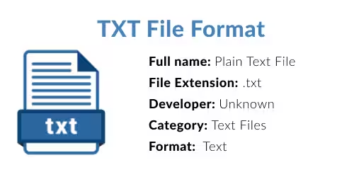

# Módulo 10: Manejo de Archivos (Persistencia)

Hasta ahora, tus programas han tenido amnesia severa. No importa cuán complejas sean las estructuras de datos que construyas en la RAM o cuánto te esmeres gestionando el Heap; en el momento en que el programa se cierra, el Sistema Operativo barre la memoria y todo se pierde como lágrimas en la lluvia. 

Para que los datos sobrevivan a la muerte del programa (persistencia), debemos guardarlos en el disco duro. Bienvenidos al manejo de archivos.

**[WARNING]** En la práctica no es muy buena idea guardar datos sensibles en texto plano, te enseñaré a manejar archivos .txt, .csv y binarios, pero si quieres guardar datos sensibles en la práctica te recomiendo usar JSON, XML o bases de datos.

Dichas tecnologías por lo general son más cómodas para trabajar con datos estructurados, sin embargo los datos que no necesitan tanta protección o bien que son creados con el fin de ser compartidos pueden almacenarse en archivos .txt, .csv o binarios sin problemas.

Cumplo con decirte esto, para que no seas tan idiota de guardar tus contraseñas en texto plano, ¿cierto Edge?

## 1. Fundamentos y el Puntero a Archivo

<p align="center">
  
</p>

Antes de leer o escribir, debes entender que tu programa de C no puede tocar el disco duro directamente. Tiene que pedirle permiso al Sistema Operativo, y el OS establecerá un "puente" de comunicación, se usarán las conocidas como syscalls (llamadas al sistema), que son las encargadas de comunicarse con el kernel del sistema operativo para llevar a cabo ciertas operaciones que requieren privilegios especiales o bien que implican el uso de hardware, como el disco duro. De cualquier modo, en esta práctica no veremos el uso de las syscalls, sino que veremos el uso de las funciones de la biblioteca estándar de C que nos permiten manejar archivos.

Para información adicional acerca de syscalls y del curso de sistemas operativos en general, tengo un repositorio en proceso que te puede ayudar más tarde.

### El Puntero `FILE *`
A diferencia de los punteros que hemos visto (`int *`, `char *`), un `FILE *` **no apunta a un dato en la RAM**. Es una estructura oscura gestionada por el Sistema Operativo que representa un "canal de comunicación" (un *stream* o flujo) entre tu programa y un archivo físico en el disco.

### Apertura (`fopen`)
Es la función que solicita abrir ese canal. 
```c
FILE *archivo = fopen("datos.txt", "r");
```
`fopen` recibe como primer parámetro el nombre del archivo, y como segundo parámetro el modo de apertura, en caso de no existir el archivo, dependerá del modo en que se abra, si se usa "r" devolverá NULL, si se usa "w" o "a" se creará el archivo.

### Modos de Apertura Básicos
El segundo parámetro le dice al OS cuáles son tus intenciones:
*   **`"r"` (Read - Lectura):** Solo para leer. Si el archivo no existe, `fopen` falla.
*   **`"w"` (Write - Escritura):** Para crear un archivo nuevo y escribir en él. **[ADVERTENCIA CRÍTICA]:** Si el archivo ya existe, el modo `"w"` lo aniquilará por completo (lo trunca a cero bytes) sin hacerte ninguna pregunta.
*   **`"a"` (Append - Añadir):** Abre el archivo para escribir datos al final del mismo, sin borrar lo que ya existía.

### Cierre Obligatorio (`fclose`)
Cuando abres un archivo, el Sistema Operativo reserva recursos y un *buffer* en memoria RAM para acelerar las escrituras. Si no haces `fclose(archivo);` al terminar, los últimos datos podrían quedarse atrapados en el buffer de la RAM y nunca guardarse en el disco duro. Además, el archivo quedará "bloqueado" por tu programa, impidiendo que otros lo usen. Así que recuerda, **Si lo abres, lo cierras**.

## 2. Gestión de Errores y Fin de Archivo

<p align="center">
  
</p>

El disco duro es un entorno un tanto hostil (no hay permisos, no hay espacio, la ruta no existe). Nunca asumas que todo salió bien.

### Validación del Puntero
Si `fopen` falla por cualquier motivo, te devolverá `NULL`. **Siempre** debes validar esto antes de intentar tocar el archivo, o el programa morirá antes de empezar.
```c
FILE *archivo = fopen("secreto.txt", "r");
if (archivo == NULL) {
    printf("Error: No se pudo abrir el archivo.\n");
    return 1;
}
```

### La constante `EOF` (End of File)
Funciones de lectura como `fgetc` o `fscanf` devuelven un valor numérico especial cuando intentan leer y se dan cuenta de que ya no hay más datos. Ese valor está definido en C como la constante `EOF` (casi siempre equivale a `-1`).

Básicamente se usa para controlar los ciclos de lectura de archivos.

### La Trampa de `feof()`
Este es el error más común entre novatos en C. La función `feof(archivo)` sirve para saber si llegaste al final, **PERO** solo devuelve verdadero *después de que ya intentaste leer más allá del final*. 
Si haces un bucle `while (!feof(archivo)) { leer_datos(); }`, la última lectura fallará, pero procesarás basura antes de que el bucle se detenga, imprimiendo el último dato dos veces.
La forma correcta es leer e inmediatamente comprobar si esa lectura en concreto fue exitosa.

Como se ve en este ejemplo:

```c
while (1) {
    int c = fgetc(archivo);
    if (c == EOF) {
        break;
    }
    putchar(c);
}
```

## 3. Archivos de Texto (Legibles para humanos)

<p align="center">
  
</p>

Esta es la conexión directa con el módulo de consola (`printf` / `scanf`). Lo que sabías hacer en la pantalla, ahora lo vas a hacer en un `.txt` en el disco.

### Escritura
*   **`fprintf(archivo, ...)`:** Es literalmente el padre de `printf`, con la única diferencia de que el primer parámetro es el puntero `FILE *` hacia donde quieres enviar el texto o si nos ponemos técnicos, vendría a ser el *stream* de salida.
    ```c
    fprintf(archivo, "El jugador %s tiene %d puntos.\n", nombre, puntos);
    ```
*   **`fputs("hola", archivo)`:** Escribe una cadena de texto pura, más rápido que `fprintf` si no necesitas formatear variables.

### Lectura
*   **`fgets(buffer, tamaño, archivo)`:** Es la forma más segura y profesional de leer un archivo de texto, línea por línea. Se detiene al encontrar un salto de línea `\n` o cuando llena el tamaño máximo, evitando el temido *Buffer Overflow*.
*   **`fscanf(archivo, "%s", cadena)`:** Lee texto con formatos, pero tiene exactamente los mismos peligros que el `scanf` normal (se detiene cobardemente en el primer espacio en blanco que encuentra). Cuidado con los nombres compuestos.

## 4. Archivos Binarios (El clon de la RAM)

<p align="center">
  
</p>

Los archivos de texto son lentos y ocupan mucho espacio por culpa de la codificación de caracteres. Aquí entra la verdadera potencia de C: los archivos binarios. No son texto legible, son **copias exactas** de los ceros y unos tal como existen en la memoria RAM.

### Los Modos Binarios (`"rb"`, `"wb"`, `"ab"`)
Le agregamos la letra `b` al modo de apertura. En sistemas tipo Unix (Linux/Mac) esto no hace ninguna diferencia técnica. Pero en Windows, si olvidas la `b`, el Sistema Operativo se pondrá creativo y convertirá invisiblemente todos los saltos de línea (`\n` a `\r\n`), corrompiendo tus estructuras de datos sin que te des cuenta. Acostúmbrate a usar la `b`.

### Lectura y Escritura Masiva (`fread` y `fwrite`)
Estas funciones no saben nada sobre texto. Reciben un puntero genérico `void *` (el inicio de la memoria que quieres copiar), el tamaño del elemento a guardar, cuántos elementos quieres guardar, y el archivo destino.

**El Superpoder Binario:**
Imagina que tienes un inventario con 10,000 `struct Producto`. En lugar de hacer 10,000 `fprintf` escribiendo textos largos, puedes volcar toda esa memoria cruda de la RAM al disco duro en *una sola y hermosa línea de código*:
```c
fwrite(inventario, sizeof(struct Producto), 10000, archivo);
```
Y para cargar esa partida guardada o base de datos de vuelta a tu programa al día siguiente, usas un solo `fread`. Es brutalmente rápido y eficiente.

## 5. Navegación y Acceso Aleatorio

<p align="center">
  
</p>

A veces tienes un archivo de 5 Gigabytes y solo quieres leer el dato que está en el medio. Leerlo todo desde el principio (Acceso Secuencial) sería estúpido.

### El Cursor (Indicador de Posición)
Todo archivo abierto tiene un "cursor" invisible interno. Cuando haces un `fread` de 10 bytes, el cursor avanza 10 bytes automáticamente para que la siguiente lectura continúe desde ahí.

### `fseek` (La Teletransportación)
Permite mover ese cursor a un byte físico específico dentro del archivo, sin tener que leer lo que hay antes.
Funciona usando tres puntos de anclaje de referencia:
*   `SEEK_SET`: Se mueve contando los bytes desde el **inicio** del archivo.
*   `SEEK_CUR`: Se mueve contando desde la posición **actual** del cursor.
*   `SEEK_END`: Se mueve contando desde el **final** del archivo hacia atrás.

### `ftell` (El GPS del cursor)
Devuelve un número entero: el número de byte exacto en el que se encuentra el cursor en este instante.

**El Truco Clásico para saber el peso de un archivo:**
1. Abres el archivo.
2. Lo teletransportas al final: `fseek(archivo, 0, SEEK_END);`
3. Le preguntas al GPS dónde estás: `long peso = ftell(archivo);`
Y listo, en peso tendrás el tamaño total del archivo en bytes.

### `rewind`
Un atajo de cortesía que devuelve instantáneamente el cursor al byte cero (el inicio absoluto del archivo), exactamente igual que hacer `fseek(archivo, 0, SEEK_SET)`.

## 6. Llegaste a la hoguera

<p align="center">
  
</p>

Felicidades, en este punto sabes bastante de C, muchas personas lo habrán dejado en la introducción, y es normal, es un lenguaje difícil, no te lleva de la mano como otros, pero la recompensa vale la pena.

A este punto ya puedes realizar muchas cosas y programas distintos, pero todavía falta mucho por aprender, en los siguientes módulos veremos principalmente buenas prácticas, modularidad, cómo crear tus propios headers, el uso de makefiles para compilar, además de pasar por operaciones a nivel de bits, que vendría a ser el tope de la optimización, aún queda un largo camino por delante, toma un descanso y nos vemos más tarde.

