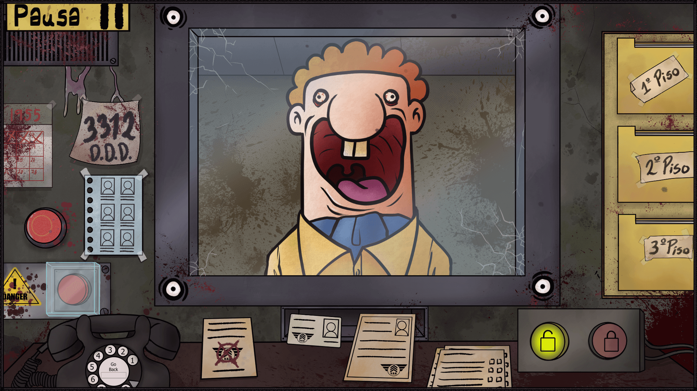

# Módulo 11: Modularidad y Headers (O cómo evitar códigos de 10,000 líneas)

Hasta ahora has estado acostumbrado a meter todo en el `main.c`; sin embargo, para tu sorpresa, no es una buena práctica cuando tu programa empieza a crecer en tamaño. Poner todo tu código dentro de un solo archivo .c no es una buena idea; si lo haces, felicidades: has creado lo que en la industria conocemos cariñosamente como "Código Espagueti" o un "Monolito de la Muerte". 

Hoy vamos a aprender a *modularizar* tu código. Según las sagradas escrituras de Kernighan y Ritchie (*The C Programming Language*), un programa bien diseñado debe separarse en piezas pequeñas, manejables y lógicas. Esto permite mayor control, mejor organización y facilita la depuración y el mantenimiento del código, además de volverlo escalable para futuras actualizaciones y le harás un favor a cualquiera que tenga que leer tu código en el futuro (incluso a tu futuro yo).

---

## 1. El Concepto de Modularidad y el Compilador

<p align="center">
  
</p>

Antes de empezar a hachar código, necesitas entender *por qué* lo dividimos y, más importante aún, *cómo* C une las piezas.

### Divide y Vencerás
Imagina que estás haciendo un juego. No quieres que la lógica gráfica (dibujar píxeles) se mezcle con la de la base de datos (guardar puntajes) ni con la matemática (calcular colisiones). La modularidad trata de separar tu código por **dominios**. Cada dominio vive de forma ermitaña, en su propia caja, y solo se comunican cuando es estrictamente necesario.

### Las 3 Fases de la Construcción
Para entender cómo archivos separados terminan siendo un solo ejecutable, debes entender qué pasa cuando llamas a `gcc` (o Clang):

1. **El Preprocesador (El becario del Copy-Paste):** Se ejecuta antes que nada. Busca todas las líneas que empiezan con `#` (como `#include`) y, literalmente, copia y pega el texto de esos archivos en tu código fuente. No sabe de C, solo sabe de texto.
2. **El Compilador (El Traductor):** Toma ese texto gigante y lo traduce a código máquina, creando "Archivos Objeto" (`.o` en Linux/Mac, `.obj` en Windows). Aquí es donde el compilador revisa la sintaxis y se queja si falta un punto y coma.
3. **El Linker o Enlazador (El Ensamblador):** Toma todos los archivos `.o` y los une en un solo ejecutable final (`.exe` o `.out`). Es el tipo que dice "Ah, en `main.o` llaman a la función `disparar()`, que fue definida en `armas.o`. Voy a conectar los cables para que apunten a la dirección de memoria correcta".

### El Alcance Global (Scope)
Por defecto, si creas una función `calcular_daño()` en `armas.c`, el archivo `main.c` no tiene ni la más mínima idea de que esa función existe. El compilador de C es muy paranoico (con justa razón) y aísla cada archivo `.c`. Para que `main.c` pueda usar la función de su vecino, hay que firmar un contrato. Y ese contrato se llama *Header*.

---

## 2. Archivos de Cabecera (.h): El Contrato

<p align="center">
  
</p>

El archivo `.h` (Header) es la **interfaz pública** de tu módulo. Es como el menú de un restaurante: le dice a los otros archivos *qué* platos pueden pedir, pero no revela *cómo* el chef los prepara (la implementación queda oculta).

Aunque, en realidad, puedes poner la implementación dentro del header, sin embargo, no es una buena práctica. Ya hablaremos de eso después.


### ¿Qué SÍ debe ir en un `.h`?
Todo lo que necesite ser conocido o usado por otros archivos:
* **Prototipos (firmas) de funciones:** `int sumar(int a, int b);` (Nota el punto y coma al final. Nada de llaves).
* **Definiciones de macros:** `#define MAX_ENEMIGOS 100`
* **Declaraciones de structs, unions y enums:** Junto con sus respectivos `typedef`.

> [!WARNING]
> Me acabo de dar cuenta que no tomé en consideración la existencia de enums en C, revisaré en qué parte lo puedo incluir más adelante, debí haberlo visto en el módulo de structs pero se me fue.


### ¿Qué NO debe ir en un `.h`?
**NO PONGAS IMPLEMENTACIÓN LÓGICA, A MENOS QUE SEA NECESARIO** 
No escribas el código (lo que va dentro de las llaves `{}`) ni inicialices variables globales (`int vida = 100;`). Si lo haces, el preprocesador pegará ese código idéntico en cada archivo `.c` que incluya tu `.h`. Cuando llegue el turno del Linker, verá cinco funciones idénticas en cinco archivos distintos y te castigará severamente por intentar redefinir la misma cosa varias veces (error de *multiple definition*).

Hay ciertas excepciones donde inevitablemente deberás poner la implementación dentro del header, como lo pueden ser cuando definimos structs, enums, constantes globales o a veces macros, sin embargo, la idea es que tu header sea lo más limpio y ordenado posible y no un amasijo de código.

### Inclusión Local vs Inclusión de Sistema
* `#include <stdio.h>`: Los corchetes angulares le dicen al preprocesador que busque en las carpetas de instalación del sistema operativo (donde viven las librerías estándar).
* `#include "mi_modulo.h"`: Las comillas dobles le dicen que busque primero en la **carpeta actual** de tu proyecto. (Sí, literalmente significa "busca aquí al lado").

Cuando creas tus .h deberás incluirlos en tu programa usando las comillas dobles en vez de los corchetes angulares, y de igual forma hacerlo de la forma del ejemplo de arriba; solo funcionará en caso de que el header se encuentre en la misma carpeta que tu archivo .c, en caso contrario deberás especificar la ruta relativa o absoluta del archivo.

---

## 3. Archivos de Implementación (.c): El Ejecutor

<p align="center">
  
</p>

El archivo `.c` es donde ocurre la magia. Es el código privado de tu módulo.

### El Vínculo
La primera línea de tu archivo `mi_modulo.c` **debe ser** `#include "mi_modulo.h"`. Hacer esto obliga al compilador a verificar que la implementación que estás escribiendo coincida perfectamente con el prototipo que prometiste en el header. Si prometiste retornar un `int` pero tu código retorna un `float`, el compilador te gritará y evitarás desastres en tiempo de ejecución.

> [!WARNING]
> Recuerda, se incluye el .h (header), no el .c (implementación).


### Funciones Privadas (`static`)
En C el encapsulamiento a nivel de clases no existe (Concepto de la Programación Orientada a Objetos), pero tenemos un truco sucio y efectivo: la palabra clave `static`. 
Si declaras una función como `static` en un archivo `.c` (ej. `static void calcular_friccion();`), esa función se vuelve **completamente invisible** para el resto del proyecto, incluso si intentan forzarla. Es una función puramente interna y privada del módulo.

Esto hará que solo ese archivo .c pueda acceder a esa función, útil en muchos casos donde se requieren cálculos específicos sin fines de ser usados por otros archivos. 

### Variables Compartidas (`extern`)
¿Qué pasa si necesitas que varios módulos compartan una variable global? (Spoiler: las variables globales tienden al mal diseño, pero a veces son necesarias).
1. **La Prometes** en el `.h` usando la palabra reservada `extern`: `extern int puntuacion_global;`
2. **La Creas (Defines)** en *un solo* `.c`: `int puntuacion_global = 0;`

Así, todos los archivos que incluyan el `.h` sabrán que la variable existe en algún lado, pero el sistema operativo solo asignará la memoria una vez.

---

## 4. Guardas de Inclusión (Include Guards)

<p align="center">
  
</p>

Aquí es donde nos protegemos de la estupidez colectiva y del caos del preprocesador.

### El Problema de la Inclusión Múltiple
Imagina que `main.c` incluye a `personaje.h` y a `armas.h`. Pero resulta que `armas.h` *también* incluye a `personaje.h` (porque las armas afectan a los personajes). 
¿Qué hace el preprocesador? Como es literal y obediente, copia y pega `personaje.h` **dos veces** dentro de `main.c`. El compilador verá dos declaraciones idénticas del `struct Personaje` y abortará la misión con un error de redefinición de tipo.


### La Solución Clásica
Usamos directivas del preprocesador en cada `.h` que creamos. Este es el escudo protector clásico que verás en casi todo código en C:

```c
#ifndef MI_MODULO_H   // Si este macro NO ha sido definido todavía...
#define MI_MODULO_H   // Entonces defínelo, y lee el resto del archivo

// Todo el contenido del header va aquí
typedef struct {
    int vida;
} Personaje;

#endif // Fin de la guarda
```
Si el preprocesador intenta incluir el archivo por segunda vez, el macro `MI_MODULO_H` ya estará definido, por lo que todo el bloque hasta el `#endif` será ignorado olímpicamente.

De esta forma evitarás errores de redefinición de tipos, como me pasó una vez con un colega que creó un header que tenía funciones distintas a las mías, pero copió y pegó la definición del header, por ende, no incluía todas las funciones y causaba errores de ejecución.

Por convención, la definición de los macros debe ser en mayúsculas y debe usar el mismo nombre del archivo que se está protegiendo.


### La Solución Moderna: `#pragma once`
Escribir el `#ifndef`, `#define` y `#endif` en cada archivo aburre. Por eso existe `#pragma once`. 
Lo pones como la primera línea de tu archivo `.h` y el compilador se encargará por detrás de incluir ese archivo solo una vez. Es rápido, no requiere inventar nombres de macros, y está soportado por virtualmente todos los compiladores modernos (GCC, Clang, MSVC).

```c
#pragma once

// Todo tu header aquí
```
*Nota purista: Los libros más viejos se aferran al `#ifndef` porque `#pragma once` no es estrictamente parte del estándar de C, pero en el mundo real de hoy, úsalo sin miedo.*

---

## 5. Compilación de Múltiples Archivos (El Linker)

<p align="center">
  
</p>

Ya tienes tus pedazos de código bien estructurados. ¿Cómo los ensamblamos?

### Compilación por Consola
Si intentas compilar solo el main (`gcc main.c`), el compilador no sabrá dónde están las definiciones reales de tus otros módulos (el código de verdad) y fallará horriblemente en el paso del Linker. Tienes que pasarle **todos** los archivos `.c`:

```bash
gcc main.c mi_modulo.c otro_modulo.c -o programa_final
```
*Observa que **NO** le pasamos los archivos `.h` a GCC. El compilador ya los va a encontrar porque tú mismo le dijiste dónde estaban con los `#include` de los archivos `.c`.*

### El Error de Incluir Archivos `.c`
Como te comentaba antes, hay algo que no debes hacer; hace tiempo un novato desesperado (yo en mi primer año) a veces intentaba arreglar un error de compilación haciendo `#include "mi_modulo.c"` directamente dentro del `main.c`. 
**Bueno, esto no se hace.** 
Incluir un `.c` destruye todo el propósito de la compilación separada y te lanza al pozo de los errores de *múltiple definición*. Los `#include` son para los headers, punto y se acabó.

### Introducción Rápida a Makefiles
Escribir `gcc archivo1.c archivo2.c archivo3.c ...` funciona para 3 archivos. Cuando tengas 15, querrás prenderle fuego a tu teclado. 
Para eso existen los **Makefiles**. Un Makefile es una receta que automatiza tu proceso de compilación, invocando a GCC por ti y, lo más importante, compilando *solamente* los archivos `.c` que han sido modificados desde la última vez (para ahorrar tiempo). Lo exploraremos a fondo en el siguiente módulo, luego de verlos te preguntarás cómo pudiste vivir sin ellos tanto tiempo.

---

## 6. Librerías "Header-Only" (Tendencia Moderna)

<p align="center">
  
</p>

En el mundo moderno del desarrollo (especialmente en videojuegos y gráficos con C/C++), vas a notar librerías de terceros que se distribuyen en un único archivo que hace todo el trabajo, como `stb_image.h` (de Sean Barrett). 

### El Concepto
En lugar de distribuir un `.h` para declarar y un `.c` para implementar, el autor mete **TODO** (declaración e implementación) en el mismo `.h`. ¿Eso no rompe la regla de oro que acabamos de aprender? Bueno, sí, pero como todo en C, no es que carezca de sentido, usan una técnica del preprocesador para que funcione.

### El Truco del Macro
La implementación lógica dentro del `.h` está encerrada dentro de un `#ifdef` con un macro gigante. Si simplemente incluyes el header (`#include "stb_image.h"`), solo obtienes las firmas de las funciones. 

Para que la librería exista físicamente, debes ir a **UN SOLO** archivo `.c` de tu proyecto y "encender" el código fuente antes de incluir el header:

```c
// Solo en UN archivo .c (como main.c, o un stb_impl.c dedicado)
#define STB_IMAGE_IMPLEMENTATION 
#include "stb_image.h"

// En los demás archivos .c, simplemente haces:
// #include "stb_image.h"
```
Esto resuelve la pesadilla de configurar tu compilador para enlazar archivos `.c` de terceros. Literalmente copias un archivo `.h` a tu proyecto y tienes una librería funcionando.

Por lo general se usan funciones del tipo inline, las cuales se definen dentro del archivo .h para optimizar el rendimiento, pero como siempre, depende del desarrollador. Y es bueno que sepas que existe, sin embargo, no ahondarás mucho en este tema durante este curso.

---

## 7. Errores Clásicos (Troubleshooting)

<p align="center">
  
</p>

Aquí están los 3 errores más comunes que verás cuando comiences a modularizar tu código, y qué significan:

### 1. `undefined reference to 'mi_funcion'` (Referencia Indefinida)
* **Qué significa:** El compilador te creyó cuando prometiste en el `.h` que esa función existía. Pero cuando el Linker fue a buscar el código de verdad (el motor) para conectarlo, no lo encontró por ningún lado.
* **La Solución:** Olvidaste pasarle el archivo `mi_modulo.c` al comando de `gcc` en tu terminal, o literalmente te olvidaste de escribir la función en el `.c`.

### 2. `multiple definition of 'mi_funcion'` (Múltiples Definiciones)
* **Qué significa:** El Linker encontró dos o más funciones con exactamente el mismo nombre o dos variables globales idénticas.
* **Por qué pasa:** Rompiste la Regla de Oro y metiste código de llaves `{}` o inicializaste una variable (ej. `int vidas = 3;`) en tu archivo `.h`, el cual fue incluido en más de un archivo `.c`. El preprocesador pegó ese código repetidamente y ahora hay clones de tu lógica que no deberían existir.
* **La Solución:** Mueve la implementación (el código) al `.c`. Deja solo la declaración (el prototipo) en el `.h`.

### 3. Dependencia Circular
* **Qué significa:** `Personaje.h` hace `#include "Armas.h"`, pero resulta que `Armas.h` hace `#include "Personaje.h"`. Tienes un bucle infinito de dependencias. 
* **Por qué pasa:** Porque un struct en A necesita saber de B, y el struct en B necesita saber de A.
* **La Solución (Forward Declarations):** Rompe el ciclo con una "declaración anticipada". Si `Armas.h` solo usa un *puntero* a `Personaje`, no necesita el `.h` completo. Le puedes mentir piadosamente al compilador diciéndole: *"Oye, existe un struct que se llama Personaje. Créeme. Asigna memoria para un puntero y no preguntes estupideces"*.


```c
// En Armas.h (en lugar de #include "Personaje.h")
#pragma once

// Forward declaration
typedef struct Personaje Personaje; 

typedef struct {
    int municion;
    Personaje* dueño; // Como es un puntero, el compilador sabe cuánto pesa (8 bytes), no necesita ver el cuerpo.
} Arma;
```

---
Bien, ahora entiendes el porqué un programa medianamente decente tiene docenas de archivos .h y .c. Sin embargo, la siguiente pregunta es: ¿Cómo compilo todo eso? Aquí es donde entra en juego el **Make**, echa un vistazo a los ejemplos de headers y código que te dejé y nos vemos en el módulo de makefiles.

---

<div align="center">
  <a href="../10_Archivos/10_Archivos.md">⬅️ Retroceder</a> | 
  <a href="./Codigo/">💻 Ir a Códigos</a> | 
  <a href="../12_Makefiles/12_Makefiles.md">Avanzar ➡️</a>
</div>
