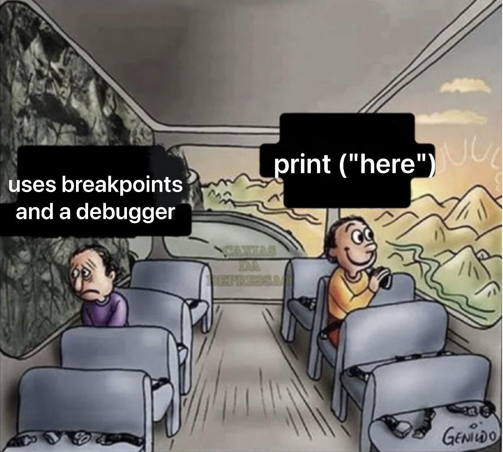
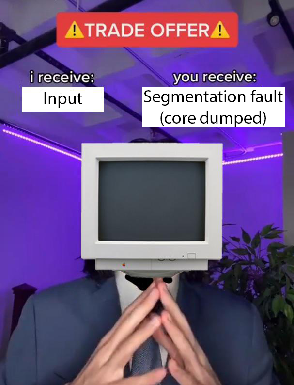

# Módulo 15: Debug (El noble arte de cazar tus propios errores)

Si has sobrevivido a los punteros, a la memoria dinámica y a la manipulación de bits, ya te habrás dado cuenta de una verdad universal ineludible en C: **tu código puede morir**. Y ten la certeza que pasará tarde o temprano.

En otros lenguajes, cuando cometes un error de memoria, el intérprete te detiene con cuidado, te da una palmadita en la espalda y te muestra un bonito y formateado mensaje de error indicando la línea exacta del crimen. C no hace eso. C ejecutará instrucciones corruptas, destruirá la memoria de otras variables en silencio y, si tienes suerte, el Sistema Operativo matará a tu programa disparándole un *Segmentation Fault (core dumped)* sin darte más contexto.

Este módulo te enseñará cómo dejar de adivinar y empezar a diagnosticar tu código como un profesional utilizando las herramientas estándar de UNIX que Kernighan, Ritchie y sus sucesores nos legaron.

---

## 1. La Mentalidad y el "Print Debugging"

<p align="center">
  
</p>

Lo primero que hace un programador novato cuando su programa falla es empezar a cambiar el código al azar a ver si mágicamente se arregla. **No hagas eso.**

### El Método Científico
Depurar es hacer ciencia. Tienes que aislar el problema, crear un caso de prueba mínimo que sea reproducible y formular hipótesis basadas en evidencia (estado de la memoria, valores de las variables). No toques una sola línea de lógica de negocio hasta que sepas exactamente *por qué* está fallando.

### El arte del `printf`
El "Print Debugging" es la técnica más antigua del mundo: llenar tu código de `printf("Llegué aquí 1\n");` para ver hasta dónde llega el programa antes de morir. Es útil para programas muy pequeños y rápidos, pero es insostenible en bases de código masivas. Sin embargo, tiene unas limitaciones importantes que debes conocer.

### La trampa del Buffer (Vital)
El flujo estándar (`stdout`) que usa `printf` tiene **buffer**. Esto significa que cuando haces un `printf`, el texto no va inmediatamente a la pantalla; se queda guardado en la memoria temporal (buffer) hasta que se llena o hasta que imprimes un salto de línea (`\n`). 
¿El problema? Si tu programa se estrella con un *Segmentation Fault*, el programa muere tan rápido que el Sistema Operativo **no vacía el buffer a la pantalla**. 
Es decir: tu `printf` sí se ejecutó, pero nunca llegaste a verlo, llevándote a creer falsamente que el programa no llegó a esa línea. 
**Solución:** 
1. Fuerza la impresión inyectando un `fflush(stdout);` justo después del `printf`.
2. O mejor aún, usa el flujo de errores que no tiene buffer por defecto: `fprintf(stderr, "Llegué aquí\n");`.

### Macros de Diagnóstico
C te regala tres macros mágicos proporcionados por el compilador para saber exactamente desde dónde estás imprimiendo:
* `__FILE__`: El nombre del archivo actual (string).
* `__LINE__`: El número de línea actual (entero).
* `__func__`: El nombre de la función actual (string).

```c
fprintf(stderr, "[DEBUG] Falla en %s, línea %d, función %s\n", __FILE__, __LINE__, __func__);
```

---

## 2. La Primera Línea de Defensa: El Compilador

<p align="center">
  
</p>

El compilador de C es perezoso y permisivo por defecto (por herencia histórica). Si no le exiges que sea estricto, te dejará compilar auténticas estupideces sin decir una palabra.

### Las Banderas Estrictas
Acostúmbrate a compilar *siempre* con el cuchillo entre los dientes:
`gcc -Wall -Wextra -pedantic main.c -o programa`
Estas banderas (`Warnings all`, `Warnings extra`, y adhesión pedante al estándar ISO de C) harán que el compilador te avise de errores lógicos antes de que siquiera intentes ejecutar tu programa. Un *warning* (advertencia) del compilador es un error esperando a suceder.

### La Bandera `-g` (El Requisito Absoluto)
Si quieres usar herramientas serias de depuración, tu binario final necesita estar asociado al código fuente que tú escribiste.
Debes agregar la bandera `-g` al compilar: `gcc -g main.c -o programa`.
Esto le dice a `gcc` que incruste los nombres de tus variables, nombres de funciones y los números de línea originales dentro del archivo ejecutable. Si compilas sin `-g`, los debuggers solo te mostrarán direcciones de memoria hexadecimales en crudo y lenguaje ensamblador incomprensible.

---

## 3. El Estándar Industrial: GDB (GNU Debugger)

<p align="center">
  
</p>

Si el *Print Debugging* es un cuchillo de mantequilla, GDB es un quirófano completo. Te permite pausar el tiempo de tu programa, ver qué hay en la memoria y avanzar línea por línea.

### Conceptos Básicos
Para usarlo, inicias el debugger cargando tu binario (previamente compilado con `-g`):
`gdb ./programa`
Una vez dentro, tienes los comandos de flujo (que puedes abreviar con su primera letra):
* `run` (`r`): Inicia la ejecución de tu programa.
* `next` (`n`): Ejecuta la siguiente línea de código, saltando *por encima* de las llamadas a funciones.
* `step` (`s`): Ejecuta la siguiente línea, pero si es una función, entra *dentro* de ella paso a paso.
* `continue` (`c`): Reanuda la ejecución hasta que el programa termine o se tope con otro breakpoint.

### Breakpoints (Puntos de Interrupción)
Le dices a GDB: "Ejecuta todo normal, pero paúsate en seco cuando llegues aquí".
* `break main`: Pausa el tiempo justo al entrar al `main`.
* `break archivo.c:45`: Pausa el tiempo en la línea 45 de `archivo.c`.

### Inspección de Datos
Cuando el tiempo está pausado, puedes interrogar la memoria.
* `print mi_variable` (o `p mi_variable`): Te muestra el valor actual. ¡Incluso funciona con structs y punteros!

### El comando `backtrace` (`bt`) (El Salvavidas)
Esta es la razón principal por la que la gente ama GDB. Si corres tu programa con `run` y este explota por un Segmentation Fault, GDB interceptará el cadáver del programa.
Si en ese momento escribes `bt` (backtrace), GDB rastreará toda la pila de llamadas (Call Stack) y te dirá exactamente el archivo, la función y **la línea exacta de código** donde se produjo el choque. Te ahorras 3 horas de adivinanzas con `printf`.

---

## 4. Depuración de Memoria: Valgrind

<p align="center">
  
</p>

Mientras que GDB es para encontrar fallos lógicos y cuelgues, Valgrind es un médico forense especialista en memoria dinámica. Valgrind crea un procesador virtual simulado donde ejecuta tu código e intercepta silenciosamente cada byte de memoria, cada `malloc` y cada `free` que haces. 

### El Comando
No requiere compilar nada extra (siempre y cuando hayas usado `-g`). Simplemente corres tu programa a través de él:
`valgrind --leak-check=full ./programa`

### Interpretación de la Autopsia
Valgrind escupirá un reporte detallado. Los errores clásicos de los que te debes cuidar son:
* **Invalid read/write of size X**: Estás leyendo o escribiendo en un puntero salvaje o fuera de los límites de un arreglo. (Ej. intentar acceder a `arreglo[15]` cuando solo pediste memoria para 10).
* **Conditional jump or move depends on uninitialised value(s)**: El clásico error de declarar una variable y no igualarla a nada (ej. `int x; if(x > 0)...`). Estás tomando decisiones basadas en la basura residual que había en la memoria.
* **Definitely lost (Memory Leak)**: Pediste memoria con `malloc` o `calloc`, pero perdiste el puntero y jamás llamaste a `free`. Valgrind te dirá exactamente en qué línea hiciste el `malloc` que olvidaste liberar.

---

## 5. Análisis Post-Mortem (Core Dumps) - Avanzado

<p align="center">
  
</p>

Imagínate este escenario: Has enviado tu programa al servidor en la nube de un cliente real. El cliente lo ejecuta, y aleatoriamente después de 3 días, el programa explota. No puedes reproducirlo en tu computadora. No puedes dejar un GDB abierto 3 días en el servidor. ¿Cómo sabes en qué línea falló? Con los **Core Dumps**.

### ¿Qué es un Core Dump?
Cuando un programa muere por un error crítico (como un Segfault) en sistemas UNIX/Linux, el núcleo del Sistema Operativo puede ser configurado para congelar una "fotografía" (dump) exacta de toda la memoria RAM, los registros y las variables de tu programa en el milisegundo exacto de su muerte, y guardarlo todo en un archivo pesado en el disco (llamado habitualmente `core`).

### Activación
Por defecto, Linux desactiva esta función para ahorrar espacio. Para encenderla en la terminal donde vas a correr el programa, usas:
`ulimit -c unlimited`
A partir de ese momento, si tu programa sufre un Segfault, verás que la consola te dice: `Segmentation fault (core dumped)`. Básicamente guardó el cadáver para analizarlo luego.

### La Autopsia
Una vez que el cliente te envía ese archivo `core` por correo, tú te sientas en tu máquina, abres GDB y le pasas tanto tu ejecutable original (compilado con `-g`) como el archivo forense:
`gdb ./programa core`
GDB cargará la fotografía de la memoria. Si escribes `bt` o `print variables`, verás exactamente el estado y la línea del programa del cliente en el instante preciso antes de que muriera, sin tener que ejecutar ni una sola línea de código de nuevo.

Como puedes ver, hay múltiples formas de depurar, cada una sirviendo para un propósito específico; si bien es probable que los proyectos que manejes sean bastante pequeños como para prescindir de gdb, es bueno saber que existe y que puedes usarlo para ahorrarte tiempo cuando estés apretado.

Hasta aquí llega el curso de C, espero que lo hayas disfrutado tanto como yo disfruté crearlo (aprendí cosas que no tenía idea que existían XD). Te sugiero que eches una vista a los ejercicios y a la lista de proyectos que hay en el repositorio; si logras algo decente, envíamelo como pull request y lo puedo incluir en el repositorio.

Como DLC puedes revisar el curso de SDL que hay disponible con el fin de que puedas darle estética a lo que crees. Buena suerte y espero haber sido de ayuda, ¡nos vemos!
