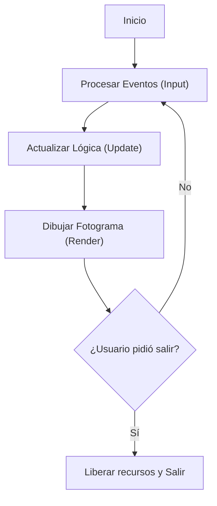

# Submódulo 01: Estructuras Base, Ventana y Ciclo de Eventos (SDL3)

*Seguramente estás cansado de que tus programas vivan en la terminal sin ninguna directiva visual. Te doy la bienvenida a la programación gráfica con **SDL3**.*

Si has llegado hasta aquí, ya superaste punteros, fugas de memoria con `malloc`, macros, headers y depuración forense con GDB. Es hora de unificar todo y construir tu propio videojuego 2D desde cero en C, será algo simple pero servirá para que aprendas a crear un proyecto real.

En este primer submódulo construiremos los cimientos del proyecto: un **juego de escape de un laberinto** de dimensión arbitraria (iniciaremos con $31 \times 21$). Aprenderemos a leer el mundo dinámicamente desde un archivo `.txt`, alojar la matriz en el **Heap**, imprimir un log de verificación en consola, abrir una ventana acelerada por hardware con SDL3 y mantenerla viva mediante el denominado como **Game Loop**.

---

## 1. ¿Por qué SDL3 y qué hay debajo del capó?

<p align="center">
  
</p>

Si vienes de Python, probablemente hayas programado con **Pygame** (aunque probablemente no). Lo que muchos no saben es que Pygame no es más que un *wrapper* (envoltorio) escrito en C encima de **SDL**. Al programar directamente en C con SDL, te saltas las capas lentas del intérprete e interactúas directamente con el hardware y la tarjeta gráfica.

### ¿Qué es SDL3?
**SDL (Simple DirectMedia Layer)** es el estándar indiscutible de la industria para desarrollo multimedia y videojuegos multiplataforma en C. La utilizan proyectos masivos como Valve para el cliente de Steam, emuladores y cientos de motores comerciales.

Recientemente se lanzó **SDL3**, una modernización completa de SDL2:
* La API se rediseñó para ser más limpia, segura e idiomática en C moderno.
* Funciones combinadas como `SDL_CreateWindowAndRenderer()` permiten crear la ventana y el contexto gráfico en una sola llamada elegante.
* Las funciones de inicialización y verificación devuelven valores booleanos (`bool`) directamente en lugar de los antiguos enteros `0` y `-1`.
* El manejo de eventos y renderizado por GPU es más rápido y eficiente.

---

## 2. El Laberinto Dinámico: Adiós al Hardcoding

En lugar de incrustar números fijos en el código fuente, nuestro juego lee el mapa desde un archivo plano externo: [`assets/mapa.txt`](../assets/mapa.txt).

### El Formato de `mapa.txt`
El archivo está estructurado de forma completamente dinámica:
1. **Línea 1:** Indica las dimensiones `filas columnas` (en nuestro caso: `21 31`).
2. **Siguientes 21 líneas:** Los 31 números de cada fila separados por espacios:
   * `1`: Pared sólida (intransitable).
   * `0`: Camino transitable (suelo).
   * `2`: Salida / Meta del laberinto.
   * `3`: Punto de aparición (*spawn*) inicial del jugador.

```plaintext
21 31
1 1 1 1 1 1 1 1 1 1 1 1 1 1 1 1 1 1 1 1 1 1 1 1 1 1 1 1 1 1 1
1 3 1 0 0 0 1 0 0 0 0 0 1 0 0 0 0 0 0 0 0 0 1 0 0 0 0 0 0 0 1
1 0 1 0 1 0 1 0 1 1 1 0 1 1 1 0 1 0 1 1 1 0 1 1 1 0 1 1 1 0 1
...
1 0 0 0 1 0 0 0 0 0 1 0 0 0 0 0 0 0 0 0 1 0 0 0 0 0 0 0 0 2 1
1 1 1 1 1 1 1 1 1 1 1 1 1 1 1 1 1 1 1 1 1 1 1 1 1 1 1 1 1 1 1
```

> [!NOTE]
> **¿Por qué dimensiones impares ($31 \times 21$)?**  
> En los algoritmos de laberintos, las dimensiones impares permiten que los muros y los pasillos alternen perfectamente. Una cuadrícula de $31 \times 21$ asegura que todo el perímetro exterior sea un muro continuo y los pasillos internos no tengan ambigüedades.

---

## 3. Desacoplamiento: Terreno vs. Entidad Jugador

Un error habitual de novato es dejar al jugador representado como un número `3` permanente dentro de la matriz. **No hagas eso.**
Si el jugador sobreescribe la celda con un `3`, cuando se mueva necesitarías recordar si abajo había un suelo, una trampa o la salida.

La arquitectura limpia desacopla el terreno de las entidades:
1. Al detectar el valor `3` en el archivo, guardamos sus coordenadas en el `struct Jugador { int x; int y; }`.
2. Reemplazamos inmediatamente esa celda por `CELDA_CAMINO` (`0`). De este modo, la matriz solo representa el terreno inmutable.

```c
typedef struct {
    int x; // Columna lógica actual 
    int y; // Fila lógica actual 
} Jugador;

typedef struct {
    int filas;
    int columnas;
    int **celdas; // Matriz bidimensional en el Heap 
} Laberinto;
```

---

## 4. Memoria Dinámica: La Matriz en el Heap

Recordando lo aprendido en el **Módulo 09 (Memoria Dinámica)**, para soportar laberintos de cualquier tamaño no podemos usar arreglos de tamaño fijo en el Stack. Asignamos la matriz en el Heap utilizando un puntero doble (`int **`):

```c
// Asignar el arreglo de punteros a fila 
laberinto->celdas = malloc(laberinto->filas * sizeof(int *));

// Asignar cada fila individualmente 
for (int f = 0; f < laberinto->filas; f++) {
    laberinto->celdas[f] = malloc(laberinto->columnas * sizeof(int));
}
```

Y como todo buen programador de C con modales, cada `malloc` se valida contra `NULL` y tiene su función destructora `laberinto_liberar()` con `free()` para evitar cualquier fuga de memoria (*Memory Leak*).

---

## 5. El Log de Verificación por Consola

Antes de pintar píxeles, debemos asegurarnos de que la memoria se cargó sin fallos. La función `laberinto_imprimir_consola()` vuelca a la terminal los números crudos de la matriz leída:

```c
void laberinto_imprimir_consola(const Laberinto *laberinto) {
    printf("\n=== Log de Carga del Laberinto en Memoria Dinámica ===\n");
    printf("-> Dimensiones leídas: %d filas x %d columnas\n", laberinto->filas, laberinto->columnas);
    printf("-> Matriz cargada (números crudos):\n\n");

    for (int f = 0; f < laberinto->filas; f++) {
        for (int c = 0; c < laberinto->columnas; c++) {
            printf("%d ", laberinto->celdas[f][c]);
        }
        printf("\n");
    }
    printf("\n-> [OK] Matriz asignada en el Heap y verificada exitosamente.\n\n");
}
```

---

## 6. Ventana y Renderer en SDL3

En SDL3 existen dos entidades inseparables:
* **`SDL_Window`:** La ventana del Sistema Operativo (marco, barra de título, botones de minimizar/cerrar).
* **`SDL_Renderer`:** El contexto acelerado por hardware (GPU) que enviará órdenes a la tarjeta gráfica mediante Vulkan, OpenGL, Direct3D o Metal.

En [`ventana.c`](./ventana.c) las inicializamos en un solo paso:

```c
bool ventana_inicializar(SDL_Window **ventana, SDL_Renderer **renderer, const char *titulo, int ancho, int alto) {
    if (!SDL_Init(SDL_INIT_VIDEO)) {
        SDL_Log("ERROR al inicializar SDL3: %s", SDL_GetError());
        return false;
    }

    if (!SDL_CreateWindowAndRenderer(titulo, ancho, alto, 0, ventana, renderer)) {
        SDL_Log("ERROR al crear ventana y renderer: %s", SDL_GetError());
        SDL_Quit();
        return false;
    }

    return true;
}
```

### Cálculo de Dimensiones de Pantalla
Con casillas de `TAM_TILE = 44` píxeles y un panel superior para el cronómetro (`PANEL_HUD_ALTO = 64` px):
* **Ancho:** $\text{columnas} \times 44 = 31 \times 44 = 1364\text{ px}$.
* **Alto:** $\text{filas} \times 44 + 64 = 21 \times 44 + 64 = 988\text{ px}$.
* Esta resolución ofrece un tamaño amplio y cómodo que se adapta a monitores 1080p sin distorsión ni pixelación.

---

## 7. El Game Loop Base y Polling de Eventos

A diferencia de un programa de consola que ejecuta instrucciones de arriba abajo y muere, un videojuego mantiene un ciclo continuo a 60 FPS:



Con `SDL_PollEvent(&evento)`, extraemos uno por uno los eventos enviados por el Sistema Operativo:

```c
bool corriendo = true;
SDL_Event evento;

while (corriendo) {
    // Procesar eventos 
    while (SDL_PollEvent(&evento)) {
        if (evento.type == SDL_EVENT_QUIT) {
            corriendo = false; // Clic en la 'X' de la ventana 
        } else if (evento.type == SDL_EVENT_KEY_DOWN) {
            if (evento.key.key == SDLK_ESCAPE) {
                corriendo = false; // Presionar Escape 
            }
        }
    }

    // Limpiar la pantalla en negro (R=0, G=0, B=0, Alpha=255) 
    SDL_SetRenderDrawColor(renderer, 0, 0, 0, 255);
    SDL_RenderClear(renderer);

    // Intercambio de búferes (Double Buffering) 
    SDL_RenderPresent(renderer);
}
```

---

## 8. Estructura de Archivos de este Submódulo

Dentro de esta carpeta [`01_Ventana_y_Ciclo/`](./):
* [`laberinto.h`](./laberinto.h): Contrato público con las estructuras `Laberinto` y `Jugador`, constantes y prototipos.
* [`laberinto.c`](./laberinto.c): Implementación de la carga dinámica de `mapa.txt`, asignación en el Heap, impresión de log crudo en consola y liberación con `free`.
* [`ventana.h`](./ventana.h): Firmas para inicializar video/GPU, ejecutar el Game Loop base y destruir los recursos de SDL3.
* [`ventana.c`](./ventana.c): Implementación de las llamadas a SDL3 y el bucle de eventos.
* [`main.c`](./main.c): Archivo de prueba simple para verificar la carga del mapa, la salida por consola y la apertura/cierre de la ventana.

### ¿Cómo probar este submódulo?
Para compilar y ejecutar esta prueba puntual directamente desde la terminal:

```bash
gcc -Wall -Wextra -std=c11 main.c laberinto.c ventana.c -o prueba $(pkg-config --cflags --libs sdl3)
./prueba
```

> [!NOTE]
> **Sobre la Compilación:**
> Cada submódulo cuenta con su `main.c` para pruebas individuales rápidas. El **Makefile unificado residirá en el Submódulo 06**, donde se integrará todo el proyecto en el ejecutable final del juego.

---

<div align="center">
  <a href="../README.md">⬅️ Menú del Módulo 16</a> | 
  <a href="../02_Renderizado_y_Assets/README.md">Avanzar al Submódulo 02 ➡️</a>
</div>
