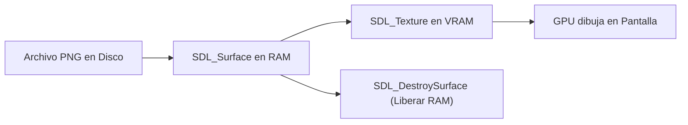

# Submódulo 02: Renderizado y Carga de Texturas (SDL3)

En el submódulo anterior logramos abrir una ventana acelerada por hardware, pero solo mostraba un fondo negro. Es momento de transformar esa pantalla vacía en un mundo visual 2D proyectando el laberinto y el personaje utilizando los gráficos de la carpeta de assets.

En este submódulo aprenderás la diferencia crucial entre la memoria RAM y la memoria de video (VRAM), cómo cargar imágenes en la GPU con SDL3 y cómo proyectar una matriz matemática en coordenadas visuales de pantalla mediante rectángulos de precisión flotante.

---

## 1. Superficies vs. Texturas (RAM vs. VRAM)

En desarrollo gráfico con C y SDL3 existen dos estructuras esenciales para manejar imágenes:

### SDL_Surface (Memoria RAM del Sistema)
Una superficie es un bloque de memoria convencional en la RAM donde los píxeles están almacenados en crudo. La CPU puede leerlos y modificarlos byte a byte. Sin embargo, dibujar directamente con la CPU es lento e ineficiente para videojuegos modernos.

### SDL_Texture (Memoria VRAM de la GPU)
Una textura es una imagen procesada y cargada directamente en la memoria dedicada de la tarjeta gráfica. La GPU está diseñada específicamente para transformar, escalar y proyectar estas texturas a cientos de cuadros por segundo de forma paralela.

### El Flujo de Carga Óptimo
Para pintar un sprite en pantalla, seguimos una secuencia estricta:



1. Leemos el archivo del disco a una superficie temporal en RAM con `SDL_LoadSurface()`.
2. Transferimos los datos a la tarjeta gráfica creando una textura con `SDL_CreateTextureFromSurface()`.
3. Destruimos la superficie de la RAM con `SDL_DestroySurface()` inmediatamente para no desperdiciar memoria principal.

---

## 2. Implementación de Carga: `render.h` y `render.c`

Para mantener la modularidad, agrupamos los punteros de textura en una estructura dedicada dentro de [`render.h`](./render.h):

```c
typedef struct {
    SDL_Texture *pared;
    SDL_Texture *camino;
    SDL_Texture *salida;
    SDL_Texture *jugador;
} Texturas;
```

En [`render.c`](./render.c), implementamos una función auxiliar privada para cargar cualquier imagen y convertirla en textura:

```c
static SDL_Texture *cargar_textura(SDL_Renderer *renderer, const char *ruta) {
    SDL_Surface *superficie = SDL_LoadSurface(ruta);
    if (superficie == NULL) {
        fprintf(stderr, "[ERROR] No se pudo cargar la imagen: %s (%s)\n", ruta, SDL_GetError());
        return NULL;
    }

    // Crear la textura acelerada por hardware en la VRAM
    SDL_Texture *textura = SDL_CreateTextureFromSurface(renderer, superficie);
    SDL_DestroySurface(superficie);

    return textura;
}
```

Al inicializar las texturas, cargamos los sprites desde la carpeta compartida `assets/`:
* `camino.png`: Suelo transitable del laberinto.
* `pared.png`: Muro sólido e impenetrable.
* `salida.png`: Meta de escape.
* `player.png`: Personaje principal.

---

## 3. De la Matriz a la Pantalla: Coordenadas y `SDL_FRect`

En SDL2 se utilizaba `SDL_Rect` con coordenadas enteras. En **SDL3**, el motor de renderizado se modernizó y utiliza **`SDL_FRect`**, una estructura de coordenadas en coma flotante (`float`) que ofrece precisión subpíxel y escalado suave.

### Matemáticas de Proyección
Nuestra matriz lógica tiene coordenadas `(columna, fila)` que van de `(0, 0)` hasta `(30, 20)`. Para proyectar cada celda en la ventana:
* Cada casilla mide `TAM_TILE = 44` píxeles para una visualización amplia y nítida.
* Reservamos un espacio superior de `PANEL_HUD_ALTO = 64` píxeles para el panel de tiempo y cronómetro.
* Resolución resultante de la ventana: 1364 x 988 píxeles (óptima para pantallas 1080p).

La fórmula de traslación es:

$$\text{pos\_x} = \text{columna} \times 44$$

$$\text{pos\_y} = (\text{fila} \times 44) + 64$$

```c
SDL_FRect destino = {
    (float)(c * TAM_TILE),
    (float)((f * TAM_TILE) + PANEL_HUD_ALTO),
    (float)TAM_TILE,
    (float)TAM_TILE
};
```

---

## 4. Renderizado en Capas

El dibujado en videojuegos 2D funciona como capas de pintura. Si pintamos al personaje primero y luego el suelo encima, el personaje quedará tapado e invisible.

Por eso el renderizado se divide en dos fases ordenadas:

### Capa 1: Dibujado del Laberinto (`render_dibujar_laberinto`)
Recorremos la matriz con dos bucles anidados. En cada celda dibujamos primero la textura de camino como fondo base y, si la celda es pared o salida, dibujamos encima el sprite correspondiente con `SDL_RenderTexture()`:

```c
void render_dibujar_laberinto(SDL_Renderer *renderer, const Laberinto *laberinto, const Texturas *texturas) {
    for (int f = 0; f < laberinto->filas; f++) {
        for (int c = 0; c < laberinto->columnas; c++) {
            SDL_FRect destino = {
                (float)(c * TAM_TILE),
                (float)((f * TAM_TILE) + PANEL_HUD_ALTO),
                (float)TAM_TILE,
                (float)TAM_TILE
            };

            // Dibujar suelo base en todas las celdas
            SDL_RenderTexture(renderer, texturas->camino, NULL, &destino);

            // Dibujar pared o meta segun el valor de la celda
            int celda = laberinto->celdas[f][c];
            if (celda == CELDA_PARED) {
                SDL_RenderTexture(renderer, texturas->pared, NULL, &destino);
            } else if (celda == CELDA_SALIDA) {
                SDL_RenderTexture(renderer, texturas->salida, NULL, &destino);
            }
        }
    }
}
```

### Capa 2: Dibujado del Jugador (`render_dibujar_jugador`)
Una vez proyectado el terreno completo, dibujamos la textura del personaje en sus coordenadas lógicas actuales:

```c
void render_dibujar_jugador(SDL_Renderer *renderer, const Jugador *jugador, const Texturas *texturas) {
    SDL_FRect destino = {
        (float)(jugador->x * TAM_TILE),
        (float)((jugador->y * TAM_TILE) + PANEL_HUD_ALTO),
        (float)TAM_TILE,
        (float)TAM_TILE
    };

    SDL_RenderTexture(renderer, texturas->jugador, NULL, &destino);
}
```

---

## 5. Destrucción Limpia de Recursos

Las texturas viven en la memoria dedicada de la tarjeta gráfica. Al cerrar el juego debemos destruirlas explícitamente mediante `SDL_DestroyTexture()`:

```c
void render_destruir_texturas(Texturas *texturas) {
    if (texturas->pared)   SDL_DestroyTexture(texturas->pared);
    if (texturas->camino)  SDL_DestroyTexture(texturas->camino);
    if (texturas->salida)  SDL_DestroyTexture(texturas->salida);
    if (texturas->jugador) SDL_DestroyTexture(texturas->jugador);
}
```

---

## 6. Estructura de Archivos de este Submódulo

Dentro de esta carpeta [`02_Renderizado_y_Assets/`](./):
* [`render.h`](./render.h): Declaración del contenedor `Texturas` y prototipos de renderizado.
* [`render.c`](./render.c): Implementación de la carga en GPU y dibujado en capas con SDL3.
* [`main.c`](./main.c): Programa de prueba que carga el laberinto, inicializa la ventana y dibuja todo el escenario en pantalla.

### ¿Cómo compilar y probar este submódulo?
Desde la terminal dentro de esta carpeta:

```bash
gcc -Wall -Wextra -std=c11 main.c render.c ../01_Ventana_y_Ciclo/laberinto.c ../01_Ventana_y_Ciclo/ventana.c -o prueba $(pkg-config --cflags --libs sdl3)
./prueba
```

Al ejecutarlo, la ventana mostrará el laberinto completo con sus texturas de muro, caminos, la salida visible y al personaje posicionado en su punto de inicio.

---

<div align="center">
  <a href="../01_Ventana_y_Ciclo/README.md">⬅️ Anterior: Submódulo 01</a> | 
  <a href="../README.md">Menú del Módulo 16</a> | 
  <a href="../03_Interaccion_y_Eventos/README.md">Avanzar al Submódulo 03 ➡️</a>
</div>
