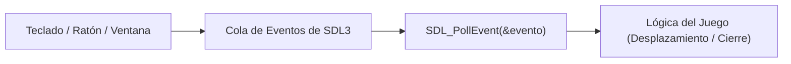

# Submódulo 03: Interacción, Eventos y Detección de Colisiones (SDL3)

En el submódulo anterior aprendimos a cargar texturas en la VRAM de la GPU y proyectar visualmente el laberinto y el personaje sobre la ventana. Sin embargo, el mundo era estático e inerte.

En este submódulo daremos vida al juego procesando las acciones del usuario: capturaremos las pulsaciones del teclado mediante la cola de eventos de SDL3, actualizaremos la posición lógica del jugador sobre la cuadrícula y aplicaremos reglas de colisión sólida para impedir que atraviese las paredes de piedra.

---

## 1. La Cola de Eventos del Sistema Operativo

Cuando un usuario interactúa con tu ventana (presiona una tecla, mueve el ratón o pulsa la cruz de cerrar), el sistema operativo no interrumpe bruscamente tu programa en mitad de una instrucción. En su lugar, deposita cada acción en una **cola de mensajes** (*Event Queue*).

SDL3 centraliza y normaliza estos sucesos bajo la estructura polimórfica `SDL_Event`.



### El Bucle de Eventos (`SDL_PollEvent`)
En cada iteración del Game Loop debemos vaciar por completo la cola de eventos pendientes. Si no lo hiciéramos, el sistema operativo consideraría que la ventana "no responde" y el juego se congelaría.

```c
SDL_Event evento;
while (SDL_PollEvent(&evento)) {
    if (evento.type == SDL_EVENT_QUIT) {
        // El usuario solicitó cerrar la ventana
        return false;
    }
    // Procesar otros tipos de eventos...
}
```

---

## 2. Movimiento por Casillas vs. Movimiento Continuo

En videojuegos existen dos filosofías principales para procesar el teclado:

1. **Estado continuo (`SDL_GetKeyboardState`):** Consulta directa de si una tecla está actualmente hundida. Es ideal para juegos de naves espaciales o plataformas donde la velocidad es continua (píxeles por segundo).
2. **Pulsación discreta (`SDL_EVENT_KEY_DOWN`):** Se dispara una única vez en el instante exacto en que la tecla desciende. Es la opción perfecta para nuestro laberinto basado en baldosas (*tile-based grid*), ya que garantiza que cada pulsación avance exactamente **una casilla**, evitando desplazamientos descontrolados.

En SDL3, los códigos de tecla virtuales se consultan mediante `evento.key.key` (por ejemplo, `SDLK_ESCAPE`, `SDLK_UP`, `SDLK_W`):

```c
if (evento.type == SDL_EVENT_KEY_DOWN) {
    switch (evento.key.key) {
        case SDLK_UP:
        case SDLK_W:
            jugador_intentar_mover(jugador, laberinto, 0, -1);
            break;
        case SDLK_DOWN:
        case SDLK_S:
            jugador_intentar_mover(jugador, laberinto, 0, 1);
            break;
        case SDLK_LEFT:
        case SDLK_A:
            jugador_intentar_mover(jugador, laberinto, -1, 0);
            break;
        case SDLK_RIGHT:
        case SDLK_D:
            jugador_intentar_mover(jugador, laberinto, 1, 0);
            break;
        default:
            break;
    }
}
```

---

## 3. Desacoplamiento Lógico: Coordenadas vs. Píxeles

Un principio de diseño crítico en motores 2D es mantener la lógica del mundo totalmente separada de la representación visual en pantalla:

* **Espacio Lógico (Matriz):** El jugador solo conoce su posición en casillas de la matriz `(x, y)`, por ejemplo `(1, 1)`.
* **Espacio Gráfico (Renderer):** El módulo de renderizado traduce esas coordenadas a píxeles multiplicando por `TAM_TILE = 44` y sumando el margen vertical `PANEL_HUD_ALTO = 64`.

Gracias a esto, la verificación de colisiones no requiere complejas fórmulas trigonométricas de cajas delimitadoras (*AABB*), sino una simple consulta de índice en la matriz bidimensional en tiempo $O(1)$.

---

## 4. Detección de Colisiones Sólidas

Antes de modificar las coordenadas del jugador, realizamos un movimiento especulativo o tentativo:

1. Calculamos la celda objetivo: `nuevo_x = jugador->x + dx`, `nuevo_y = jugador->y + dy`.
2. Validamos si esa posición está fuera de rango o corresponde a una pared sólida invocando `laberinto_es_pared()`.
3. Si la celda es transitable (camino o salida), consolidamos las nuevas coordenadas. Si es una pared, abortamos el movimiento sin alterar la posición del personaje.

```c
bool jugador_intentar_mover(Jugador *jugador, const Laberinto *laberinto, int dx, int dy) {
    if (jugador == NULL || laberinto == NULL) {
        return false;
    }

    int nuevo_x = jugador->x + dx;
    int nuevo_y = jugador->y + dy;

    // Rechazar el movimiento si colisiona con un muro
    if (laberinto_es_pared(laberinto, nuevo_x, nuevo_y)) {
        return false;
    }

    // Actualizar coordenadas logicas
    jugador->x = nuevo_x;
    jugador->y = nuevo_y;

    // Comprobar si se alcanzo la salida
    if (laberinto_es_salida(laberinto, nuevo_x, nuevo_y)) {
        printf("-> [META] El jugador alcanzo la salida en (%d, %d)\n", nuevo_x, nuevo_y);
    }

    return true;
}
```

---

## 5. Estructura de Archivos de este Submódulo

Dentro de la carpeta [`03_Interaccion_y_Eventos/`](./):
* [`input.h`](./input.h): Prototipos de gestión de eventos y resolución de colisiones.
* [`input.c`](./input.c): Lógica de teclado, bucle `SDL_PollEvent` y validación de movimiento.
* [`main.c`](./main.c): Programa interactivo de prueba que integra ventana, renderizado y movimiento en tiempo real.

---

## 6. Compilación y Prueba Práctica

Para compilar y ejecutar el banco de pruebas interactivo de este submódulo:

```bash
gcc -Wall -Wextra -std=c11 main.c input.c ../02_Renderizado_y_Assets/render.c ../01_Ventana_y_Ciclo/laberinto.c ../01_Ventana_y_Ciclo/ventana.c -o prueba $(pkg-config --cflags --libs sdl3)
./prueba
```

### Controles en el Programa de Prueba
* **Flechas de dirección o teclas WASD:** Desplazan al aventurero a través del laberinto celda por celda.
* **Colisiones activas:** Observarás que el personaje no puede atravesar los muros de piedra ni salir de los límites de la pantalla.
* **Consola:** Cada paso imprimirá las coordenadas `(x, y)` en la terminal. Al pisar la salida, se notificará la llegada a la meta.
* **Escape / Cruz de la ventana:** Cierra el juego y libera de manera limpia todos los recursos de memoria y GPU.

---

<div align="center">
  <a href="../02_Renderizado_y_Assets/README.md">⬅️ Anterior: Submódulo 02</a> | 
  <a href="../README.md">Menú del Módulo 16</a> | 
  <a href="../04_Texto_y_Cronometro/README.md">Avanzar al Submódulo 04 ➡️</a>
</div>
