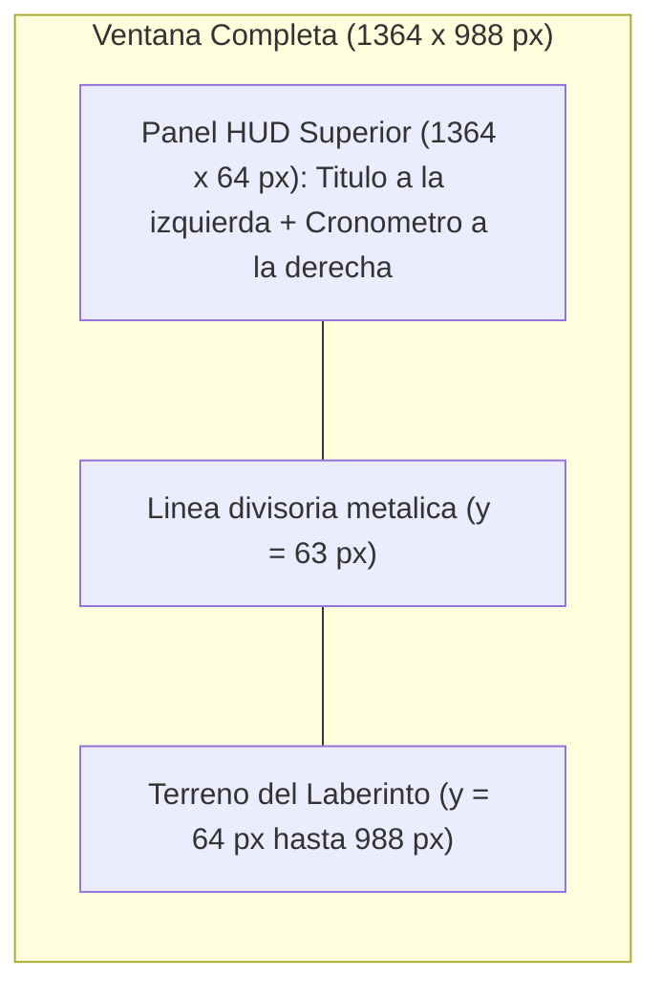

# Submódulo 04: Tipografía y Cronómetro en Pantalla (HUD)

En el submódulo anterior logramos que el personaje respondiera al teclado y respetara las paredes del laberinto. Sin embargo, para convertir un laberinto en un videojuego desafiante necesitamos un elemento clave de tensión: **el tiempo**.

En este submódulo aprenderás a medir el paso del tiempo en milisegundos con SDL3, cómo diseñar y dibujar una interfaz de usuario (HUD) en la parte superior de la ventana y las distintas técnicas para renderizar tipografías en pantalla.

---

## 1. Medición del Tiempo en Videojuegos (`SDL_GetTicks`)

En C estándar solemos recurrir a `time.h` y `clock()`, pero en el desarrollo de videojuegos dependemos de funciones del motor que miden el tiempo de reloj real con precisión de milisegundos o nanosegundos.

SDL3 proporciona dos funciones principales para consultar el tiempo transcurrido desde que la biblioteca fue inicializada:
* **`SDL_GetTicks()`:** Devuelve un entero sin signo de 64 bits (`Uint64`) con los milisegundos transcurridos.
* **`SDL_GetTicksNS()`:** Devuelve nanosegundos (ideal para cálculos de física de altísima precisión).

### La Fórmula del Cronómetro
Para medir cuánto tiempo lleva el jugador dentro del laberinto, registramos una marca temporal de inicio y comparamos en cada cuadro:

$$\text{tiempo\_transcurrido} = \text{SDL\_GetTicks}() - \text{tiempo\_inicio}$$

```c
Uint64 tiempo_inicio = SDL_GetTicks();

// Dentro del Game Loop:
Uint64 tiempo_actual = SDL_GetTicks();
Uint64 transcurrido_ms = tiempo_actual - tiempo_inicio;
```

---

## 2. Aritmética Temporal: De Milisegundos a `MM:SS.CC`

Mostrar al usuario un número plano como `48592 ms` resulta incómodo e ilegible. Es necesario descomponer ese valor en unidades humanas:

1. **Total de segundos:** $\lfloor \text{ms} / 1000 \rfloor$
2. **Minutos:** $\lfloor \text{segundos} / 60 \rfloor$
3. **Segundos restantes:** $\text{segundos} \pmod{60}$
4. **Centésimas de segundo:** $\lfloor (\text{ms} \pmod{1000}) / 10 \rfloor$

En [`texto.c`](./texto.c), implementamos esta conversión de manera limpia y segura:

```c
void hud_formatear_tiempo(Uint64 milisegundos, char *buffer, size_t tam_buffer) {
    Uint64 total_segundos = milisegundos / 1000;
    Uint64 minutos = total_segundos / 60;
    Uint64 segundos = total_segundos % 60;
    Uint64 centesimas = (milisegundos % 1000) / 10;

    snprintf(buffer, tam_buffer, "%02llu:%02llu.%02llu",
             (unsigned long long)minutos,
             (unsigned long long)segundos,
             (unsigned long long)centesimas);
}
```

---

## 3. Renderizado de Texto: Enfoques en SDL3

Dibujar letras en una GPU no es tan simple como pintar rectángulos: las fuentes tipográficas son vectores matemáticos que deben rasterizarse a mapas de bits.

### Técnica 1: Texto Integrado de SDL3 (`SDL_RenderDebugText`)
SDL3 introdujo un motor de texto nativo que no requiere ninguna biblioteca externa. Utiliza un mapa de caracteres integrado de 8x8 píxeles.

Para otorgarle tamaño, visibilidad y color adecuado en pantalla, combinamos tres funciones:
1. `SDL_SetRenderScale(renderer, escala, escala)` para ampliar proporcionalmente los glifos.
2. `SDL_SetRenderDrawColor(renderer, r, g, b, a)` para teñir el texto.
3. `SDL_RenderDebugText(renderer, x / escala, y / escala, texto)` para proyectar los caracteres.

Esta técnica es ligera, ultra rápida y garantiza que el juego compile directamente con `-lSDL3` en cualquier sistema sin dependencias complejas de fuentes en disco.

### Técnica 2: Fuentes TrueType con `SDL3_ttf` (Opcional)
Para fuentes personalizadas con curvas vectoriales perfectas (`.ttf` o `.otf`), se utiliza la biblioteca satélite `SDL3_ttf`:
1. Se inicializa con `TTF_Init()`.
2. Se carga el archivo con `TTF_OpenFont("assets/fuente.ttf", tamaño)`.
3. Se crea una superficie de texto con `TTF_RenderText_Blended()` o directamente una textura con `TTF_CreateSurfaceTextEngine()`.
4. Se destruye con `TTF_CloseFont()` y `TTF_Quit()`.

---

## 4. Diseño del Panel HUD (*Heads-Up Display*)

El HUD es la franja de información superpuesta al juego. En nuestra arquitectura reservamos los primeros 64 píxeles verticales (`PANEL_HUD_ALTO = 64`):



Al renderizar en capas:
1. Primero pintamos el laberinto y el personaje desde $y \ge 64$.
2. Encima pintamos el panel rectangular del HUD (`SDL_RenderFillRect`).
3. Trazamos la línea horizontal divisoria con `SDL_RenderLine`.
4. Escribimos el título y el tiempo formateado.

---

## 5. Estructura de Archivos de este Submódulo

Dentro de la carpeta [`04_Texto_y_Cronometro/`](./):
* [`texto.h`](./texto.h): Prototipos de formateo de tiempo, escalado de fuentes y dibujado del HUD.
* [`texto.c`](./texto.c): Implementación matemática y llamadas gráficas de SDL3.
* [`main.c`](./main.c): Banco de pruebas interactivo donde el cronómetro corre en vivo mientras navegas por el laberinto.

---

## 6. Compilación y Prueba Práctica

Para compilar y ejecutar el banco de pruebas de este submódulo:

```bash
gcc -Wall -Wextra -std=c11 main.c texto.c ../03_Interaccion_y_Eventos/input.c ../02_Renderizado_y_Assets/render.c ../01_Ventana_y_Ciclo/laberinto.c ../01_Ventana_y_Ciclo/ventana.c -o prueba $(pkg-config --cflags --libs sdl3)
./prueba
```

### ¿Qué verificar durante la prueba?
* La barra superior muestra el panel oscuro con el título `LABERINTO ESCAPE` en tono claro.
* El cronómetro en verde esmeralda avanza de forma fluida mostrando minutos, segundos y centésimas.
* Al llegar a la salida (meta), el cronómetro se congela automáticamente registrando el tiempo récord y aparece el aviso `[META ALCANZADA!]`.

---

<div align="center">
  <a href="../03_Interaccion_y_Eventos/README.md">⬅️ Anterior: Submódulo 03</a> | 
  <a href="../README.md">Menú del Módulo 16</a> | 
  <a href="../05_Pantallas_y_Estados/README.md">Avanzar al Submódulo 05 ➡️</a>
</div>
