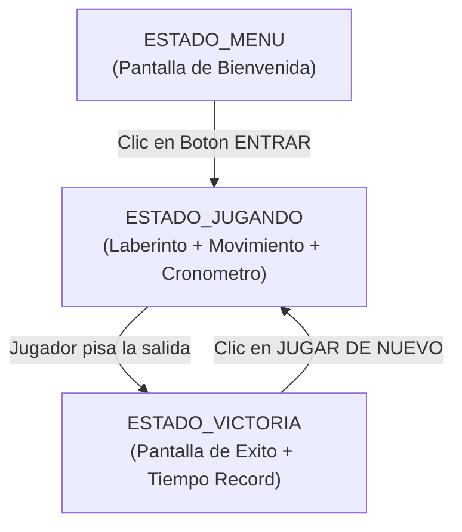

# Submódulo 05: Máquina de Estados y Pantallas de Menú/Victoria

En los submódulos previos construimos los cimientos del laberinto: ventana, sprites acelerados por GPU, colisiones de teclado y un HUD con cronómetro en tiempo real. No obstante, al ejecutar el juego aparecíamos de golpe en medio del laberinto sin preámbulos ni una pantalla de celebración al ganar.

En este submódulo implementaremos una **Máquina de Estados Finita (FSM)** que gobernará el flujo completo del videojuego, y aprenderemos a gestionar el ratón para crear botones interactivos con efectos visuales al pasar el cursor encima (*hover*).

---

## 1. Máquinas de Estados Finitas (FSM) en Videojuegos

Un videojuego no es una única pantalla estática; es un sistema dinámico que transiciona entre diferentes modos de operación. Si intentáramos controlar todo esto con decenas de banderas booleanas (`bool en_menu`, `bool jugando`, `bool gano`), el código se volvería un laberinto inmanejable de condiciones cruzadas (*código espagueti*).

La solución estándar en la industria es una **Máquina de Estados Finita**:



En C definimos estos estados mediante un `enum`:

```c
typedef enum {
    ESTADO_MENU,
    ESTADO_JUGANDO,
    ESTADO_VICTORIA
} EstadoJuego;
```

En el bucle principal, tanto la gestión de eventos como el renderizado se ramifican limpiamente con una estructura `switch (estado)`.

---

## 2. Botones Interactivos y Detección de Ratón (*Hitbox*)

A diferencia de un entorno web donde el navegador provee elementos `<button>`, en gráficos de bajo nivel con SDL3 debemos construir nuestros propios componentes interactivos desde cero.

Un botón se compone de:
1. Una región rectangular en el espacio de pantalla (`SDL_FRect rect`).
2. Una etiqueta de texto a mostrar (`const char *texto`).
3. Una bandera de estado para saber si el cursor está encima (`bool hover`).

```c
typedef struct {
    SDL_FRect rect;
    const char *texto;
    bool hover;
} Boton;
```

### Matemáticas de Intersección Punto-Rectángulo
Para saber si el ratón está sobre el botón, comprobamos si sus coordenadas `(px, py)` caen dentro de los límites del rectángulo:

$$x \le px \le x + w \quad \land \quad y \le py \le y + h$$

```c
bool boton_contiene_punto(const Boton *boton, float px, float py) {
    return (px >= boton->rect.x &&
            px <= boton->rect.x + boton->rect.w &&
            py >= boton->rect.y &&
            py <= boton->rect.y + boton->rect.h);
}
```

---

## 3. Procesamiento de Eventos del Ratón en SDL3

SDL3 emite eventos dedicados para la actividad del ratón:

* **`SDL_EVENT_MOUSE_MOTION`:** Se dispara al mover el cursor. Consultamos `evento.motion.x` y `evento.motion.y` para actualizar la bandera `hover` del botón e iluminar su borde en pantalla.
* **`SDL_EVENT_MOUSE_BUTTON_DOWN`:** Se dispara al presionar un botón del ratón. Comprobamos si fue el clic izquierdo (`evento.button.button == SDL_BUTTON_LEFT`) y si las coordenadas `(evento.button.x, evento.button.y)` colisionan con nuestro botón:

```c
if (evento.type == SDL_EVENT_MOUSE_BUTTON_DOWN && evento.button.button == SDL_BUTTON_LEFT) {
    if (boton_contiene_punto(&boton_entrar, evento.button.x, evento.button.y)) {
        estado = ESTADO_JUGANDO;
        tiempo_inicio = SDL_GetTicks();
    }
}
```

---

## 4. Estructura de Archivos de este Submódulo

Dentro de la carpeta [`05_Pantallas_y_Estados/`](./):
* [`estados.h`](./estados.h): Definición del `enum EstadoJuego`, la estructura `Boton` y prototipos de pantallas.
* [`estados.c`](./estados.c): Lógica de colisión de botones y renderizado del Menú Principal y de la Pantalla de Victoria con el tiempo final.
* [`main.c`](./main.c): Banco de pruebas interactivo que permite recorrer el ciclo completo: Menú -> Juego -> Victoria -> Reinicio.

---

## 5. Compilación y Prueba Práctica

Para compilar y ejecutar el banco de pruebas interactivo:

```bash
gcc -Wall -Wextra -std=c11 main.c estados.c ../04_Texto_y_Cronometro/texto.c ../03_Interaccion_y_Eventos/input.c ../02_Renderizado_y_Assets/render.c ../01_Ventana_y_Ciclo/laberinto.c ../01_Ventana_y_Ciclo/ventana.c -o prueba $(pkg-config --cflags --libs sdl3)
./prueba
```

### Experiencia del Usuario en la Prueba
1. **Inicio en Pantalla de Bienvenida:** Fondo oscuro con el título en dorado y el botón `ENTRAR`. Pasa el ratón sobre el botón para apreciar el cambio de color e iluminación.
2. **Entrada al Laberinto:** Haz clic izquierdo sobre `ENTRAR`. La pantalla cambiará al laberinto y el cronómetro comenzará a contar desde cero.
3. **Victoria y Registro:** Navega hasta la salida en `(29, 19)`. La pantalla cambiará automáticamente a verde victoria, mostrando el tiempo récord congelado y el botón `JUGAR DE NUEVO`.
4. **Reinicio o Salida:** Al hacer clic en `JUGAR DE NUEVO`, el personaje vuelve al punto de inicio y el cronómetro se reinicia. En cualquier momento puedes pulsar `ESC` para cerrar la ventana.

---

<div align="center">
  <a href="../04_Texto_y_Cronometro/README.md">⬅️ Anterior: Submódulo 04</a> | 
  <a href="../README.md">Menú del Módulo 16</a> | 
  <a href="../06_Audio_y_Final/README.md">Avanzar al Submódulo 06 ➡️</a>
</div>
