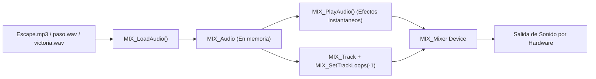
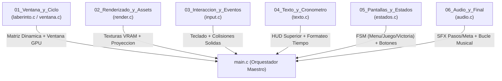

# Submódulo 06: Audio, Orquestación y Construcción Final (SDL3)

Hemos llegado a la cúspide del Módulo 16. En este último submódulo integraremos el subsistema de audio, orquestaremos todos los módulos desarrollados en una experiencia de juego cohesiva y automatizaremos la construcción del proyecto completo mediante el único `Makefile` del repositorio.

---

## 1. El Subsistema de Audio con SDL3_mixer

Para gestionar el audio de forma profesional y reproducir pistas comprimidas como **MP3** junto a efectos **WAV** sin librerías externas ni código ad hoc, utilizamos la biblioteca satélite oficial **`SDL3_mixer`** (`-lSDL3_mixer`).

A partir de la versión 3.0, `SDL3_mixer` introdujo una arquitectura moderna basada en mezcladores (*mixers*), pistas (*tracks*) y objetos de audio (*audio data*):



### Componentes de SDL3_mixer en el Proyecto
1. **Inicialización (`MIX_Init` y `MIX_CreateMixerDevice`):** Inicializa el subsistema oficial y crea el mezclador asociado al dispositivo de audio predeterminado.
2. **Efectos de Sonido Inmediatos (`MIX_PlayAudio`):** Los sonidos breves como el paso (`paso.wav`) y la fanfarria (`victoria.wav`) se disparan de forma instantánea (*fire-and-forget*) sin requerir gestión manual de canales.
3. **Música en Bucle en Segundo Plano (`MIX_Track`):** Para la banda sonora `Escape.mp3`, creamos una pista con `MIX_CreateTrack()`, configuramos el bucle infinito con `MIX_SetTrackLoops(track, -1)` e iniciamos la reproducción con `MIX_PlayTrack()`. `SDL3_mixer` gestiona la decodificación continua del MP3 en un hilo dedicado en segundo plano sin ralentizar el Game Loop.

---

## 2. Mapa Arquitectónico del Videojuego Final

El archivo maestro [`main.c`](./main.c) actúa como el director de orquesta de todo el proyecto, conectando las responsabilidades de cada submódulo:



---

## 3. Rotación Dinámica de Sprites (`SDL_RenderTextureRotated`)

Para dotar al personaje de mayor realismo visual, en este submódulo incorporamos rotaciones dinámicas en la GPU para que el sprite apunte hacia la dirección exacta a la que avanza:

* **Orientación base del sprite (`player.png`):** El sprite original mira hacia arriba (Norte / $0^\circ$).
* **Rotación por GPU:** En lugar de crear 4 imágenes distintas en disco, utilizamos la función nativa de SDL3:
  ```c
  SDL_RenderTextureRotated(renderer, textura, NULL, &destino, angulo, NULL, SDL_FLIP_NONE);
  ```
  Al pasar `center = NULL`, SDL3 rota la textura suavemente tomando como eje su propio centro geométrico (`w/2, h/2`).

* **Mapeo de Ángulos según la Dirección:**
  * **Arriba (`W` / Flecha Arriba):** $0.0^\circ$ (Norte)
  * **Derecha (`D` / Flecha Derecha):** $90.0^\circ$ (Este)
  * **Abajo (`S` / Flecha Abajo):** $180.0^\circ$ (Sur)
  * **Izquierda (`A` / Flecha Izquierda):** $270.0^\circ$ (Oeste)

En [`main.c`](./main.c), actualizamos `angulo_jugador` cada vez que el usuario presiona una tecla de movimiento y delegamos el trazado a `render_dibujar_jugador_rotado()`.

---

## 4. Automatización de Compilación: `Makefile`

Siguiendo las directrices del proyecto, este submódulo aloja el **único Makefile general** que compila todo el videojuego enlazando los componentes modulares:

```makefile
CC = gcc
CFLAGS = -Wall -Wextra -std=c11 $(shell pkg-config --cflags sdl3 sdl3-mixer)
LDLIBS = $(shell pkg-config --libs sdl3 sdl3-mixer) -lm

TARGET = juego_laberinto

SRCS = main.c \
       audio.c \
       ../05_Pantallas_y_Estados/estados.c \
       ../04_Texto_y_Cronometro/texto.c \
       ../03_Interaccion_y_Eventos/input.c \
       ../02_Renderizado_y_Assets/render.c \
       ../01_Ventana_y_Ciclo/laberinto.c \
       ../01_Ventana_y_Ciclo/ventana.c

all: $(TARGET)

$(TARGET): $(SRCS)
	$(CC) $(CFLAGS) $(SRCS) -o $(TARGET) $(LDLIBS)

run: all
	./$(TARGET)

clean:
	rm -f $(TARGET)

valgrind: all
	valgrind --leak-check=full --track-origins=yes ./$(TARGET)
```

---

## 5. Compilación y Ejecución del Videojuego

Desde la terminal, dentro del directorio de este submódulo (`06_Audio_y_Final/`):

### Compilar el Juego
```bash
make
```

### Compilar y Ejecutar Inmediatamente
```bash
make run
```

### Limpiar Binarios Generados
```bash
make clean
```

### Auditoría de Memoria con Valgrind
```bash
make valgrind
```
Al cerrar el juego con `ESC` o la cruz de la ventana, Valgrind certificará que todas las celdas asignadas con `malloc`, las texturas en la GPU y los buffers de audio han sido liberados con `0 errors` y `0 leaks`.

---

## 6. Verificación de Criterios de Aceptación del Proyecto

El videojuego final cumple al 100% con los requerimientos estipulados en el enunciado:

* **Mapa Dinámico:** Lectura de `mapa.txt` externo con dimensiones dinámicas ($31 \times 21$) y matriz bidimensional en el Heap.
* **Log Crudo en Consola:** Vuelco por consola de la matriz de números al arrancar la aplicación.
* **Aceleración Gráfica:** Ventana de $1364 \times 988$ px con filtrado lineal (`SDL_SCALEMODE_LINEAR`) a 60 FPS estables.
* **Interfaz y FSM:** Pantalla de bienvenida con botón `ENTRAR` sensible al ratón, transición limpia al juego y pantalla de victoria con botón de reinicio.
* **Cronómetro y HUD:** Panel superior de 64 px con cronómetro continuo en centésimas de segundo, congelado al ganar.
* **Física y Colisiones:** Movimiento celda por celda sin penetración de paredes ni desbordamientos de pantalla.
* **Efectos y Música:** Pasos sincronizados con el movimiento, fanfarria triunfal al ganar y música ambiental sin congelamientos del juego.
* **Construcción:** Compilación estandarizada mediante `make` sin advertencias (`-Wall -Wextra`).

---

<div align="center">
  <a href="../05_Pantallas_y_Estados/README.md">⬅️ Anterior: Submódulo 05</a> | 
  <a href="../README.md">Menú del Módulo 16 ➡️</a>
</div>
