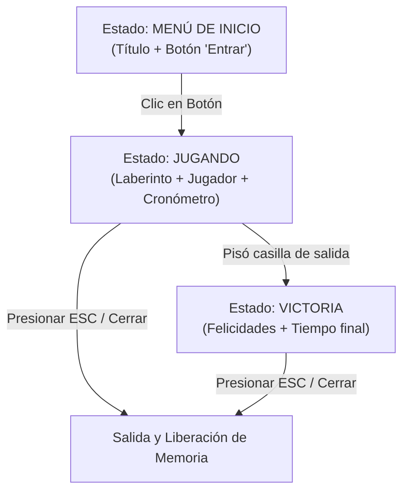

# Módulo 16: Interfaz Gráfica y Videojuegos con SDL3

Seguramente estás cansado de que tus programas vivan en la terminal sin ninguna directiva visual. Es hora de ponerle color, sonido, física e interacción a tus ideas. En este módulo aplicaremos todo lo aprendido a lo largo del curso (punteros, memoria dinámica, structs, modularidad y Makefiles) e incorporaremos una GUI funcional construyendo un videojuego 2D completo desde cero con la moderna biblioteca **SDL3** y la arquitectura modular de C.

<p align="center">
  
</p>

<div align="center">
  <h3><a href="./01_Ventana_y_Ciclo/README.md">Comenzar con el Submódulo 1: Ventana y Ciclo de Eventos</a></h3>
</div>

---

## El Laberinto de Escape 2D

### 1. Descripción General
Debes desarrollar un videojuego 2D de exploración y escape en vista cenital (top-down). El jugador controlará a un personaje dentro de un laberinto cerrado y deberá encontrar la salida en el menor tiempo posible, navegando mediante las flechas del teclado y respetando las colisiones físicas contra los muros.

El proyecto no utiliza matrices fijas en el código fuente: el mundo se genera y carga dinámicamente leyendo un archivo de texto externo (`assets/mapa.txt`), reservando memoria en el Heap con `malloc` y liberándola limpiamente con `free` al terminar la ejecución.

---

### 2. Flujo del Programa y Máquina de Estados

El juego debe estructurarse mediante una Máquina de Estados Finita (FSM) con tres pantallas claramente diferenciadas:



1. **Pantalla de Inicio (Menú Principal):**
   * Muestra el título del juego y una breve indicación de controles.
   * Contiene un botón interactivo centrado con el texto "Entrar".
   * El sistema detecta eventos de ratón (`SDL_EVENT_MOUSE_BUTTON_DOWN`): si el usuario hace clic dentro de las coordenadas del botón, el juego realiza la transición inmediata al estado de juego y comienza a medir el tiempo.

2. **Pantalla de Juego (El Laberinto en Acción):**
   * El cronómetro arranca en el instante en que se presiona "Entrar" utilizando `SDL_GetTicks()`.
   * Se dibuja el laberinto celda por celda proyectando las texturas aceleradas por GPU (`pared.png`, `camino.png`, `salida.png`).
   * El jugador aparece en la posición inicial definida en el archivo y se desplaza casilla por casilla con las flechas del teclado (`Arriba`, `Abajo`, `Izquierda`, `Derecha`).
   * **Sistema de Colisiones Sólidas:** Antes de modificar las coordenadas del jugador, el motor valida que la celda destino no sea una pared (`1`). Si hay un muro, el movimiento se bloquea.
   * En la franja superior (panel HUD) se muestra el tiempo transcurrido en tiempo real con tipografía TrueType (`SDL3_ttf`).

3. **Pantalla de Victoria (Fin de Partida):**
   * Al alcanzar las coordenadas de la salida (`2`), el juego detiene el cronómetro y congela el tiempo transcurrido.
   * Cambia a una pantalla de felicitaciones que muestra el mensaje: *"¡Felicidades! Has escapado del laberinto"* junto con el tiempo final exacto registrado.
   * Permite cerrar el programa limpiamente presionando la tecla `Escape` o el botón de cierre de la ventana.

---

### 3. Modelo de Datos y Archivo de Configuración (`mapa.txt`)

El diseño del nivel reside de forma externa en [`assets/mapa.txt`](./assets/mapa.txt) con un formato completamente dinámico:

```plaintext
21 31
1 1 1 1 1 1 1 1 1 1 1 1 1 1 1 1 1 1 1 1 1 1 1 1 1 1 1 1 1 1 1
1 3 1 0 0 0 1 0 0 0 0 0 1 0 0 0 0 0 0 0 0 0 1 0 0 0 0 0 0 0 1
1 0 1 0 1 0 1 0 1 1 1 0 1 1 1 0 1 0 1 1 1 0 1 1 1 0 1 1 1 0 1
...
1 0 0 0 1 0 0 0 0 0 1 0 0 0 0 0 0 0 0 0 1 0 0 0 0 0 0 0 0 2 1
1 1 1 1 1 1 1 1 1 1 1 1 1 1 1 1 1 1 1 1 1 1 1 1 1 1 1 1 1 1 1
```

* **Línea 1:** Dimensiones del mapa en formato `filas columnas` (en nuestro caso: `21 31`).
* **Siguientes 21 líneas:** Los 31 números de cada fila separados por espacios:
  * `1`: Pared sólida e impenetrable.
  * `0`: Camino transitable (suelo).
  * `2`: Meta o salida del laberinto.
  * `3`: Posición inicial de spawn del jugador.

#### Desacoplamiento de Entidades
Al cargar el mapa en memoria dinámica, la casilla `3` se lee para inicializar las coordenadas del `struct Jugador { int x; int y; }` y se convierte inmediatamente en `0` (camino) dentro de la matriz. De este modo, la matriz solo representa el terreno inmutable y el jugador se dibuja de forma desacoplada en su posición actual.

#### Log de Verificación en Consola
Al iniciar, el programa vuelca por consola la matriz leída en números crudos separados por espacios, confirmando las dimensiones cargadas y la asignación correcta en el Heap.

---

### 4. Especificaciones Técnicas y Gráficas

* **Resolución de Pantalla:** 
  * Casilla base: `TAM_TILE = 44` píxeles.
  * Panel superior: `PANEL_HUD_ALTO = 64` píxeles.
  * Ventana calculada: $31 \times 44 = \mathbf{1364\text{ px}}$ de ancho por $(21 \times 44) + 64 = \mathbf{988\text{ px}}$ de alto.
* **Aceleración por GPU:** Se utiliza `SDL_Renderer` con texturas de video (`SDL_Texture`) y rectángulos de coma flotante (`SDL_FRect`).
* **Filtrado Antialiasing:** Se activa `SDL_SetTextureScaleMode(textura, SDL_SCALEMODE_LINEAR)` para garantizar que los sprites se proyecten con bordes suaves y nítidos.
* **Gestión Rigurosa de Recursos:** Cada `malloc` cuenta con su correspondiente `free` en `laberinto_liberar()`, cada textura se destruye con `SDL_DestroyTexture()` y la ventana/renderer se cierran con `SDL_DestroyRenderer()`, `SDL_DestroyWindow()` y `SDL_Quit()`.

---

## Hoja de Ruta de Submódulos

El proyecto se desarrolla de manera acumulativa a través de 6 submódulos, cada uno con su propia carpeta dedicada, su documentación teórica y un archivo `main.c` de prueba local:

1. [Submódulo 01: Estructuras Base, Ventana y Ciclo de Eventos](./01_Ventana_y_Ciclo/README.md)  
   Carga dinámica de `mapa.txt` en el Heap con `malloc`, log por consola de la matriz en números crudos, inicialización de SDL3, ventana acelerada por GPU y el Game Loop.
2. [Submódulo 02: Renderizado y Carga de Texturas](./02_Renderizado_y_Assets/README.md)  
   Carga de sprites desde `assets/` a la VRAM, proyección matemática con `SDL_FRect`, filtrado lineal y renderizado por capas (suelo, muros, meta y personaje).
3. [Submódulo 03: Interacción y Manejo de Eventos (Input)](./03_Interaccion_y_Eventos/README.md)  
   Procesamiento de eventos de teclado (`SDL_EVENT_KEY_DOWN`), lógica de movimiento y colisiones sólidas contra paredes.
4. [Submódulo 04: Tipografía y Cronómetro en Pantalla (HUD)](./04_Texto_y_Cronometro/README.md)  
   Integración de tipografía y HUD superior de 64 px, medición precisa del tiempo transcurrido con `SDL_GetTicks()` y dibujado en tiempo real.
5. [Submódulo 05: Máquina de Estados y Pantallas de Menú/Victoria](./05_Pantallas_y_Estados/README.md)  
   Implementación de la máquina de estados finita (FSM), botón interactivo sensible a clics y posición del ratón (*hover*), y pantalla de victoria con tiempo récord.
6. [Submódulo 06: Efectos de Sonido, Música y Construcción Final](./06_Audio_y_Final/README.md)  
   Integración de audio con `SDL3_mixer` (música ambiental en bucle con `Escape.mp3`, pasos y fanfarria de victoria), rotación dinámica de sprites por GPU según la dirección de movimiento, orquestación global en `main.c` y el `Makefile` general unificado para compilar el juego final.

---

## Estructura de Carpetas del Módulo

* [`assets/`](./assets/): Texturas gráficas (`pared.png`, `camino.png`, `player.png`, `salida.png`), banda sonora ambiental (`Escape.mp3`), efectos de audio (`paso.wav`, `victoria.wav`), logo [`sdl3.jpeg`](./assets/sdl3.jpeg) y el diseño de nivel [`mapa.txt`](./assets/mapa.txt).
* [`01_Ventana_y_Ciclo/`](./01_Ventana_y_Ciclo/): Submódulo 1 con lógica de laberinto dinámico, ventana y prueba local.
* [`02_Renderizado_y_Assets/`](./02_Renderizado_y_Assets/): Submódulo 2 con carga de texturas GPU, renderizado y prueba local.
* [`03_Interaccion_y_Eventos/`](./03_Interaccion_y_Eventos/): Submódulo 3 con captura de eventos, movimiento y colisiones.
* [`04_Texto_y_Cronometro/`](./04_Texto_y_Cronometro/): Submódulo 4 con renderizado tipográfico y cronómetro HUD.
* [`05_Pantallas_y_Estados/`](./05_Pantallas_y_Estados/): Submódulo 5 con máquina de estados y botones interactivos.
* [`06_Audio_y_Final/`](./06_Audio_y_Final/): Submódulo 6 con audio multicanal, el ejecutable final y el `Makefile` general.

---

## Criterios de Aceptación (Checklist del Proyecto)

El videojuego desarrollado en este módulo cumple rigurosamente con todos los siguientes puntos:

- [x] Carga de mapa desde archivo externo dinámico sin dimensiones cableadas en el código.
- [x] Asignación bidimensional en el Heap sin fugas de memoria reportadas por Valgrind.
- [x] Log por consola al iniciar mostrando la matriz en números crudos.
- [x] Ventana acelerada por GPU en 1364 x 988 píxeles con renderizado fluido a 60 FPS.
- [x] Pantalla de inicio con botón "Entrar" que responde al clic del ratón.
- [x] Cronómetro en pantalla que inicia al pulsar "Entrar" y cuenta el tiempo de forma continua.
- [x] Movimiento fluido con flechas del teclado respetando colisiones sólidas contra las paredes.
- [x] Transición automática a pantalla de victoria al pisar la meta, congelando el tiempo final.
- [x] Efectos de sonido y música de fondo sin bloqueos de hilo de ejecución.
- [x] Compilación automatizada mediante un único Makefile en el Submódulo 06.

---

<div align="center">
  <a href="../15_Debug/README.md">⬅️ Anterior: Debug</a> | <a href="../../Anexos/README.md">Siguiente: Anexos ➡️</a>
</div>
