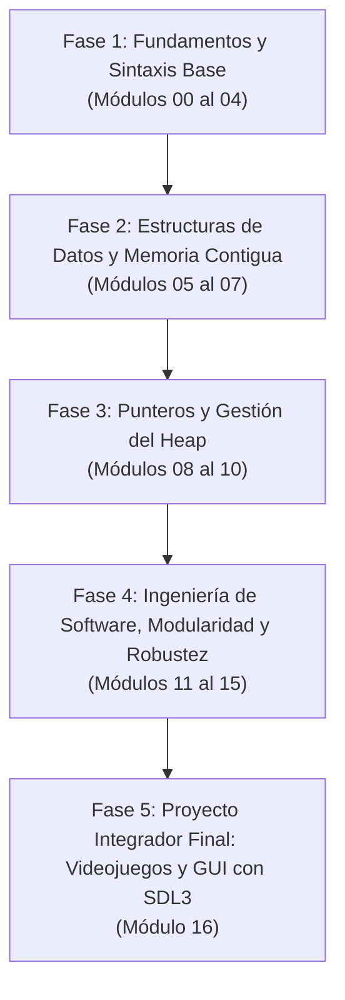

# Módulos de Basic-C-Without-Tears

Bienvenido al núcleo de **Basic-C-Without-Tears**. Si vienes de lenguajes de alto nivel como Python, JavaScript o Java, programar en C puede parecer intimidante al principio: no existe un recolector de basura (*garbage collector*) que limpie por ti, los tipos de datos no son mágicos y la memoria exige respeto absoluto.

Sin embargo, dominar C te otorga el superpoder de comprender qué ocurre realmente en el procesador y en la memoria RAM de tu máquina. Este plan de está compuesto por **17 módulos progresivos (del 00 al 16)**, estructurados para llevarte paso a paso desde tu primer binario ejecutable hasta el desarrollo de un videojuego 2D completo acelerado por hardware.

---

## Fases de la Ruta de Aprendizaje

---

## Tabla Resumen de Módulos

| Módulo | Título | Temas Clave | Enlace |
| :---: | :--- | :--- | :---: |
| **00** | **Introducción** | Filosofía de C, compilación vs. interpretación, GCC, Hello World. | [Ver Módulo](./00_Introduccion/README.md) |
| **01** | **Tipos y Variables** | Tipos primitivos, modificadores (`unsigned`, `long`), `sizeof`, constantes. | [Ver Módulo](./01_Tipos_y_Variables/README.md) |
| **02** | **Input y Output** | Entrada y salida estándar, `printf`, `scanf`, especificadores de formato, buffers. | [Ver Módulo](./02_Input_Output/README.md) |
| **03** | **Control de Flujo** | Condicionales (`if`/`else`, `switch`), bucles (`for`, `while`, `do-while`), saltos. | [Ver Módulo](./03_Control_de_Flujo/README.md) |
| **04** | **Funciones** | Modularidad, paso por valor, prototipos, ámbito de variables, recursividad. | [Ver Módulo](./04_Funciones/README.md) |
| **05** | **Arreglos y Matrices** | Memoria contigua, vectores unidimensionales, matrices multidimensionales. | [Ver Módulo](./05_Arreglos_y_Matrices/README.md) |
| **06** | **Strings** | Cadenas terminadas en nulo (`\0`), manipulación en memoria, biblioteca `string.h`. | [Ver Módulo](./06_Strings/README.md) |
| **07** | **Structs y Unions** | Modelado de datos complejos, estructuras, uniones, enums, padding y alineación. | [Ver Módulo](./07_Structs_y_Unions/README.md) |
| **08** | **Punteros** | Direcciones de memoria, operador `*` y `&`, aritmética de punteros, punteros dobles. | [Ver Módulo](./08_Punteros/README.md) |
| **09** | **Memoria Dinámica** | Asignación en el Heap: `malloc`, `calloc`, `realloc`, `free`, prevención de leaks. | [Ver Módulo](./09_Memoria_Dinamica/README.md) |
| **10** | **Manejo de Archivos** | Persistencia en disco, streams `FILE*`, modos de apertura, lectura y escritura. | [Ver Módulo](./10_Archivos/README.md) |
| **11** | **Modularidad y Headers** | División en múltiples `.c` y `.h`, guardas de inclusión `#ifndef`, proceso de linking. | [Ver Módulo](./11_Modularidad_y_Headers/README.md) |
| **12** | **Makefiles** | Automatización con GNU Make, reglas, dependencias, variables, targets eficientes. | [Ver Módulo](./12_Makefiles/README.md) |
| **13** | **Manejo de Errores** | Códigos de retorno defensivos, variables globales `errno`, `perror`, `strerror`. | [Ver Módulo](./13_Manejo_de_Errores/README.md) |
| **14** | **Operaciones de Bits** | Nivel de hardware: operadores bit a bit (`&`, `\|`, `^`, `~`, `<<`, `>>`), máscaras binarias. | [Ver Módulo](./14_Operaciones_de_Bits/README.md) |
| **15** | **Debugging** | Caza profesional de fallos, depuración con GDB, detección de fugas con Valgrind. | [Ver Módulo](./15_Debug/README.md) |
| **16** | **GUI y Videojuegos con SDL3** | Proyecto cumbre: videojuego 2D acelerado por GPU, texturas, sonido con SDL3_mixer. | [Ver Módulo](./16_GUI_SDL/README.md) |

---

## Detalle Módulo por Módulo

### [Módulo 00: Introducción](./00_Introduccion/README.md)
¿Crees que C es un dinosaurio? Puede que tenga sus años, pero sigue moviendo el mundo: desde sistemas embebidos y microcontroladores hasta motores gráficos y sistemas operativos como Linux y Windows. Aquí entenderás la diferencia radical entre compilar a código máquina con GCC e interpretar con lenguajes como Python, terminando con tu primer programa estructurado.

### [Módulo 01: Tipos y Variables](./01_Tipos_y_Variables/README.md)
En C no existen los tipos dinámicos automáticos. Aquí asumes el control de cada byte: aprenderás qué son los enteros, caracteres y números en coma flotante, cómo influyen los modificadores (`signed`, `unsigned`, `short`, `long`) y cómo inspeccionar el consumo exacto de memoria con `sizeof`.

### [Módulo 02: Input y Output](./02_Input_Output/README.md)
Tu programa deja de ser una caja negra y comienza a comunicarse con el exterior. Dominarás el formateo de datos con `printf()`, la lectura interactiva desde el teclado con `scanf()` y aprenderás a lidiar con el buffer de entrada estándar (`stdin`) para evitar saltos indeseados.

### [Módulo 03: Control de Flujo](./03_Control_de_Flujo/README.md)
Aprende a dotar de lógica y capacidad de decisión a tus programas. Este módulo profundiza en las bifurcaciones condicionales (`if`, `else if`, `else`, `switch`) y los ciclos iterativos (`for`, `while`, `do-while`), junto a las sentencias de control `break` y `continue`.

### [Módulo 04: Funciones](./04_Funciones/README.md)
Aplica el principio de "divide y vencerás". Aprenderás a diseñar bloques de código reutilizables, la importancia de los prototipos de función para informar al compilador, el paso de parámetros por valor, el ciclo de vida de las variables locales y globales, y la recursividad.

### [Módulo 05: Arreglos y Matrices](./05_Arreglos_y_Matrices/README.md)
Descubre cómo la memoria almacena colecciones ordenadas de datos de forma contigua. Aprenderás a declarar, inicializar y recorrer arreglos unidimensionales (vectores) y matrices bidimensionales (filas y columnas), fundamentales para representar cuadrículas y tableros.

### [Módulo 06: Strings (Cadenas de Texto)](./06_Strings/README.md)
En C, las cadenas de texto no son un tipo de datos primitivo; son arreglos de caracteres sellados por un byte nulo (`\0`). Comprenderás cómo funcionan internamente, los riesgos de desbordamiento de búfer (*buffer overflow*) y el uso seguro de las funciones de `string.h` (`strlen`, `strcpy`, `strcmp`, `strcat`).

### [Módulo 07: Structs y Unions](./07_Structs_y_Unions/README.md)
Pasa de trabajar con variables aisladas a modelar entidades del mundo real. Aprenderás a empaquetar distintos tipos bajo una sola estructura (`struct`), optimizar memoria compartida con uniones (`union`), crear enumeraciones legibles (`enum`) y comprender el alineamiento y *padding* de bytes que aplica el compilador.

### [Módulo 08: Punteros](./08_Punteros/README.md)
El pilar fundamental de C. Desmitificamos la característica más temida y potente del lenguaje: aprenderás qué es una dirección de memoria, cómo usar los operadores `&` (referencia) y `*` (desreferencia), cómo funciona la aritmética de punteros, la equivalencia entre punteros y arreglos, y el paso por referencia.

### [Módulo 09: Memoria Dinámica](./09_Memoria_Dinamica/README.md)
Libérate de los límites de la memoria estática del Stack y aprende a solicitar memoria en tiempo de ejecución en el Heap. Dominarás el uso responsable de `malloc()`, `calloc()`, `realloc()` y la regla de oro: cada byte solicitado debe liberarse con `free()` para evitar fugas de memoria (*memory leaks*).

### [Módulo 10: Manejo de Archivos](./10_Archivos/README.md)
La memoria RAM es volátil; al apagar el equipo se pierde todo. En este módulo aprenderás a persistir información en el disco duro utilizando streams (`FILE*`), abrir archivos en distintos modos (`r`, `w`, `a`, `rb`, `wb`), y leer o escribir tanto en formato de texto plano como en binario puro con `fread()` y `fwrite()`.

### [Módulo 11: Modularidad y Headers](./11_Modularidad_y_Headers/README.md)
Cuando los proyectos crecen, mantener todo en un solo archivo resulta insostenible. Aprenderás a estructurar proyectos profesionales separando las declaraciones públicas en archivos de cabecera (`.h`) y las implementaciones en archivos fuente (`.c`), protegiéndolos contra inclusiones múltiples con directivas `#ifndef`.

### [Módulo 12: Makefiles (Automatización)](./12_Makefiles/README.md)
Compilar manualmente decenas de archivos `.c` en la terminal se vuelve tedioso y propenso a errores. Dominarás **GNU Make**, aprendiendo a escribir `Makefiles` eficientes con objetivos (*targets*), dependencias, variables automáticas (`$@`, `$<`, `$^`) y compilación incremental para compilar únicamente los módulos modificados.

### [Módulo 13: Manejo de Errores](./13_Manejo_de_Errores/README.md)
En sistemas de producción, los fallos no son una posibilidad, sino una certeza. Aprenderás a escribir código defensivo comprobando códigos de retorno, inspeccionando la variable global `errno`, e interpretando mensajes descriptivos del sistema mediante `perror()` y `strerror()`.

### [Módulo 14: Operaciones de Bits](./14_Operaciones_de_Bits/README.md)
El nivel más cercano al hardware. Olvídate de los números abstractos y manipula bits individuales con operadores binarios (`&`, `|`, `^`, `~`, `<<`, `>>`). Aprenderás a crear máscaras de bits, empaquetar banderas booleanas de configuración en un solo entero y optimizar el rendimiento.

### [Módulo 15: Debugging](./15_Debug/README.md)
Aprende a diagnosticar y cazar errores invisibles como un profesional. Dejarás de depender de imprimir cientos de líneas con `printf()` para dominar el depurador estándar **GDB** (puntos de interrupción, inspección de registros, ejecución paso a paso) y la herramienta de análisis de memoria **Valgrind** para certificar cero fugas de memoria.

### [Módulo 16: Interfaz Gráfica y Videojuegos con SDL3](./16_GUI_SDL/README.md)
El proyecto integrador final de todo el curso. Aplicarás todos los conceptos aprendidos (matrices dinámicas en el Heap, estructuras, punteros, modularidad, makefiles y control de errores) para construir un videojuego 2D completo de escape de un laberinto utilizando la moderna biblioteca **SDL3**:
* Aceleración por GPU con `SDL_Renderer` y proyección con `SDL_FRect`.
* Filtrado bilineal antialiasing para gráficos nítidos en 1364 x 988 px.
* Movimiento por cuadrícula con colisiones sólidas contra muros.
* Tipografía en pantalla y cronómetro HUD en tiempo real con `SDL_GetTicks()`.
* Máquina de estados finita (Menú, Jugando, Victoria) con botones sensibles al ratón.
* Rotación dinámica del personaje según la dirección de marcha.
* Audio multicanal con la biblioteca oficial **`SDL3_mixer`** para efectos WAV y música ambiental MP3 en bucle continuo.

---

  <a href="../README.md">⬅️ Inicio del Repositorio</a> | 
  <a href="./00_Introduccion/README.md">Comenzar con el Módulo 00 ➡️</a>

