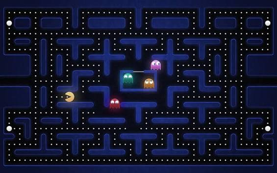
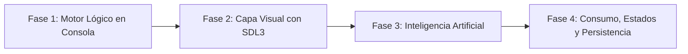

# Pacman

<p align="center">
  
</p>

---

## 1. Why?

En 1980, **Pac-Man** revolucionó la industria del entretenimiento digital. No solo fue un éxito colosal en ventas a nivel mundial, sino que introdujo uno de los primeros sistemas de Inteligencia Artificial en videojuegos: cada uno de los cuatro fantasmas contaba con una "personalidad" y un patrón de persecución/emboscada completamente diferenciado.

Este proyecto no busca que hagas una copia visual idéntica de Pac-Man. Tu protagonista podría ser un virus informático devorando paquetes de datos, un caballero recolectando gemas en una mazmorra o una nave navegando por un campo de asteroides. El objetivo central es **dominar la separación estricta entre modelo de datos y capa de presentación**: aprenderás a serializar y cargar un mundo desde un archivo de texto plano (`.txt`), representarlo en memoria mediante matrices dinámicas y darle vida audiovisual interactiva utilizando la biblioteca **SDL3**, gestionando múltiples entidades autónomas en tiempo real.

---

## 2. Enunciado Formal

Debes desarrollar un videojuego 2D basado en cuadrículas (*Grid-based Engine*). El juego debe cargar la geometría del laberinto desde un archivo externo de configuración. 

El jugador controlará a una entidad principal que recorrerá los pasillos del laberinto recolectando objetos (puntos/monedas) para incrementar su puntuación. Simultáneamente, múltiples enemigos autónomos se desplazarán por el mapa intentando interceptar y atrapar al jugador. Al finalizar la partida (por victoria o derrota), el programa registrará y actualizará de forma persistente los puntajes más altos (*High Scores*) en un archivo binario en disco.

---

## 3. Hitos de Desarrollo Sugeridos

Para asegurar un avance estructurado y evitar bloqueos, se recomienda seguir esta secuencia de desarrollo incremental:



### Fase 1: El Motor Lógico (Modo Consola)
Prescinde de SDL3 en esta primera etapa. Construye un programa en consola que abra un archivo `.txt` con la estructura del mapa, asigne dinámicamente una matriz bidimensional (`char **`) con `malloc` y cargue los caracteres en memoria. Imprime la matriz en la terminal con `printf` para verificar que la lectura de filas y columnas sea exacta.

### Fase 2: El Salto Visual (Integración de SDL3)
Integra la biblioteca SDL3. Diseña el bucle principal de renderizado que recorra la matriz y dibuje primitivas gráficas (rectángulos coloreados o texturas) para diferenciar paredes transitables de pasillos. Agrega a la entidad del jugador y vincula el movimiento con los eventos de teclado (`SDL_EVENT_KEY_DOWN`), validando matemáticamente que la celda de destino no sea un muro antes de permitir el desplazamiento.

### Fase 3: Inteligencia Artificial (Entidades Enemigas)
Introduce a los enemigos en el juego. Haz que actualicen su posición automáticamente cada cierto intervalo de fotogramas o tiempo acumulado. Comienza implementando una toma de decisiones aleatoria entre direcciones transitables válidas y luego evoluciona hacia patrones de persecución directa comparando distancias Manhattan o euclidianas respecto a la posición del jugador.

### Fase 4: Consumo, Estados y Persistencia
Implementa la lógica de colisión entre el jugador y los puntos del mapa: al ingresar a una celda con un punto, este debe eliminarse de la matriz y el marcador debe incrementarse. Define las condiciones de victoria (cuando no queden puntos en el mapa) y de derrota (cuando un enemigo ocupe la misma celda del jugador). Al concluir la sesión, guarda el récord en un archivo binario estructurado.

---

## 4. Consideraciones Técnicas y Paradigmas

* **Movimiento Anclado a Cuadrícula (Grid-based)**: Para simplificar el motor físico, tanto el mapa como las coordenadas lógicas de las entidades deben coincidir con celdas enteras de la matriz (por ejemplo, cada casilla mide $32 \times 32$ píxeles en pantalla). Las entidades se desplazan de casilla en casilla.
* **Máquinas de Estado**: Utiliza tipos enumerados (`enum`) para gestionar de forma explícita y limpia:
  - Los estados globales del juego (`ESTADO_MENU`, `ESTADO_JUGANDO`, `ESTADO_PAUSA`, `ESTADO_VICTORIA`, `ESTADO_GAMEOVER`).
  - Los estados de comportamiento de los enemigos (`PATRULLA`, `PERSECUCION`, `HUIDA`).
* **Gestión Rigurosa de Memoria**: Si el mapa posee dimensiones variables ($F \times C$), debes asignar la matriz dinámica en el Heap con `malloc`/`calloc`. Al cerrar el programa, es obligatorio liberar cada fila y el puntero principal con `free` para prevenir fugas de memoria.
* **Compilación Automatizada con Makefile**: Todo el proyecto debe compilarse utilizando la herramienta `make`. Debes incluir un archivo `Makefile` en la raíz del proyecto que automatice la construcción de los módulos `.c`, la inclusión de librerías (`-lSDL3`) y la limpieza de binarios.

  Ejemplo sugerido de `Makefile`:
  ```makefile
  CC = gcc
  CFLAGS = -Wall -Wextra -std=c11 -Iinclude
  LDFLAGS = -lSDL3

  SRCS = src/main.c src/mapa.c src/jugador.c src/enemigo.c
  OBJS = $(SRCS:.c=.o)
  TARGET = pacman

  all: $(TARGET)

  $(TARGET): $(OBJS)
  	$(CC) $(OBJS) -o $(TARGET) $(LDFLAGS)

  %.o: %.c
  	$(CC) $(CFLAGS) -c $< -o $@

  run: $(TARGET)
  	./$(TARGET)

  clean:
  	rm -f $(OBJS) $(TARGET)

  .PHONY: all run clean
  ```

---

## 5. Arquitectura de Datos y Persistencia

### Formato del Archivo de Mapa (`mapa.txt`)
El diseño del nivel se define mediante un archivo plano de caracteres. Por ejemplo:

```plaintext
#######
#.....#
#.###.#
#P...E#
#######
```
* `#`: Muro o pared sólida (intransitable).
* `.`: Punto / moneda recolectable.
* `P`: Posición inicial de spawn del Jugador.
* `E`: Posición inicial de spawn del Enemigo.
* ` ` (espacio): Pasillo vacío transitable.

### Modelado de Estructuras en C
Para mantener una arquitectura limpia y desacoplada, se sugiere modelar las entidades de la siguiente manera:

```c
#include <stdbool.h>
#include <SDL3/SDL.h>

// Estados de la maquina de comportamiento del enemigo
typedef enum {
    ESTADO_PATRULLA,
    ESTADO_PERSECUCION,
    ESTADO_HUIDA
} EstadoEnemigo;

// Direcciones de movimiento cardinal
typedef enum {
    DIR_NINGUNA = 0,
    DIR_ARRIBA,
    DIR_ABAJO,
    DIR_IZQUIERDA,
    DIR_DERECHA
} Direccion;

// Estructura representativa del jugador
typedef struct {
    int x, y;             // Coordenadas logicas en la matriz
    int vidas;            // Vidas restantes
    int puntaje;          // Puntos acumulados
    Direccion direccion;  // Direccion de avance
    bool estaVivo;
} Jugador;

// Estructura representativa del enemigo / fantasma
typedef struct {
    int x, y;                 // Coordenadas logicas en la matriz
    EstadoEnemigo estado;     // Estado de IA actual
    Direccion direccionActual;// Direccion de movimiento
    int velocidadMs;          // Intervalo de paso en milisegundos
    Uint64 ultimoPasoMs;      // Timestamp del ultimo movimiento
} Enemigo;

// Estructura del mapa dinamico
typedef struct {
    int filas;
    int columnas;
    char **celdas;            // Matriz dinamica de caracteres
} Mapa;

// Estructura para el registro de High Scores
typedef struct {
    char iniciales[4];        // Ejemplo: "AAA" + '\0'
    int puntaje;
} RegistroRecord;
```

### Persistencia de High Scores (`highscores.dat`)
Para registrar las mejores puntuaciones, guarda un arreglo de tamaño fijo (ej. el Top 5) en un archivo binario mediante `fwrite` y `fread`. Si el archivo no existe al iniciar, el juego debe inicializarlo con registros por defecto sin generar errores.

---

## 6. Recomendaciones de Flujo y UI (SDL3)

* **Independencia de Fotogramas (Delta Time / Timers)**: En SDL3 el ciclo de refresco puede superar los cientos de fotogramas por segundo. Utiliza marcas de tiempo con `SDL_GetTicks()` para asegurar que las entidades se muevan a intervalos regulares (por ejemplo, un paso cada $250\text{ ms}$), independientemente de la tasa de FPS de la pantalla.
* **Separación de Lógica y Renderizado**: 
  - La función `actualizarJuego()` debe encargarse exclusivamente de modificar las variables de estado y coordenadas lógicas.
  - La función `renderizarJuego()` debe limitarse a consultar dichas variables y dibujar en pantalla con `SDL_RenderFillRect()` o `SDL_RenderTexture()`. ¡Nunca modifiques la lógica dentro de la rutina de dibujado!
* **Feedback Visual Inmediato**: Si un enemigo cambia de estado (por ejemplo, a modo `HUIDA`), altera su color de dibujado con `SDL_SetRenderDrawColor()` para comunicar inmediatamente al jugador que las reglas de interacción han cambiado.

---

## 7. Casos Borde y Manejo de Errores

* **Archivo Inexistente o Corrupto**: Si `mapa.txt` no se encuentra en el directorio de ejecución o posee filas con longitudes inconsistentes, el programa debe capturar el error, emitir un mensaje descriptivo en consola o ventana y finalizar limpiamente liberando cualquier recurso previo.
* **Atascos Geométricos en IA**: Si un enemigo queda atrapado en un pasillo sin salida (forma de "U" con paredes en 3 lados), su algoritmo debe permitirle dar la vuelta $180^\circ$ en lugar de colisionar infinitamente contra el muro frontal.
* **Validación de Límites de Matriz (*Out of Bounds*)**: Antes de evaluar `mapa->celdas[y][x]`, verifica de forma estricta que $0 \le x < \text{columnas}$ y $0 \le y < \text{filas}$ para evitar accesos fuera de rango y violaciones de segmento (*Segmentation Fault*).

---

## 8. Verificadores de Funcionamiento (Checklist)

Tu proyecto se considerará completo y aprobado cuando cumpla con los siguientes criterios:

- [ ] **Compilación Automatizada**: El proyecto incluye un archivo `Makefile` funcional con reglas para compilar (`make`), ejecutar (`make run`) y limpiar binarios (`make clean`).
- [ ] **Carga Dinámica**: El mapa no está prefijado en el código fuente; se lee y construye dinámicamente desde un archivo `.txt` externo.
- [ ] **Colisiones Sólidas**: El jugador puede navegar fluidamente por los pasillos sin atravesar las paredes.
- [ ] **Enemigos Autónomos**: Existen al menos 2 enemigos que patrullan y toman decisiones de movimiento sin violar las restricciones del mapa.
- [ ] **Mecánica de Recolección**: El puntaje aumenta al colisionar con los puntos del laberinto, y los ítems recolectados desaparecen de la matriz.
- [ ] **Condiciones de Fin de Partida**: El juego detecta automáticamente la condición de Victoria (recolección total de puntos) y de Derrota (colisión contra un enemigo).
- [ ] **Persistencia Funcional**: La tabla de récords se almacena en disco en un archivo binario y persiste entre distintas ejecuciones del programa.

---

## 9. Desafíos Opcionales (Bonus)

Si deseas llevar tu proyecto al siguiente nivel técnico, implementa una de las siguientes características avanzadas:

1. **Pathfinding Inteligente (Algoritmo BFS / A*)**: Sustituye el movimiento heurístico simple de los enemigos por un algoritmo de búsqueda en grafos como **Breadth-First Search (BFS)** o **A***, permitiendo que los enemigos calculen y sigan en tiempo real la ruta más corta exacta hacia el jugador.
2. **Editor de Niveles Integrado**: Incorpora un modo de edición accesible desde el menú principal que permita usar el ratón para pintar casillas vacías, colocar muros, posicionar al jugador y exportar directamente el mapa resultante a un nuevo archivo `.txt`.
3. **Musica**: Agrega música en distintos lugares del juego.
