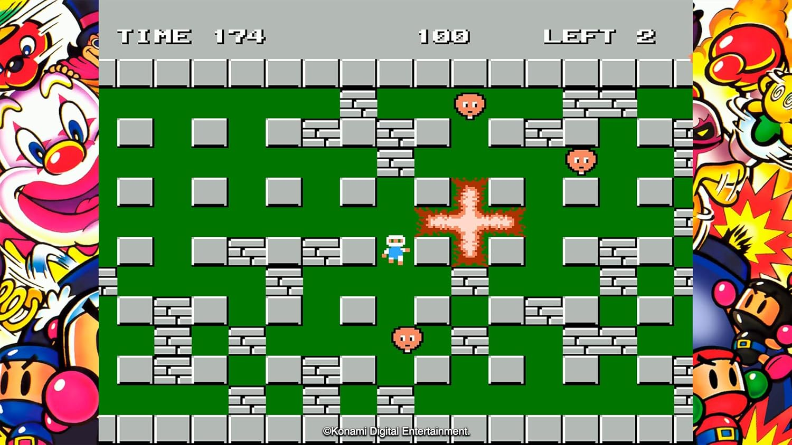
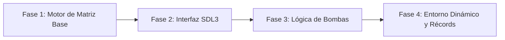

# Bomberman

<p align="center">
  
</p>

---

## 1. Why?

Lanzado en 1983, **Bomberman** introdujo una mecánica brillante al género de los laberintos: la alteración dinámica del terreno mediante temporizadores. A diferencia de otros juegos donde el mapa es estático, aquí el jugador tiene el poder de destruir partes del entorno para abrir nuevos caminos o atrapar enemigos.

Este proyecto te enfrentará a un desafío técnico fundamental en la programación de videojuegos: la **gestión de eventos asíncronos y temporizadores múltiples**. Aprenderás a manejar acciones que no ocurren de inmediato (como dejar una bomba y esperar a que explote), a calcular áreas de efecto (el rango de la explosión en cruz) y a actualizar la matriz del mapa en tiempo real, todo mientras la biblioteca **SDL3** mantiene el juego corriendo a un framerate fluido.

---

## 2. Enunciado Formal

Debes desarrollar un videojuego 2D basado en cuadrículas (*Grid-based Engine*). El juego cargará un mapa desde un archivo de configuración externo, el cual contendrá bloques indestructibles, bloques destructibles y pasillos vacíos.

El jugador controlará a un personaje capaz de moverse por las celdas vacías y colocar bombas. Las bombas deben detonar tras un tiempo determinado, destruyendo los bloques frágiles en su radio de explosión (en forma de cruz) y eliminando a los enemigos atrapados en el fuego. El objetivo es despejar el nivel o sumar la mayor cantidad de puntos antes de perder todas las vidas. Al finalizar, el programa debe registrar las mejores puntuaciones de forma persistente en un archivo binario.

---

## 3. Hitos de Desarrollo Sugeridos

Para evitar abrumarte con todas las mecánicas a la vez, sigue esta progresión de desarrollo:



### Fase 1: Motor de Matriz Base (Modo Consola)
Inicia sin gráficos. Lee el archivo `.txt` del mapa usando `malloc` para alojar la matriz dinámica (`char **`). Imprime la matriz en consola y programa el movimiento del jugador, asegurándote de que no pueda atravesar ni los muros sólidos ni los bloques destructibles.

### Fase 2: Interfaz SDL3 (El Salto Visual)
Conecta tu lógica con SDL3. Dibuja la cuadrícula usando diferentes colores o texturas para los muros, los bloques frágiles y el jugador. Vincula el movimiento a los eventos del teclado (`SDL_EVENT_KEY_DOWN`), manteniendo el movimiento bloque a bloque (anclado a la cuadrícula).

### Fase 3: Lógica de Bombas y Temporizadores
Este es el núcleo del juego. Implementa la acción de colocar una bomba en la coordenada actual del jugador. Utiliza `SDL_GetTicks()` para registrar el momento en que se plantó y verifica en el bucle principal si ya pasaron los milisegundos necesarios para detonar. Implementa la explosión calculando la cruz de impacto en la matriz.

### Fase 4: Entorno Dinámico, Enemigos y Récords
Haz que la explosión reemplace los caracteres de bloques destructibles en tu matriz por espacios vacíos. Agrega enemigos con movimiento básico y detecta si la explosión los alcanza. Finalmente, implementa las condiciones de victoria/derrota y guarda el puntaje en un archivo binario.

---

## 4. Consideraciones Técnicas y Paradigmas

* **Eventos Asíncronos (Temporizadores)**: Las bombas no detienen la ejecución del programa. Debes almacenar el timestamp de creación de cada bomba y, en cada iteración del game loop, comprobar si `(tiempoActual - tiempoCreacion) >= tiempoDetonacion`.
* **Cálculo de Área de Efecto (AoE)**: Al explotar una bomba, el algoritmo debe iterar hacia arriba, abajo, izquierda y derecha desde el epicentro. La propagación debe detenerse si encuentra un muro indestructible (`#`), pero debe destruir (y luego detenerse en) el primer muro destructible (`+`) que encuentre en cada dirección.
* **Gestión Rigurosa de Memoria**: Además de la matriz del mapa, si permites poner múltiples bombas, podrías necesitar un arreglo dinámico o una lista enlazada para gestionarlas. Todo debe ser liberado con `free` al salir.
* **Compilación Automatizada con Makefile**: Utiliza un Makefile para automatizar la compilación con `gcc`, vinculando correctamente `-lSDL3`.

  Ejemplo sugerido de `Makefile`:
  ```makefile
  CC = gcc
  CFLAGS = -Wall -Wextra -std=c11 -Iinclude
  LDFLAGS = -lSDL3

  SRCS = src/main.c src/mapa.c src/jugador.c src/bombas.c
  OBJS = $(SRCS:.c=.o)
  TARGET = bomberman

  all: $(TARGET)

  $(TARGET): $(OBJS)
  	$(CC) $(OBJS) -o $(TARGET) $(LDFLAGS)

  %.o: %.c
  	$(CC) $(CFLAGS) -c $< -o $@

  run: $(TARGET)
  	./$(TARGET)

  clean:
  	rm -f $(OBJS) $(TARGET)

  .PHONY: all run clean
  ```

---

## 5. Arquitectura de Datos y Persistencia

### Formato del Archivo de Mapa (`mapa.txt`)
El diseño se basa en caracteres. Los laberintos de Bomberman suelen tener muros fijos intercalados:

```plaintext
#######
#P++..#
#.#+#.#
#+++E+#
#######
```
* `#`: Muro sólido (Indestructible).
* `+`: Bloque frágil (Destructible con bombas).
* `P`: Posición inicial del Jugador.
* `E`: Posición de un Enemigo.
* `.` o ` ` (espacio): Pasillo vacío transitable.

### Modelado de Estructuras en C
Una arquitectura limpia requiere separar los componentes claramente:

```c
#include <stdbool.h>
#include <SDL3/SDL.h>

// Estados de la bomba
typedef enum {
    BOMBA_INACTIVA,
    BOMBA_PLANTADA,
    BOMBA_EXPLOTANDO
} EstadoBomba;

// Estructura de la Bomba
typedef struct {
    int x, y;             // Coordenadas en la matriz
    EstadoBomba estado;
    Uint64 tiempoPlantada;// Timestamp de creación
    int radio;            // Alcance de la explosión (ej. 1 casilla)
} Bomba;

// Estructura del Jugador
typedef struct {
    int x, y;
    int vidas;
    int puntaje;
    int maxBombas;        // Capacidad simultánea
    bool estaVivo;
} Jugador;

// Estructura del Mapa
typedef struct {
    int filas;
    int columnas;
    char **celdas;
} Mapa;

// Estructura para el registro de High Scores
typedef struct {
    char iniciales[4];    // "AAA" + '\0'
    int puntaje;
} RegistroRecord;
```

### Persistencia de High Scores (`highscores.dat`)
Almacena un arreglo con los 5 mejores puntajes usando `fwrite` y cárgalo con `fread`. Maneja con gracia el caso en que el archivo aún no exista creando registros vacíos (0 puntos).

---

## 6. Recomendaciones de Flujo y UI (SDL3)

* **Independencia de Fotogramas**: Desacopla la lógica del renderizado. Que tu ciclo `while` principal gestione los eventos (`SDL_PollEvent`), actualice estados lógicos (como los temporizadores de las bombas) y luego dibuje todo de una pasada.
* **Feedback de la Explosión**: Cuando una bomba detone, mantén un estado `BOMBA_EXPLOTANDO` durante unos breves milisegundos (ej. 300 ms). Dibuja la explosión visualmente (rectángulos naranjas/rojos) en ese lapso para que el jugador perciba qué área fue afectada antes de volver a dejar la casilla libre.
* **Prevención de Suicidios Lógicos**: Permite que el jugador pueda "estar" en la misma casilla de la bomba recién plantada para que pueda escapar de ella, pero si la abandona, vuelve a considerarla un obstáculo sólido.

---

## 7. Casos Borde y Manejo de Errores

* **Explosiones Fuera de Límites (*Out of Bounds*)**: Al calcular la cruz de fuego, verifica rigurosamente que $x$ e $y$ están dentro de $0 \le x < \text{columnas}$ y $0 \le y < \text{filas}$. Una explosión no debe intentar acceder a `mapa->celdas[-1][0]`.
* **Carga de Archivos Fallida**: Si falta `mapa.txt` o las filas tienen distintos tamaños, finaliza con un mensaje en la salida de error estándar (`fprintf(stderr, ...)`) y libera la memoria ya alojada para evitar leaks.
* **Colapso de Temporizadores**: Asegúrate de manejar correctamente el momento en que una bomba explota, liberando esa entidad o reseteando su estructura para que pueda ser reutilizada, previniendo que el juego se ralentice por acumular cálculos de eventos finalizados.

---

## 8. Verificadores de Funcionamiento (Checklist)

Para que el proyecto se considere exitoso, debes cumplir con:

- [ ] **Compilación Automatizada**: El Makefile funciona para generar y limpiar los ejecutables sin errores.
- [ ] **Entorno Dinámico**: El mapa carga desde `.txt`. El jugador no traspasa muros `#` ni bloques `+`.
- [ ] **Mecánica Base**: El jugador puede colocar al menos una bomba, y esta explota de forma autónoma después de un par de segundos.
- [ ] **Interacción de Sistemas**: La explosión destruye los bloques `+` (transformándolos en pasillos vacíos).
- [ ] **Área de Efecto Limitada**: La explosión es detenida por muros sólidos `#` y no destruye lo que está detrás de ellos.
- [ ] **Condiciones de Partida**: Si el jugador es tocado por un enemigo o por el área de una explosión, pierde.
- [ ] **Persistencia Binaria**: Los puntajes más altos sobreviven al reinicio de la aplicación.

---

## 9. Desafíos Opcionales (Bonus)

¿Buscas destacar? Intenta incorporar estas características avanzadas:

1. **Reacciones en Cadena (*Chain Explosions*)**: Si la onda expansiva de una bomba golpea a otra bomba que aún no ha detonado, esta última debe explotar inmediatamente, creando una reacción en cadena.
2. **Sistema de Power-Ups**: Al destruir bloques frágiles, existe una probabilidad (ej. 20%) de que aparezca un ítem en esa celda. Diseña al menos dos: uno que aumente el radio de explosión de las bombas, y otro que permita plantar más bombas simultáneas.
3. **Múltiples Mapas Dinámicos**: En lugar de cargar un solo nivel, lee un índice de niveles o detecta automáticamente múltiples archivos `.txt`. Cuando el jugador elimine a todos los enemigos, se abre una "puerta" oculta bajo un bloque destructible que lo lleva al siguiente nivel.

