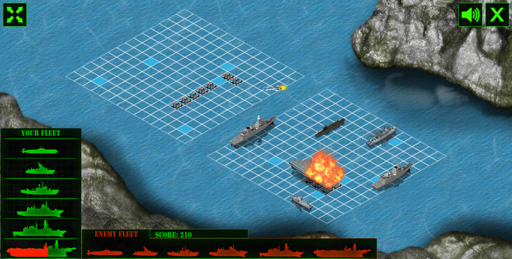
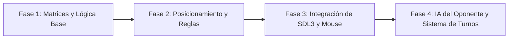

# Battleship (Batalla Naval)

<p align="center">
  
</p>

---

## 1. Why?

Con orígenes que se remontan a los juegos de lápiz y papel previos a la Primera Guerra Mundial, **Batalla Naval (Battleship)** es el clásico definitivo de deducción y estrategia por turnos. A nivel de programación, este proyecto representa un cambio de paradigma fundamental respecto a los juegos de acción en tiempo real: el desafío ya no es la velocidad de reacción del game loop, sino el **ocultamiento de información (*Data Hiding*)**, el **mapeo de coordenadas espaciales** y la **gestión de estados discretos**.

En este proyecto aprenderás a manejar múltiples matrices simultáneas (lo que tú ves vs. lo que el enemigo ve), a procesar eventos de ratón (*mouse clicks*) transformando píxeles de la pantalla en índices de un arreglo bidimensional, y a diseñar una Inteligencia Artificial que no dependa del movimiento físico, sino de la probabilidad y la memoria a corto plazo.

---

## 2. Enunciado Formal

Debes desarrollar un videojuego de estrategia por turnos en 2D. El juego consistirá en dos fases principales: una fase de preparación, donde el jugador posicionará su flota de barcos (de distintos tamaños) en una cuadrícula, y una fase de combate, donde el jugador y la CPU (o un segundo jugador) se turnarán para "disparar" a las coordenadas de la cuadrícula rival.

El programa debe mantener el estado oculto de los barcos enemigos y solo revelar si un disparo fue "Agua" o "Impacto". Un barco se considera "Hundido" cuando todas sus casillas han recibido impactos. El primer jugador en hundir la flota completa del oponente gana la partida. Al finalizar, el programa registrará las victorias y derrotas en un archivo binario para llevar un historial persistente del jugador.

---

## 3. Hitos de Desarrollo Sugeridos

Dado que es un juego por turnos con dos fases muy marcadas, te recomendamos el siguiente flujo de trabajo:



### Fase 1: Matrices y Lógica Base (Modo Consola)
Comienza modelando el tablero en la terminal. Crea dos matrices de $10 \times 10$ para el jugador (una para sus barcos, otra para registrar sus disparos) y dos para la CPU. Implementa una función que imprima el tablero en consola usando caracteres (`~` para agua, `B` para barco, `X` para impacto, `O` para fallo).

### Fase 2: Posicionamiento y Reglas
Programa la lógica para colocar barcos (horizontal o verticalmente). Escribe las funciones de validación que aseguren que un barco de tamaño $N$ no se salga de los límites de la matriz ni se superponga con un barco previamente colocado. Prueba esta fase ingresando coordenadas manualmente por teclado (`A5`, `C3`, etc.).

### Fase 3: Integración de SDL3 y Mouse
Lleva el juego al entorno gráfico. Dibuja las cuadrículas utilizando `SDL_RenderRect()`. Aquí entra el reto principal: capturar el evento `SDL_EVENT_MOUSE_BUTTON_DOWN` y traducir las coordenadas $(X, Y)$ del clic en píxeles a las coordenadas $(Fila, Columna)$ de tu matriz en C.

### Fase 4: IA del Oponente, Turnos y Persistencia
Implementa la máquina de estados que alterne el turno entre el Jugador y la CPU. Crea una lógica básica para que la CPU dispare aleatoriamente, validando que no dispare dos veces a la misma casilla. Finalmente, añade la detección de "Juego Terminado" y guarda el historial de victorias en un archivo binario.

---

## 4. Consideraciones Técnicas y Paradigmas

* **Transformación Espacial (Mouse a Matriz)**: Si tu tablero empieza en el píxel `offsetX` y cada celda mide `cellSize`, la fórmula para saber a qué columna hizo clic el usuario es una simple división entera: `columna = (mouseX - offsetX) / cellSize`.
* **Separación del Estado del Juego**: A diferencia de Pac-Man, aquí la información es asimétrica. Una celda en el tablero enemigo puede contener un barco en la lógica de datos, pero en la capa de presentación (UI) debe renderizarse como "Agua" hasta que reciba un impacto.
* **Validación de Entradas (Input Sanitization)**: En juegos por turnos impulsados por clics, es vital ignorar los clics que ocurren fuera del área válida del tablero, o los clics realizados mientras es el turno de la CPU.
* **Compilación Automatizada con Makefile**: Como en proyectos anteriores, mantén la disciplina de usar `make`.

  Ejemplo sugerido de `Makefile`:
  ```makefile
  CC = gcc
  CFLAGS = -Wall -Wextra -std=c11 -Iinclude
  LDFLAGS = -lSDL3

  SRCS = src/main.c src/tablero.c src/logica.c src/ia.c
  OBJS = $(SRCS:.c=.o)
  TARGET = battleship

  all: $(TARGET)

  $(TARGET): $(OBJS)
  	$(CC) $(OBJS) -o $(TARGET) $(LDFLAGS)

  %.o: %.c
  	$(CC) $(CFLAGS) -c $< -o $@

  clean:
  	rm -f $(OBJS) $(TARGET)

  .PHONY: all clean
  ```

---

## 5. Arquitectura de Datos y Persistencia

### Modelado de Estructuras en C
Para manejar la dualidad de la información y el estado de cada casilla, utiliza enumeraciones que den semántica a tus datos:

```c
#include <stdbool.h>

// Estados posibles de una celda
typedef enum {
    ESTADO_AGUA,
    ESTADO_BARCO,
    ESTADO_IMPACTO, // Disparo acertado a un barco
    ESTADO_FALLO    // Disparo al agua
} EstadoCelda;

// Orientacion para la fase de colocacion
typedef enum {
    HORIZONTAL,
    VERTICAL
} Orientacion;

// Estructura de un Barco
typedef struct {
    int tamano;
    int impactosRecibidos;
    bool estaHundido;
} Barco;

// Estructura del Tablero
typedef struct {
    int filas;
    int columnas;
    EstadoCelda **celdas;       // Matriz dinamica
    Barco *flota;               // Arreglo de barcos colocados
    int barcosRestantes;
} Tablero;

// Estructura del Jugador
typedef struct {
    char nombre[20];
    Tablero tableroPropio;      // Donde estan sus barcos
    Tablero tableroRastreo;     // Donde marca sus disparos al enemigo
    bool esHumano;
} Jugador;

// Registro estadístico
typedef struct {
    int partidasJugadas;
    int victorias;
    int derrotas;
} RegistroEstadistico;
```

### Persistencia de Estadísticas (`estadisticas.dat`)
No hay "High Score" tradicional aquí. Usa un archivo binario para guardar la estructura `RegistroEstadistico`. Cada vez que termina una partida, lee el registro actual con `fread`, suma 1 a partidas jugadas y a la victoria/derrota correspondiente, y vuelve a sobrescribir con `fwrite`.

---

## 6. Recomendaciones de Flujo y UI (SDL3)

* **Feedback Visual Diferenciado**: Utiliza una paleta de colores clara. Por ejemplo:
  - **Azul oscuro**: Agua inexplorada.
  - **Gris / Plata**: Tus barcos (fase de colocación).
  - **Blanco / Celeste claro**: Disparo fallado.
  - **Rojo**: Impacto exitoso.
  - **Rojo oscuro / Negro**: Barco completamente hundido.
* **Diseño de Pantalla Dividida**: Divide tu ventana en dos mitades:
  - **Izquierda**: el tablero del jugador (donde ve sus barcos y dónde le dispara la CPU).
  - **Derecha**: el tablero de rastreo (donde el jugador hace clic para atacar a la CPU).
* **Gestión de Turnos Visual**: Cuando sea el turno de la CPU, puedes usar un retraso intencional (`SDL_Delay` o acumulación de ticks) de $1$ o $2$ segundos antes de que la CPU dispare. Esto le da peso y suspenso al juego; si la CPU dispara en $1\text{ ms}$, la experiencia resulta muy confusa para el jugador humano.

---

## 7. Casos Borde y Manejo de Errores

* **Superposición (*Overlapping*) y Límites**: Al colocar un barco de tamaño 4 en la coordenada $(8, 8)$ hacia la derecha en un tablero de $10 \times 10$, el barco intentará ocupar las columnas 8, 9, 10 y 11. Esto causaría un desbordamiento de búfer. Tu función `esPosicionValida()` debe retornar `false` antes de intentar escribir en la matriz.
* **Disparos Redundantes**: Si el jugador hace clic en una celda que ya está en estado `ESTADO_IMPACTO` o `ESTADO_FALLO`, el evento debe ser ignorado completamente (no se consume el turno ni se penaliza).
* **Fugas de Memoria en Matrices Múltiples**: Tienes al menos 4 matrices bidimensionales dinámicas (dos por cada jugador). Asegúrate de tener una función `liberarTablero(Tablero *t)` robusta al cerrar el juego.

---

## 8. Verificadores de Funcionamiento (Checklist)

El proyecto se considerará completo y aprobado si cumple con:

- [ ] **Compilación Automatizada**: El Makefile construye el proyecto sin advertencias (*warnings*).
- [ ] **Validación de Posicionamiento**: El juego impide colocar barcos superpuestos o fuera de los límites de la cuadrícula.
- [ ] **Interacción por Mouse**: Los clics en pantalla se traducen de forma precisa a coordenadas del tablero lógico.
- [ ] **Ocultamiento de Datos**: El tablero enemigo no muestra sus barcos hasta que son impactados.
- [ ] **Lógica de Combate**: El juego registra correctamente los aciertos, los fallos, y detecta cuando un barco específico ha sido hundido por completo.
- [ ] **Condición de Victoria**: El juego termina correctamente cuando un jugador hunde el $100\%$ de la flota rival.
- [ ] **Persistencia**: Las victorias y derrotas se guardan en disco y se recuperan al abrir el juego nuevamente.

---

## 9. Desafíos Opcionales (Bonus)

Si quieres llevar tus habilidades algorítmicas y de arquitectura al límite, intenta estas mejoras:

1. **IA "Search & Destroy" (Algoritmo de Caza)**: Mejora la CPU. Cuando acierte un disparo aleatorio, debe cambiar al estado "Destrucción", disparando solo a las casillas adyacentes (arriba, abajo, izquierda, derecha) al impacto hasta hundir el barco completo, para luego volver a disparar aleatoriamente.
2. **Animaciones y Partículas**: En lugar de que el color cambie instantáneamente, utiliza SDL3 para renderizar una secuencia de sprites de una explosión o de un chapuzón de agua cuando ocurre un disparo.
3. **Multijugador en Red (Sockets TCP)**: Sustituye a la CPU por otro cliente. Utiliza la librería `<sys/socket.h>` para que dos instancias del juego se conecten a través de la red local, enviándose mutuamente coordenadas $(x, y)$ a través de la red. (Este es un excelente puente hacia sistemas distribuidos).

