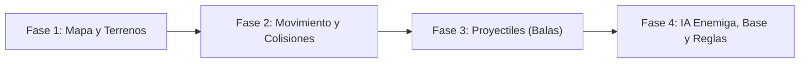

# Battle City

<p align="center">
  
</p>

---

## 1. Why?

Lanzado en 1985 para la Famicom/NES, **Battle City** definió el estándar de los juegos de combate de tanques en vista cenital y popularizó la mecánica de "defensa de la base" (el icónico Águila). A nivel arquitectónico, este título da un paso gigantesco en complejidad respecto a juegos como Pac-Man o Bomberman por un factor crucial: la **gestión de múltiples proyectiles simultáneos** y la **detección de colisiones dinámicas continuas**.

Este proyecto te enseñará a implementar el patrón de **Object Pooling** (piscina de objetos) para gestionar el ciclo de vida de las balas de forma eficiente sin saturar la memoria. Además, te obligará a dominar las cajas de colisión (**AABB** - *Axis-Aligned Bounding Boxes*) y a programar un sistema de renderizado con "capas" (*Z-index*), ya que los tanques pueden ocultarse debajo de la maleza, pero no pueden atravesar el agua.

---

## 2. Enunciado Formal

Debes desarrollar un videojuego de acción y estrategia 2D basado en un mapa de baldosas (*Tile-based*). El jugador controlará un tanque que puede moverse en cuatro direcciones y disparar proyectiles. El mapa, cargado desde un archivo de texto, contendrá distintos tipos de terreno: ladrillos (destruibles), acero (indestructibles), agua (bloquea el paso pero no los disparos) y maleza (oculta a las unidades).

El objetivo principal es doble: destruir a todos los tanques enemigos que aparecen periódicamente en el mapa y, de manera crítica, proteger la Base Aliada ubicada en la parte inferior. Si el jugador pierde todas sus vidas, o si cualquier proyectil (enemigo o aliado) destruye la Base, la partida termina inmediatamente. Al finalizar, se registrará el puntaje máximo (*High Score*) en un archivo binario.

---

## 3. Hitos de Desarrollo Sugeridos

Dada la cantidad de elementos móviles, es vital construir el motor por capas:



### Fase 1: Mapa y Múltiples Terrenos
Comienza definiendo la estructura del mapa. Lee el archivo `.txt` y traduce los caracteres a una matriz. Integra SDL3 inmediatamente para renderizar los distintos tipos de bloques con colores o texturas diferentes. Asegúrate de dibujar la base del jugador.

### Fase 2: Movimiento Direccional y Colisiones Físicas
Implementa el tanque del jugador. A diferencia de un movimiento puramente por "saltos" de cuadrícula, aquí el tanque debe poder girar (mirar hacia arriba, abajo, izquierda, derecha) y avanzar de forma fluida. Implementa la lógica que impida que el tanque atraviese paredes de ladrillo, acero o agua.

### Fase 3: El Sistema de Proyectiles
Añade la capacidad de disparar. Crea un arreglo dinámico o fijo de estructuras `Proyectil`. Cuando el jugador presione la tecla de disparo, "instancia" una bala con la posición y dirección del tanque. Actualiza la posición de la bala en cada frame y detecta sus colisiones: si choca contra el acero, la bala desaparece; si choca contra un ladrillo, lo destruye y desaparece.

### Fase 4: IA Enemiga, Defensa de la Base y Persistencia
Crea el sistema de *spawn* (generación) de enemigos. Prográmales una IA básica que los haga avanzar, girar aleatoriamente al chocar y disparar rítmicamente. Finalmente, implementa la colisión más importante: si cualquier bala toca el bloque de la Base Aliada, activa el Game Over. Guarda los puntajes en disco.

---

## 4. Consideraciones Técnicas y Paradigmas

* **Resolución de Colisiones AABB**: Para que el movimiento sea fluido, tu tanque no puede estar anclado a un índice `[fila][columna]` exacto en todo momento. Debes usar coordenadas en píxeles (ej. `float x, y`) y verificar la intersección de rectángulos (`SDL_FRect`) entre el tanque y los bloques del mapa.
* **Pool de Proyectiles**: En lugar de usar `malloc` y `free` cada vez que se dispara y destruye una bala (lo cual fragmenta la memoria y ralentiza el juego), reserva un arreglo fijo al inicio (ej. `Proyectil balas[50]`). Usa una bandera `bool activo` en la estructura para reciclar los espacios inactivos cuando el jugador dispare.
* **Fuego Amigo (*Friendly Fire*)**: Recuerda una regla clásica de Battle City: los proyectiles aliados y enemigos colisionan entre sí en el aire, anulándose mutuamente. Además, el jugador puede destruir su propia base por accidente.
* **Compilación Automatizada con Makefile**:

  Ejemplo sugerido de `Makefile`:
  ```makefile
  CC = gcc
  CFLAGS = -Wall -Wextra -std=c11 -Iinclude
  LDFLAGS = -lSDL3 -lm

  SRCS = src/main.c src/mapa.c src/tanque.c src/balas.c src/colisiones.c
  OBJS = $(SRCS:.c=.o)
  TARGET = battlecity

  all: $(TARGET)

  $(TARGET): $(OBJS)
  	$(CC) $(OBJS) -o $(TARGET) $(LDFLAGS)

  %.o: %.c
  	$(CC) $(CFLAGS) -c $< -o $@

  clean:
  	rm -f $(OBJS) $(TARGET)

  .PHONY: all clean
  ```

---

## 5. Arquitectura de Datos y Persistencia

### Formato del Archivo de Mapa (`nivel1.txt`)
Usa caracteres para definir el campo de batalla:

```plaintext
....................
.##..@@..##..@@..##.
.##..@@..##..@@..##.
.##..##..==..##..##.
.##..##......##..##.
.......##B##........
```
* `.`: Vacío (Transitable).
* `#`: Ladrillo (Destruible, bloquea movimiento y balas).
* `@`: Acero (Indestructible, bloquea movimiento y balas).
* `=`: Agua (Bloquea movimiento, permite balas).
* `~`: Maleza (Transitable, oculta visualmente al tanque).
* `B`: Base Aliada (Águila).

### Modelado de Estructuras en C
```c
#include <stdbool.h>
#include <SDL3/SDL.h>

// Direcciones posibles
typedef enum {
    DIR_ARRIBA,
    DIR_ABAJO,
    DIR_IZQUIERDA,
    DIR_DERECHA
} Direccion;

typedef enum {
    TERRENO_VACIO,
    TERRENO_LADRILLO,
    TERRENO_ACERO,
    TERRENO_AGUA,
    TERRENO_MALEZA,
    TERRENO_BASE
} TipoTerreno;

// Estructura del Proyectil (Pool de objetos)
typedef struct {
    float x, y;
    float velocidad;
    Direccion dir;
    bool activo;
    bool esEnemigo; // Para diferenciar balas del jugador vs IA
} Proyectil;

// Estructura del Tanque (Jugador o Enemigo)
typedef struct {
    float x, y;
    float velocidad;
    Direccion dir;
    int vidas;
    bool estaVivo;
    Uint64 ultimoDisparoMs; // Control de cadencia de fuego (Cooldown)
} Tanque;

// Estructura del Mapa
typedef struct {
    int filas, columnas;
    TipoTerreno **celdas;
    SDL_FRect baseRect;     // Hitbox de la base
    bool baseDestruida;
} Mapa;

// Registro de Puntajes
typedef struct {
    char nombre[10];
    int puntaje;
} Record;
```

---

## 6. Recomendaciones de Flujo y UI (SDL3)

* **Orden de Dibujado (*Z-Index* / Capas)**: El orden en que llamas a tus funciones de renderizado define qué se ve encima de qué. El bucle de dibujo debe ser estrictamente:
  1. Fondo y terrenos base (Agua, Ladrillos, Acero).
  2. Tanques (Jugador y Enemigos).
  3. Proyectiles y Explosiones.
  4. Maleza (La maleza se dibuja al final para que tape a los tanques que pasen por debajo).
* **Control de Cadencia (*Cooldown*)**: No permitas que el jugador dispare un rayo láser continuo. Usa `SDL_GetTicks()` al disparar y exige que pasen, por ejemplo, $500\text{ ms}$ antes de permitir instanciar otro proyectil.
* **Orientación Visual**: Utiliza una misma textura (o dibujo primitivo) para el tanque, y rótalo dependiendo de su propiedad `dir` para que el cañón apunte a la dirección correcta.

---

## 7. Casos Borde y Manejo de Errores

* **Balas vs. Balas**: Cuando actualices los proyectiles, verifica si una bala enemiga y una aliada ocupan el mismo espacio. Si lo hacen, ambas deben cambiar su estado a `activo = false` simultáneamente.
* **Destrucción Parcial de Ladrillos**: En el juego original, las balas destruían medias baldosas de ladrillo. Para simplificar, puedes hacer que una bala destruya la celda completa, pero ten cuidado de no salirte de los límites de la matriz al calcular qué celda fue impactada por la coordenada $(x, y)$ del proyectil.
* **Spawns Bloqueados**: Si un enemigo intenta reaparecer (*spawnear*) en una coordenada donde ya hay otro tanque, el nuevo tanque se quedará atascado o se superpondrán. Verifica que la zona de aparición (*Bounding Box*) esté despejada antes de instanciar un nuevo enemigo.

---

## 8. Verificadores de Funcionamiento (Checklist)

Para que el proyecto se considere exitoso, debes cumplir con:

- [ ] **Compilación y Limpieza**: El Makefile funciona perfectamente para compilar y limpiar.
- [ ] **Renderizado de Terrenos**: Los 5 tipos de terreno (Ladrillo, Acero, Agua, Maleza, Base) se cargan y dibujan correctamente con sus propiedades físicas.
- [ ] **Movimiento AABB**: El tanque se mueve de forma fluida y se detiene correctamente al chocar contra muros o agua.
- [ ] **Gestión de Proyectiles**: El tanque puede disparar balas que viajan de forma independiente, respetando el *cooldown*.
- [ ] **Interacción Físico-Lógica**: Las balas destruyen los ladrillos, pero desaparecen sin dañar el acero.
- [ ] **Game Over**: Dispararle a la Base Aliada finaliza el juego inmediatamente.
- [ ] **IA Funcional**: Los tanques enemigos aparecen, se mueven y disparan por el mapa.
- [ ] **Persistencia**: Se guardan y cargan los *High Scores* desde un archivo binario.

---

## 9. Desafíos Opcionales (Bonus)

¿Buscas destacar? Intenta incorporar estas características avanzadas:

1. **Power-Ups (Ítems temporales)**: Haz que ciertos enemigos, al ser destruidos, suelten un ítem en el mapa. Implementa la "Estrella" (mejora la velocidad de disparo del jugador), la "Pala" (convierte los muros de ladrillo de la Base en acero temporalmente) o el "Reloj" (congela a los enemigos por 5 segundos).
2. **Editor de Niveles en Vivo**: Integra una herramienta donde, presionando la tecla TAB, pases del modo "Juego" al modo "Edición". Usa el ratón para pintar distintos tipos de bloques en la cuadrícula y una tecla para guardar el resultado en `nivel_custom.txt`.
3. **Clases de Enemigos**: Implementa polimorfismo a nivel de datos. Crea tanques básicos, tanques rápidos (se mueven al doble de velocidad pero no rompen ladrillos) y tanques pesados (requieren recibir 3 balas aliadas para ser destruidos).

