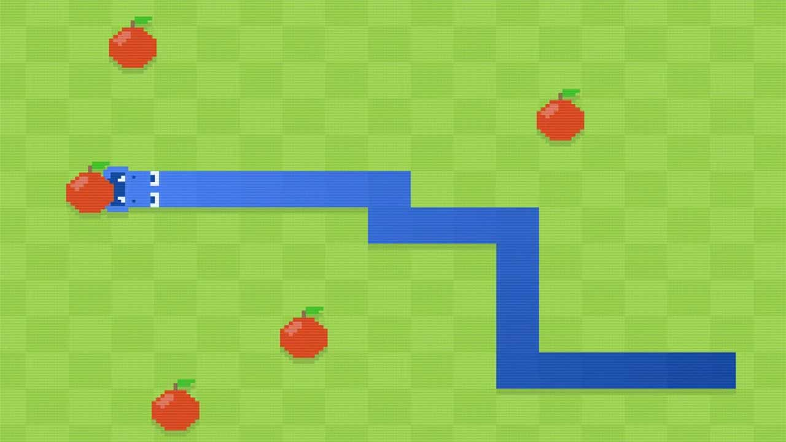
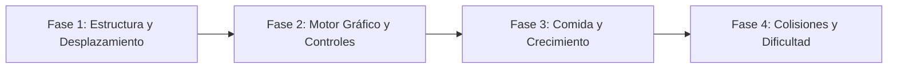

# Snake 

<p align="center">
  
</p>

---

## 1. Why?

Aunque sus orígenes se remontan al juego de arcade *Blockade* en 1976, **Snake** alcanzó la inmortalidad cultural en 1997 al ser incluido en los teléfonos móviles Nokia. Su premisa es engañosamente simple, pero a nivel de arquitectura de software, representa el rito de iniciación perfecto para comprender las **estructuras de datos dinámicas** y el concepto de **cola (FIFO)**.

En proyectos anteriores como Pac-Man o Battle City, las entidades ocupaban una o un par de celdas fijas. En Snake, el jugador controla una entidad cuyo tamaño crece dinámicamente y cuyo cuerpo debe seguir exactamente la ruta trazada por su cabeza. Este proyecto te enseñará a gestionar la memoria de un objeto en constante expansión (usando arreglos desplazados o listas enlazadas), a generar eventos pseudoaleatorios y a resolver el clásico problema del *input buffering* (almacenamiento de teclas en búfer) en el ciclo de juego.

---

## 2. Enunciado Formal

Debes desarrollar un videojuego 2D basado en una cuadrícula cerrada. El jugador controlará una serpiente que avanza ininterrumpidamente en una de cuatro direcciones. El objetivo es dirigir la cabeza de la serpiente hacia las "manzanas" (comida) que aparecen de forma aleatoria en el mapa.

Cada vez que la serpiente come una manzana, su longitud aumenta en un segmento y la puntuación se incrementa. El juego termina (*Game Over*) si la cabeza de la serpiente choca contra los límites de la pantalla (muros) o si colisiona contra cualquier parte de su propio cuerpo. A medida que el puntaje aumenta, la velocidad del juego debe acelerarse gradualmente. Al finalizar la partida, se guardará el récord máximo en un archivo binario.

---

## 3. Hitos de Desarrollo Sugeridos

Construye la serpiente paso a paso para asegurar que la lógica de movimiento sea impecable antes de añadir los gráficos:



### Fase 1: Estructura y Desplazamiento (Modo Consola)
Comienza modelando la serpiente. Puedes usar un arreglo de coordenadas `(x, y)`. Para simular el movimiento, en cada turno, cada segmento del cuerpo debe tomar la posición del segmento que estaba delante de él, y la cabeza debe moverse un paso en la dirección actual. Imprime las coordenadas en la consola para validar que la "cola" sigue a la "cabeza" correctamente.

### Fase 2: Motor Gráfico y Controles (SDL3)
Integra SDL3. Dibuja la cuadrícula, renderizando cada segmento de la serpiente como un rectángulo relleno (`SDL_RenderFillRect`). Implementa la lectura del teclado (`SDL_EVENT_KEY_DOWN`) para cambiar la dirección de la cabeza, asegurándote de que el movimiento siga ocurriendo a intervalos fijos (por ejemplo, cada $150\text{ ms}$), independientemente de la velocidad de fotogramas.

### Fase 3: Comida y Crecimiento
Implementa la lógica de aparición de la manzana. Genera coordenadas aleatorias `(x, y)` asegurándote de que caigan dentro de los límites de la cuadrícula. Cuando la cabeza de la serpiente ocupe la misma casilla que la manzana, incrementa la variable de longitud de la serpiente, suma puntos y genera una manzana nueva.

### Fase 4: Colisiones, Dificultad y Persistencia
Añade las condiciones de derrota: chocar contra los bordes de la cuadrícula o verificar si la coordenada de la cabeza es igual a la coordenada de cualquier otro segmento del cuerpo. Implementa una reducción progresiva del intervalo de tiempo entre movimientos (aumentando la velocidad) cada vez que comas 5 manzanas. Guarda el récord en disco al perder.

---

## 4. Consideraciones Técnicas y Paradigmas

* **Simulación de Movimiento (El truco del desplazamiento)**: No necesitas mover cada segmento individualmente basándote en direcciones. El enfoque más eficiente en C es iterar el arreglo de segmentos de atrás hacia adelante: el segmento $i$ toma la posición de $i-1$. Finalmente, actualizas la cabeza (segmento $0$) sumándole la dirección actual.
* **Manejo del Búfer de Entrada (*Input Buffering*)**: Un error clásico en Snake. Si la serpiente va hacia la `DERECHA` y el jugador presiona `ARRIBA` y luego `IZQUIERDA` antes del siguiente tick de movimiento, la serpiente girará $180^\circ$ e impactará consigo misma instantáneamente. Debes bloquear el cambio de dirección a un máximo de un giro por tick lógico, o implementar una cola de teclas.
* **Generación de Números Aleatorios**: Utiliza `srand(time(NULL))` al inicio del programa y `rand() % limite` para posicionar la comida.
* **Compilación Automatizada con Makefile**:

  Ejemplo sugerido de `Makefile`:
  ```makefile
  CC = gcc
  CFLAGS = -Wall -Wextra -std=c11 -Iinclude
  LDFLAGS = -lSDL3

  SRCS = src/main.c src/juego.c src/serpiente.c src/comida.c
  OBJS = $(SRCS:.c=.o)
  TARGET = snake

  all: $(TARGET)

  $(TARGET): $(OBJS)
  	$(CC) $(OBJS) -o $(TARGET) $(LDFLAGS)

  %.o: %.c
  	$(CC) $(CFLAGS) -c $< -o $@

  clean:
  	rm -f $(OBJS) $(TARGET)

  .PHONY: all clean
  ```

---

## 5. Arquitectura de Datos y Persistencia

### Modelado de Estructuras en C
A diferencia de juegos que cargan mapas desde `.txt`, Snake es puramente matemático. La cuadrícula es implícita:

```c
#include <stdbool.h>
#include <SDL3/SDL.h>

#define MAX_SEGMENTOS 1000 // Tamaño máximo teórico en la cuadrícula

// Direcciones posibles (No se puede ir en reversa)
typedef enum {
    DIR_ARRIBA,
    DIR_ABAJO,
    DIR_IZQUIERDA,
    DIR_DERECHA
} Direccion;

// Coordenada lógica en la cuadrícula
typedef struct {
    int x;
    int y;
} Coordenada;

// Estructura de la Serpiente
typedef struct {
    Coordenada cuerpo[MAX_SEGMENTOS];
    int longitud;
    Direccion direccionActual;
    Direccion siguienteDireccion; // Para prevenir el bug del input rápido
    bool viva;
} Serpiente;

// Estructura de la Partida
typedef struct {
    int columnas, filas;
    Coordenada comida;
    int puntaje;
    int retardoMs;          // Velocidad del juego (disminuye con el tiempo)
    Uint64 ultimoPasoMs;    // Temporizador
} Partida;

// Registro de Récord
typedef struct {
    int maxPuntaje;
} RegistroRecord;
```

### Persistencia de High Scores (`highscore.dat`)
Como este juego se trata puramente de superar el récord personal, solo necesitas guardar un `int` (o un arreglo pequeño si quieres un Top 5). Carga el archivo al inicio; si la puntuación final es mayor, sobrescribe el archivo binario usando `fwrite`.

---

## 6. Recomendaciones de Flujo y UI (SDL3)

* **Separación Visual de Segmentos**: Al usar `SDL_RenderFillRect()` para dibujar el cuerpo, si cada segmento mide $32 \times 32$ píxeles, dibuja rectángulos de $30 \times 30$ o $31 \times 31$ centrados en la celda. Dejar un margen de 1 o 2 píxeles entre segmentos hace que el jugador vea claramente la longitud del cuerpo en lugar de un bloque monolítico de color.
* **Contraste de Colores**: La interfaz debe ser limpia y de alto contraste. Tradicionalmente: fondo negro/verde oscuro, serpiente verde brillante/blanca, y la manzana de un rojo intenso para guiar rápidamente el ojo del jugador.
* **El "Efecto Pac-Man" (Opcional)**: En lugar de paredes mortales, puedes hacer que al salir por el lado derecho, la cabeza reaparezca por el izquierdo. Esto cambia drásticamente la jugabilidad y la función de actualización (`x = (x + columnas) % columnas`).

---

## 7. Casos Borde y Manejo de Errores

* **Spawns Imposibles de Comida**: Al generar una coordenada aleatoria para la manzana, debes iterar sobre todo el arreglo `cuerpo` de la serpiente. Si la manzana cae encima del cuerpo de la serpiente, debes generar una nueva coordenada iterativamente (`while`) hasta encontrar una celda vacía.
* **Prevención de Suicidio de 180 Grados**: Si `direccionActual == DIR_DERECHA`, el programa debe ignorar activamente cualquier intento de cambiar la dirección a `DIR_IZQUIERDA`. Solo las direcciones ortogonales son válidas.
* **Victoria Absoluta**: ¿Qué pasa si el jugador es tan bueno que la serpiente llena el $100\%$ de la cuadrícula? El código de spawn de la comida entraría en un bucle infinito buscando una celda vacía. Debes verificar si `longitud == (columnas * filas)` y activar una condición de "Victoria Perfecta".

---

## 8. Verificadores de Funcionamiento (Checklist)

Para que el proyecto se considere exitoso, debes cumplir con:

- [ ] **Compilación y Limpieza**: `make` y `make clean` funcionan correctamente sin advertencias.
- [ ] **Lógica de Movimiento**: La cola sigue perfectamente a la cabeza y la serpiente se mueve a un ritmo constante anclado a la cuadrícula.
- [ ] **Control de Input**: El jugador no puede hacer que la serpiente dé un giro de $180^\circ$ instantáneo sobre sí misma, incluso presionando teclas muy rápido.
- [ ] **Crecimiento Físico**: Al pasar sobre una manzana, la puntuación sube, la manzana reaparece en una celda vacía, y la serpiente crece en el siguiente ciclo.
- [ ] **Colisiones Fatales**: Chocar contra las paredes (si están activadas) o contra cualquier segmento de su propio cuerpo finaliza la partida al instante.
- [ ] **Dificultad Progresiva**: La velocidad de movimiento de la serpiente aumenta gradualmente durante la partida.
- [ ] **Persistencia Binaria**: El *High Score* sobrevive entre ejecuciones de la aplicación.

---

## 9. Desafíos Opcionales (Bonus)

¿Buscas destacar? Intenta incorporar estas características avanzadas:

1. **Listas Enlazadas Dinámicas**: En lugar de usar un arreglo de tamaño fijo `MAX_SEGMENTOS`, refactoriza el cuerpo de la serpiente para usar una Lista Enlazada Simple (`struct Nodo { Coordenada c; struct Nodo* sig; };`). Usa `malloc` al comer y `free` al reiniciar, gestionando la memoria dinámica en tiempo real.
2. **Obstáculos Estáticos y Niveles**: Carga escenarios desde un archivo `.txt` donde haya muros internos fijos que la serpiente deba evadir, transformando el juego en una serie de niveles.
3. **La Serpiente IA (Autoplay)**: Implementa el algoritmo de **Breadth-First Search (BFS)** o **A*** para que la computadora juegue sola de forma perfecta, encontrando siempre el camino más corto hacia la manzana sin chocar consigo misma.

