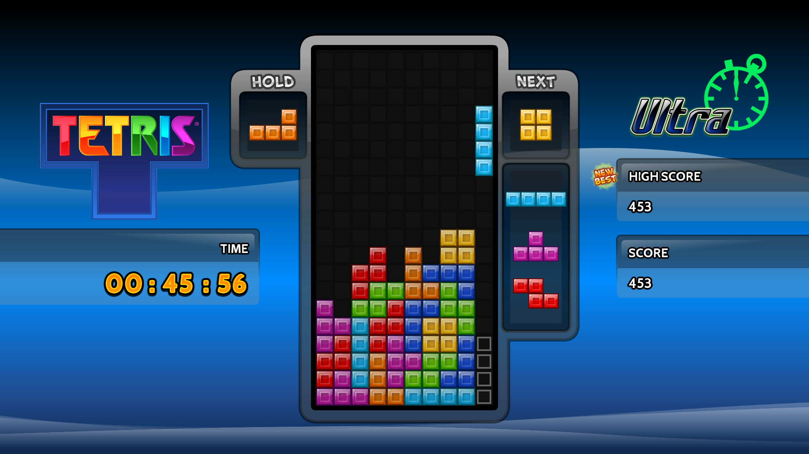
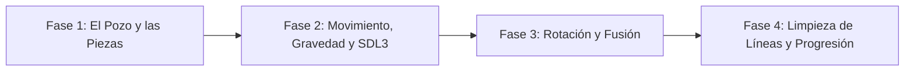

# Tetris

<p align="center">
  
</p>

---

## 1. Why?

Creado por el ingeniero soviético Alexey Pajitnov en 1984, **Tetris** es probablemente el rompecabezas digital más famoso de la historia. Pero más allá de su adictiva jugabilidad, desde la perspectiva de la ingeniería de software, Tetris es la prueba de fuego definitiva para dominar la **manipulación de matrices**, las **transformaciones espaciales (rotaciones)** y la **fusión de estructuras de datos**.

A diferencia de juegos donde entidades flotan libremente en el espacio, en Tetris tienes un objeto dinámico (el Tetrominó activo) que, al colisionar, debe "congelarse" y transferir su estado a un entorno estático (el pozo). Este proyecto te obligará a pensar en "simulaciones de colisión" (probar un movimiento en memoria antes de aplicarlo en pantalla), a gestionar la limpieza de arreglos bidimensionales (cuando se completa una línea) y a manejar tiempos de gravedad que cambian dinámicamente.

---

## 2. Enunciado Formal

Debes desarrollar un rompecabezas de bloques que caen basado en una cuadrícula (tradicionalmente de $10 \times 20$ celdas). El jugador deberá mover de izquierda a derecha y rotar $90^\circ$ piezas geométricas compuestas por cuatro bloques (Tetrominós) mientras descienden por la pantalla.

Cuando una pieza toca el fondo o a otro bloque previamente anclado, se "congela" en esa posición y el sistema genera una nueva pieza en la parte superior. Si el jugador logra llenar una fila horizontal completa con bloques, esa fila se elimina, los bloques superiores descienden y el puntaje aumenta. El juego termina (*Game Over*) cuando las piezas apiladas alcanzan el límite superior del pozo, impidiendo que nazca una nueva pieza. Se debe mantener un registro del puntaje máximo en un archivo binario.

---

## 3. Hitos de Desarrollo Sugeridos

La complejidad de Tetris radica en las colisiones durante las rotaciones. Sigue este orden estrictamente para no atascarte:



### Fase 1: El Pozo y las Piezas (Lógica Pura)
Define tu matriz principal (el "pozo" o *playfield*). Luego, diseña cómo vas a representar los 7 Tetrominós (I, J, L, O, S, T, Z). La forma más sencilla en C es usar matrices estáticas de $4 \times 4$ para cada pieza. Programa funciones lógicas que impriman el pozo en consola y que superpongan la pieza activa sobre él usando coordenadas lógicas $(x, y)$.

### Fase 2: Movimiento, Gravedad e Interfaz SDL3
Da el salto gráfico. Dibuja el pozo vacío y los bordes. Luego dibuja la pieza activa. Implementa un temporizador usando `SDL_GetTicks()`: si pasan, por ejemplo, $800\text{ ms}$, la variable $y$ de la pieza debe sumar 1 (caída por gravedad). Vincula las flechas izquierda y derecha del teclado para modificar la coordenada $x$, validando que la pieza no se salga de los muros.

### Fase 3: Rotación y Fusión (El Núcleo del Juego)
Implementa la rotación de matrices. Al presionar la tecla de rotar, gira la matriz $4 \times 4$ del Tetrominó. Regla de oro: antes de aplicar la rotación o el movimiento hacia abajo, simula el cambio en una matriz temporal. Si esa matriz temporal se superpone con un bloque anclado o se sale de la pantalla, cancela el movimiento. Si la pieza choca hacia abajo, cópiala ("fusiónala") permanentemente en la matriz del pozo.

### Fase 4: Limpieza de Líneas, Progresión y Persistencia
Después de cada "fusión", recorre el pozo buscando filas llenas. Si encuentras una, elimínala y desplaza todas las filas superiores una posición hacia abajo. Aumenta el puntaje. Con cada cierto número de líneas limpiadas, reduce el tiempo de gravedad para aumentar la dificultad. Guarda el récord en disco al llegar al Game Over.

---

## 4. Consideraciones Técnicas y Paradigmas

* **La Representación de las Piezas**: Puedes usar arreglos 3D estáticos para almacenar las rotaciones precalculadas, o usar un algoritmo que rote una matriz de $4 \times 4$ matemáticamente (transponer la matriz e invertir las filas). La pieza "O" (el cuadrado) no necesita rotar, y la "I" requiere cuidado para no desplazarse de su eje.
* **Separación de Capas de Datos**: El error más común en Tetris es intentar manejar la pieza que cae y los bloques ya caídos en la misma matriz. Debes tener dos entidades separadas: la `MatrizPozo` (estática) y la `PiezaActiva` (dinámica). Solo en el momento del renderizado se combinan visualmente en pantalla, y solo en el momento de la colisión inferior los datos de `PiezaActiva` se escriben en `MatrizPozo`.
* **Desplazamiento de Memoria (Line Clear)**: Para eliminar una línea $i$, puedes usar un simple bucle `for` que copie la fila $i-1$ en la $i$, luego la $i-2$ en la $i-1$, etc., subiendo hasta la cima, y luego limpiar la fila 0 con ceros.
* **Compilación Automatizada con Makefile**:

  Ejemplo sugerido de `Makefile`:
  ```makefile
  CC = gcc
  CFLAGS = -Wall -Wextra -std=c11 -Iinclude
  LDFLAGS = -lSDL3

  SRCS = src/main.c src/juego.c src/tetrominos.c src/tablero.c
  OBJS = $(SRCS:.c=.o)
  TARGET = tetris

  all: $(TARGET)

  $(TARGET): $(OBJS)
  	$(CC) $(OBJS) -o $(TARGET) $(LDFLAGS)

  %.o: %.c
  	$(CC) $(CFLAGS) -c $< -o $@

  clean:
  	rm -f $(OBJS) $(TARGET)

  .PHONY: all clean
  ```

---

## 5. Arquitectura de Datos y Persistencia

### Modelado de Estructuras en C
```c
#include <stdbool.h>
#include <SDL3/SDL.h>

#define FILAS 20
#define COLUMNAS 10

// Identificadores de color y forma
typedef enum {
    VACIO = 0,
    TIPO_I, TIPO_J, TIPO_L, TIPO_O,
    TIPO_S, TIPO_T, TIPO_Z
} TipoBloque;

// Estructura de la pieza dinámica
typedef struct {
    TipoBloque forma[4][4]; // Matriz local de la pieza
    int x;                  // Posición X relativa al pozo (puede ser negativa al rotar)
    int y;                  // Posición Y relativa al pozo
    TipoBloque tipoColor;
} PiezaActiva;

// Estructura del entorno estático
typedef struct {
    TipoBloque celdas[FILAS][COLUMNAS];
} Pozo;

// Estado general del juego
typedef struct {
    Pozo pozo;
    PiezaActiva actual;
    PiezaActiva siguiente;
    int lineasLimpiadas;
    int puntaje;
    int nivel;
    Uint64 velocidadGravedadMs;
    Uint64 ultimoPasoMs;
    bool gameOver;
} EstadoJuego;

// Registro para el guardado binario
typedef struct {
    int maxPuntaje;
    int maxLineas;
} RegistroRecord;
```

### Persistencia (`highscore.dat`)
Maneja el récord global del jugador. Al iniciar, carga el archivo con `fread` para mostrar el High Score. Al perder, compara tu puntuación actual con la histórica, y si es mayor, guárdala con `fwrite`.

---

## 6. Recomendaciones de Flujo y UI (SDL3)

* **Paleta de Colores Estandarizada**: Usa los colores oficiales para dar un *look and feel* profesional:
  - **I**: Cian (`#00FFFF`)
  - **J**: Azul (`#0000FF`)
  - **L**: Naranja (`#FFA500`)
  - **O**: Amarillo (`#FFFF00`)
  - **S**: Verde (`#00FF00`)
  - **T**: Morado (`#800080`)
  - **Z**: Rojo (`#FF0000`)
* **Proceso de Renderizado**: Tu función de pintado debe:
  1. Dibujar un fondo oscuro.
  2. Recorrer la matriz `Pozo` y dibujar los bloques anclados.
  3. Recorrer la matriz $4 \times 4$ de `PiezaActiva` y dibujarla en `(x + col, y + fila)` multiplicada por el tamaño del bloque en píxeles.
  4. Dibujar la cuadrícula (opcional pero muy útil para el jugador).
* **Previsualización (*Next Piece*)**: Dibuja un recuadro fuera del pozo principal donde siempre se muestre cuál es la pieza que caerá después. Esto es crucial para la estrategia del jugador.

---

## 7. Casos Borde y Manejo de Errores

* **Rotación contra la Pared**: Si el jugador pega la pieza "I" verticalmente contra el muro derecho e intenta rotarla horizontalmente, la matriz de $4 \times 4$ sobresaldrá de la cuadrícula. La lógica de tu función `puedeRotar()` debe detectar este choque de índices (*Out of bounds*) y retornar `false`, cancelando la rotación (o implementando un *Wall Kick*, empujándola una casilla a la izquierda).
* **Game Over por Bloqueo de Nacimiento**: La condición de final de partida exacta ocurre si, al generar una nueva pieza en la fila 0, esta choca instantáneamente con los bloques que ya están anclados en el pozo.
* **Múltiples Líneas (Tetris)**: Asegúrate de que tu algoritmo pueda detectar y eliminar 1, 2, 3 o 4 líneas simultáneas en un solo chequeo, otorgando un bono exponencial de puntos por hacer un "Tetris" (4 líneas).

---

## 8. Verificadores de Funcionamiento (Checklist)

Para que el proyecto se considere exitoso, debes cumplir con:

- [ ] **Compilación**: El proyecto usa Makefile y compila libre de advertencias.
- [ ] **Lógica de Gravedad**: La pieza cae automáticamente basada en temporizadores de SDL3, independiente del framerate.
- [ ] **Control de Movimiento**: La pieza se mueve lateralmente y puede ser acelerada hacia abajo (*Soft Drop*) sin salir del pozo.
- [ ] **Prevención de Atajos Inconsistentes**: Las piezas no pueden superponerse a otras piezas ya congeladas, ni al bajar ni al rotar.
- [ ] **Sistema de Fusión**: Al tocar el suelo u otro bloque inferior, la pieza se transfiere al Pozo estático.
- [ ] **Limpieza y Cascada**: Al completar una o más líneas, estas desaparecen y los bloques superiores caen correctamente.
- [ ] **Persistencia Binaria**: El récord de puntos se salva al terminar la partida.

---

## 9. Desafíos Opcionales (Bonus)

¿Buscas destacar? Intenta incorporar estas características avanzadas:

1. **Pieza Fantasma (*Ghost Piece*)**: Utiliza la lógica de colisión para calcular dónde caería la pieza actual si se soltara de golpe. Dibuja esa misma pieza en la base del pozo usando una transparencia (canal Alfa en SDL3) o dibujando solo los bordes del rectángulo.
2. **Caída Fuerte (*Hard Drop*)**: Vincula la tecla Espacio para que, en un solo frame, la pieza baje instantáneamente hasta su posición final, se ancle, puntúe y pida la siguiente pieza de inmediato.
3. **Reserva de Pieza (*Hold Piece*)**: Añade un recuadro secundario en la UI que permita al jugador presionar Shift para intercambiar la pieza activa actual por una guardada en "reserva". Obliga a que esto solo se pueda hacer una vez por cada caída para equilibrar el juego.

