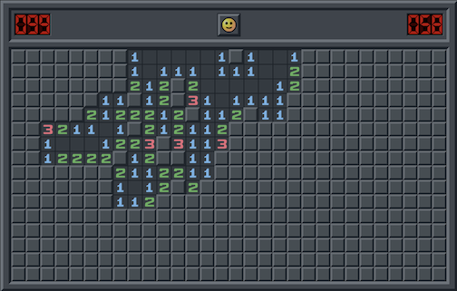
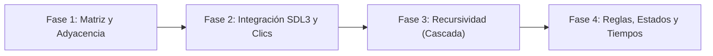

# Buscaminas (Minesweeper)

<p align="center">
  
</p>

---

## 1. Why?

Popularizado masivamente al ser incluido en Windows 3.1 en 1992, el **Buscaminas (Minesweeper)** es una obra maestra del diseño de rompecabezas lógicos. Desde la perspectiva de la programación, este proyecto representa una transición crítica hacia el **diseño guiado por eventos (*Event-Driven Design*)** y la implementación de **algoritmos de recorrido de grafos**.

A diferencia de Tetris o Battle City, donde el tiempo y la gravedad actúan constantemente, el Buscaminas es un sistema en reposo que reacciona exclusivamente a los estímulos del usuario (clics del ratón). El mayor valor técnico de este proyecto es dominar el algoritmo de "relleno por difusión" (**Flood Fill**), habitualmente implementado mediante recursividad, para revelar casillas vacías en cascada, además de perfeccionar la separación estricta entre el estado lógico de los datos y su estado visual.

---

## 2. Enunciado Formal

Debes desarrollar un videojuego de lógica y deducción en 2D basado en una cuadrícula. El juego generará un campo minado oculto. El jugador utilizará el ratón para interactuar con la cuadrícula: el clic izquierdo revelará el contenido de una celda, y el clic derecho colocará una bandera para marcar la sospecha de una mina.

Las celdas reveladas que no contengan minas mostrarán un número del 1 al 8, indicando cuántas minas hay en las casillas adyacentes. Si el jugador revela una celda sin minas adyacentes (un cero), el juego debe revelar automáticamente todas las celdas conectadas. La partida se gana al revelar todas las celdas que no son minas. La partida se pierde inmediatamente si se revela una celda que contiene una mina. El juego debe contar el tiempo transcurrido y guardar los mejores tiempos (*Fastest Times*) en un archivo binario.

---

## 3. Hitos de Desarrollo Sugeridos

Este juego se construye mejor validando las matemáticas antes que la interfaz:



### Fase 1: Matriz y Cálculo de Adyacencia (Modo Consola)
Crea una matriz bidimensional. Coloca minas aleatoriamente usando `rand()`. Luego, itera sobre cada celda que no sea una mina y cuenta cuántas minas tiene alrededor (en sus 8 direcciones). Imprime la matriz en la terminal revelando todo para comprobar que los números generados son matemáticamente correctos.

### Fase 2: Integración SDL3 y Clics del Ratón
Lleva el tablero a SDL3. Dibuja las celdas ocultas. Implementa la lectura de `SDL_EVENT_MOUSE_BUTTON_DOWN` para diferenciar el clic izquierdo (revelar) del derecho (bandera). Traduce las coordenadas de píxeles $(x, y)$ a índices de matriz $(\text{fila}, \text{columna})$ y cambia el estado visual de la celda cliqueada.

### Fase 3: Recursividad (El Efecto Cascada)
Este es el desafío principal. Escribe una función `revelarCelda(fila, columna)`. Si la celda cliqueada tiene 0 minas adyacentes, además de revelarse, debe llamarse a sí misma (`revelarCelda`) para sus 8 vecinos. Debes tener extremo cuidado de no procesar celdas ya reveladas para evitar bucles infinitos y desbordamientos de pila (*Stack Overflow*).

### Fase 4: Reglas, Tiempos y Persistencia
Agrega la regla del "Primer Clic Seguro": el tablero de minas no debe generarse hasta que el jugador hace su primer clic, asegurando que nunca pierda en el primer movimiento. Implementa un cronómetro en pantalla y, al ganar, guarda el tiempo en disco si supera el récord histórico.

---

## 4. Consideraciones Técnicas y Paradigmas

* **Arquitectura Orientada a Eventos**: El ciclo `while` principal no actualizará físicas. Solo reaccionará cuando `SDL_PollEvent` detecte interacción, o para actualizar el texto del cronómetro.
* **Algoritmo Flood Fill**: La revelación en cascada es un recorrido de grafo. Puedes implementarlo mediante Recursividad (*Depth-First Search*) o, si buscas un enfoque más seguro a nivel de memoria para tableros gigantescos, de forma Iterativa utilizando tu propia estructura de Pila (*Stack*) o Cola (*Queue*).
* **El Primer Clic Seguro**: La forma más elegante de implementarlo es iniciar la matriz vacía. Al recibir el primer clic izquierdo en la celda $(F, C)$, se generan las minas aleatoriamente con la condición estricta de que la celda $(F, C)$ y sus 8 vecinos no pueden contener minas. Luego, se calculan los números y se ejecuta la revelación.
* **Compilación Automatizada con Makefile**:

  Ejemplo sugerido de `Makefile`:
  ```makefile
  CC = gcc
  CFLAGS = -Wall -Wextra -std=c11 -Iinclude
  LDFLAGS = -lSDL3

  SRCS = src/main.c src/tablero.c src/eventos.c src/revelado.c
  OBJS = $(SRCS:.c=.o)
  TARGET = buscaminas

  all: $(TARGET)

  $(TARGET): $(OBJS)
  	$(CC) $(OBJS) -o $(TARGET) $(LDFLAGS)

  %.o: %.c
  	$(CC) $(CFLAGS) -c $< -o $@

  clean:
  	rm -f $(OBJS) $(TARGET)

  .PHONY: all clean
  ```

---

## 5. Arquitectura de Datos y Persistencia

### Modelado de Estructuras en C
Para mantener el código limpio, empaqueta todas las propiedades de una casilla en un solo `struct`:

```c
#include <stdbool.h>
#include <SDL3/SDL.h>

// Definición de dificultades estándar
#define FILAS_PRINCIPIANTE 9
#define COLS_PRINCIPIANTE 9
#define MINAS_PRINCIPIANTE 10

// Estado lógico de una celda única
typedef struct {
    bool esMina;            // ¿Hay una bomba aquí?
    bool estaRevelada;      // ¿El jugador ya la descubrió?
    bool tieneBandera;      // ¿El jugador puso una bandera?
    int minasAdyacentes;    // Valor del 0 al 8
} Celda;

// Estructura del Tablero
typedef struct {
    int filas;
    int columnas;
    int totalMinas;
    bool primerClicHecho;
    Celda **matriz;         // Matriz dinámica
} Tablero;

// Estados del Juego
typedef enum {
    ESTADO_JUGANDO,
    ESTADO_VICTORIA,
    ESTADO_DERROTA
} EstadoPartida;

// Estructura de la Partida
typedef struct {
    Tablero tablero;
    EstadoPartida estado;
    Uint64 tiempoInicioMs;
    int tiempoTranscurridoSegundos;
    int banderasColocadas;
} Partida;

// Registro de Récords Binario
typedef struct {
    int mejorTiempoPrincipiante;
    int mejorTiempoIntermedio;
    int mejorTiempoExperto;
} Records;
```

### Persistencia de Tiempos (`records.dat`)
El objetivo del juego no es sumar puntos, sino minimizar el tiempo. Al abrir el juego, lee el archivo binario. Si el jugador gana una partida en nivel "Principiante" en 45 segundos, y el registro histórico era de 60 segundos (o no existía/estaba en 0), actualiza el archivo usando `fwrite`.

---

## 6. Recomendaciones de Flujo y UI (SDL3)

* **Paleta Clásica de Colores**: El Buscaminas original es famoso por sus colores de números. Ayuda mucho a la legibilidad mantenerlos:
  - **1**: Azul (`#0000FF`)
  - **2**: Verde (`#008000`)
  - **3**: Rojo (`#FF0000`)
  - **4**: Azul oscuro / Púrpura (`#000080`)
  - **5**: Granate (`#800000`)
  - **6**: Turquesa (`#008080`)
  - **7**: Negro (`#000000`)
  - **8**: Gris oscuro (`#808080`)
* **Feedback Táctil Visual**: Cuando el usuario mantiene presionado el botón izquierdo del ratón sobre una celda cubierta, esta debe cambiar su apariencia a "hundida" temporalmente, y volver a su estado normal si el ratón sale de esa celda antes de soltar el clic.
* **Revelación Final (Derrota)**: Cuando el jugador clica una mina, el juego debe cambiar a estado `ESTADO_DERROTA` y recorrer toda la matriz para dibujar (revelar) todas las demás minas que estaban ocultas, mostrando también cuáles banderas estaban equivocadas.

---

## 7. Casos Borde y Manejo de Errores

* **Límites de Adyacencia (*Out of Bounds*)**: Al calcular las 8 celdas adyacentes para colocar los números (y durante el algoritmo de cascada), asegúrate de usar condiciones como `if (f >= 0 && f < filas && c >= 0 && c < columnas)` antes de acceder a `matriz[f][c]`.
* **Protección de Banderas**: Un clic izquierdo sobre una celda que tiene la propiedad `tieneBandera == true` debe ser ignorado por completo. La celda no debe revelarse a menos que el jugador retire la bandera con un clic derecho primero.
* **Clics Concurrentes en Estados Finalizados**: Si `estado != ESTADO_JUGANDO`, el programa debe ignorar activamente todos los eventos del ratón relacionados con interactuar con el tablero (para evitar que se sigan revelando celdas después del Game Over).

---

## 8. Verificadores de Funcionamiento (Checklist)

Para que el proyecto se considere exitoso, debes cumplir con:

- [ ] **Compilación y Limpieza**: Uso correcto del Makefile sin advertencias de compilación.
- [ ] **Traducción Espacial**: Los clics del ratón se mapean perfectamente a la matriz lógica, sin desfases visuales.
- [ ] **Seguridad del Primer Clic**: Es matemáticamente imposible perder en el primer clic izquierdo.
- [ ] **Mecánica de Banderas**: Se pueden colocar y retirar banderas, y estas bloquean la revelación accidental.
- [ ] **Cascada Recursiva**: Hacer clic en un espacio vacío (0) revela instantáneamente toda la "isla" conectada de casillas vacías y sus bordes numéricos.
- [ ] **Detección de Final**: El juego detecta la victoria cuando $\text{celdasTotales} - \text{minas} == \text{celdasReveladas}$, y la derrota al pisar una mina.
- [ ] **Persistencia Binaria**: El mejor tiempo en segundos se guarda en el disco duro.

---

## 9. Desafíos Opcionales (Bonus)

¿Buscas destacar? Intenta incorporar estas características avanzadas:

1. **Acordes (*Chording*)**: Implementa la mecánica avanzada del juego original. Si una celda ya está revelada (ej. tiene un "2") y el jugador ya le ha colocado exactamente 2 banderas correctas a su alrededor, hacer un clic con la rueda del ratón (o clic izquierdo+derecho simultáneo) sobre ese "2" revelará automáticamente las celdas adyacentes restantes.
2. **Dificultad Personalizada**: Agrega un menú previo donde el jugador pueda usar campos de texto o deslizadores para ingresar las dimensiones exactas (ej. $20 \times 40$) y la cantidad de minas deseada antes de instanciar el tablero con `malloc`.
3. **Escalado Dinámico**: Modifica el motor de renderizado para que, si el tablero es muy grande (ej. Experto $16 \times 30$), el tamaño de las celdas en pantalla se calcule dinámicamente y se reduzca para que quepa perfectamente en la ventana de SDL3, o implementa una cámara móvil.

