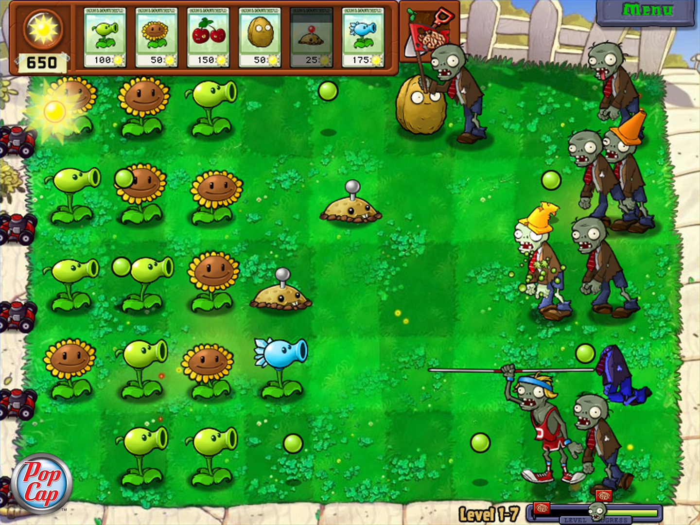
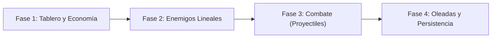

# Plants vs Zombies

<p align="center">
  
</p>

---

## 1. Why?

Aunque el género de defender la base (*Tower Defense*) nació en los juegos de estrategia de los 90, fue en 2009 cuando **Plants vs. Zombies** perfeccionó la fórmula llevándola a un sistema de "carriles" (*lanes*) basados en una cuadrícula.

Desde el punto de vista arquitectónico, este proyecto te sumergirá en el desafío de la **gestión masiva de entidades asíncronas** y el patrón **Productor-Consumidor**. A diferencia de otros juegos donde solo hay un protagonista y un puñado de enemigos, aquí tendrás decenas de defensores generando recursos o disparando balas a ritmos diferentes, decenas de proyectiles volando por la pantalla, y hordas de enemigos avanzando a distintas velocidades. Aprenderás a desacoplar los temporizadores, a optimizar la detección de colisiones (limitándola por filas) y a diseñar una economía interna funcional.

---

## 2. Enunciado Formal

Debes desarrollar un videojuego de estrategia y gestión de recursos en 2D. El campo de batalla consistirá en una cuadrícula (típicamente de $5 \times 9$ casillas). El jugador deberá gastar puntos de "Energía" para plantar distintas unidades defensivas en las celdas vacías del tablero.

El juego debe contar con al menos dos tipos de defensores (uno que genere energía periódicamente y otro que dispare proyectiles) y hordas de enemigos que aparecerán desde el extremo derecho de la pantalla y caminarán hacia la izquierda. Las colisiones ocurren de forma lineal: los proyectiles dañan a los enemigos, y los enemigos "mastican" a los defensores hasta destruirlos para poder avanzar. Si un solo enemigo logra cruzar el límite izquierdo de la pantalla, el jugador pierde la partida. El sistema debe registrar la máxima oleada (o tiempo) sobrevivida en un archivo binario.

---

## 3. Hitos de Desarrollo Sugeridos

La clave de este proyecto es que todo funciona por temporizadores independientes. Sepáralo en las siguientes fases:



### Fase 1: Tablero, Colocación y Economía Base
Comienza dibujando la cuadrícula con SDL3. Implementa una interfaz muy básica donde el jugador tenga un contador de "Energía" que aumenta lentamente con el tiempo. Permite que el usuario haga clic en una interfaz para seleccionar un defensor y luego clic en una celda vacía para colocarlo, deduciendo el costo de la energía. Evita que coloque dos unidades en la misma celda.

### Fase 2: Enemigos y Movimiento Continuo
Crea el sistema de aparición (*spawner*) de enemigos. Los defensores están anclados a la cuadrícula `[fila][columna]`, pero los enemigos deben usar coordenadas `float x, y` para moverse fluidamente de derecha a izquierda. Implementa la lógica donde, si un enemigo colisiona físicamente (intersecta rectángulos) con un defensor, se detiene y comienza a reducirle la vida.

### Fase 3: Proyectiles y Combate
Dale a tus defensores la capacidad de instanciar estructuras de tipo `Proyectil`. Los proyectiles avanzan hacia la derecha. Implementa la colisión: si un proyectil toca a un enemigo, el enemigo pierde HP y el proyectil desaparece. Para optimizar, asegúrate de que los proyectiles de la Fila 1 solo comprueben colisiones con enemigos que también caminen por la Fila 1.

### Fase 4: Tipos de Unidades, Oleadas y Persistencia
Añade el defensor generador de recursos (que instancie ítems de energía en su casilla cada $N$ segundos para que el jugador los recoja con un clic). Configura un sistema de oleadas que aumente la frecuencia de aparición de enemigos con el tiempo. Implementa la condición de derrota (enemigo cruza el lado izquierdo) y guarda el récord de oleadas superadas.

---

## 4. Consideraciones Técnicas y Paradigmas

* **Optimización por Carriles (*Lane-based Collision*)**: No hagas que cada proyectil verifique colisión contra todos los enemigos del mapa. Si tienes 5 filas, mantén 5 listas de enemigos separadas (o incluye un identificador de fila en cada enemigo). Un guisante en la fila 2 solo debe verificar distancias contra enemigos en la lista de la fila 2.
* **Manejo de Entidades Muertas (Reciclaje)**: Cuando un enemigo o defensor llega a 0 HP, no basta con hacerlo invisible. Debes liberarlo de la memoria (`free` si usas listas enlazadas) o marcar su bandera `activo = false` (si usas arreglos de *Object Pooling*) para que el ciclo de actualización lo ignore y los proyectiles no choquen contra "fantasmas".
* **Desacoplamiento Visual**: Un enemigo puede estar visualmente dentro de la celda de la columna 4, pero eso es solo renderizado. Toda su lógica de daño debe basarse en la intersección de sus cajas de colisión (`SDL_FRect`), no en su índice de matriz.
* **Compilación Automatizada con Makefile**:

  Ejemplo sugerido de `Makefile`:
  ```makefile
  CC = gcc
  CFLAGS = -Wall -Wextra -std=c11 -Iinclude
  LDFLAGS = -lSDL3

  SRCS = src/main.c src/tablero.c src/entidades.c src/oleadas.c
  OBJS = $(SRCS:.c=.o)
  TARGET = towerdefense

  all: $(TARGET)

  $(TARGET): $(OBJS)
  	$(CC) $(OBJS) -o $(TARGET) $(LDFLAGS)

  %.o: %.c
  	$(CC) $(CFLAGS) -c $< -o $@

  clean:
  	rm -f $(OBJS) $(TARGET)

  .PHONY: all clean
  ```

---

## 5. Arquitectura de Datos y Persistencia

### Modelado de Estructuras en C
Necesitarás mezclar estructuras estáticas (para el tablero) y dinámicas/pools (para los proyectiles y enemigos):

```c
#include <stdbool.h>
#include <SDL3/SDL.h>

#define FILAS 5
#define COLUMNAS 9

// Tipos de defensores
typedef enum {
    DEFENSOR_NINGUNO,
    DEFENSOR_DISPARADOR, // Ej: Lanza-Guisantes
    DEFENSOR_GENERADOR   // Ej: Girasol
} TipoDefensor;

// Estructura anclada a la cuadrícula
typedef struct {
    TipoDefensor tipo;
    int hp;
    Uint64 ultimoAtaqueMs; // Para controlar la cadencia de disparo o generación
} Celda;

// Estructura flotante (Pool de Proyectiles)
typedef struct {
    float x;
    int fila;              // En qué carril viaja
    float velocidad;
    int dano;
    bool activo;
} Proyectil;

// Estructura flotante (Lista o Pool de Enemigos)
typedef struct {
    float x;
    int fila;
    float velocidadActual; // 0 si está comiendo una planta
    int hp;
    int danoPorSegundo;
    Uint64 ultimoMordiscoMs;
    bool activo;
} Enemigo;

// Estructura global del Estado
typedef struct {
    Celda cuadricula[FILAS][COLUMNAS];
    Proyectil balas[200];
    Enemigo zombis[100];
    int energia;
    int oleadaActual;
    Uint64 tiempoInicioNivelMs;
    bool gameOver;
} EstadoJuego;

// Registro para persistencia
typedef struct {
    char nombreJugador[20];
    int maxOleadasSuperadas;
} RegistroRecord;
```

### Persistencia (`records.dat`)
El avance en un *Tower Defense* suele medirse en tiempo sobrevivido u oleadas completadas. Almacena en tu archivo binario el número máximo de oleadas que el jugador logró repeler antes de perder.

---

## 6. Recomendaciones de Flujo y UI (SDL3)

* **Interfaz de Selección (*Drag/Click & Drop*)**: Dibuja un panel en la parte superior o izquierda con "Cartas". Cuando el jugador haga clic en una carta, dibuja una versión semitransparente del defensor pegada al puntero del ratón (`SDL_GetMouseState`). Al hacer clic sobre el tablero, restas la energía y fijas la unidad.
* **Feedback Visual de Daño (*Hit Flash*)**: Cuando un enemigo reciba daño de un proyectil, usa `SDL_SetTextureColorMod()` o cambia su color de renderizado a blanco o rojo durante unos pocos milisegundos para dar retroalimentación satisfactoria de que el disparo impactó.
* **Limpieza de Basura Visual**: Un error común es que un proyectil falle o siga de largo y vuele infinitamente hacia la derecha. Si el $x$ del proyectil supera el ancho de la ventana, debes establecer `activo = false` para reciclar esa memoria.

---

## 7. Casos Borde y Manejo de Errores

* **El Problema del Disparo Atrapado**: Si un zombi se está comiendo al defensor que le está disparando, asegúrate de que el punto de instanciación (*spawn*) del proyectil esté ubicado físicamente antes del zombi, de lo contrario, el proyectil podría aparecer detrás del enemigo y seguir volando hacia la derecha sin impactarle.
* **Superposición de Enemigos**: A diferencia de los defensores, varios enemigos sí pueden superponerse en la misma coordenada $x$ de una fila. Tu sistema de proyectiles debe ser capaz de impactar al primer enemigo que alcance (usualmente el de menor valor $x$).
* **Sincronización del Recolector (Soles/Energía)**: Si un generador produce un ítem de energía que cae al suelo, debes asegurarte de asignarle su propio temporizador de vida (ej. desaparecer si el jugador no hace clic en él tras $10$ segundos) para evitar inundar la pantalla y la memoria con ítems no recogidos.

---

## 8. Verificadores de Funcionamiento (Checklist)

Para que el proyecto se considere exitoso, debes cumplir con:

- [ ] **Compilación y Limpieza**: Proyecto estructurado y compilable usando `make`.
- [ ] **Economía Funcional**: La energía se agota al colocar unidades y se regenera a través del tiempo o unidades específicas.
- [ ] **Independencia de Entidades**: Puedes colocar múltiples defensores en distintas celdas y cada uno opera a su propio ritmo (disparando o generando) de forma asíncrona.
- [ ] **Interacción Físico-Lógica**: Los proyectiles viajan, impactan a los enemigos correctos (por fila) y aplican daño, destruyéndose al chocar.
- [ ] **Comportamiento Enemigo**: Los enemigos avanzan. Si chocan con una unidad defensiva, se detienen a destruirla, y retoman su marcha al eliminarla.
- [ ] **Condición de Fin**: El juego termina correctamente cuando un enemigo alcanza el límite izquierdo del mapa.
- [ ] **Persistencia**: Se almacena la oleada máxima en un archivo binario.

---

## 9. Desafíos Opcionales (Bonus)

¿Buscas destacar? Intenta incorporar estas características avanzadas:

1. **Proyectiles con Arcos Parabólicos**: En lugar de moverse de forma estrictamente horizontal en el eje $X$, crea defensores (como la Catapulta) cuyas balas usen una fórmula cuadrática para describir una parábola en el eje $Y$, ignorando a los enemigos que están al frente para golpear directamente al que está más atrás en el carril.
2. **Efectos de Estado (*Status Effects*)**: Añade un defensor que dispare proyectiles de hielo. Si un enemigo es impactado, cambia su color visual a azul y reduce su variable `velocidadActual` a la mitad durante 5 segundos, usando la estructura del enemigo para llevar el registro del temporizador de congelación.
3. **Gestor de Niveles Basado en Archivos**: En lugar de programar la aparición de enemigos en el código (*hardcode*), crea un archivo `.txt` o equivalente donde estructures el nivel, por ejemplo: `T:10,F:3,Z:Basico` (A los 10 segundos, en la fila 3, aparece un zombi básico). Haz que tu programa lea e interprete este guion de batalla.

