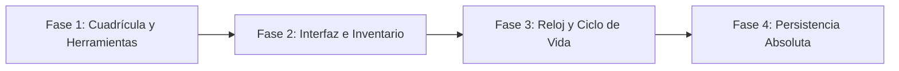

# Clon de Stardew Valley (Simulador Agrícola)

<p align="center">
  
</p>

---

## 1. Why?

Lanzado originalmente como *Harvest Moon* en los 90 y perfeccionado a nivel indie por *Stardew Valley* en 2016, el simulador de vida y granja es un género que fascina por su cualidad relajante. Sin embargo, detrás de esa aparente tranquilidad se esconde uno de los retos más fascinantes de la programación de videojuegos: la **simulación de sistemas persistentes**, las **máquinas de estado a largo plazo** y la **gestión de inventarios**.

A diferencia de un juego de acción donde los estados duran fracciones de segundo, en este proyecto desarrollarás un mundo "vivo". Aprenderás a gestionar un reloj interno que transforma el tiempo real en tiempo de juego (ciclo día/noche), a programar ciclos de vida complejos (una semilla que muta a brote y luego a fruto dependiendo de si fue regada), y a implementar un sistema de guardado masivo, ya que aquí no guardas solo un puntaje, sino el estado absoluto de miles de casillas y objetos.

---

## 2. Enunciado Formal

Debes desarrollar un videojuego de simulación agrícola en 2D con perspectiva *top-down* (cenital) basado en un sistema de baldosas (*Tile-based*). El jugador controlará a un granjero con un inventario de herramientas (azada, regadera) y semillas.

El juego debe contar con un terreno interactivo: el jugador podrá arar la tierra, plantar semillas, regarlas y, tras el paso de los días, cosechar los cultivos para almacenarlos en su inventario. El mundo debe estar regido por un reloj interno que haga avanzar las horas, provocando transiciones visuales entre el día y la noche. Al llegar la madrugada, o cuando el jugador decida dormir, el sistema procesará la "Transición de Día" (los cultivos regados crecen, la tierra mojada se seca). El jugador debe poder guardar su progreso de forma persistente y reanudar la partida exactamente donde la dejó.

---

## 3. Hitos de Desarrollo Sugeridos

Este proyecto requiere una fuerte base de estructuras de datos antes de siquiera pensar en los gráficos. Sigue esta progresión:



### Fase 1: La Cuadrícula Interactiva y Herramientas
Inicia con la matriz de la granja. Dibuja a tu personaje usando SDL3 y permítele moverse libremente (o bloque a bloque). Implementa un sistema de "alcance" (*reach*): al presionar una tecla, el jugador interactúa con la casilla que tiene exactamente frente a él. Programa la Azada (cambia una celda de `TERRENO_TIERRA` a `TERRENO_ARADO`) y la Regadera (cambia a `TERRENO_MOJADO`).

### Fase 2: Semillas, Cosechas e Inventario
Crea la estructura del inventario del jugador (un arreglo de ranuras). Implementa la lógica para seleccionar una semilla del inventario y plantarla exclusivamente en `TERRENO_ARADO`. Define las fases de crecimiento visuales (ej. Semilla $\rightarrow$ Brote $\rightarrow$ Adulta $\rightarrow$ Cosechable).

### Fase 3: Reloj Interno y Transición de Día
Implementa el ciclo de tiempo. Usa temporizadores para que, por ejemplo, 1 segundo en la vida real equivalga a 10 minutos en el juego. Agrega el oscurecimiento visual paulatino al atardecer. Crea la función `procesarNuevoDia()`: esta función debe iterar sobre toda la matriz; si una planta está en `TERRENO_MOJADO`, avanza su fase de crecimiento. Finalmente, seca toda la tierra.

### Fase 4: Animales Básicos y Persistencia Absoluta
Añade entidades móviles simples (como gallinas que caminan aleatoriamente y generan un huevo cada mañana). Desarrolla el sistema de guardado (*Save State*), volcando el estado actual del inventario, la hora, el día y la matriz completa de la granja a un archivo binario.

---

## 4. Consideraciones Técnicas y Paradigmas

* **Arquitectura de Capas (*Layered Rendering*)**: Tu mapa ya no es una simple matriz de caracteres. Necesitarás al menos dos capas de datos por celda: el terreno base (pasto, tierra, arado) y la entidad superpuesta (la planta, una piedra, un cerco).
* **El Tiempo Desacoplado**: A diferencia de Tetris donde el tiempo afecta directamente a la jugabilidad en tiempo real, aquí el tiempo es una variable de estado. Tu función de actualización debe calcular: `minutosJuego += (deltaTicks / factorVelocidad)`.
* **Guardado de Estado (*Serialization*)**: Para guardar la partida, no puedes simplemente guardar un "High Score". Debes serializar el `struct` del `Jugador` completo (posición, dinero, inventario) y volcar la matriz gigante de la granja completa al archivo binario mediante `fwrite`.
* **Compilación Automatizada con Makefile**:

  Ejemplo sugerido de `Makefile`:
  ```makefile
  CC = gcc
  CFLAGS = -Wall -Wextra -std=c11 -Iinclude
  LDFLAGS = -lSDL3

  SRCS = src/main.c src/mundo.c src/jugador.c src/tiempo.c src/inventario.c
  OBJS = $(SRCS:.c=.o)
  TARGET = farmsim

  all: $(TARGET)

  $(TARGET): $(OBJS)
  	$(CC) $(OBJS) -o $(TARGET) $(LDFLAGS)

  %.o: %.c
  	$(CC) $(CFLAGS) -c $< -o $@

  clean:
  	rm -f $(OBJS) $(TARGET)

  .PHONY: all clean
  ```

---

## 5. Arquitectura de Datos y Persistencia

### Modelado de Estructuras en C
```c
#include <stdbool.h>
#include <SDL3/SDL.h>

#define FILAS_MAPA 50
#define COLS_MAPA 50
#define MAX_INVENTARIO 12

// Tipos de terreno e items
typedef enum { TERRENO_PASTO, TERRENO_TIERRA, TERRENO_ARADO, TERRENO_MOJADO } TipoTerreno;
typedef enum { ITEM_NADA, ITEM_AZADA, ITEM_REGADERA, ITEM_SEMILLA_TOMATE, ITEM_TOMATE } TipoItem;

// Ciclo de vida de un cultivo
typedef struct {
    TipoItem tipoSemilla;
    int faseCrecimiento; // 0: Semilla, 1: Brote, 2: Adulta, 3: Cosechable
    int diasParaCrecer;
    bool viva;
} Cultivo;

// Estructura de una casilla de la cuadrícula
typedef struct {
    TipoTerreno terreno;
    Cultivo cultivo;
    bool tieneObstaculo; // Roca, madera, etc.
} Casilla;

// Ranura del inventario
typedef struct {
    TipoItem item;
    int cantidad;
} SlotInventario;

// Entidad del Jugador
typedef struct {
    int x, y; // Coordenadas en la cuadrícula o en píxeles
    int dinero;
    int energiaMaxima;
    int energiaActual;
    SlotInventario inventario[MAX_INVENTARIO];
    int slotSeleccionado;
} Jugador;

// El Reloj del Mundo
typedef struct {
    int dia;
    int hora;
    int minuto;
    Uint64 temporizadorMs;
} RelojMundo;

// Estado Global
typedef struct {
    Casilla mapa[FILAS_MAPA][COLS_MAPA];
    Jugador jugador;
    RelojMundo tiempo;
} EstadoJuego;
```

### Persistencia (`savegame1.dat`)
Escribirás la estructura `EstadoJuego` íntegra en el disco. Al abrir el juego y seleccionar "Cargar Partida", usarás `fread` para volcar esos bytes directamente en la memoria y recuperar el mundo exactamente como estaba.

---

## 6. Recomendaciones de Flujo y UI (SDL3)

* **El Ciclo Día/Noche (*Filtro Alfa*)**: La transición visual del tiempo es crucial. Cuando pasen las 18:00 (6:00 PM), activa el *Alpha Blending* en SDL3. Dibuja un rectángulo que cubra toda la pantalla (`SDL_RenderFillRect`) de color azul oscuro / púrpura, y ve aumentando su canal Alfa (transparencia) gradualmente de 0 (invisible) a 150 (oscuro pero visible) a medida que se acerca la medianoche.
* **Cursor de Interacción**: Dibuja un recuadro translúcido (o un borde resaltado) en la celda hacia la cual el jugador está mirando. Esto es vital para que el jugador sepa exactamente qué porción de tierra va a regar o dónde va a plantar, evitando frustraciones.
* **Overlay de Inventario (HUD)**: Mantén una barra inferior de acceso rápido (*Hotbar*) visible en todo momento. Usa las teclas numéricas (1, 2, 3...) o la rueda del ratón para alternar la herramienta activa (variable `jugador.slotSeleccionado`).

---

## 7. Casos Borde y Manejo de Errores

* **El Límite de la Madrugada (*Pass Out*)**: ¿Qué ocurre si el jugador no va a la cama? Debes programar un evento duro (ej. a las 02:00 AM) donde el juego fuerce la transición de día automáticamente, penalizando al jugador con pérdida de dinero o de energía máxima para el día siguiente.
* **Uso Inválido de Herramientas**: El código debe verificar el contexto antes de actuar. Si el jugador usa la Regadera sobre `TERRENO_PASTO`, no debe pasar nada. Si intenta plantar una semilla sobre un obstáculo o tierra sin arar, la acción debe bloquearse silenciosamente (o con un sonido de error).
* **Gestión de Recursos Finita**: Cada golpe de azada o uso de regadera debe restar puntos de `energiaActual` al jugador. Si la energía llega a 0, el jugador no puede usar herramientas y debe comer algo del inventario o irse a dormir.

---

## 8. Verificadores de Funcionamiento (Checklist)

Para que el proyecto se considere exitoso, debes cumplir con:

- [ ] **Compilación**: El Makefile gestiona el proyecto modularmente sin errores de vinculación.
- [ ] **Manipulación de Capas**: El jugador puede arar la tierra y ver cómo cambia el gráfico subyacente.
- [ ] **Sistema de Crecimiento**: Las semillas plantadas avanzan de fase visual únicamente tras procesar el fin del día (y solo si la tierra estaba mojada).
- [ ] **Interacción de Inventario**: El jugador puede equipar herramientas, consumir semillas al plantarlas y recibir ítems nuevos al cosechar.
- [ ] **El Paso del Tiempo**: El reloj avanza de forma autónoma. El sistema detecta y ejecuta automáticamente las rutinas nocturnas cuando el jugador duerme.
- [ ] **Serialización Total**: El jugador puede cerrar el juego por completo, abrirlo de nuevo, y encontrar cada cultivo regado, cada ítem de su inventario y la hora exacta del día donde lo dejó.

---

## 9. Desafíos Opcionales (Bonus)

¿Buscas destacar? Intenta incorporar estas características avanzadas:

1. **El Sistema de Estaciones (Temporadas)**: Implementa que cada mes tenga 28 días. Al cambiar de estación (Primavera a Verano), cambia la paleta de colores del terreno (*tileset*) y programa una rutina que marchite/destruya automáticamente cualquier cultivo que no sea compatible con la nueva estación.
2. **Pathfinding para Animales Domésticos (A*)** : Agrega vacas u ovejas que vaguen libremente por la granja durante el día. Implementa el algoritmo **A*** (*A-Star*) para que, al dar las 18:00 hrs, los animales calculen la ruta óptima sorteando cultivos y vallas para regresar automáticamente a su establo a dormir.
3. **Crafteo (Elaboración de Objetos)**: Crea un menú especial donde el jugador pueda combinar recursos (ej. $20 \text{ Madera} + 5 \text{ Piedra} = 1 \text{ Cofre}$). Los cofres deben poder ser colocados en el mapa de forma persistente y, al hacerles clic, abrir una matriz de inventario secundaria.

