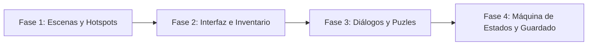

# Aventura Gráfica Point & Click

<p align="center">
  
</p>

---

## 1. Why?

En los años 90, LucasArts y Sierra definieron una era dorada con títulos como *The Secret of Monkey Island* o *Day of the Tentacle*. A nivel de ingeniería de software, desarrollar una aventura gráfica supone un abandono total de las físicas en tiempo real o la gravedad, para adentrarte en el dominio de las **máquinas de estados finitos**, los **árboles de decisión** y la **arquitectura orientada a datos (*Data-Driven Design*)**.

En este proyecto, la historia y la temática la decides tú (puedes hacer un misterio ciberpunk, una comedia pirata o un thriller de terror). El verdadero reto técnico es crear el "Motor" (*Engine*) que permita cargar escenarios, detectar clics en polígonos o rectángulos invisibles (*Hotspots*), gestionar un inventario y registrar qué eventos narrativos ya han ocurrido. Aprenderás que la complejidad de un juego no siempre está en los reflejos, sino en el rastreo impecable de cientos de variables lógicas.

---

## 2. Enunciado Formal

Debes desarrollar un motor de aventura gráfica 2D impulsado exclusivamente por el uso del ratón (*Point & Click*). El juego debe permitir al jugador explorar una serie de escenas o pantallas interconectadas. La historia, los personajes y el objetivo final son de tu libre elección.

Cada pantalla debe contener "Zonas Interactivas" (*Hotspots*). Al hacer clic en estas zonas, el jugador podrá: examinar objetos, recoger ítems para añadirlos a su inventario, o cambiar a otra escena. El progreso se basará en la resolución de puzles mediante el uso del inventario (ej. "usar Llave en Puerta") y la interacción con otros personajes mediante cuadros de diálogo. El estado del mundo (qué puertas están abiertas, qué objetos han sido recogidos) debe registrarse en una máquina de estados global y persistir mediante un sistema de guardado y carga en archivo binario.

---

## 3. Hitos de Desarrollo Sugeridos

A diferencia de un juego de acción, aquí debes construir la infraestructura antes de escribir la primera línea de la historia:



### Fase 1: Escenarios y Zonas Interactivas (Hotspots)
Inicia cargando una imagen de fondo con SDL3. Luego, define áreas rectangulares invisibles (`SDL_FRect`) sobre la imagen. Programa la lectura del ratón (`SDL_EVENT_MOUSE_BUTTON_DOWN`) y utiliza funciones de intersección de puntos para detectar si el usuario hizo clic dentro de un Hotspot. Crea una función para "viajar" de una escena a otra al hacer clic en zonas de salida (como puertas o bordes de pantalla).

### Fase 2: El Inventario y el "Drag & Drop"
Implementa una barra de inventario persistente en la parte inferior o superior de la pantalla. Crea lógica para que un clic en un Hotspot de tipo "Recogible" elimine el objeto del escenario y lo añada a una ranura libre del inventario. Permite que el jugador seleccione un ítem del inventario y el cursor cambie para indicar que el objeto está "activo", listo para ser usado sobre otra cosa.

### Fase 3: Árboles de Diálogo y Lógica de Puzles
Desarrolla un sistema de texto. Cuando el jugador haga clic en un NPC, dibuja un cuadro de texto y permite al jugador elegir entre varias respuestas (1, 2, 3). Implementa la lógica de los puzles: si el jugador hace clic en el Hotspot "Cerradura" teniendo activo el ítem "Llave", la cerradura cambia de estado y la llave se consume. Si usa un ítem incorrecto, muestra un mensaje genérico ("Eso no funciona").

### Fase 4: Máquina de Estados y Persistencia
Crea un arreglo global de banderas booleanas (`bool flags[100]`) o enums que representen el progreso narrativo (ej. `FLAG_GUARDIA_DISTRAIDO = true`). Al guardar la partida, no necesitas guardar gráficos; solo necesitas guardar en un archivo binario en qué escena está el jugador, los ítems exactos de su inventario y el arreglo de banderas.

---

## 4. Consideraciones Técnicas y Paradigmas

* **Lógica Guiada por Eventos (*Event-Driven*)**: Este juego no necesita correr a 60 FPS fijos calculando físicas. Puedes usar `SDL_WaitEvent()` en lugar de `SDL_PollEvent()`, de modo que el procesador "duerma" (consumiendo $0\%$ de CPU) hasta que el usuario mueva el ratón o haga clic.
* **Separación de Lógica y Contenido (*Data-Driven*)**: El peor error en este género es llenar tu código C con miles de sentencias `if (escena == 5 && clicX > 10)`. Esfuérzate por definir tus escenas mediante estructuras de datos (o incluso leyendo archivos `.txt`) para que añadir un nuevo escenario sea agregar datos, no escribir más código fuente.
* **Gestión de Cadenas (*Strings*)**: El manejo de texto en C puede ser complejo. Asegúrate de tener funciones sólidas para renderizar texto (usando la extensión `SDL_ttf`) con saltos de línea automáticos (*Word Wrap*) para los diálogos largos.
* **Compilación Automatizada con Makefile**:

  Ejemplo sugerido de `Makefile`:
  ```makefile
  CC = gcc
  CFLAGS = -Wall -Wextra -std=c11 -Iinclude
  LDFLAGS = -lSDL3 -lSDL3_ttf

  SRCS = src/main.c src/escenas.c src/interaccion.c src/inventario.c
  OBJS = $(SRCS:.c=.o)
  TARGET = aventura

  all: $(TARGET)

  $(TARGET): $(OBJS)
  	$(CC) $(OBJS) -o $(TARGET) $(LDFLAGS)

  %.o: %.c
  	$(CC) $(CFLAGS) -c $< -o $@

  clean:
  	rm -f $(OBJS) $(TARGET)

  .PHONY: all clean
  ```

---

## 5. Arquitectura de Datos y Persistencia

### Modelado de Estructuras en C
```c
#include <stdbool.h>
#include <SDL3/SDL.h>

#define MAX_INVENTARIO 20
#define MAX_BANDERAS 100

// Tipos de interacciones posibles
typedef enum {
    ACCION_EXAMINAR,
    ACCION_RECOGER,
    ACCION_HABLAR,
    ACCION_IR_A_ESCENA
} TipoAccion;

// Una zona clickeable en la pantalla
typedef struct {
    SDL_FRect rectangulo;
    TipoAccion accion;
    int idObjeto;          // Si es recogible
    int idEscenaDestino;   // Si es una salida
    char descripcion[256]; // Texto al examinar
    int flagRequerida;     // Condición (ej. solo visible si puerta abierta)
} Hotspot;

// Definición de una Escena/Pantalla
typedef struct {
    int id;
    char rutaFondo[128];
    Hotspot zonas[10];     // Arreglo de zonas clickeables
    int numZonas;
} Escena;

// Inventario del Jugador
typedef struct {
    int items[MAX_INVENTARIO]; // IDs de los objetos obtenidos
    int cantidadItems;
    int itemSeleccionado;      // ID del item activo (para usarlo en puzles)
} Inventario;

// El Estado Global (Lo que se guarda en el archivo)
typedef struct {
    int escenaActual;
    Inventario inventario;
    bool eventos[MAX_BANDERAS]; // Ej: eventos[0] = puerta abierta, eventos[1] = npc habló
} EstadoJuego;
```

### Persistencia (`savegame.dat`)
El guardado es extremadamente ligero y elegante. Solo necesitas hacer `fwrite(&estadoGlobal, sizeof(EstadoJuego), 1, archivo)`. Al cargar la partida, lees este bloque e inmediatamente instruyes al motor de renderizado que cargue la `escenaActual`.

---

## 6. Recomendaciones de Flujo y UI (SDL3)

* **Feedback del Cursor**: La regla de oro del Point & Click. Intercepta la coordenada del ratón en cada iteración y comprueba si colisiona con algún Hotspot. Si es así, cambia la imagen del cursor (un ojo para examinar, una mano para coger, un bocadillo para hablar). Esto evita que el jugador haga "caza de píxeles" (*pixel hunting*) a ciegas.
* **El "Verbo" Activo**: Cuando el jugador haga clic en un objeto de su inventario, este objeto debe quedar pegado al cursor (o ser resaltado en la UI) indicando que el siguiente clic intentará "Usar [Objeto] en [Hotspot]".
* **Bloqueo de Interfaz**: Durante animaciones o mientras un texto de diálogo se está mostrando progresivamente ("efecto máquina de escribir"), asegúrate de ignorar temporalmente los clics en otras partes de la pantalla para evitar romper el flujo narrativo o corromper el estado de la partida.

---

## 7. Casos Borde y Manejo de Errores

* **Combinaciones Inválidas**: ¿Qué pasa si el jugador intenta usar el "Pollo de Goma con Polea" en la "Taza de Café"? Debes prever un mensaje por defecto genérico ("No creo que sea buena idea", "Eso no funciona juntos") para evitar que el juego falle silenciosamente ante miles de combinaciones incorrectas.
* **Condiciones de Carrera (*Flags*)**: Si el jugador intenta coger unas monedas, asegúrate de cambiar la bandera `monedas_recogidas = true` antes de añadir el ítem al inventario. Si no, si el jugador hace clic rápidamente dos veces, podría ejecutar la acción dos veces y obtener el ítem duplicado.
* **Gestión de Recursos Multimedia**: Cargar y descargar imágenes de fondo es costoso. Si pasas de la Escena 1 a la Escena 2, asegúrate de usar `SDL_DestroyTexture` en el fondo anterior antes de cargar el nuevo, de lo contrario tendrás fugas de memoria catastróficas (*Memory Leaks*).

---

## 8. Verificadores de Funcionamiento (Checklist)

Para que el proyecto se considere exitoso, debes cumplir con:

- [ ] **Compilación y Limpieza**: Proyecto estructurado modularmente y sin advertencias en la compilación.
- [ ] **Mapeo Espacial**: El ratón detecta correctamente áreas rectangulares invisibles (Hotspots) y muestra descripciones al interactuar con ellas.
- [ ] **Navegación**: El jugador puede transitar de una escena (pantalla) a otra haciendo clic en zonas de salida (puertas, caminos).
- [ ] **Lógica de Puzles**: El jugador puede coger ítems, almacenarlos en el inventario, seleccionarlos y usarlos en Hotspots específicos para alterar el estado del escenario.
- [ ] **Feedback al Usuario**: Existencia de un sistema de texto o diálogos funcionales.
- [ ] **Seguridad Lógica**: El juego maneja con gracia los intentos de combinar ítems incorrectos.
- [ ] **Serialización (Guardado)**: Se puede salir del juego y, al cargar, el jugador recupera exactamente su inventario, ubicación y el estado del escenario.

---

## 9. Desafíos Opcionales (Bonus)

¿Buscas destacar? Intenta incorporar estas características avanzadas:

1. **Intérprete de Scripts (*Scripting Engine*)**: En lugar de programar la historia en C puro, crea un intérprete simple que lea archivos de texto. Ejemplo de un `escena1.txt`: `SI USAR(llave, puerta) ENTONCES QUITAR(llave) Y SET_FLAG(1)`. Esto te permite crear juegos nuevos sin recompilar el código fuente.
2. **Pathfinding de Personajes (Algoritmo A*)**: En los juegos de LucasArts, cuando haces clic, el personaje camina hacia el punto esquivando obstáculos. Implementa navegación por malla (*NavMesh*) o algoritmo **A*** para que un sprite animado camine hasta el Hotspot antes de ejecutar la acción, en lugar de que ocurra instantáneamente o en primera persona.
3. **Árboles de Diálogo Complejos**: Crea un sistema JSON o estructural donde una conversación tenga ramificaciones reales: la opción A abre nuevas preguntas, mientras que la opción B ofende al NPC y cierra la conversación, alterando una bandera del `EstadoJuego`.

