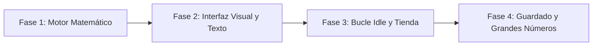

# Clon de Cookie Clicker (Juego Incremental)

<p align="center">
  
</p>

---

## 1. Why?

Lanzado por Julien "Orteil" Thiennot en 2013, **Cookie Clicker** codificó el género de los juegos incrementales (o *Idle Games*). Aunque a simple vista parece una parodia trivial, desde la perspectiva de la ingeniería de software es un ejercicio magistral en **escalabilidad de datos**, **matemáticas exponenciales** y **bucles de acumulación asíncrona**.

En proyectos anteriores, las entidades se movían y chocaban. Aquí, tu mayor enemigo es el desbordamiento de enteros (*Integer Overflow*) y la gestión de la interfaz de usuario. Este proyecto te obligará a usar tipos de datos masivos, a renderizar texto dinámico en tiempo real (mostrando números que cambian 60 veces por segundo sin parpadear), y a dominar el uso de *Delta Time* para asegurar que la generación automática de recursos sea matemáticamente perfecta independientemente del framerate de la pantalla.

---

## 2. Enunciado Formal

Debes desarrollar un videojuego incremental en 2D centrado en la interfaz de usuario (UI). La pantalla estará dividida en dos secciones principales: un área de interacción activa (un objeto central que el jugador debe clicar) y una tienda de mejoras.

El jugador generará una moneda principal (ej. "Galletas", "Oro", "Líneas de Código") al hacer clic. Con esa moneda, podrá comprar "Edificios" o "Generadores" (ej. Cursores, Abuelas, Granjas, Servidores) que producirán la moneda de forma automática cada segundo. El costo de cada generador aumentará exponencialmente cada vez que se compre uno. El objetivo del juego es infinito: optimizar la producción por segundo (CpS - *Cookies per Second*). El programa debe guardar el progreso absoluto del jugador en un archivo para que pueda retomar su imperio mercantil en cualquier momento.

---

## 3. Hitos de Desarrollo Sugeridos

Dado que es un juego basado en interfaz, la lógica matemática debe ser sólida antes de dibujar botones:



### Fase 1: Motor Matemático (Consola)
Comienza en la terminal. Define tus variables de recursos. Programa la función de clic y la fórmula de aumento de precio (típicamente $\text{precio} = \text{precioBase} \times 1.15^{\text{cantidadComprada}}$). Crea un bucle de consola que te permita "comprar" cosas escribiendo un número y verifica que la producción por segundo se calcule correctamente.

### Fase 2: Interfaz Visual y Renderizado de Texto (SDL3)
Integra SDL3 y, de manera crucial, la extensión `SDL3_ttf` (*TrueType Fonts*) para dibujar texto. Dibuja un gran botón central y detecta el `SDL_EVENT_MOUSE_BUTTON_DOWN` sobre él. Renderiza el contador de tu moneda principal en la pantalla, actualizando el texto cada vez que hagas clic.

### Fase 3: El Bucle Idle (Generación Automática) y la Tienda
Este es el corazón del juego. Usa el tiempo delta o temporizadores para sumar automáticamente a tu moneda principal basándote en tu Producción por Segundo (CpS). Renderiza botones para la tienda; estos deben mostrar el nombre del edificio, la cantidad poseída y su precio actual. Si el jugador no tiene suficiente dinero, el botón debe dibujarse en gris o inactivo.

### Fase 4: Guardado de Partida y Gestión de Escala
Implementa la función de autoguardado (por ejemplo, cada 60 segundos). Tu archivo debe registrar la cantidad exacta de moneda y la cantidad de cada edificio comprado. Maneja el escalado visual para que los números no se salgan de la pantalla.

---

## 4. Consideraciones Técnicas y Paradigmas

* **Tipos de Datos Masivos**: Un `int` estándar en C (32 bits) tiene un límite de aproximadamente 2.14 mil millones. En un Clicker, llegarás a ese número en horas. Debes usar `unsigned long long` (64 bits, límite de 18 trillones) o pasar directamente a usar `double` si planeas llegar a números cuatrillones o superiores.
* **Acumulación por Delta Time**: La producción automática no debe sumar de golpe una vez por segundo, sino fraccionadamente en cada frame para que el contador suba de forma fluida. Fórmula: `moneda += produccionPorSegundo * (deltaTicks / 1000.0f)`.
* **Fórmula de Crecimiento Económico**: Para que el juego esté balanceado, usa una tasa de crecimiento exponencial constante para el costo de los edificios. La constante de Orteil es $1.15$.
* **Compilación Automatizada con Makefile**: Necesitarás enlazar la librería de matemáticas (`-lm`) y la de fuentes de SDL (`-lSDL3_ttf`).

  Ejemplo sugerido de `Makefile`:
  ```makefile
  CC = gcc
  CFLAGS = -Wall -Wextra -std=c11 -Iinclude
  LDFLAGS = -lSDL3 -lSDL3_ttf -lm

  SRCS = src/main.c src/logica.c src/tienda.c src/render_texto.c
  OBJS = $(SRCS:.c=.o)
  TARGET = idleclicker

  all: $(TARGET)

  $(TARGET): $(OBJS)
  	$(CC) $(OBJS) -o $(TARGET) $(LDFLAGS)

  %.o: %.c
  	$(CC) $(CFLAGS) -c $< -o $@

  clean:
  	rm -f $(OBJS) $(TARGET)

  .PHONY: all clean
  ```

---

## 5. Arquitectura de Datos y Persistencia

### Modelado de Estructuras en C
```c
#include <stdbool.h>
#include <SDL3/SDL.h>

#define MAX_TIPOS_EDIFICIOS 10

// Estructura de un Generador/Edificio
typedef struct {
    char nombre[32];
    double precioBase;
    double produccionBase;     // Cuánto produce por segundo
    int cantidadPoseida;
    double multiplicadorCosto; // Habitualmente 1.15
} Edificio;

// Estructura Global del Estado
typedef struct {
    double monedaActual;
    double totalHistoricoGenerado;
    double produccionPorSegundo;
    double poderDeClic;        // Cuánto generas al hacer clic manual
    Edificio edificios[MAX_TIPOS_EDIFICIOS];
    Uint64 ultimoTiempoGuardado;
    Uint64 tiempoUltimoFrame;   // Para el Delta Time
} EstadoJuego;
```

### Persistencia (`savegame.dat`)
Dado que la partida es básicamente matemática, tu archivo de guardado es minúsculo (solo vuelcas el `struct EstadoJuego`). Sin embargo, su precisión es crítica. Usa `fwrite` para guardar el estado binario con alta precisión (los `double` mantendrán los decimales exactos de tu progreso).

---

## 6. Recomendaciones de Flujo y UI (SDL3)

* **Formateo de Números (Abreviaturas)**: Nadie quiere leer `1543456000.00`. Debes escribir una función en C que tome tu `double` y retorne un `char *` formateado. Ejemplo: Si el número es mayor a 1,000,000, muestra `"1.54 Millones"`. Si supera los 1,000,000,000, muestra `"1.54 Billones"`.
* **Feedback Visual Táctil (*Juice*)**: Cuando el jugador haga clic en el objeto central, redúcelo un $5\%$ de tamaño durante 50 milisegundos y luego devuélvelo a la normalidad. Esto da una sensación de "impacto".
* **Partículas de Texto Flotante**: Cada vez que se hace un clic manual, genera una pequeña entidad visual (ej. `"+1"`) en la coordenada del ratón. Esta entidad debe flotar hacia arriba en el eje $Y$ y desvanecerse (reduciendo su canal Alfa) hasta desaparecer y ser eliminada de la memoria.

---

## 7. Casos Borde y Manejo de Errores

* **El Problema del Desperdicio (*Floating Point Inaccuracy*)**: Si sumas fracciones diminutas de un `double` (ej. sumar $0.0001$ a $100000000.0$), podrías perder precisión debido a la arquitectura de punto flotante. Una solución es tener un acumulador de "fracciones" y solo sumar al contador principal cuando la fracción alcance $1.0$.
* **Rendimiento de SDL_ttf**: Re-renderizar una fuente TTF a una textura nueva 60 veces por segundo es muy costoso para la CPU. Intenta renderizar solo cuando el número entero cambie, o usa una fuente bitmap de tamaño fijo donde dibujes caracteres individuales desde un *spritesheet* (hoja de texturas) como si fueran *tiles*.
* **Prevención de Clics Infinitos (*Auto-Clickers*)**: Algunos usuarios utilizarán macros. Asegúrate de que el juego no se cuelgue si recibe 500 eventos de clic por segundo, simplemente procesándolos lógicamente sin saturar el sistema de partículas flotantes.

---

## 8. Verificadores de Funcionamiento (Checklist)

Para que el proyecto se considere exitoso, debes cumplir con:

- [ ] **Compilación**: El Makefile enlaza correctamente tanto SDL3 como SDL3_ttf y la librería matemática (`-lm`).
- [ ] **Mecánica Base**: Hacer clic aumenta la moneda actual utilizando la variable de `poderDeClic`.
- [ ] **Tienda Dinámica**: Se pueden comprar edificios. Al comprar uno, su precio aumenta siguiendo la fórmula exponencial.
- [ ] **Bucle Idle**: La moneda aumenta automáticamente por segundo basándose en los edificios poseídos, usando Delta Time para asegurar fluidez.
- [ ] **Bloqueo Visual de Tienda**: Los edificios más caros que la moneda actual aparecen atenuados o no son clickeables.
- [ ] **Renderizado Numérico**: Los números masivos se imprimen correctamente en pantalla sin desbordar los tipos de datos.
- [ ] **Autoguardado**: El juego guarda la partida automáticamente y se reanuda con la cantidad exacta de moneda y edificios.

---

## 9. Desafíos Opcionales (Bonus)

¿Buscas destacar? Intenta incorporar estas características avanzadas:

1. **Producción Offline (*Offline Progress*)**: Modifica tu archivo de guardado para incluir la marca de tiempo de UNIX (`time(NULL)`) del momento exacto en que se cerró el juego. Al volver a abrirlo, calcula cuántos segundos han pasado en el mundo real, multiplícalo por la Producción por Segundo (CpS), y otórgale ese recurso de golpe al jugador con un mensaje de bienvenida.
2. **Sistema de Mejoras Cruzadas (*Upgrades Synergies*)**: Añade una pestaña de "Mejoras" únicas (ej. "Ratón de Titanio: Los clics manuales valen un $1\%$ de tu CpS total", o "Ratones Rodantes: Las Granjas son el doble de eficientes").
3. **El Sistema de Prestigio (*Ascensión*)**: Cuando los números lleguen a los billones y el progreso se estanque, permite al jugador "Reiniciar" toda su partida desde cero, pero otorgándole "Fichas Celestiales" permanentes que le den un multiplicador de $+10\%$ a toda la producción futura, añadiendo una capa estratégica metajuego.

