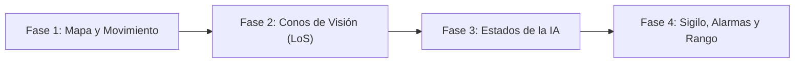

# Juego de Sigilo e Infiltración Top-Down

<p align="center">
  
</p>

---

## 1. Why?

Aunque juegos como *Castle Wolfenstein* sentaron las bases en los 80, fue la saga *Metal Gear* (y en particular sus *VR Missions*) la que codificó el sigilo moderno. A nivel de ingeniería, este género invierte la lógica tradicional de los videojuegos: el objetivo ya no es colisionar con los enemigos (dispararles), sino evitar a toda costa que esa colisión lógica (visual o auditiva) ocurra.

Este proyecto te introducirá a uno de los conceptos matemáticos más importantes en el desarrollo de videojuegos: el **Line of Sight (Línea de Visión)** utilizando el algoritmo de Bresenham o Raycasting básico. Además, te obligará a dominar las **Máquinas de Estados Finitos (FSM)** más complejas hasta ahora, ya que la IA enemiga no solo se mueve, sino que tiene "memoria" a corto plazo (fases de Patrulla, Sospecha, Alerta y Búsqueda), alterando radicalmente las reglas del juego según su estado emocional.

---

## 2. Enunciado Formal

Debes desarrollar un videojuego de sigilo táctico 2D con vista cenital (*Top-down*). El jugador controlará a un espía que debe infiltrarse en un complejo, recuperar un disco de datos clasificado y llegar al punto de extracción.

El mapa estará custodiado por guardias con conos de visión y cámaras de seguridad. El jugador podrá caminar (hace ruido) o arrastrarse (silencioso pero lento, y reduce su perfil visual). Si el jugador entra en el cono de visión de un guardia y no hay paredes bloqueando la vista, el guardia entrará en estado de "Alerta", persiguiendo al jugador. Si el jugador es atrapado, la partida termina. Al completar la misión, el juego calculará un Rango (S, A, B, C) basado en el tiempo tardado y el número de veces que el jugador fue detectado, guardando este historial en un archivo binario.

---

## 3. Hitos de Desarrollo Sugeridos

La dificultad aquí radica en la geometría y la IA. Construye el juego de la siguiente manera:



### Fase 1: Mapa y Movimiento Fluido
Carga un mapa desde un archivo `.txt` (Paredes, Suelo, Cajas, Extracción). Dibuja el entorno en SDL3. Implementa al jugador con movimiento libre (usando coordenadas `float` en lugar de estar anclado a la cuadrícula). Agrega un botón para alternar entre postura "De Pie" y "Agachado/Arrastrándose", cambiando la velocidad de movimiento.

### Fase 2: Conos de Visión y Raycasting (Línea de Visión)
Coloca a los guardias en el mapa. Dibuja un "cono" visual frente a ellos (puede ser un triángulo o un trapecio). Implementa la lógica de colisión: si el jugador entra en el área matemática del cono, traza una línea invisible (usando el algoritmo de Bresenham) desde el guardia hasta el jugador. Si esa línea atraviesa una "Pared" o una "Caja", el jugador no es visto. Si la línea está despejada, el jugador es detectado.

### Fase 3: Máquina de Estados Enemiga (IA)
Programa el cerebro del guardia. Define una ruta de patrulla (una serie de puntos $x, y$ entre los cuales el guardia se moverá cíclicamente). Si el guardia detecta al jugador, cambia su estado a `ALERTA` y comienza a seguir las coordenadas del jugador. Si pierde de vista al jugador por $X$ segundos, cambia a `BUSQUEDA` (movimiento errático) y finalmente vuelve a `PATRULLA`.

### Fase 4: Objetivos, HUD y Persistencia
Coloca el objetivo (el disco) en el mapa. Dibuja un HUD (Interfaz) que muestre el estado global del complejo (NORMAL, ALERTA). Cuando el jugador llegue a la salida con el disco, calcula su puntuación y guarda su Rango en un archivo persistente.

---

## 4. Consideraciones Técnicas y Paradigmas

* **El Algoritmo de Bresenham**: Para el *Line of Sight* en una cuadrícula, este algoritmo es indispensable. Te permite calcular qué celdas de tu matriz son atravesadas por una línea recta entre el Punto A (Guardia) y el Punto B (Jugador).
* **Normalización de Vectores**: Si tu personaje se mueve a velocidad $V$ y presiona ARRIBA y DERECHA al mismo tiempo, matemáticamente se moverá más rápido en diagonal ($V \times \sqrt{2}$). Debes "normalizar" el vector de movimiento para que la velocidad sea constante en todas las direcciones.
* **Sistemas de Ruido (Radios Audibles)**: Además de la vista, puedes crear un radio invisible alrededor del jugador. Si corre, el radio tiene $50$ píxeles; si se arrastra, $0$ píxeles. Si el centro de un guardia entra en este círculo de ruido, el guardia se girará inmediatamente hacia esa dirección.
* **Compilación Automatizada con Makefile**:

  Ejemplo sugerido de `Makefile`:
  ```makefile
  CC = gcc
  CFLAGS = -Wall -Wextra -std=c11 -Iinclude
  LDFLAGS = -lSDL3 -lm

  SRCS = src/main.c src/mapa.c src/linea_vision.c src/ia.c src/jugador.c
  OBJS = $(SRCS:.c=.o)
  TARGET = stealth_vr

  all: $(TARGET)

  $(TARGET): $(OBJS)
  	$(CC) $(OBJS) -o $(TARGET) $(LDFLAGS)

  %.o: %.c
  	$(CC) $(CFLAGS) -c $< -o $@

  clean:
  	rm -f $(OBJS) $(TARGET)

  .PHONY: all clean
  ```

---

## 5. Arquitectura de Datos y Persistencia

### Modelado de Estructuras en C
```c
#include <stdbool.h>
#include <SDL3/SDL.h>

#define MAX_WAYPOINTS 10
#define MAX_GUARDIAS 20

// Estados de la IA (FSM)
typedef enum {
    ESTADO_PATRULLA,  // Caminando por su ruta predefinida
    ESTADO_SOSPECHA,  // Escuchó un ruido, mirando a ese punto
    ESTADO_ALERTA,    // Vio al jugador, persiguiendo
    ESTADO_BUSQUEDA   // Perdió de vista al jugador, buscando en la zona
} EstadoGuardia;

// Postura del Jugador
typedef enum {
    POSTURA_PIE,
    POSTURA_AGACHADO
} Postura;

// Entidad del Jugador
typedef struct {
    float x, y;
    Postura postura;
    bool tieneDisco;
} Jugador;

// Entidad del Guardia
typedef struct {
    float x, y;
    float anguloMirada;         // En grados o radianes
    EstadoGuardia estado;
    SDL_Point ruta[MAX_WAYPOINTS];
    int waypointActual;
    int numWaypoints;
    Uint64 temporizadorAlerta;  // Para saber cuándo volver a patrullar
} Guardia;

// El Estado del Mundo
typedef struct {
    int matrizMapa[50][50];
    Guardia guardias[MAX_GUARDIAS];
    Jugador jugador;
    bool estadoGlobalAlerta;    // Si es true, suenan las sirenas
    int vecesDescubierto;
    Uint64 tiempoInicioMs;
} Mision;

// Registro de Estadísticas
typedef struct {
    char iniciales[4];
    int mejorTiempoSegundos;
    int menosVecesDescubierto;
    char rangoSAB;              // 'S', 'A', 'B', 'C'
} RegistroMision;
```

### Persistencia (`service_record.dat`)
Para juegos basados en misiones, la persistencia registra la maestría. Al finalizar la misión, debes leer el archivo binario. Si el jugador logró un mejor tiempo o un mejor rango que la vez anterior, sobrescribes el registro utilizando `fwrite`.

---

## 6. Recomendaciones de Flujo y UI (SDL3)

* **Renderizado del Cono de Visión**: Para que el jugador sepa por dónde puede pisar, dibuja el cono de visión usando polígonos rellenos semitransparentes en SDL3 (Alpha en 100). Si el estado del guardia es `PATRULLA`, dibújalo azul/verde. Si es `ALERTA`, dibújalo rojo sangre.
* **El Icónico "!" (Exclamación)**: Feedback visual puro. Cuando la variable estado de un guardia cambie de `PATRULLA` a `ALERTA`, pausa temporalmente el movimiento de ese guardia por $0.5$ segundos, dibuja un "!" gigante sobre su cabeza y, si implementas audio, reproduce un sonido estridente.
* **La Vista de Radar (Mini-mapa)**: Es un clásico del género. En una esquina de la pantalla, dibuja una versión a escala reducida de tu `matrizMapa`, donde el jugador es un punto verde y los enemigos son puntos rojos (que desaparecen o se vuelven visibles dependiendo de las reglas del radar).

---

## 7. Casos Borde y Manejo de Errores

* **Visión de Rayos X (*Glitches de LoS*)**: Si tu algoritmo de *Line of Sight* no es robusto, el guardia podría ver al jugador a través de las esquinas de los muros (*Corner clipping*). Asegúrate de revisar las celdas adyacentes a la línea matemática trazada para evitar que la visión atraviese huecos diagonales.
* **Atascos en la Fase de Alerta**: Si el guardia cambia a `ESTADO_ALERTA` e intenta perseguir al jugador, un simple movimiento en línea recta ($x \mathrel{+}= \text{velocidad}$) hará que el guardia se quede atascado chocando contra una pared si el jugador da la vuelta a una esquina. La IA necesitará un rudimentario seguidor de bordes o *pathfinding*.
* **Rotación Instantánea (*Snap Rotation*)**: Si un guardia llega a un waypoint y de repente debe mirar hacia atrás, no cambies su `anguloMirada` de $0^\circ$ a $180^\circ$ en un solo frame, o el jugador no tendrá tiempo de reacción. Implementa una rotación gradual matemática (interpolar el ángulo) para que el cono de visión barra la habitación como un faro.

---

## 8. Verificadores de Funcionamiento (Checklist)

Para que el proyecto se considere exitoso, debes cumplir con:

- [ ] **Compilación y Limpieza**: Makefile funciona, compilando el proyecto libre de advertencias y vinculando la librería matemática `-lm`.
- [ ] **Geometría y Colisión**: El jugador choca correctamente con cajas y paredes, y el cono de visión de los enemigos no atraviesa muros de hormigón.
- [ ] **Mecánica de Detección**: El jugador puede esquivar el cono visual. Si es tocado por él con línea de visión despejada, el guardia es alertado.
- [ ] **Comportamiento Reactivo (IA)**: Los guardias siguen una ruta predefinida y abandonan su ruta para perseguir al jugador si lo detectan.
- [ ] **Lógica de Misión**: El jugador puede recoger el objetivo, alcanzar la extracción, y el sistema discrimina correctamente si cumplió la misión (Victoria) o fue tocado por un guardia (Derrota).
- [ ] **Persistencia y Rangos**: El sistema calcula un rango final y guarda las mejores estadísticas del jugador en el disco duro.

---

## 9. Desafíos Opcionales (Bonus)

¿Buscas destacar? Intenta incorporar estas características avanzadas:

1. **Pathfinding Táctico (A*)**: Integra el algoritmo **A*** para que, durante el estado de Búsqueda o Alerta, el guardia calcule la ruta más corta y realista para rodear paredes y llegar a la última posición conocida del jugador.
2. **Cámaras de Seguridad y Puntos Ciegos**: Agrega entidades estáticas (Cámaras) que barren su cono de visión de izquierda a derecha. Permite que el jugador, si está en estado "Arrastrándose" y pegado exactamente a la pared debajo de la cámara, evite ser detectado (aprovechando el punto ciego cónico).
3. **Señuelos y Distracciones (*Knocking*)**: Implementa una mecánica donde el jugador pueda presionar una tecla para "golpear la pared" o lanzar un cargador vacío. Esto crea un círculo de ruido en esa coordenada. Cualquier guardia dentro del radio cambiará a `ESTADO_SOSPECHA` e irá a investigar esa coordenada exacta antes de volver a su ruta.

