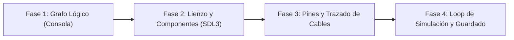

# Simulador de Circuitos Lógicos

<p align="center">
  
</p>

---

## 1. Why?
Desarrollar un simulador de circuitos digitales marca una transición monumental: estás pasando del desarrollo de videojuegos al desarrollo de herramientas y software de simulación computacional.

A nivel de ingeniería, un circuito lógico no es más que un Grafo Dirigido (Directed Graph). Este proyecto te obligará a abandonar las matrices bidimensionales que usaste en Tetris o Pac-Man y a abrazar las estructuras de datos interconectadas mediante punteros (Nodos y Aristas). Aprenderás a programar interfaces gráficas basadas en nodos (Node-based UI), a gestionar el "Drag & Drop" (arrastrar y soltar) de elementos en un lienzo infinito, y a implementar algoritmos de evaluación topológica para simular la propagación de corriente eléctrica a través de operadores del Álgebra de Boole.

## 2. Enunciado Formal
Debes desarrollar una herramienta de software interactiva en 2D que permita al usuario diseñar y simular circuitos digitales. El programa presentará un lienzo (Canvas) donde el jugador podrá instanciar, arrastrar y posicionar distintos tipos de componentes: Entradas (Interruptores), Salidas (LEDs) y Compuertas Lógicas (AND, OR, NOT, XOR).

El usuario podrá interactuar con los "Pines" de cada componente para trazar cables visuales que conecten la salida de una compuerta con la entrada de otra. El simulador debe evaluar el circuito en tiempo real: si el usuario hace clic en un interruptor para encenderlo, la señal (1 lógico) debe viajar por los cables, ser procesada por las compuertas y encender o apagar los LEDs correspondientes basándose en tablas de verdad. Finalmente, el usuario debe poder guardar el diseño de su circuito en un archivo y cargarlo posteriormente.

## 3. Hitos de Desarrollo Sugeridos
La complejidad geométrica de las conexiones exige un orden estricto. Construye el simulador así:



- **Fase 1: El Grafo Lógico Base (Modo Consola):** Olvida los gráficos. Diseña las estructuras de datos (`struct`) para los Nodos (compuertas) y los Cables (punteros entre nodos). Escribe funciones para conectar manualmente el Nodo A con el Nodo B en código. Implementa la función `evaluarCircuito()` y prueba en la terminal si conectar un Switch(ON) a una compuerta NOT te imprime un resultado 0.
- **Fase 2: Lienzo y Componentes (UI en SDL3):** Integra SDL3. Implementa el renderizado de un lienzo con cuadrícula. Dibuja rectángulos que representen a los componentes. Implementa la lógica de interacción del ratón: detectar si se hace clic sobre el cuerpo de una compuerta y actualizar sus coordenadas ($x, y$) mientras se mantiene presionado el botón izquierdo (Drag & Drop).
- **Fase 3: Interacción de Pines y Cables (Wiring):** Añade "Pines" (pequeños cuadrados o círculos) a los bordes de tus compuertas. Implementa la máquina de estados del ratón: si el usuario hace clic en un pin de salida y arrastra, dibuja una línea temporal. Si suelta el ratón sobre un pin de entrada, instancia en memoria la conexión (crea un Cable) y dibuja una línea permanente entre ambos.
- **Fase 4: Bucle de Simulación y Persistencia:** Haz que el bucle principal evalúe el estado de todas las compuertas y cambie el color de los cables vivos (ej. Verde para Alto/1, Negro para Bajo/0). Permite interactuar con los interruptores. Implementa un sistema que serialice el grafo (guardando IDs, tipos, posiciones y conexiones) a un archivo binario.

## 4. Consideraciones Técnicas y Paradigmas
- **Evaluación por "Ticks" (Update Loop):** Evita usar recursividad directa para evaluar el circuito (ej. pedirle al LED su estado, que este le pregunte a la compuerta, y así hacia atrás). Si el usuario crea un bucle (conectar la salida de un OR a su propia entrada), la recursividad causará un Stack Overflow. Usa un enfoque iterativo: en cada frame (o tick de simulación), lee las entradas de cada compuerta del frame anterior y calcula la salida del frame actual.
- **Separación de Modelo y Vista:** El concepto de "Cable" en la lógica es solo un puntero o un índice indicando Nodo_A $\to$ Nodo_B. En la vista, el "Cable" es una rutina de dibujo lineal desde ($x_1, y_1$) hasta ($x_2, y_2$). Mantén ambos conceptos separados.
- **Manejo Dinámico de Memoria:** Un usuario puede instanciar docenas de compuertas y borrarlas a voluntad. Necesitarás listas enlazadas (Linked Lists) o arreglos dinámicos para gestionar la creación y destrucción en tiempo de ejecución, usando `malloc` y `free` con extremo cuidado para no dejar cables apuntando a memoria liberada (Punteros Colgantes / Dangling Pointers).
- **Compilación Automatizada con Makefile:**
  Ejemplo sugerido de Makefile:

```makefile
CC = gcc
CFLAGS = -Wall -Wextra -std=c11 -Iinclude
LDFLAGS = -lSDL3 -lm

SRCS = src/main.c src/canvas.c src/logica_booleana.c src/grafos.c src/interfaz.c
OBJS = $(SRCS:.c=.o)
TARGET = logicsim

all: $(TARGET)

$(TARGET): $(OBJS)
	$(CC) $(OBJS) -o $(TARGET) $(LDFLAGS)

%.o: %.c
	$(CC) $(CFLAGS) -c $< -o $@

clean:
	rm -f $(OBJS) $(TARGET)

.PHONY: all clean
```

## 5. Arquitectura de Datos y Persistencia

### Modelado de Estructuras en C
El modelado de un grafo requiere referencias claras. Cada pin de entrada solo puede recibir un cable, pero un pin de salida puede enviar múltiples cables (Fan-out).

```c
#include <stdbool.h>
#include <SDL3/SDL.h>

#define MAX_PINES_IN 2
#define MAX_CONEXIONES_OUT 10

typedef enum {
    TIPO_SWITCH, // Entrada manual
    TIPO_LED,    // Salida visual
    TIPO_AND,
    TIPO_OR,
    TIPO_NOT,
    TIPO_XOR
} TipoComponente;

// Declaración adelantada para referenciar dentro del cable
struct Nodo;

typedef struct {
    struct Nodo* origen;
    int pinOrigen; // Índice del pin de salida
    struct Nodo* destino;
    int pinDestino; // Índice del pin de entrada
    bool estadoActual; // 0 o 1
} Cable;

typedef struct Nodo {
    int id;
    TipoComponente tipo;
    SDL_FRect rectVisual; // Posición y tamaño en pantalla
    
    // Entradas lógicas (0 o 1) para el cálculo del tick actual
    bool valoresEntrada[MAX_PINES_IN];
    Cable* cablesEntrada[MAX_PINES_IN]; // Qué cables llegan aquí
    
    // Salida lógica
    bool valorSalida;
    Cable* cablesSalida[MAX_CONEXIONES_OUT]; // A dónde envío mi señal
    int numCablesSalida;
    
    struct Nodo* siguiente; // Para la lista enlazada de Nodos en el lienzo
} Nodo;

// El Lienzo / Simulador
typedef struct {
    Nodo* cabezaNodos;     // Inicio de la lista de componentes
    Cable* cabezaCables;   // (Opcional) Lista separada para iterar cables visuales
    int generadorIds;
    float offsetCamaraX;   // Para mover el lienzo (Pan)
    float offsetCamaraY;
} Simulador;
```

### Persistencia (`circuito.bin` o `.json`)
Guardar grafos es un problema clásico. No puedes guardar punteros en disco (las direcciones de memoria cambiarán al cargar). Debes guardar los IDs de los nodos.
1. Guarda la lista de todos los Nodos (guardando su `id`, `tipo`, `x`, `y`).
2. Guarda la lista de todas las conexiones (`id_origen`, `pin_origen`, `id_destino`, `pin_destino`).
3. Al cargar, primero instancias todos los nodos y luego, mediante una función de búsqueda por ID, reconstruyes los punteros de los cables.

## 6. Recomendaciones de Flujo y UI (SDL3)
- **Feedback Visual Táctil (Hover):** Cuando el ratón pase por encima de un pin, dibuja un círculo resaltado alrededor de él. Esto ayuda al usuario a saber que está a punto de interactuar con el sistema de cables y no simplemente arrastrar la compuerta.
- **Colores de la Lógica:** El estándar industrial es claro: los cables y pines con estado Bajo (0) se dibujan en azul oscuro o negro, y los que tienen estado Alto (1) se dibujan en verde brillante o rojo intenso.
- **Trazado Elegante (Opcional):** Aunque dibujar una línea recta con `SDL_RenderLine()` es funcional, los simuladores profesionales dibujan curvas de Bézier cúbicas, o bien líneas ortogonales (Línea horizontal $\to$ Línea vertical $\to$ Línea horizontal) para que el circuito parezca un plano real.

## 7. Casos Borde y Manejo de Errores
- **Eliminación de Nodos (El efecto cascada):** Si el usuario selecciona una compuerta OR y presiona la tecla Suprimir, no basta con hacer `free()` a ese nodo. Debes iterar sobre todos sus pines de entrada y salida, destruir los Cables conectados, y setear a `NULL` los punteros correspondientes en los componentes vecinos. Fallar en esto provocará un Segmentation Fault inmediato.
- **Entradas Flotantes (Floating Inputs):** Si una compuerta AND tiene un pin conectado y otro desconectado, ¿cuál es el valor del pin desconectado? Define un estándar en tu motor (por defecto, los pines no conectados deben leerse como 0 lógico).
- **Cortocircuitos Conceptuales:** Evita físicamente por interfaz que el usuario pueda conectar una Salida con otra Salida. Un cable siempre debe conectar un origen OUT a un destino IN.

## 8. Verificadores de Funcionamiento (Checklist)
- [ ] **Compilación:** El Makefile construye el proyecto sin advertencias.
- [ ] **Drag & Drop:** Es posible crear múltiples componentes, seleccionarlos con el ratón y moverlos libremente por la pantalla sin que parpadeen ni se solapen de forma extraña.
- [ ] **Cableado (Wiring):** Se pueden trazar cables válidos de salidas a entradas, y las líneas visuales siguen a los nodos si estos son movidos de lugar.
- [ ] **Álgebra de Boole:** Las compuertas procesan las entradas correctamente. Un AND con 1 y 0 emite 0. Un XOR con 1 y 1 emite 0, etc.
- [ ] **Propagación:** Activar un Switch actualiza de inmediato el color del cable, el estado de la compuerta, y finalmente enciende el LED correspondiente al final de la cadena.
- [ ] **Gestión de Memoria Segura:** Borrar nodos y cables funciona correctamente sin crashear el programa.
- [ ] **Serialización:** Los circuitos pueden ser guardados en disco y recuperados manteniendo las conexiones intactas.

## 9. Desafíos Opcionales (Bonus)
- **Circuitos Secuenciales (Relojes y Flip-Flops):** Agrega el factor tiempo. Introduce un componente Reloj (Clock) que alterne su salida entre 0 y 1 automáticamente cada 500ms. Luego, implementa un "Latches" o un Flip-Flop tipo D para crear memoria en el circuito. (Cuidado con los bucles lógicos infinitos en el mismo tick).
- **Encapsulamiento (Circuitos Integrados Custom):** Permite que el usuario seleccione un conjunto de compuertas (ej. dos XOR, dos AND y un OR para un Sumador Completo), haga clic en "Empaquetar" y el sistema colapse todo en un solo bloque visual ("IC") que tenga las entradas y salidas correspondientes.
- **Generador de Tablas de Verdad:** Añade un botón que analice automáticamente cuántas Entradas y Salidas hay en el lienzo, simule todas las combinaciones posibles ($2^N$ estados) de forma oculta en memoria, y despliegue una ventana o exporte un `.txt` con la Tabla de Verdad matemática completa del circuito.
