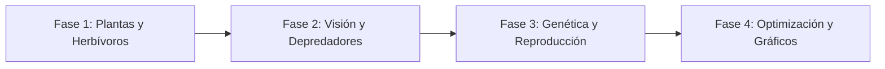

# Ecosistema de Vida Artificial

<p align="center">
  
</p>

---

## 1. Why?
Desarrollar un Simulador de Vida Artificial (basado en modelado basado en agentes o *Agent-based modeling*) representa un salto hacia la programación de sistemas complejos y comportamientos emergentes.

Aquí no hay jugador. Eres un observador (y creador) de un ecosistema que funciona bajo sus propias reglas. A nivel de ingeniería, este proyecto te enfrentará al brutal desafío del rendimiento algorítmico (el problema de colisión $\mathcal{O}(N^2)$) y a la gestión dinámica agresiva de memoria, ya que las entidades nacerán y morirán por miles de forma impredecible. Además, introducirás conceptos de algoritmos genéticos elementales, viendo cómo la evolución selecciona características puramente matemáticas en la pantalla.

## 2. Enunciado Formal
Debes desarrollar una simulación 2D en tiempo real (cero intervención del usuario durante la ejecución) de un ecosistema cerrado. El entorno contendrá tres tipos de entidades que interactúan mediante la transferencia de energía:

- **Productores (Plantas):** Aparecen y se reproducen pasivamente consumiendo recursos ambientales invisibles. No se mueven.
- **Consumidores (Herbívoros):** Se mueven buscando Productores. Gastan energía al moverse y mueren si su energía llega a cero. Si acumulan suficiente energía, se reproducen.
- **Depredadores (Carnívoros):** Persiguen y consumen a los Herbívoros para obtener energía.

Cada criatura móvil (consumidor y depredador) tendrá un "Genoma" con atributos (ej. Velocidad, Rango de Visión). Al reproducirse, la cría heredará los atributos de sus padres con una ligera probabilidad de mutación (variación aleatoria). El programa debe renderizar la simulación y mostrar estadísticas en tiempo real. Opcionalmente, se podrá guardar el estado del ecosistema o sus estadísticas históricas.

## 3. Hitos de Desarrollo Sugeridos
Construir un ecosistema equilibrado es extremadamente difícil; tiende a la extinción masiva rápidamente. Avanza capa por capa:



- **Fase 1: Productores y Herbívoros (Termodinámica Base):** Implementa el mapa y las estructuras de entidades. Haz que las Plantas aparezcan aleatoriamente. Implementa a los Herbívoros moviéndose al azar. Programa el ciclo de energía: un Herbívoro pierde $1$ unidad de energía por frame; si toca una Planta, la Planta desaparece y el Herbívoro gana $50$ unidades. Si llega a $0$, el Herbívoro muere (libera su memoria).
- **Fase 2: Sistemas Sensoriales y Depredadores:** Añade a los Carnívoros. Ahora el movimiento no puede ser totalmente al azar. Implementa un "Rango de Visión". Un Carnívoro debe iterar sobre la lista de Herbívoros y, si hay uno dentro de su radio, cambiar su vector de dirección hacia él. Si el Carnívoro alcanza al Herbívoro, lo elimina y roba su energía.
- **Fase 3: Reproducción y Mutaciones (Genética):** Define la regla de oro reproductiva: Si una entidad supera un umbral de energía (ej. $> 150$), gasta el $50\%$ de esa energía para instanciar una nueva criatura. Al crearla, copia su Genoma. Luego, aplica una función de mutación que sume o reste un valor aleatorio pequeño (ej. $\pm 5\%$) a la Velocidad o al Tamaño de la cría.
- **Fase 4: Interfaz de Métricas y Equilibrio:** Dibuja gráficos o textos en SDL3 (usando `SDL3_ttf`) mostrando la cantidad actual de cada especie. Ajusta los valores mágicos (energía ganada al comer, coste de moverse) hasta lograr que el sistema sea cíclico (simulando las ecuaciones de Lotka-Volterra) y no colapse en 10 segundos.

## 4. Consideraciones Técnicas y Paradigmas
- **El Costo del Movimiento (Trade-offs):** La evolución matemática requiere desventajas. Si un mutante nace con el doble de Velocidad, debe consumir el doble de energía por frame. Si no programas este balance, la simulación degenerará en criaturas moviéndose a la velocidad de la luz instantáneamente.
- **Optimización Espacial (Grid / Spatial Hashing):** Si tienes 1,000 depredadores y 1,000 herbívoros, calcular la distancia euclidiana entre todos ellos en cada frame requiere $1,000,000$ de operaciones matemáticas continuas (raíces cuadradas). Para optimizar esto, divide el mapa en "sectores" o usa una cuadrícula; un depredador solo debe buscar presas que estén registradas en su misma celda o en las adyacentes.
- **Gestión de Listas (Borrado Seguro):** Dado que las entidades mueren en medio del bucle principal, si usas un arreglo, ten cuidado al eliminar un índice. Lo ideal es recorrer la lista al revés, o usar una bandera `bool viva` y luego hacer una pasada de limpieza ("Garbage Collection") al final del frame para compactar arreglos o liberar listas enlazadas.
- **Compilación Automatizada con Makefile:**
  Ejemplo sugerido de Makefile:

```makefile
CC = gcc
CFLAGS = -Wall -Wextra -std=c11 -Iinclude -O2  # -O2 es crucial aquí para rendimiento
LDFLAGS = -lSDL3 -lSDL3_ttf -lm

SRCS = src/main.c src/ecosistema.c src/entidades.c src/genetica.c src/render.c
OBJS = $(SRCS:.c=.o)
TARGET = alife_sim

all: $(TARGET)

$(TARGET): $(OBJS)
	$(CC) $(OBJS) -o $(TARGET) $(LDFLAGS)

%.o: %.c
	$(CC) $(CFLAGS) -c $< -o $@

clean:
	rm -f $(OBJS) $(TARGET)

.PHONY: all clean
```

## 5. Arquitectura de Datos y Persistencia

### Modelado de Estructuras en C
El diseño de datos debe enfocarse en la agrupación y en diferenciar propiedades de estado (dinámicas) de propiedades genéticas (heredables).

```c
#include <stdbool.h>
#include <SDL3/SDL.h>

typedef enum {
    TIPO_PRODUCTOR,
    TIPO_HERBIVORO,
    TIPO_CARNIVORO
} TipoEntidad;

// El "ADN" que muta
typedef struct {
    float velocidad;
    float radioVision;
    float tamano;               // Afecta el área de colisión
    int colorR, colorG, colorB; // ¡Puede mutar para camuflaje!
} Genoma;

// La entidad individual
typedef struct Entidad {
    int id;
    TipoEntidad tipo;
    
    // Estado Físico
    float x, y;
    float dx, dy;               // Vector de dirección actual
    
    // Estado Biológico
    float energiaActual;
    float edad;
    bool viva;
    
    // Genética
    Genoma adn;
    
    // Punteros para lista enlazada (opcional, o usar arreglos estáticos grandes)
    struct Entidad* siguiente;
} Entidad;

// El Mundo (Manejador de entidades)
typedef struct {
    float ancho, alto;
    Entidad* cabezaPlantas;
    Entidad* cabezaHerbivoros;
    Entidad* cabezaCarnivoros;
    int poblacionPlantas;
    int poblacionHerbivoros;
    int poblacionCarnivoros;
    Uint64 tickActual;
} Ecosistema;
```

### Persistencia (Opcional)
En lugar de guardar la partida para "continuar jugando", aquí es más interesante crear un Data Logger. Abre un archivo `.csv` al inicio en modo append (`"a"`) y, cada $100$ frames, escribe una línea: `Tick,Plantas,Herbivoros,Carnivoros,VelocidadPromedio`. Podrás graficar esto en Excel o Python después.

## 6. Recomendaciones de Flujo y UI (SDL3)
- **Controles de Tiempo (Time Scale):** Este tipo de simulaciones a veces requiere esperar minutos para ver cambios evolutivos. Implementa las teclas `+` y `-` para aumentar la variable de velocidad de la simulación, procesando la función lógica `update()` múltiples veces por cada función `render()`.
- **Visualización de Genomas:** Dibuja a los depredadores y presas como formas geométricas simples (círculos o triángulos). Usa el atributo `tamano` de su genoma para escalar el radio de dibujo con `SDL_RenderGeometry()`. Usa sus genes RGB para pintarlos. Con el tiempo, verás físicamente a la población cambiar de color.
- **Depuración Visual (Debug View):** Asigna la tecla `TAB` para alternar una vista técnica que dibuje líneas rectas entre los depredadores y sus presas actuales, y círculos vacíos representando sus radios de visión.

## 7. Casos Borde y Manejo de Errores
- **El Apocalipsis Instantáneo:** Al arrancar, si los herbívoros comen demasiado rápido, extinguirán las plantas y luego morirán de hambre. Solución: Las plantas deben aparecer a un ritmo garantizado (ej. 5 por frame mínimo) independientemente de la reproducción natural, emulando la energía solar.
- **Superpoblación Creadora de Lag:** Si los depredadores mueren y los herbívoros no tienen límite reproductivo, tendrás 50,000 entidades en pantalla y tu CPU colapsará. Establece un "Límite Máximo" (*Hard Cap*) de entidades por especie, o introduce una mecánica de "Vejez" donde la energía máxima disminuye con los ciclos para garantizar la muerte.
- **Movimiento Tembloroso (Jittering):** Si una entidad busca el centro exacto de otra y ambos se mueven en cada frame, pueden entrar en un bucle donde vibran en el lugar corrigiendo su ángulo infinitamente. Implementa un "radio de alcance" (ej. si la distancia $< 5$ píxeles, se considera que ya la atrapó).

## 8. Verificadores de Funcionamiento (Checklist)
- [ ] **Compilación y Rendimiento:** Uso de la bandera `-O2` en el Makefile. El juego puede manejar al menos 1,000 entidades simultáneas a 60 FPS.
- [ ] **Ciclo Termodinámico:** Las criaturas gastan energía constantemente y la recuperan comiendo. Mueren al llegar a 0.
- [ ] **Sistemas Perceptivos:** Los cazadores no se mueven de forma puramente aleatoria si hay comida cerca.
- [ ] **Herencia Genética:** Al reproducirse, la criatura hija recibe las estadísticas del padre.
- [ ] **Mutación Matemática:** Existe una pequeña probabilidad matemática de que las estadísticas cambien (positiva o negativamente) al nacer.
- [ ] **Estabilidad Relativa:** El ecosistema puede sobrevivir por sí solo durante al menos 5 minutos sin que ocurra una extinción total de todas las especies móviles.

## 9. Desafíos Opcionales (Bonus)
- **Partición Espacial (QuadTree o Grid):** Implementa una estructura de datos QuadTree para optimizar drásticamente la detección de colisiones y el chequeo visual, permitiéndote pasar de 1,000 entidades a 10,000 o más en pantalla.
- **Ciclos Ambientales (Estaciones):** Añade una variable global de temperatura que suba y baje con el tiempo (simulando invierno y verano). Haz que las plantas crezcan mucho más lento en invierno, y que las criaturas que mutaron con un genoma de "grasa/tamaño" resistan mejor el consumo de energía en el frío.
- **Especiación y Aislamiento:** Coloca un río (muro de agua) en el medio del mapa que pocas entidades puedan cruzar. Observa cómo la especie de la mitad izquierda puede evolucionar con colores o tamaños distintos a los de la mitad derecha debido al aislamiento geográfico.
