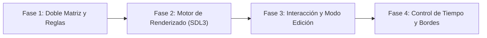

# Juego de la Vida de Conway

<p align="center">
  
</p>

---

## 1. Why?
Ideado por el matemático británico John Horton Conway en 1970, el Juego de la Vida no es un juego tradicional, sino un "juego de cero jugadores" basado en un autómata celular. Su magia radica en la emergencia: cómo patrones increíblemente complejos, caóticos o simétricos nacen a partir de cuatro reglas matemáticas extremadamente simples.

Desde la perspectiva de la arquitectura de software, este proyecto es un rito de iniciación absoluto para comprender el concepto de Doble Búfer (Double Buffering) en la gestión de memoria. Aprenderás por qué no puedes actualizar una matriz al mismo tiempo que la estás leyendo, y dominarás la iteración eficiente de arreglos bidimensionales masivos. Además, es un excelente ejercicio para construir interfaces de usuario (UI) de simulación, alternando entre modos de edición (pausa) y ejecución.

## 2. Enunciado Formal
Debes desarrollar un simulador de autómatas celulares en 2D. El mundo consiste en una cuadrícula (finita o toroidal) de celdas que pueden estar en uno de dos estados: Vivas o Muertas.

El jugador interactuará con el lienzo vacío usando el ratón para "pintar" o "borrar" celdas vivas, estableciendo la semilla o estado inicial. Al presionar "Play", la simulación avanzará generación tras generación (turnos) basándose en las 4 reglas estándar de Conway:

1. **Subpoblación:** Una celda viva con menos de 2 vecinas vivas, muere.
2. **Supervivencia:** Una celda viva con 2 o 3 vecinas vivas, sobrevive.
3. **Sobrepoblación:** Una celda viva con más de 3 vecinas vivas, muere.
4. **Reproducción:** Una celda muerta con exactamente 3 vecinas vivas, nace (se vuelve viva).

El programa debe permitir pausar, reanudar, limpiar el tablero y controlar la velocidad de las generaciones. Opcionalmente, podrá cargar o guardar patrones iniciales en un archivo.

## 3. Hitos de Desarrollo Sugeridos
El riesgo principal de este proyecto es corromper el cálculo de vecinos. Sigue estos pasos para aislar la lógica de la interfaz:



- **Fase 1: Doble Matriz y Lógica Pura (Modo Consola):** Olvida SDL3 por ahora. Crea dos matrices de enteros o booleanos del mismo tamaño. Inicializa una con un patrón simple (como un bloque de 3x1 que formará un oscilador). Escribe la función que cuenta los vecinos de una celda ($x, y$). Escribe la función que lee la Matriz A, aplica las reglas y guarda el resultado en la Matriz B. Imprime la matriz en consola.
- **Fase 2: Motor de Renderizado en SDL3:** Lleva tus matrices a SDL3. Dibuja un rectángulo blanco (o de color) por cada celda viva, y fondo negro para las muertas. Implementa el intercambio de buffers (Buffer Swap): después de calcular la Matriz B basándote en la A, haz que tu puntero de lectura ahora apunte a la B, y usa la A para escribir la siguiente generación.
- **Fase 3: Interacción y Modo Edición:** Introduce una variable de estado para saber si el juego está en PAUSA o REPRODUCIENDO. Si está en pausa, captura los eventos del ratón (`SDL_EVENT_MOUSE_BUTTON_DOWN` y el movimiento arrastrado). Convierte los píxeles del ratón a índices de la matriz y permite al usuario "dibujar" celdas vivas y "borrar" con el clic derecho.
- **Fase 4: Control de Tiempo, Bordes y Limpieza:** Implementa un temporizador: la simulación no debe avanzar a 1000 generaciones por segundo. Permite ajustar el retardo (ej. de 50 ms a 500 ms por generación). Decide cómo manejarás los bordes de la pantalla (paredes rígidas o mundo "pac-man" que se conecta de lado a lado). Añade una tecla para limpiar todo el tablero.

## 4. Consideraciones Técnicas y Paradigmas
- **El Problema del Doble Búfer:** Si lees la celda ($0,0$), determinas que debe morir, y la cambias a muerta inmediatamente en tu única matriz, cuando vayas a calcular los vecinos de la celda ($0,1$), leerás el nuevo estado de ($0,0$), arruinando la simulación. Siempre lee del Buffer Actual, y escribe exclusivamente en el Buffer Siguiente. Al terminar el frame, intercámbialos.
- **Mundo Toroidal (Módulo Matemático):** Para hacer que el mapa sea infinito visualmente (si una forma sale por la derecha, entra por la izquierda), al buscar vecinos usa el operador módulo `%`. El vecino a la izquierda de $x = 0$ es `(x - 1 + ANCHO) % ANCHO`.
- **Optimización Cero (Early Exit):** Si un bloque de 10x10 está completamente vacío, calcular sus vecinos es una pérdida de CPU. Aunque no es estrictamente necesario para tableros pequeños, en tableros masivos puedes llevar un registro de "zonas activas" para no procesar áreas muertas.
- **Compilación Automatizada con Makefile:**
  Ejemplo sugerido de Makefile:

```makefile
CC = gcc
CFLAGS = -Wall -Wextra -std=c11 -Iinclude
LDFLAGS = -lSDL3

SRCS = src/main.c src/mundo.c src/reglas.c src/interfaz.c
OBJS = $(SRCS:.c=.o)
TARGET = gameoflife

all: $(TARGET)

$(TARGET): $(OBJS)
	$(CC) $(OBJS) -o $(TARGET) $(LDFLAGS)

%.o: %.c
	$(CC) $(CFLAGS) -c $< -o $@

clean:
	rm -f $(OBJS) $(TARGET)

.PHONY: all clean
```

## 5. Arquitectura de Datos y Persistencia

### Modelado de Estructuras en C
Para hacer el doble búfer elegante en C, usa punteros a matrices que intercambiarás (swap) al final de cada generación.

```c
#include <stdbool.h>
#include <SDL3/SDL.h>

// Estado general de la aplicación
typedef enum {
    ESTADO_EDICION,  // Simulación pausada, el usuario dibuja
    ESTADO_SIMULANDO // Simulación corriendo
} EstadoJuego;

// La estructura del Universo
typedef struct {
    int filas;
    int columnas;
    bool **bufferA;  // Matriz 1
    bool **bufferB;  // Matriz 2
    bool **actual;   // Puntero al buffer de lectura actual
    bool **siguiente;// Puntero al buffer de escritura
} Universo;

// Gestor de la simulación
typedef struct {
    Universo mundo;
    EstadoJuego estado;
    int generacionesCalculadas;
    int retardoMs;   // Control de velocidad
    Uint64 ultimoTickMs;
} Simulacion;
```

### Persistencia (Semillas)
Guardar el estado es simple: puedes iterar la matriz y guardar las coordenadas ($x, y$) de las celdas vivas en un archivo de texto. Al cargar, inicializas la matriz en ceros y enciendes las coordenadas listadas.

## 6. Recomendaciones de Flujo y UI (SDL3)
- **La Cuadrícula Visual (Grid):** Dibuja líneas grises oscuras (`SDL_RenderLine`) separando las celdas. Esto es crucial en el modo de edición para que el jugador sepa exactamente dónde está haciendo clic. Cuando el juego esté en modo simulación, puedes hacer que las líneas desaparezcan para un look más cinemático.
- **Pintado Continuo (Mouse Drag):** Captura `SDL_EVENT_MOUSE_MOTION`. Si el usuario mueve el ratón y el botón izquierdo está presionado, calcula en qué celda está el cursor y cámbiala a viva. Esto es mucho más cómodo que obligar al usuario a hacer clic individualmente cientos de veces.
- **Feedback de Pausa:** Cuando el juego esté en `ESTADO_EDICION`, muestra un texto o un ícono de pausa claramente visible en una esquina, o cambia el color del borde de la ventana, para que el usuario entienda la máquina de estados.

## 7. Casos Borde y Manejo de Errores
- **El Click Fuera de Límites:** Si permites que la cuadrícula no ocupe toda la pantalla (por ejemplo, para tener un panel de botones a la derecha), asegúrate de que hacer clic en el panel no intente modificar `mundo.actual[panelY][panelX]` y provoque un desbordamiento de memoria (Segmentation Fault).
- **Parpadeo de Renderizado (Flickering):** En SDL3, asegúrate de limpiar la pantalla (`SDL_RenderClear`) y dibujarlo todo en cada frame, sin importar si el juego está pausado o simulando. No intentes "dibujar solo las celdas que cambiaron", ya que SDL3 utiliza su propio doble búfer interno para la GPU y eso generará artefactos visuales.
- **Fugas de Memoria en Matrices Bidimensionales:** Al alojar la matriz con `malloc`, probablemente alojes un arreglo de punteros a arreglos. Al salir del juego, debes hacer `free` a cada fila individualmente antes de hacer `free` al arreglo principal, y debes hacerlo para ambos buffers (A y B).

## 8. Verificadores de Funcionamiento (Checklist)
- [ ] **Compilación:** El proyecto se construye limpiamente usando make.
- [ ] **Intercambio Seguro:** Se implementó correctamente el sistema de lectura/escritura en dos matrices separadas (Double Buffering).
- [ ] **Fidelidad Matemática:** La "Prueba del Planeador" (Glider Test). Dibuja un Glider; si se mueve diagonalmente por la pantalla de forma infinita sin deformarse, tus 4 reglas de Conway son matemáticamente perfectas.
- [ ] **Modos de Estado:** El usuario puede pausar la simulación, dibujar con el ratón sin errores de coordenadas, y reanudar.
- [ ] **Bordes Manejados:** Las naves o patrones que llegan al borde de la pantalla no crashean el programa (desaparecen o reaparecen por el otro lado según tu diseño).
- [ ] **Manejo Dinámico de Tiempo:** La velocidad de las generaciones se rige por un temporizador (Delta Time) y no va tan rápido como la CPU lo permita.

## 9. Desafíos Opcionales (Bonus)
- **Parser de Formato RLE (Run Length Encoded):** Existe un estándar mundial en internet (`.rle`) para guardar patrones complejos (como máquinas de Turing o cañones de gliders). Escribe un lector que abra un archivo `.rle`, parsee los metadatos y construya la semilla inicial en tu cuadrícula.
- **Edad de las Celdas (Mapa de Calor):** En lugar de usar `bool`, usa un entero que represente "cuántas generaciones seguidas lleva viva esta celda". Renderiza las celdas recién nacidas en azul brillante, las que tienen 10 turnos en verde, y las más ancianas en rojo/amarillo, creando un rastro visual hermoso de la actividad celular.
- **Mundo Infinito (Cámara y Zoom):** Implementa variables de cámara (`offsetX`, `offsetY`, `zoom`). Permite que el usuario arrastre el tablero con el clic central del ratón y use la rueda para acercar y alejar, dibujando solo las porciones de la matriz que entran dentro del Frustum de la pantalla.
