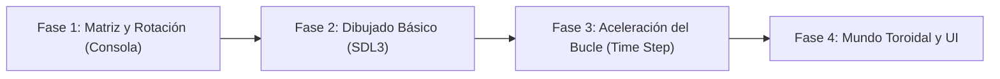

# La Hormiga de Langton

<p align="center">
  
</p>

---

## 1. Why?
Inventada por Chris Langton en 1986, la Hormiga de Langton es un autómata celular bidimensional que actúa como una Máquina de Turing universal. Su belleza radica en el concepto de comportamiento emergente: a partir de dos reglas dolorosamente simples, el sistema genera patrones simétricos, luego desciende a un caos absoluto, y de repente (alrededor del paso 10.000), emerge un orden perfecto en forma de una "autopista" infinita.

A nivel de ingeniería, este proyecto te enseñará a dominar las máquinas de estados finitos orientadas a la dirección y el desacoplamiento extremo entre la lógica y el renderizado. Aprenderás que una simulación no puede estar atada a los fotogramas de la pantalla; si quieres ver la "autopista" construirse, tu programa deberá ser capaz de calcular miles de pasos lógicos en la memoria por cada único fotograma que dibuja en SDL3, obligándote a escribir algoritmos en C altamente optimizados.

## 2. Enunciado Formal
Debes desarrollar un simulador 2D en tiempo real de la Hormiga de Langton. El mundo consiste en una cuadrícula de celdas que pueden tener dos estados o colores (por ejemplo, Blanco y Negro). El "Agente" (la hormiga) se ubicará inicialmente en el centro de la cuadrícula mirando hacia una de las direcciones cardinales.

En cada paso de la simulación, la hormiga obedecerá estrictamente dos reglas según el color de la celda en la que se encuentra:
- **Si está en una celda Blanca:** Gira $90^\circ$ a la derecha, cambia el color de la celda a Negro y avanza una unidad hacia adelante.
- **Si está en una celda Negra:** Gira $90^\circ$ a la izquierda, cambia el color de la celda a Blanco y avanza una unidad hacia adelante.

El programa debe renderizar el avance de la hormiga en tiempo real, permitir pausar/reanudar, y sobre todo, ofrecer un control para acelerar los "Pasos por Fotograma" (Steps per Frame). Al detener la simulación, se debe poder guardar el estado del lienzo en un archivo.

## 3. Hitos de Desarrollo Sugeridos
A diferencia del Juego de la Vida, aquí no hay doble búfer, pero el control de la dirección matemática es fundamental.



- **Fase 1: Matriz y Matemática de Rotación:** Trabaja en consola. Define una matriz estática y coloca a la hormiga en el centro. El reto aquí es matemático: si la hormiga mira al "Norte" (0) y gira a la derecha, debe mirar al "Este" (1). Implementa la lógica de actualización: leer celda $\to$ girar $\to$ invertir color celda $\to$ mover coordenadas $(x, y)$. Imprime el tablero paso a paso.
- **Fase 2: Dibujado Básico en SDL3:** Pasa a SDL3. Dibuja la cuadrícula, asignando un color de fondo para los ceros (0) y otro para los unos (1). Dibuja a la hormiga (preferiblemente como un triángulo o rectángulo pequeño que indique hacia dónde mira) en sus coordenadas actuales. Haz que la simulación dé exactamente 1 paso lógico por cada frame visual.
- **Fase 3: Aceleración del Bucle (El Desacoplamiento):** La hormiga necesita más de 10,000 pasos para construir la autopista. Si vas a 60 FPS (1 paso por frame), tardarás casi 3 minutos en verla. Modifica tu bucle principal para que, utilizando un ciclo `for` interno, la función de actualización de la hormiga se ejecute $N$ veces en la memoria antes de llamar a la función de renderizado de SDL3.
- **Fase 4: Mundo Toroidal y Guardado:** Implementa la lógica de "efecto Pac-Man" para los bordes: si la hormiga se sale por el límite derecho, reaparece por el izquierdo, para evitar errores de desbordamiento (Segmentation Fault). Añade persistencia permitiendo volcar la matriz final de colores a un archivo binario o de imagen portátil (`.ppm` / `.pbm`).

## 4. Consideraciones Técnicas y Paradigmas
- **Matemática Vectorial Simple:** Usa un `enum` para las direcciones (`Norte=0`, `Este=1`, `Sur=2`, `Oeste=3`).
  - Para girar a la derecha: `dir = (dir + 1) % 4;`
  - Para girar a la izquierda: `dir = (dir + 3) % 4;`
  - Utiliza arreglos de desplazamiento (`dx = {0, 1, 0, -1}`, `dy = {-1, 0, 1, 0}`) para que avanzar hacia adelante sea un simple `x += dx[dir]; y += dy[dir];` sin necesidad de docenas de condicionales `if`.
- **Rendimiento de Caché:** Dado que la matriz será modificada miles de veces por fotograma, asegúrate de que el acceso a la memoria sea rápido. Una matriz plana (unidimensional de tamaño `ancho * alto`) suele ser más rápida de acceder en C que un arreglo de punteros `**` debido a la localidad de la caché del procesador.
- **Compilación Automatizada con Makefile:**
  Ejemplo sugerido de Makefile:

```makefile
CC = gcc
CFLAGS = -Wall -Wextra -std=c11 -Iinclude -O2
LDFLAGS = -lSDL3

SRCS = src/main.c src/mundo.c src/hormiga.c src/render.c
OBJS = $(SRCS:.c=.o)
TARGET = langton

all: $(TARGET)

$(TARGET): $(OBJS)
	$(CC) $(OBJS) -o $(TARGET) $(LDFLAGS)

%.o: %.c
	$(CC) $(CFLAGS) -c $< -o $@

clean:
	rm -f $(OBJS) $(TARGET)

.PHONY: all clean
```

## 5. Arquitectura de Datos y Persistencia

### Modelado de Estructuras en C

```c
#include <stdbool.h>
#include <SDL3/SDL.h>

// Cardinalidad estándar (Sentido horario)
typedef enum {
    DIR_NORTE = 0,
    DIR_ESTE  = 1,
    DIR_SUR   = 2,
    DIR_OESTE = 3
} Direccion;

// El agente
typedef struct {
    int x;
    int y;
    Direccion dir;
} Hormiga;

// El Lienzo / Mundo
typedef struct {
    int columnas;
    int filas;
    bool *celdas; // Matriz plana para mayor rendimiento en caché: celdas[y * columnas + x]
} Universo;

// Estado Global
typedef struct {
    Universo mundo;
    Hormiga hormiga;
    unsigned long long pasosTotales; // Se desbordará un 'int' normal
    int pasosPorFrame;               // Control de velocidad
    bool enPausa;
} Simulacion;
```

### Persistencia (Exportar a PBM/PPM)
En lugar de un formato binario propietario, como este proyecto genera patrones hermosos, exporta la matriz directamente a un archivo de imagen PBM (Portable Bitmap) o PPM (Portable Pixmap). Es un formato de texto plano que cualquier visor de imágenes moderno puede abrir:

```plaintext
P1
# Dimensiones: Ancho Alto
800 600
0 1 0 0 1 ...
```

## 6. Recomendaciones de Flujo y UI (SDL3)
- **Separación de Colores y Estética:** Tradicionalmente se usa blanco y negro, pero el patrón resalta mucho más con una estética ciberpunk o retro. Por ejemplo, Fondo `#1E1E2E` (Gris oscuro) y rastro `#00FFCC` (Cian brillante). La hormiga puede dibujarse de un color contrastante como rojo o magenta (`#FF0055`).
- **Información en Pantalla (OSD):** Usa `SDL3_ttf` (o una fuente de mapa de bits propia) para imprimir en una esquina la cantidad de "Pasos Actuales". Es increíblemente satisfactorio para el usuario ver ese número subir a decenas de miles y coincidir visualmente con el momento en que se genera la autopista.
- **Control de Velocidad:** Asigna las flechas ARRIBA y ABAJO para multiplicar o dividir la variable `pasosPorFrame` (ej. 1, 10, 100, 1000, 10000 pasos por dibujado). Esto le da al usuario un control de "Time Lapse".

## 7. Casos Borde y Manejo de Errores
- **El Límite del Mundo:** La autopista avanza en diagonal de forma indefinida. Cuando la hormiga golpee un borde, si usaste matemáticas modulares (`x = (x + columnas) % columnas`), reaparecerá por el lado opuesto, interrumpiendo su propia autopista y generando un nuevo estallido de caos. Asegúrate de que las matemáticas modulares soporten números negativos en C (ya que `-1 % 100` en C da `-1`, no `99`. Usa `x = (x + ancho) % ancho;`).
- **Bloqueo del Bucle Principal:** Si estableces `pasosPorFrame` en $10,000,000$, la función que actualiza la hormiga tardará más de $16\text{ ms}$, lo que hará que el framerate de SDL3 caiga por debajo de 60 FPS y la ventana parezca "congelada" o que no responde a los eventos del ratón/teclado. Para mitigarlo, limita el máximo de cálculos por frame o calcúlalo en un hilo (*Thread*) separado.
- **Sobreescritura de Persistencia:** Al guardar archivos de imagen (`.ppm`), agrega el número de pasos al nombre del archivo (`langton_10450_pasos.ppm`) para no sobrescribir capturas previas.

## 8. Verificadores de Funcionamiento (Checklist)
- [ ] **Compilación y Optimizaciones:** El código se compila limpio con make y el flag `-O2` (optimización) activado.
- [ ] **Exactitud Matemática:** La matemática de giro y avance funciona mediante arreglos y operadores de módulo, evitando bloques gigantescos de `if-else` o `switch`.
- [ ] **Manejo de Bordes (Wraparound):** La hormiga puede salir por un borde de la pantalla y reaparecer por el extremo opuesto sin causar desbordamientos de memoria.
- [ ] **Verificación Visual Crítica:** Acelerando la simulación, la hormiga atraviesa una fase caótica y, cerca de los $\approx 10,000$ pasos, el comportamiento emergente funciona y comienza a dibujar una gruesa línea recta diagonal (la "Autopista").
- [ ] **Aceleración Temporal:** El usuario puede alterar la velocidad de cálculo (pasos por frame) en tiempo real sin romper la simulación.
- [ ] **Exportación:** El estado del tablero puede guardarse en un archivo al detener la ejecución.

## 9. Desafíos Opcionales (Bonus)
- **Reglas Extendidas (Múltiples Colores):** En lugar de blanco/negro (2 colores), implementa la variante de Langton que acepta una cadena de texto como `LRRRRRLLR`. Cada letra define si en el Color $N$ gira a Izquierda o Derecha, transitando al siguiente color cíclicamente. Esto produce patrones de crecimiento radiales, triángulos y esponjas increíbles.
- **Cámara Libre y Zoom infinito:** Abandona la cuadrícula estática anclada a los píxeles de la ventana. Convierte tus rutinas de dibujado a un sistema con `offsetX`, `offsetY` y `zoom`. Permite al usuario alejar la vista para observar cómo la autopista viaja por el lienzo masivo, y arrastrar el mapa con el ratón.
- **Guerra de Hormigas (Multithreading):** Instancia 2, 4 o 10 hormigas en distintas partes de un mapa gigantesco. Cada una tiene su propio color de rastro y sus propias reglas de giro. Cuando las autopistas de dos hormigas distintas colisionan, observa la desestabilización mutua que producen. Implementa esto usando hilos de C (`<pthread.h>`) o de SDL3.
