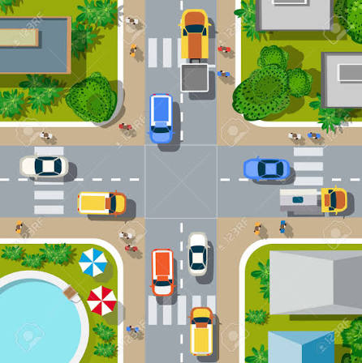
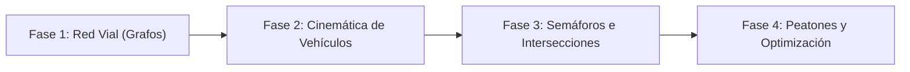

# Simulador de Tráfico Urbano

<p align="center">
  
</p>

---

## 1. Why?
Dar el salto de mover un personaje con el teclado a programar una ciudad entera que funciona sola es uno de los mayores hitos en la ingeniería de software. Un simulador de tráfico te introduce de lleno en la Teoría de Colas, la Cinemática Continua y el diseño de Agentes Autónomos.

A diferencia de los juegos en cuadrícula, los vehículos del mundo real no se mueven de bloque en bloque a velocidad constante; aceleran, frenan bruscamente si el auto de enfrente se detiene, y deben tomar decisiones en fracciones de segundo al llegar a una intersección. Este proyecto te obligará a dominar los Grafos Dirigidos (para la red de carreteras), las matemáticas de vectores (para el movimiento y dirección), y máquinas de estado concurrentes (para coordinar semáforos interconectados sin causar accidentes).

## 2. Enunciado Formal
Debes desarrollar un simulador de tráfico 2D con vista cenital (Top-down). El entorno estará compuesto por una red de carreteras (carriles simples o múltiples) que se cruzan en intersecciones controladas por semáforos o señales de alto.

El simulador generará de forma autónoma distintos tipos de vehículos (coches rápidos, autobuses lentos, camiones pesados) que circularán por los carriles respetando los límites de velocidad y la distancia de seguridad con el vehículo de enfrente (*Car-following model*). Además, se incluirán cruces peatonales donde entidades autónomas (peatones) intentarán cruzar la calle, obligando a los vehículos a ceder el paso. El objetivo de la herramienta es visualizar el flujo de tráfico, medir cuellos de botella y permitir al usuario alterar los tiempos de los semáforos en tiempo real para optimizar la circulación.

## 3. Hitos de Desarrollo Sugeridos
La complejidad de coordinar cientos de agentes independientes requiere construir la infraestructura vial antes de instanciar el primer coche:



- **Fase 1: La Red Vial y Nodos (Grafo):** Define la ciudad no como una imagen, sino como un Grafo. Un "Carril" es una arista (línea o curva) que conecta el "Nodo A" con el "Nodo B". Dibuja estas líneas en SDL3. Crea una estructura de datos que permita saber, al llegar a una intersección, hacia qué otros nodos se puede girar.
- **Fase 2: Cinemática y Modelo de Seguimiento:** Instancia el primer vehículo. Asígnale una velocidad, una aceleración máxima y una capacidad de frenado. Implementa un modelo de seguimiento: el vehículo debe calcular la distancia exacta con el auto que tiene directamente delante en su mismo carril. Si la distancia es menor a su zona de confort, debe aplicar una aceleración negativa (frenar) para igualar la velocidad del líder y evitar chocar.
- **Fase 3: Semáforos y Control de Intersecciones:** Añade semáforos a los nodos de intersección. Un semáforo es una máquina de estados (Verde $\to$ Amarillo $\to$ Rojo) controlada por un temporizador. Los vehículos deben tratar un semáforo en Rojo como si fuera un "vehículo detenido" frente a ellos, frenando suavemente hasta detenerse en la línea de pare. Gestiona el ciclo semafórico para que los carriles perpendiculares nunca tengan luz verde al mismo tiempo.
- **Fase 4: Peatones, Diferenciación y Métricas:** Introduce la variedad: camiones que aceleran lento pero tienen alta velocidad máxima, y peatones que cruzan por las cebras (pasos de cebra). Mide cuántos vehículos logran salir del mapa por minuto (Rendimiento/Throughput) y pinta los coches de color rojo progresivamente si pasan mucho tiempo detenidos (Mapa de calor de congestión).

## 4. Consideraciones Técnicas y Paradigmas
- **Cinemática Basada en Delta Time:** El movimiento ya no es `x += velocidad`. Ahora es física real elemental: `velocidad += aceleracion * dt` y `posicion += velocidad * dt`. Esto garantiza que un camión frene con la inercia correcta independientemente de los fotogramas por segundo.
- **Modelo de Conductor Inteligente (IDM - Intelligent Driver Model):** No hace falta programar IA compleja con redes neuronales. Basta con una fórmula matemática donde la aceleración de un coche dependa de su velocidad actual, la velocidad deseada y la distancia con el coche de enfrente (búsqueda de un hueco temporal seguro).
- **Partición Espacial de Carriles:** El problema de colisión $\mathcal{O}(N^2)$ te destruirá aquí. Un coche en el Carril Norte no debe calcular distancias con coches en el Carril Sur. Cada Carril debe mantener una Lista Enlazada o Arreglo ordenado de los vehículos que circulan por él, de modo que un coche solo pregunte: "¿Quién es el índice anterior a mí en esta lista?".
- **Compilación Automatizada con Makefile:**
  Ejemplo sugerido de Makefile:

```makefile
CC = gcc
CFLAGS = -Wall -Wextra -std=c11 -Iinclude -O2
LDFLAGS = -lSDL3 -lm

SRCS = src/main.c src/red_vial.c src/vehiculos.c src/semaforos.c src/render.c
OBJS = $(SRCS:.c=.o)
TARGET = trafficsim

all: $(TARGET)

$(TARGET): $(OBJS)
	$(CC) $(OBJS) -o $(TARGET) $(LDFLAGS)

%.o: %.c
	$(CC) $(CFLAGS) -c $< -o $@

clean:
	rm -f $(OBJS) $(TARGET)

.PHONY: all clean
```

## 5. Arquitectura de Datos y Persistencia

### Modelado de Estructuras en C

```c
#include <stdbool.h>
#include <SDL3/SDL.h>

typedef enum { TIPO_COCHE, TIPO_CAMION, TIPO_AUTOBUS } TipoVehiculo;
typedef enum { LUZ_VERDE, LUZ_AMARILLA, LUZ_ROJA } ColorSemaforo;

struct Interseccion; // Declaración adelantada

// Un tramo de calle (Arista del grafo)
typedef struct Carril {
    int id;
    float inicioX, inicioY;
    float finX, finY;
    float limiteVelocidad;
    struct Interseccion* nodoDestino; // A dónde lleva este carril
    struct Vehiculo* primerVehiculo;  // Para saber quién va liderando
} Carril;

// Nodo del grafo
typedef struct Interseccion {
    int id;
    float x, y;
    ColorSemaforo estadoLuz;
    Uint64 temporizadorCambioMs;
    Carril* carrilesSalida[4];        // Posibles desvíos al llegar aquí
} Interseccion;

// Agente Autónomo
typedef struct Vehiculo {
    int id;
    TipoVehiculo tipo;
    float x, y;
    float velocidadActual;
    float aceleracionActual;
    float longitud;                   // Para detectar colisiones traseras
    
    // Parámetros físicos según el tipo (Coche vs Camión)
    float aceleracionMaxima;
    float frenadoMaximo;
    
    Carril* carrilActual;
    struct Vehiculo* vehiculoEnFrente; // Puntero al coche de adelante
    
    bool lucesFrenoEncendidas;         // Para feedback visual
} Vehiculo;

// Estado de la Simulación
typedef struct {
    Carril carriles[100];
    Interseccion nodos[50];
    Vehiculo vehiculos[500];          // Usar Pool de objetos
    int tiempoSimulacionSegundos;
} Ciudad;
```

### Persistencia (Mapas y Escenarios)
El simulador debe separar el "Mapa" de la lógica. Usa un archivo `.json` o un formato de texto propio para cargar la ciudad al iniciar. Por ejemplo:

```plaintext
NODO 1: 100,200
CARRIL 1: NODO 1 -> NODO 2, VEL_MAX: 50
```

Esto permite cargar configuraciones reales o escenarios de prueba (un óvalo, una cuadrícula tipo Manhattan, una rotonda).

## 6. Recomendaciones de Flujo y UI (SDL3)
- **Feedback de Frenado (Luces traseras):** Dibuja los vehículos como rectángulos. Cuando el valor de `aceleracionActual` sea negativo, dibuja dos pequeños cuadrados de un rojo muy intenso (`#FF0000`) en la parte trasera del rectángulo. Esto te permitirá "leer" las ondas de tráfico y los atascos visualmente antes de mirar los datos.
- **Depuración Geométrica (Debug Mode):** Asigna la tecla `D` para activar un modo de desarrollo. Las texturas de los coches desaparecen, dejando ver sus cajas de colisión (`SDL_FRect`), y se dibujan líneas proyectadas desde el frente de cada coche hasta el parachoques trasero del coche que le precede, coloreadas de verde (lejos) a rojo (peligro).
- **Control de Tiempos Manual:** Implementa una UI lateral (usando texto) donde al hacer clic en un semáforo, el usuario pueda cambiar la duración de la luz verde (ej. de 15s a 30s) y observar en tiempo real cómo ese cambio alivia (o empeora) el atasco en esa avenida.

## 7. Casos Borde y Manejo de Errores
- **El Atasco Insoluble (Gridlock o Deadlock):** Ocurre cuando un coche entra a la intersección sin tener espacio para salir por el carril de destino, bloqueando la intersección. Cuando el semáforo cambia, los coches perpendiculares no pueden avanzar. Solución lógica: Un vehículo no debe cruzar la línea de pare, incluso en luz verde, si no hay espacio físico para su chasis en el carril receptor.
- **El Efecto Acordeón (Ondas de Choque Phantom):** Si la reacción de frenado de tus coches no está amortiguada, un solo coche frenando un 10% causará que el de atrás frene un 20%, el de atrás un 40%, hasta que la carretera se detenga por completo sin que haya un semáforo ni accidente. Ajustar las variables de inercia y distancia de seguimiento (PID Controller) es vital.
- **Puntos de Generación (Spawn Killing):** Si generas un vehículo nuevo en el inicio de un carril, debes verificar primero si ese espacio está ocupado. Si lo fuerzas, generarás un vehículo dentro de otro, provocando que tu cálculo de distancias arroje números negativos y los coches salgan disparados hacia atrás.

## 8. Verificadores de Funcionamiento (Checklist)
- [ ] **Compilación sin Advertencias:** El proyecto usa banderas estrictas y compila limpiamente en make.
- [ ] **Física Independiente del Frame:** Los vehículos aceleran y frenan suavemente en base a Delta Time, nunca saltando posiciones de golpe.
- [ ] **Prevención de Colisiones (Car-Following):** Los coches detectan al vehículo líder de su propio carril y frenan a tiempo para mantener una distancia prudencial, sin atravesarse.
- [ ] **Lógica de Intersecciones:** Los coches respetan las fases del semáforo. Frenan en rojo y amarillo, y reanudan la marcha en verde.
- [ ] **Desaparición Limpia:** Cuando un vehículo llega al final del grafo (sale del mapa), su memoria es reciclada o liberada sin dejar punteros colgantes en el sistema.
- [ ] **Prevención de Deadlocks:** Se han implementado reglas para evitar bloqueos perpetuos en el centro de las intersecciones.

## 9. Desafíos Opcionales (Bonus)
- **Curvas y Splines (Caminos no lineales):** En lugar de usar líneas rectas (A a B), implementa Curvas de Bézier. El vehículo deberá evaluar su posición a lo largo del parámetro $t$ (de 0.0 a 1.0) para girar suavemente en las esquinas en lugar de rotar robóticamente $90^\circ$ en un solo fotograma.
- **Rotondas (Óvalos sin semáforos):** Implementa la lógica de "Ceda el paso". Al llegar a una rotonda, un vehículo debe evaluar la distancia y velocidad de los coches que ya están circulando por el carril circular, decidiendo si es seguro incorporarse o si debe esperar.
- **Pathfinding Táctico (A*) y Re-enrutamiento:** En lugar de que los coches giren al azar en cada intersección, dales un Nodo de Origen y un Nodo de Destino. Al instanciarse, el coche calcula la ruta más corta usando $A^*$ (A-Star). Si una avenida se congestiona brutalmente, los nuevos coches generados preferirán tomar vías alternativas más largas pero despejadas, simulando sistemas como Waze o Google Maps.
