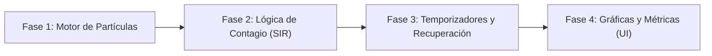

# Modelo Epidemiológico (SIR / SEIR)

<p align="center">
  
</p>

---

## 1. Why?
La pandemia de COVID-19 demostró al mundo la importancia crítica del modelado de datos. En el ámbito de las ciencias computacionales, simular una epidemia representa un puente perfecto entre la matemática de sistemas dinámicos y la programación de agentes interactivos (*Agent-Based Modeling*).

A diferencia del Juego de la Vida (autómata celular en cuadrícula) o el simulador de Vida Artificial (basado en hambre y reproducción), este proyecto se centra en la propagación de estados a través de la proximidad espacial y el rastreo estadístico. Aprenderás a optimizar el cálculo de distancias radiales, a gestionar transiciones de estado basadas en temporizadores deterministas (enfermedad $\to$ recuperación) y, lo más importante, a programar un motor de renderizado de datos que dibuje gráficas de líneas ("Aplanar la curva") en tiempo real directamente sobre SDL3.

## 2. Enunciado Formal
Debes desarrollar un simulador 2D interactivo que modele la propagación de un virus en una población cerrada. La simulación representará a cada individuo como una partícula móvil que rebota en los bordes de la pantalla.

El sistema implementará el modelo SIR (Susceptibles, Infectados, Recuperados) o SEIR (añadiendo "Expuestos"). Los individuos "Susceptibles" que entren en el radio de contagio de un "Infectado" tendrán una probabilidad porcentual de contraer la enfermedad. Tras un tiempo determinado, el infectado pasará al estado "Recuperado" (inmune) o morirá, siendo retirado de la simulación. La herramienta debe permitir ajustar parámetros iniciales (tamaño de la población, radio de contagio, tasa de mortalidad, tiempo de recuperación) y debe graficar dinámicamente en una sección de la pantalla las curvas poblacionales de cada estado.

## 3. Hitos de Desarrollo Sugeridos
Este proyecto mezcla físicas de partículas con análisis de datos. Construye el sistema de forma modular:



- **Fase 1: Motor de Partículas (Movimiento):** Instancia un arreglo de 500 individuos. Asígnales coordenadas ($x, y$) aleatorias y un vector de velocidad ($dx, dy$). Implementa la física básica: actualiza sus posiciones en cada frame y haz que reboten de forma realista si tocan los límites de la pantalla (invirtiendo su vector). Dibuja a todos como puntos o círculos azules (Susceptibles).
- **Fase 2: Lógica de Contagio (El "Paciente Cero"):** Introduce los estados (Susceptible e Infectado). Inicializa a un solo individuo como Infectado (rojo). En el bucle de actualización, si un Susceptible está a una distancia menor a $R$ (Radio de contagio) de un Infectado, genera un número aleatorio; si cae dentro de la "Probabilidad de Transmisión", cambia el estado del Susceptible a Infectado.
- **Fase 3: Temporizadores (El modelo SIR completo):** La enfermedad no es eterna. Registra el tick exacto en el que una persona se infecta. Si el tiempo actual menos el tiempo de infección supera los $14$ días (simulados en segundos o frames), el individuo cambia al estado Recuperado (verde). Un individuo Recuperado no puede ser infectado nuevamente, ignorando los chequeos de distancia.
- **Fase 4: Telemetría y Gráficos en Tiempo Real:** Reserva el 20% inferior o derecho de la ventana para la UI. En cada frame, cuenta cuántos S, I y R hay. Almacena estos tres valores en un arreglo histórico y utiliza funciones de dibujo de líneas (`SDL_RenderLine`) para trazar las tres curvas poblacionales avanzando de izquierda a derecha.

## 4. Consideraciones Técnicas y Paradigmas
- **Optimización de Distancias:** Para saber si hay contagio, debes calcular la distancia euclidiana: $\sqrt{(x_2 - x_1)^2 + (y_2 - y_1)^2}$. La raíz cuadrada (`sqrt()`) es una operación matemáticamente muy costosa para ejecutar cientos de miles de veces por frame. Truco de optimización: Compara los cuadrados. Si $(x_2 - x_1)^2 + (y_2 - y_1)^2 \le R^2$, hay contagio.
- **Separación de UI y Simulación:** Tu bucle debe procesar a las personas a 60 FPS o más, pero actualizar el arreglo histórico para la gráfica en cada frame consumirá demasiada memoria. Toma una "muestra" estadística (guarda los datos) solo una vez cada 10 o 20 frames.
- **Modelo Predictivo vs. Agentes:** Este es un modelo basado en agentes (ABM). Sus resultados tendrán "ruido" estadístico y variarán en cada ejecución, a diferencia de resolver las ecuaciones diferenciales del modelo SIR original. Esto lo hace visualmente orgánico e impredecible.
- **Compilación Automatizada con Makefile:**
  Ejemplo sugerido de Makefile:

```makefile
CC = gcc
CFLAGS = -Wall -Wextra -std=c11 -Iinclude -O2
LDFLAGS = -lSDL3 -lm

SRCS = src/main.c src/simulacion.c src/agentes.c src/graficos.c
OBJS = $(SRCS:.c=.o)
TARGET = epidemicsim

all: $(TARGET)

$(TARGET): $(OBJS)
	$(CC) $(OBJS) -o $(TARGET) $(LDFLAGS)

%.o: %.c
	$(CC) $(CFLAGS) -c $< -o $@

clean:
	rm -f $(OBJS) $(TARGET)

.PHONY: all clean
```

## 5. Arquitectura de Datos y Persistencia

### Modelado de Estructuras en C

```c
#include <stdbool.h>
#include <SDL3/SDL.h>

#define MAX_POBLACION 2000
#define MAX_MUESTRAS_GRAFICO 1000

// Fases de la enfermedad (Modelo SEIR)
typedef enum {
    ESTADO_SUSCEPTIBLE, // Azul
    ESTADO_EXPUESTO,    // Amarillo (Incubando, no contagia aún)
    ESTADO_INFECTADO,   // Rojo (Contagioso)
    ESTADO_RECUPERADO,  // Verde (Inmune)
    ESTADO_FALLECIDO    // Gris (Inmóvil, no participa)
} EstadoSalud;

// El agente
typedef struct {
    float x, y;
    float dx, dy;
    EstadoSalud estado;
    Uint64 tiempoExposicionMs;
    Uint64 tiempoInfeccionMs;
    bool enCuarentena;
} Individuo;

// Parámetros configurables del virus
typedef struct {
    float radioContagio;
    float probabilidadTransmision; // 0.0 a 1.0
    Uint64 tiempoIncubacionMs;
    Uint64 tiempoRecuperacionMs;
    float tasaMortalidad;
} DatosEnfermedad;

// Historial para graficar
typedef struct {
    int susceptibles[MAX_MUESTRAS_GRAFICO];
    int infectados[MAX_MUESTRAS_GRAFICO];
    int recuperados[MAX_MUESTRAS_GRAFICO];
    int fallecidos[MAX_MUESTRAS_GRAFICO];
    int indiceActual;              // Para saber por dónde vamos dibujando
} Historial;

// Estado Global
typedef struct {
    Individuo poblacion[MAX_POBLACION];
    int totalPoblacion;
    DatosEnfermedad virus;
    Historial metricas;
    bool simulacionCorriendo;
} Simulador;
```

### Persistencia (Exportar a CSV)
Las simulaciones científicas no "guardan partida". Deben exportar sus resultados. Permite al usuario presionar la tecla `E` para volcar el `struct Historial` en un archivo `resultados.csv`. Esto permitirá abrir los datos en Excel o Python para corroborar si la curva de infección coincide con las campanas de Gauss matemáticas.

## 6. Recomendaciones de Flujo y UI (SDL3)
- **Paleta de Colores de la OMS:** Mantén el estándar universal para estos modelos: Azul para Susceptibles (S), Rojo intenso para Infectados (I), y Verde o Gris para Recuperados (R). El contraste es vital para entender la gravedad de la epidemia de un vistazo.
- **El Gráfico de Área vs. Línea:** Para la visualización de datos, un gráfico de líneas superpuestas funciona bien, pero un *Stacked Area Chart* (Gráfico de áreas apiladas) es mucho más impactante. Dibuja líneas verticales desde $Y=0$ hasta $Y=\text{Recuperados}$ en verde, luego desde ahí hasta $Y=\text{Recuperados}+\text{Infectados}$ en rojo, etc. Esto muestra el $100\%$ de la población como un bloque sólido cambiando de color con el tiempo.
- **Sliders (Deslizadores) Interactivos:** Si logras implementar barras deslizantes simples donde el usuario pueda alterar con el ratón el "Radio de Contagio" en pleno vuelo, el simulador pasará de ser un video a ser una verdadera herramienta experimental.

## 7. Casos Borde y Manejo de Errores
- **El Cuello de Botella $\mathcal{O}(N^2)$:** Si tu población sube de 500 a 5,000, la simulación colapsará porque estás haciendo $25,000,000$ de comprobaciones de distancia por frame. Solo los infectados deben buscar a los susceptibles (no al revés), e idealmente debes implementar *Spatial Hashing* (dividir la pantalla en una cuadrícula) para que un infectado solo compruebe contagios con personas en su misma celda.
- **Divisiones por Cero en la Telemetría:** Al calcular los porcentajes para dibujar las gráficas en la pantalla, asegúrate de verificar `if (totalPoblacion > 0)` y escalar los píxeles de acuerdo al alto máximo del recuadro del gráfico.
- **Final Prematuro:** Si la probabilidad de contagio es muy baja o el tiempo de recuperación es muy rápido, el Paciente Cero podría recuperarse antes de contagiar a nadie. El sistema debe poder detectar que `Infectados == 0` y pausar la simulación o lanzar un evento de "Epidemia Erradicada".

## 8. Verificadores de Funcionamiento (Checklist)
- [ ] **Rendimiento Físico:** Las partículas se mueven fluidamente, rebotan en los límites de forma natural y no se "escapan" de la ventana.
- [ ] **Contagio Geométrico:** La infección solo ocurre si un círculo imaginario de radio $R$ alrededor del infectado toca a un susceptible.
- [ ] **Evolución Temporal:** El sistema respeta el temporizador. La entidad permanece enferma por el tiempo estipulado antes de pasar a recuperada.
- [ ] **Inmunidad Efectiva:** Los recuperados ignoran la lógica de colisión de enfermedad de manera permanente.
- [ ] **Renderizado de Datos:** El gráfico histórico se dibuja correctamente en pantalla, reflejando fielmente la proporción de colores que se ve en el enjambre de partículas.
- [ ] **Exportación Analítica:** El programa puede generar un `.csv` con los datos poblacionales al terminar la simulación.

## 9. Desafíos Opcionales (Bonus)
- **Distanciamiento Social y Cuarentenas:** Añade una variable de "Acato a normas". Permite que al presionar la tecla Espacio, el $70\%$ de la población detenga su movimiento por completo (aislamiento). Observa y grafica empíricamente cómo esto "aplana la curva" de infecciones simultáneas (evitando el colapso hospitalario simulado).
- **Lugares de Conglomeración (Centralidades):** Crea zonas especiales en el mapa (ej. "Escuelas" o "Supermercados"). Modifica la IA de los agentes para que dejen de vagar aleatoriamente y tengan una fuerte tendencia a viajar hacia esos puntos específicos del mapa, simulando cómo el virus se dispara en nodos de alta densidad.
- **El Modelo SEIR Completo:** Incorpora la fase 'E' (Expuesto/Incubando). Cuando un Susceptible es contagiado, se vuelve amarillo (Expuesto) durante unos segundos. Se mueve y actúa normal, pero no puede contagiar a otros todavía. Pasado el tiempo de incubación, muta a Rojo (Infectado) y comienza la propagación activa.
