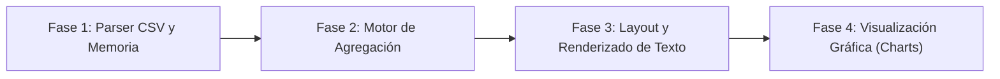

# Dashboard Analítico Financiero

<p align="center">
  
</p>

---

## 1. Why?
El desarrollo de software empresarial y las herramientas de Inteligencia de Negocios (BI) son los motores que mueven la industria actual. Detrás de las interfaces modernas, los motores de análisis de datos necesitan procesar millones de registros, filtrar, agrupar y calcular agregados en fracciones de segundo.

Este proyecto te sumergirá en el procesamiento intensivo de datos y el manejo puro de cadenas de texto (*String Parsing*). Desarrollar un dashboard te obligará a dominar la lectura de archivos estructurados, la gestión de memoria dinámica para volúmenes de datos inciertos, y la transformación de números fríos en visualizaciones gráficas interactivas. Es un ejercicio fundamental para comprender cómo el software extrae valor de la información en bruto.

## 2. Enunciado Formal
Debes desarrollar una aplicación de escritorio orientada al análisis de datos que cargue, procese y visualice registros financieros históricos. El programa leerá un archivo de texto plano estructurado (formato `.csv`) que contendrá miles de transacciones, cada una con fecha, monto, tipo (ingreso/egreso) y categoría.

El motor de la aplicación deberá alojar estos datos dinámicamente en memoria, procesarlos para extraer Indicadores Clave de Rendimiento (KPIs) como el balance total, el mes de mayores gastos y la distribución por categorías. Utilizando la biblioteca SDL3, la interfaz gráfica (UI) renderizará un panel de control interactivo que mostrará estos KPIs en formato de texto, junto con al menos dos visualizaciones gráficas generadas programáticamente: un gráfico de barras (evolución mensual) y un gráfico de proporciones o tabla ordenada.

## 3. Hitos de Desarrollo Sugeridos
El procesamiento de datos no perdona errores de formato. Construye el flujo de información paso a paso:



- **Fase 1: El Parser CSV y Arreglos Dinámicos (Consola):** Crea la lógica para abrir el archivo `.csv`. Como no sabes cuántas líneas tiene el archivo, debes inicializar un arreglo dinámico e ir expandiéndolo con `realloc` a medida que lees. Utiliza funciones como `fgets` para leer por líneas y `strtok` o `sscanf` para separar los valores separados por comas. Imprime los primeros 10 registros en consola para validar.
- **Fase 2: Motor de Agregación y Matemáticas:** Escribe funciones que iteren sobre tu arreglo de datos para generar resúmenes. Necesitarás funciones que devuelvan el balance total, que sumen los egresos de una categoría específica, y que agrupen los datos por mes y año. Valida estos cálculos imprimiendo los resultados en la terminal.
- **Fase 3: Interfaz Base y Renderizado de Texto (SDL3):** Inicializa la ventana de SDL3. Divide la pantalla en "paneles" lógicos (ej. una barra superior para KPIs, un panel izquierdo para gráficos). Integra `SDL3_ttf` para renderizar los valores calculados en la Fase 2 como texto claro y legible sobre la pantalla.
- **Fase 4: Visualización Gráfica Matemática:** El núcleo visual del proyecto. Crea una función que tome un arreglo de valores (por ejemplo, los totales mensuales) y dibuje un Gráfico de Barras. Para esto, deberás normalizar los datos: encontrar el valor máximo y mapearlo a la altura máxima disponible en píxeles dentro de tu panel de dibujo, utilizando `SDL_RenderFillRect` para construir las barras.

## 4. Consideraciones Técnicas y Paradigmas
- **Manejo de Cadenas (String Parsing):** En C, separar datos por comas requiere cuidado extremo con los punteros. Si una fila del CSV tiene un campo vacío (ej. `2026-05-12,,150.00`), la función clásica `strtok` puede fallar saltándose el delimitador. Deberás implementar una lectura robusta o usar `strsep` / lectura por caracteres.
- **Transformación Espacial (Data Mapping):** Para dibujar un gráfico, debes convertir el dominio de los datos al dominio de los píxeles. Fórmula base para la altura de una barra:
  $$\text{alturaPixel} = \left(\frac{\text{valorDato}}{\text{valorMaximo}}\right) \times \text{alturaMaximaPanel}$$
  Recuerda que en SDL3, la coordenada $Y=0$ está en la parte superior, por lo que las barras deben dibujarse "hacia abajo" (desde $Y = \text{inicio} + \text{alturaMaxima} - \text{alturaPixel}$).
- **Complejidad Algorítmica ($\mathcal{O}(N)$ vs $\mathcal{O}(N^2)$):** Si tienes 500,000 transacciones y quieres saber el total por cada una de las 12 categorías, no iteres el arreglo completo 12 veces. Itera el arreglo masivo una sola vez ($\mathcal{O}(N)$) y ve sumando en un arreglo acumulador de tamaño 12.
- **Compilación Automatizada con Makefile:**
  Ejemplo sugerido de Makefile:

```makefile
CC = gcc
CFLAGS = -Wall -Wextra -std=c11 -Iinclude
LDFLAGS = -lSDL3 -lSDL3_ttf

SRCS = src/main.c src/parser.c src/analytics.c src/ui.c src/charts.c
OBJS = $(SRCS:.c=.o)
TARGET = dashboard

all: $(TARGET)

$(TARGET): $(OBJS)
	$(CC) $(OBJS) -o $(TARGET) $(LDFLAGS)

%.o: %.c
	$(CC) $(CFLAGS) -c $< -o $@

clean:
	rm -f $(OBJS) $(TARGET)

.PHONY: all clean
```

## 5. Arquitectura de Datos y Persistencia

### Modelado de Estructuras en C

```c
#include <stdbool.h>
#include <SDL3/SDL.h>

typedef enum {
    TIPO_INGRESO,
    TIPO_EGRESO
} TipoTransaccion;

// Una fila de la base de datos
typedef struct {
    char id[16];
    char fecha[11]; // Formato YYYY-MM-DD
    TipoTransaccion tipo;
    char categoria[32];
    double monto;
} Transaccion;

// El contenedor dinámico masivo
typedef struct {
    Transaccion *registros;
    int cantidadTotal;
    int capacidadAsignada;
} BaseDatos;

// Estructuras de Agregación (Para los gráficos)
typedef struct {
    char mesAnio[8]; // "YYYY-MM"
    double totalIngresos;
    double totalEgresos;
} ResumenMensual;

typedef struct {
    char categoria[32];
    double total;
} ResumenCategoria;

// El Estado Global
typedef struct {
    BaseDatos db;
    ResumenMensual meses[12];
    ResumenCategoria categorias[20];
    int totalMeses;
    int totalCategorias;
    double balanceGlobal;
} EstadoDashboard;
```

### El Archivo de Datos (`datos_financieros.csv`)
La persistencia de esta aplicación es de solo lectura. El usuario proporcionará un archivo similar a este:

```plaintext
id,fecha,tipo,categoria,monto
TX001,2026-01-15,ingreso,Salario,2500.00
TX002,2026-01-16,egreso,Alimentacion,120.50
TX003,2026-01-18,egreso,Servicios,85.00
```

## 6. Recomendaciones de Flujo y UI (SDL3)
- **Paleta de Colores Corporativa:** Huye de los colores primarios chillones. Usa fondos grises oscuros o blancos puros. Para los datos financieros, el estándar es verde (`#2ECC71`) para ingresos/balances positivos y rojo (`#E74C3C`) o naranja para egresos. Utiliza un gris neutro para los ejes y los textos secundarios.
- **Diseño en Bloques (Grid Layout):** Divide la pantalla como si fuera un periódico. Usa `SDL_RenderRect` sutiles para delimitar "Tarjetas" (*Cards*) con bordes redondeados (si puedes programarlo) o rectos, y dibuja cada componente dentro de su tarjeta con márgenes internos (*padding*).
- **Interactividad (Tooltips):** Intercepta las coordenadas del ratón (`SDL_GetMouseState`). Si el cursor hace hover (se posa) sobre el área de una barra específica en el gráfico, dibuja un pequeño cuadro de texto flotante que muestre el monto exacto de ese mes, para compensar la falta de precisión visual de los gráficos.

## 7. Casos Borde y Manejo de Errores
- **Fugas de Memoria en Expansión:** Cuando uses `realloc` para ampliar tu base de datos a medida que lees el archivo, nunca asignes el resultado directamente a tu puntero original (`db.registros = realloc(db.registros, ...)`). Si `realloc` falla por falta de memoria RAM, devolverá `NULL` y perderás la referencia a todos los datos anteriores. Usa un puntero temporal para validarlo primero.
- **Datos Sucios o Corruptos:** El mundo real está lleno de errores tipográficos. Si el archivo `.csv` contiene letras en la columna de montos (`15O.00` en lugar de `150.00`), tu parser usando `atof` o `sscanf` debe detectarlo, registrar el error (lanzar un warning en consola) e ignorar esa fila sin crashear la aplicación completa.
- **Redimensionamiento de Ventana:** Un Dashboard debe ser responsivo. Si el usuario maximiza la ventana de SDL3, las coordenadas donde se dibujan los gráficos y textos no pueden estar "hardcodeadas" (ej. `x=500`). Deben ser un porcentaje del ancho y alto de la ventana actual, actualizando el renderizado tras un `SDL_EVENT_WINDOW_RESIZED`.

## 8. Verificadores de Funcionamiento (Checklist)
- [ ] **Compilación Estricta:** Compilación con make ejecutada sin warnings.
- [ ] **Carga Dinámica Masiva:** El programa puede cargar y almacenar en memoria dinámica un archivo de miles de líneas sin limitantes fijos (sin usar `Transaccion registros[1000]`).
- [ ] **Agregación Matemática:** Los cálculos de balance y totales por categoría coinciden con precisión matemática al corroborarlos externamente (ej. en Excel).
- [ ] **Renderizado de Tipografías:** Textos dibujados fluidamente con `SDL_ttf` sin generar fugas de memoria en la creación y destrucción de texturas.
- [ ] **Data Mapping Funcional:** Las alturas de las barras en los gráficos escalan proporcionalmente sin salirse de los márgenes del componente.
- [ ] **Tolerancia a Fallos:** El programa alerta pero no colapsa al procesar líneas del CSV con formato inválido.

## 9. Desafíos Opcionales (Bonus)
- **GUI de Modo Inmediato (ImGui / Nuklear):** En lugar de dibujar rectángulos manualmente con SDL3 primitivo, integra una librería de Interfaz de Usuario para C/C++ como Nuklear o cimgui. Esto te permitirá crear botones, menús desplegables y ventanas acoplables con estética profesional con menos líneas de código.
- **Filtros Dinámicos:** Agrega botones en la UI que permitan alterar el conjunto de datos activo. Por ejemplo, cliquear en el año "2025" debería hacer que el motor de agregación recalcule todo ignorando las fechas fuera de ese rango, y los gráficos deberían re-dibujarse (animando el cambio, si es posible).
- **Ordenamiento de Tablas (Sorting):** Muestra una tabla con los Top 10 gastos más altos. Implementa el algoritmo de QuickSort (usando la función `qsort` nativa de C) para permitir que el usuario ordene los datos por Monto o por Fecha haciendo clic en el título de la columna.
