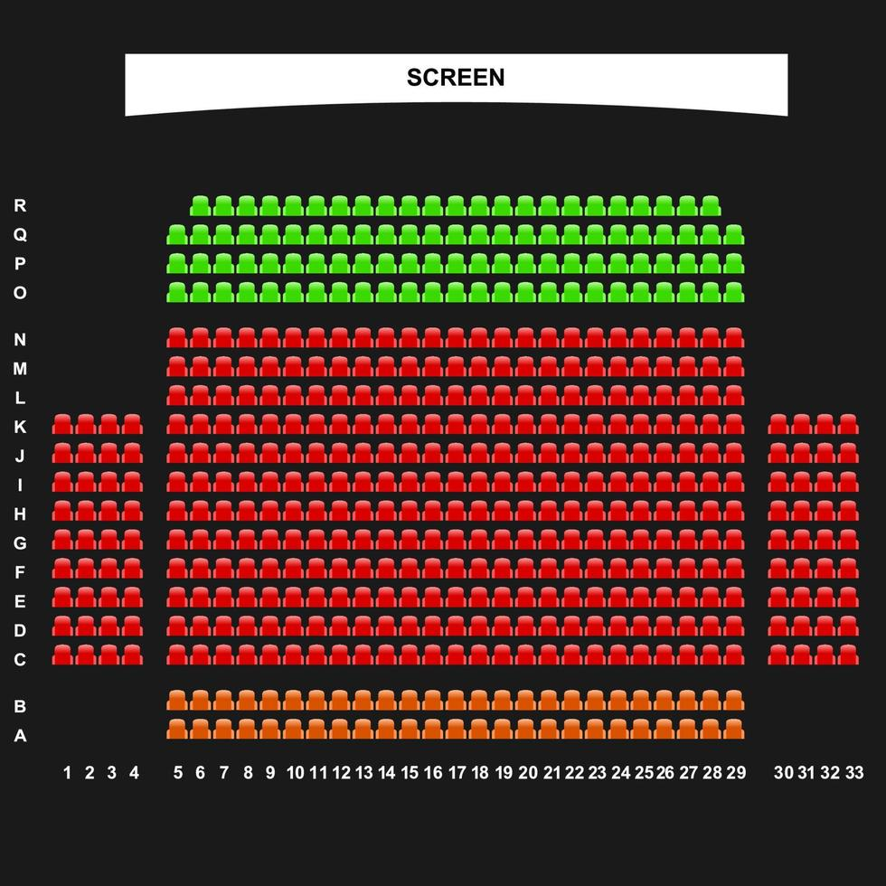
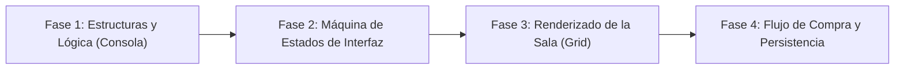

# Sistema de Reserva de Cines

<p align="center">
  
</p>

---

## 1. Why?
El desarrollo de software transaccional es el pilar de la industria tecnológica moderna. Desde comprar un boleto de avión hasta reservar una mesa en un restaurante, los sistemas deben garantizar que un recurso limitado sea asignado de manera precisa y persistente.

Construir un Sistema de Reserva de Cine en C con una interfaz gráfica representa un desafío de arquitectura de datos relacionales y gestión de estados. A diferencia de una simulación donde las cosas ocurren en tiempo real de forma autónoma, aquí el sistema espera el input del usuario, valida reglas de negocio (ej. "no puedes reservar un asiento ya ocupado") y debe asegurar que, en el momento en que se confirma una transacción, los datos se vuelquen de forma segura al disco duro. Aprenderás a crear flujos de navegación de usuario (*UI Flow*) y a mapear estructuras jerárquicas ($\text{Cine} \to \text{Películas} \to \text{Funciones} \to \text{Asientos}$).

## 2. Enunciado Formal
Debes desarrollar una aplicación de escritorio que gestione la reserva y venta de entradas para un cine. La aplicación utilizará SDL3 para renderizar una interfaz interactiva.

El flujo principal debe permitir al usuario: explorar una cartelera de películas disponibles, seleccionar una película para ver sus horarios (funciones) y, al elegir un horario, acceder a un mapa visual de la sala de cine. En este mapa, el usuario utilizará el ratón para seleccionar uno o varios asientos (distinguiendo visualmente entre libres, ocupados y seleccionados). El programa calculará el costo total en tiempo real y, al confirmar la compra, cambiará el estado de los asientos a "Ocupados". El estado absoluto de las salas y las reservas debe persistir en un archivo binario para que las compras se mantengan tras reiniciar el programa.

## 3. Hitos de Desarrollo Sugeridos
Este proyecto requiere planificar muy bien cómo se conectan las pantallas antes de programar botones:



- **Fase 1: Estructuras y Lógica (Modo Consola):** Diseña las estructuras de datos (Películas, Funciones, Asientos). Crea datos falsos (*mock data*) directamente en el código para tener al menos 2 películas y 2 horarios. Imprime la matriz de asientos de una función en la terminal usando `0` (libre) y `1` (ocupado). Escribe la función lógica que reserve un asiento (fila, columna) y valide que no esté ya ocupado.
- **Fase 2: Máquina de Estados de Interfaz (SDL3):** Integra SDL3 y `SDL3_ttf`. Implementa el flujo de navegación básico mediante una máquina de estados para la UI: `PANTALLA_CARTELERA` $\to$ `PANTALLA_HORARIOS` $\to$ `PANTALLA_SALA`. Permite que hacer clic en rectángulos (botones temporales) cambie la variable de estado y redibuje la pantalla con el contenido correspondiente.
- **Fase 3: Renderizado de la Sala y Selección Interactiva:** Trabaja en la pantalla de la sala. Dibuja la cuadrícula de asientos. Implementa la lógica de selección: al hacer clic en un asiento libre, su estado temporal cambia a `SELECCIONADO` y se añade al carrito. Si se vuelve a hacer clic, se deselecciona. Muestra el precio total dinámico en la pantalla (ej. \$5.00 por cada asiento seleccionado).
- **Fase 4: Flujo de Compra, Ticket y Persistencia:** Añade un botón de "Confirmar Compra". Al pulsarlo, itera sobre los asientos `SELECCIONADOS` y cámbialos permanentemente a `OCUPADO`. Implementa el guardado en un archivo binario (`cartelera.dat`). Asegúrate de que, al iniciar el programa, los datos se carguen desde este archivo si existe.

## 4. Consideraciones Técnicas y Paradigmas
- **Jerarquía de Datos Relacional:** En bases de datos esto se resuelve con llaves foráneas (*Foreign Keys*). En C puro, lo más eficiente es usar composición de estructuras estáticas si el tamaño es fijo (Una función contiene su propia matriz de asientos, una película contiene su arreglo de funciones).
- **Navegación de Interfaces (UI Flow):** No uses múltiples ventanas de sistema operativo. Usa una sola ventana de SDL3 y una variable de estado global `pantallaActual`. Dependiendo de esta variable, tu bucle de renderizado llamará a `dibujarCartelera()`, `dibujarHorarios()` o `dibujarSala()`.
- **Transformación Espacial Inversa:** Al dibujar los asientos centrados en pantalla, tendrás márgenes (*offsets*). Al hacer clic con el ratón, debes restar esos márgenes y dividir por el tamaño del asiento para convertir el píxel clickeado en índices de matriz `[fila][columna]`.
- **Compilación Automatizada con Makefile:**
  Ejemplo sugerido de Makefile:

```makefile
CC = gcc
CFLAGS = -Wall -Wextra -std=c11 -Iinclude
LDFLAGS = -lSDL3 -lSDL3_ttf

SRCS = src/main.c src/logica_cine.c src/interfaz.c src/render_ui.c
OBJS = $(SRCS:.c=.o)
TARGET = cine_app

all: $(TARGET)

$(TARGET): $(OBJS)
	$(CC) $(OBJS) -o $(TARGET) $(LDFLAGS)

%.o: %.c
	$(CC) $(CFLAGS) -c $< -o $@

clean:
	rm -f $(OBJS) $(TARGET)

.PHONY: all clean
```

## 5. Arquitectura de Datos y Persistencia

### Modelado de Estructuras en C

```c
#include <stdbool.h>
#include <SDL3/SDL.h>

#define MAX_PELICULAS 10
#define MAX_FUNCIONES 5
#define FILAS_SALA 10
#define COLS_SALA 15

typedef enum {
    ASIENTO_LIBRE,
    ASIENTO_OCUPADO,
    ASIENTO_SELECCIONADO // Estado temporal durante la compra
} EstadoAsiento;

// Una proyección específica en un horario
typedef struct {
    int idFuncion;
    char hora[6]; // "18:30"
    EstadoAsiento sala[FILAS_SALA][COLS_SALA];
    double precioEntrada;
} Funcion;

// Una película en cartelera
typedef struct {
    int id;
    char titulo[64];
    char duracion[10];
    char clasificacion[5];
    Funcion funciones[MAX_FUNCIONES];
    int cantidadFunciones;
} Pelicula;

// El catálogo completo (Lo que guardaremos en disco)
typedef struct {
    Pelicula peliculas[MAX_PELICULAS];
    int cantidadPeliculas;
} CineBD;

// Estado de navegación de la aplicación
typedef enum {
    PANTALLA_INICIO,
    PANTALLA_SELECCION_FUNCION,
    PANTALLA_SALA,
    PANTALLA_TICKET
} VistaActual;

typedef struct {
    CineBD baseDatos;
    VistaActual vista;
    int idPeliculaActiva;
    int idFuncionActiva;
    int asientosEnCarrito;
} AppState;
```

### Persistencia (`cine_bd.dat`)
Dado que las estructuras tienen tamaños fijos (usando `#define`), puedes guardar absolutamente toda la base de datos de tu cine con una sola línea de código: `fwrite(&app.baseDatos, sizeof(CineBD), 1, archivo);`. Al iniciar, la cargas con `fread`.

## 6. Recomendaciones de Flujo y UI (SDL3)
- **Código de Colores de la Sala:**
  - Verde o Gris claro: Asiento Libre.
  - Rojo o Gris oscuro: Asiento Ocupado.
  - Azul o Amarillo brillante: Asiento Seleccionado por el usuario actual.
- **Señalética Visual:** Dibuja un gran rectángulo curvo en la parte superior de la vista de la sala y ponle la etiqueta "PANTALLA". Esto ayuda al usuario a orientarse espacialmente para elegir si quiere sentarse adelante, al medio o atrás.
- **El Botón de "Volver":** En las interfaces de navegación anidada, es obligatorio programar un botón físico en la esquina superior izquierda o permitir el uso de la tecla `ESC` para retroceder a la pantalla anterior sin perder la sesión de la aplicación.

## 7. Casos Borde y Manejo de Errores
- **Abandono del Carrito (Limpieza de Estado):** Si el usuario selecciona 3 asientos (cambiándolos a `ASIENTO_SELECCIONADO`) pero luego presiona el botón "Volver" para elegir otra película, debes iterar sobre esa matriz y revertir esos asientos a `ASIENTO_LIBRE`. De lo contrario, se quedarán atascados en el estado de selección permanentemente.
- **Interacción Inválida:** Si el usuario hace clic en un asiento rojo (`ASIENTO_OCUPADO`), el evento debe ser ignorado por completo. Opcionalmente, puedes reproducir un sonido de error o mostrar un pequeño recuadro de texto advirtiendo "Asiento no disponible".
- **Lectura de Archivo Faltante:** La primera vez que el profesor o tú compilen el código, el archivo `cine_bd.dat` no existirá. `fopen` devolverá `NULL`. Tu programa no debe crashear; debe detectarlo, inicializar la estructura `CineBD` con datos por defecto (películas precargadas y salas vacías) y continuar la ejecución normal.

## 8. Verificadores de Funcionamiento (Checklist)
- [ ] **Compilación Modular:** Proyecto estructurado con make, libre de warnings.
- [ ] **Navegación Fluida:** Se puede ir de la lista de películas, a los horarios, a la sala, y retroceder sin errores visuales o cierres inesperados.
- [ ] **Mapeo de Grid:** Al hacer clic en un recuadro visual de la sala, cambia exactamente el índice de la matriz correspondiente.
- [ ] **Lógica de Carrito:** El sistema calcula correctamente el total a pagar basándose en la cantidad de asientos seleccionados multiplicada por el precio.
- [ ] **Confirmación Transaccional:** Al confirmar la compra, los asientos se bloquean (estado ocupado) y ya no pueden ser seleccionados.
- [ ] **Persistencia Funcional:** Cerrar la aplicación y volver a abrirla muestra exactamente las mismas butacas ocupadas de compras anteriores.

## 9. Desafíos Opcionales (Bonus)
- **Impresión de Ticket (Exportación a Texto):** Al finalizar la compra con éxito, genera dinámicamente un archivo `.txt` (ej. `ticket_001.txt`) que simule un recibo de compra. Debe incluir el nombre de la película, fecha, hora, asientos elegidos (ej. Fila 3, Columna 5) y el monto total, demostrando tu manejo de formateo de cadenas con `fprintf`.
- **Panel de Administrador (Modo Oculto):** Crea una combinación de teclas secreta (ej. `CTRL + A`) que despliegue una pantalla protegida por contraseña. En esta pantalla, permite al administrador "Limpiar Sala" (resetear una matriz a cero) o cambiar el precio de las entradas, reescribiendo la persistencia.
- **Simulación de Concurrencia (Bloqueo por Tiempo):** Imagina que alguien más está comprando. Cuando seleccionas un asiento, en lugar de ser un estado de interfaz local, añádele un *Timestamp*. Si la compra no se confirma en 2 minutos (120 segundos), un temporizador en el bucle principal revierte automáticamente el asiento a libre por "Tiempo agotado", simulando cómo funcionan los cines reales.
