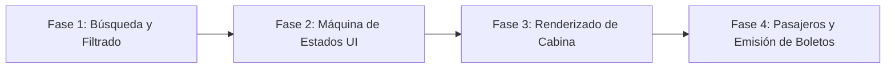

# Sistema de Reserva de Vuelos

<p align="center">
  
</p>

---

## 1. Why?
Si el sistema de cine te enseñó a gestionar una matriz espacial estática, un Sistema de Reserva de Vuelos te introduce en el mundo del filtrado de datos, la gestión de inventario temporal y la estructuración en red (Grafos).

El software de las aerolíneas (como SABRE o Amadeus) es la columna vertebral de la economía global. En este proyecto, aprenderás que un asiento no es solo una coordenada $(x, y)$, sino un recurso condicionado por una variable de tiempo (fecha) y un vector de desplazamiento ($\text{Origen} \to \text{Destino}$). Además, te enfrentarás al desafío de diseñar interfaces de usuario más complejas: formularios de búsqueda, listas de resultados dinámicos y mapas de asientos asimétricos (con pasillos y clases tarifarias distintas).

## 2. Enunciado Formal
Debes desarrollar una aplicación de escritorio con SDL3 que simule un terminal de autoservicio para la compra de boletos de avión.

La aplicación debe contar con un motor de búsqueda donde el usuario seleccione una Ciudad de Origen y una Ciudad de Destino. El sistema filtrará una base de datos de vuelos programados y mostrará los resultados disponibles. Al seleccionar un vuelo, el usuario ingresará al mapa interactivo del avión. A diferencia de un cine, el avión tendrá pasillos centrales y diferentes categorías de asientos (Primera Clase, Económica) con precios dinámicos. El usuario seleccionará su asiento, confirmará la transacción y el sistema registrará la venta en un archivo binario, actualizando la disponibilidad para futuros clientes.

## 3. Hitos de Desarrollo Sugeridos
El flujo de información es más largo que en proyectos anteriores. Divídelo en estas fases:



- **Fase 1: El Motor de Búsqueda (Lógica):** Define la estructura de los Vuelos (Origen, Destino, Fecha, Asientos). Carga una lista de vuelos predefinidos en memoria. Crea la función `buscarVuelos(origen, destino)` que itere sobre tu arreglo principal y devuelva un sub-arreglo (o lista de índices) con las coincidencias. Prueba esto imprimiendo los resultados en la consola.
- **Fase 2: Máquina de Estados y Navegación (SDL3):** Crea las pantallas principales: `PANTALLA_BUSQUEDA` (donde muestras una lista de ciudades clickeables), `PANTALLA_RESULTADOS` (donde listas los vuelos encontrados) y `PANTALLA_AVION`. Asegúrate de programar la lógica del botón "Atrás" para que el usuario pueda cancelar y buscar otra ruta sin reiniciar el programa.
- **Fase 3: Renderizado de la Cabina y Precios:** Dibuja el interior del avión. Físicamente es un cilindro largo. Representa el pasillo central dibujando los asientos de la izquierda, dejando un espacio vacío en el medio, y luego los de la derecha (ej. configuración 3-3). Asigna un multiplicador de precio a las primeras 3 filas (Primera Clase). Permite seleccionar asientos con el ratón.
- **Fase 4: Flujo de Compra, Ticket y Persistencia:** Al confirmar la compra de un asiento, marca el estado como `OCUPADO`. Vuelca el arreglo completo de vuelos a un archivo binario (`vuelos_bd.dat`). Genera visualmente un "Pase de Abordar" (*Boarding Pass*) en la pantalla final con el código del vuelo, asiento y monto pagado.

## 4. Consideraciones Técnicas y Paradigmas
- **Mapas No Homogéneos:** En un cine, una matriz de $10 \times 15$ es perfecta. En un avión, la columna del medio suele ser un pasillo. En tu matriz lógica `Asiento cabina[FILAS][COLUMNAS]`, puedes usar un estado especial (ej. `ZONA_PASILLO` o `TIPO_NULO`) para que el renderizador y el ratón ignoren esa celda por completo.
- **Manejo de Cadenas de Texto (Strings):** Comparar orígenes y destinos requerirá un uso intensivo de `strcmp()`. Asegúrate de estandarizar los textos (ej. todo en mayúsculas sin espacios extra) para evitar que una búsqueda de `" MADRID"` falle contra `"MADRID "`.
- **Listas Dinámicas de Resultados:** Si una búsqueda arroja 5 vuelos, tu interfaz debe saber dibujar exactamente 5 botones/rectángulos apilados verticalmente, y calcular el área de clic (`SDL_FRect`) de forma matemática en un bucle `for`, no con coordenadas "hardcodeadas".
- **Compilación Automatizada con Makefile:**
  Ejemplo sugerido de Makefile:

```makefile
CC = gcc
CFLAGS = -Wall -Wextra -std=c11 -Iinclude
LDFLAGS = -lSDL3 -lSDL3_ttf

SRCS = src/main.c src/vuelos.c src/interfaz.c src/render_avion.c
OBJS = $(SRCS:.c=.o)
TARGET = aero_reserva

all: $(TARGET)

$(TARGET): $(OBJS)
	$(CC) $(OBJS) -o $(TARGET) $(LDFLAGS)

%.o: %.c
	$(CC) $(CFLAGS) -c $< -o $@

clean:
	rm -f $(OBJS) $(TARGET)

.PHONY: all clean
```

## 5. Arquitectura de Datos y Persistencia

### Modelado de Estructuras en C

```c
#include <stdbool.h>
#include <SDL3/SDL.h>

#define MAX_VUELOS 50
#define FILAS_AVION 20
#define COLS_AVION 7 // Ej: 3 asientos, 1 pasillo, 3 asientos

typedef enum {
    CLASE_ECONOMICA,
    CLASE_PRIMERA,
    ZONA_PASILLO // No es un asiento interactuable
} ClaseAsiento;

typedef enum {
    ESTADO_LIBRE,
    ESTADO_OCUPADO,
    ESTADO_SELECCIONADO
} EstadoAsiento;

// Un asiento individual
typedef struct {
    ClaseAsiento clase;
    EstadoAsiento estado;
    double precio;
} Asiento;

// Un vuelo específico
typedef struct {
    char codigoVuelo[8]; // Ej: "IB6844"
    char origen[32];
    char destino[32];
    char fecha[11];      // "YYYY-MM-DD"
    char hora[6];        // "14:30"
    Asiento cabina[FILAS_AVION][COLS_AVION];
} Vuelo;

// Base de datos global
typedef struct {
    Vuelo catalogo[MAX_VUELOS];
    int totalVuelos;
} SistemaVuelos;

// Estado de la UI
typedef enum {
    VISTA_BUSCADOR,
    VISTA_RESULTADOS,
    VISTA_MAPA_ASIENTOS,
    VISTA_TICKET
} VistaApp;

typedef struct {
    SistemaVuelos bd;
    VistaApp vistaActual;
    
    // Variables temporales de la sesión
    char busquedaOrigen[32];
    char busquedaDestino[32];
    int resultadosIndices[MAX_VUELOS]; // Qué vuelos coincidieron
    int cantidadResultados;
    int vueloActivoIndex;              // El vuelo que el usuario está mirando
} AppState;
```

### Persistencia (`reservas_vuelos.dat`)
Dado el modelado de tamaño fijo, puedes guardar la variable `bd` completa (que contiene los 50 vuelos y sus mapas de asientos) volcándola directamente con `fwrite(&app.bd, sizeof(SistemaVuelos), 1, archivo);`.

## 6. Recomendaciones de Flujo y UI (SDL3)
- **El Scroll (Desplazamiento):** Un avión de 20 o 30 filas no cabe verticalmente en una pantalla de resolución estándar si dibujas los asientos a un tamaño clickeable cómodo. Necesitarás implementar un `offsetY`. Si el usuario usa la rueda del ratón (`SDL_EVENT_MOUSE_WHEEL`), suma o resta a ese offset para desplazar el dibujo de la cabina hacia arriba o abajo, simulando un Scroll.
- **Código de Colores de Cabina:**
  - Económica Libre: Azul claro.
  - Primera Clase Libre: Púrpura o Dorado.
  - Pasillo: Transparente (o color del piso).
  - Ocupado: Gris oscuro o cruz roja cruzando el asiento.
- **Feedback Condicional:** Si la búsqueda arroja 0 resultados, no dejes una pantalla en blanco. Muestra un mensaje claro como "No hay vuelos disponibles para esta ruta" y un botón vistoso para "Nueva Búsqueda".

## 7. Casos Borde y Manejo de Errores
- **El Pasillo Clickeable:** El usuario intentará hacer clic en el espacio vacío del pasillo. Tu función que convierte el clic a la coordenada `[fila][columna]` debe verificar inmediatamente `if (cabina[f][c].clase == ZONA_PASILLO)` y, de ser cierto, retornar sin hacer nada (ignorar el evento).
- **Vuelos Llenos (Overbooking):** Si un vuelo tiene el $100\%$ de sus asientos en `ESTADO_OCUPADO`, en la pantalla de resultados este vuelo debería aparecer atenuado (gris) o con una etiqueta roja de "AGOTADO", impidiendo que el usuario haga clic para entrar al mapa de asientos.
- **Filtros Flexibles:** ¿Qué pasa si el usuario escribe "santiago" en minúsculas y tu base de datos dice "SANTIAGO"? Usa funciones que conviertan las cadenas a mayúsculas antes de ejecutar `strcmp` para asegurar que el motor de búsqueda sea a prueba de errores de formato humanos.

## 8. Verificadores de Funcionamiento (Checklist)
- [ ] **Compilación Modular:** `make` compila sin errores ni advertencias.
- [ ] **Motor de Búsqueda:** La aplicación filtra correctamente los vuelos que coinciden con Origen y Destino, omitiendo los que no.
- [ ] **Geometría Irregular:** El renderizado del avión dibuja correctamente los pasillos vacíos y distingue visualmente entre clases de asientos.
- [ ] **Selección y Validación:** Es posible seleccionar uno o más asientos libres. El precio total se calcula sumando el valor específico de cada clase elegida.
- [ ] **Emisión de Boleto:** Se confirma la transacción, bloqueando las butacas elegidas, y se muestra un resumen o Ticket visual.
- [ ] **Persistencia Funcional:** Los asientos reservados siguen estando ocupados tras reiniciar la aplicación.

## 9. Desafíos Opcionales (Bonus)
- **Gestión de Escalas (Grafos y Búsqueda de Rutas):** Si no hay vuelo directo de Ciudad A a Ciudad C, implementa el algoritmo BFS (*Breadth-First Search*) para buscar si existe un vuelo de A a B y otro de B a C. En la pantalla de resultados, muestra esta opción como "Vuelo con 1 Escala".
- **Entrada de Texto Nativa (Input Text):** En lugar de hacer clic en botones predefinidos para elegir el Origen, implementa un campo de texto real. Usa `SDL_StartTextInput()` para capturar pulsaciones del teclado y dibuja el texto que el usuario va escribiendo (ej. "B - U - E - N ...") para buscar la ciudad.
- **Precios Dinámicos (Yield Management):** Modifica la función de cálculo de precios. Escribe una rutina que evalúe el porcentaje de ocupación del avión. Si el avión está más del $70\%$ lleno, incrementa el precio de los asientos restantes automáticamente en un $30\%$, simulando el algoritmo real de oferta y demanda de las aerolíneas.
