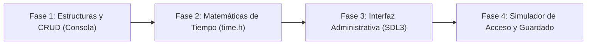

# Sistema de Planes para Gimnasio

<p align="center">
  
</p>

---

## 1. Why?
En los proyectos anteriores gestionamos recursos que se consumen una sola vez (un asiento de cine o de avión). Un Sistema de Gestión de Gimnasio da el salto hacia un paradigma fundamental en el software moderno: el modelo de suscripción (SaaS) y el control de acceso basado en tiempo (*Time-based Access Control*).

A nivel de ingeniería, este proyecto te obligará a dominar la biblioteca estándar `<time.h>` de C para calcular vigencias y vencimientos. Además, implementarás tu primer sistema CRUD completo (Crear, Leer, Actualizar, Borrar) para gestionar una base de datos de usuarios en memoria, y diseñarás una interfaz de "Punto de Control" (*Check-in*) que debe reaccionar instantáneamente para validar o rechazar el acceso de un cliente basándose en el estado de su contrato.

## 2. Enunciado Formal
Debes desarrollar una aplicación de escritorio con SDL3 diseñada para la recepción de un centro deportivo. La aplicación tendrá dos módulos principales: Administración y Control de Acceso.

En el módulo de Administración, el operador podrá registrar nuevos socios (asignándoles un DNI/Identificador y un nombre) y venderles "Planes" (ej. Pase Diario, Mensualidad Básica, Anualidad VIP). Al asignar un plan, el sistema calculará automáticamente la fecha de vencimiento. En el módulo de Control de Acceso, el sistema simulará un escáner: se ingresará el DNI del socio y el programa verificará en tiempo real si el usuario existe y si su plan está vigente (comparando la fecha de vencimiento con el reloj del sistema actual), mostrando una gran señal visual de Acceso Permitido o Denegado. La base de datos de socios debe persistir en un archivo binario.

## 3. Hitos de Desarrollo Sugeridos
La manipulación del tiempo y las fechas es propensa a errores matemáticos sutiles. Avanza en este orden:



- **Fase 1: Estructuras de Datos y Operaciones CRUD:** Define la estructura del Socio. Escribe las funciones lógicas para añadir un socio a un arreglo, buscar un socio por su DNI, modificar su plan y darlo de baja (borrado lógico o físico). Prueba estas operaciones imprimiendo los resultados en la terminal antes de tocar la interfaz gráfica.
- **Fase 2: Matemáticas de Tiempo y Vigencia:** Aprende a usar `time_t` y `struct tm` de la biblioteca `<time.h>`. Crea una función que tome la fecha actual (`time(NULL)`) y le sume 30 días para un plan mensual, o 365 para uno anual. Escribe la función de validación que compare la fecha de vencimiento almacenada en el perfil del socio con la fecha de hoy para retornar un booleano (`true` = acceso permitido, `false` = plan vencido).
- **Fase 3: Interfaz Administrativa y Navegación (SDL3):** Crea las pantallas de UI. Necesitarás una pantalla de "Dashboard" o Menú Principal. Diseña la vista del registro de usuarios, donde se liste la base de datos (mostrando IDs, Nombres y Días Restantes). Implementa botones para renovar el plan de un usuario seleccionado.
- **Fase 4: Simulador de Check-in y Persistencia:** Diseña la pantalla de Acceso. Esta pantalla debe estar limpia, a la espera de un input. Al recibir un DNI y presionar "Ingresar", el sistema buscará al socio. Si está vigente, la pantalla parpadeará en verde; si no, en rojo. Al cerrar la aplicación, todo el arreglo de socios debe volcarse a disco.

## 4. Consideraciones Técnicas y Paradigmas
- **Manipulación de Época (Unix Time):** En C, es mucho más fácil guardar la fecha de vencimiento como un `time_t` (un entero grande que representa los segundos desde el 1 de enero de 1970) que guardar `"15/10/2026"`. Para saber si un plan caducó, la validación es simplemente `if (fechaVencimiento < time(NULL)) { /* Vencido */ }`.
- **Borrado Lógico vs Físico:** Si usas un arreglo para tu base de datos y borras al socio en el índice 2, tendrías que desplazar todos los elementos posteriores hacia atrás para no dejar huecos. En software empresarial, se prefiere el Borrado Lógico: añades un `bool estaActivo` al struct del socio y simplemente lo pones en `false`. El sistema lo ignora, pero conservas el historial.
- **Búsqueda Eficiente ($\mathcal{O}(N)$ vs $\mathcal{O}(\log N)$):** Si el gimnasio tiene 5,000 socios, buscar por DNI iterando desde el 0 hasta el 5,000 (*Linear Search*) es funcional pero ineficiente. Si mantienes el arreglo ordenado por DNI, puedes implementar Búsqueda Binaria para encontrar a cualquier socio en un máximo de 13 iteraciones.
- **Compilación Automatizada con Makefile:**
  Ejemplo sugerido de Makefile:

```makefile
CC = gcc
CFLAGS = -Wall -Wextra -std=c11 -Iinclude
LDFLAGS = -lSDL3 -lSDL3_ttf

SRCS = src/main.c src/db_socios.c src/tiempo.c src/interfaz.c src/checkin.c
OBJS = $(SRCS:.c=.o)
TARGET = gym_manager

all: $(TARGET)

$(TARGET): $(OBJS)
	$(CC) $(OBJS) -o $(TARGET) $(LDFLAGS)

%.o: %.c
	$(CC) $(CFLAGS) -c $< -o $@

clean:
	rm -f $(OBJS) $(TARGET)

.PHONY: all clean
```

## 5. Arquitectura de Datos y Persistencia

### Modelado de Estructuras en C

```c
#include <stdbool.h>
#include <time.h>
#include <SDL3/SDL.h>

#define MAX_SOCIOS 1000

typedef enum {
    PLAN_NINGUNO,
    PLAN_DIARIO,
    PLAN_MENSUAL,
    PLAN_ANUAL
} TipoPlan;

// Perfil de un cliente
typedef struct {
    int dni;
    char nombre[64];
    TipoPlan planActual;
    time_t fechaVencimiento; // Timestamp UNIX del fin del contrato
    bool estaActivo;         // Para el borrado lógico
} Socio;

// La Base de Datos
typedef struct {
    Socio registros[MAX_SOCIOS];
    int cantidadSocios;      // Cuántos slots se han usado
} BaseDatosGym;

// Estado de la Interfaz
typedef enum {
    VISTA_MENU,
    VISTA_ADMIN_SOCIOS,
    VISTA_CONTROL_ACCESO
} VistaApp;

typedef struct {
    BaseDatosGym bd;
    VistaApp vistaActual;
    
    // Variables temporales para el teclado en pantalla o input de DNI
    char inputBuffer[16];
    int longitudInput;
    
    // Variables para el feedback visual del Check-in
    bool mostrarFeedback;
    bool accesoConcedido;
    char mensajeFeedback[128];
    Uint64 tiempoFeedbackMs; // Para que el color verde/rojo desaparezca a los 3 segundos
} AppState;
```

### Persistencia (`socios_db.dat`)
Guardar la base de datos es una operación de bloque directo: `fwrite(&app.bd, sizeof(BaseDatosGym), 1, archivo);`. Como estás usando `time_t`, las fechas se guardan automáticamente como números enteros, evitando problemas de parseo de cadenas de texto al volver a cargar el archivo.

## 6. Recomendaciones de Flujo y UI (SDL3)
- **Teclado Numérico (Numpad Virtual):** En la vista de Control de Acceso, además de capturar las pulsaciones reales del teclado, dibuja un teclado numérico grande en la pantalla interactuable con el ratón. En los gimnasios, este módulo suele correr en tablets o pantallas táctiles (*Touchscreens*), por lo que botones grandes mejoran la experiencia.
- **Feedback Visual Explosivo:** El módulo de acceso debe ser visible desde lejos por el recepcionista. Cuando un acceso sea válido, pinta el $80\%$ de la pantalla de verde e imprime "¡BIENVENIDO [NOMBRE]!". Si está vencido, pinta de rojo intenso con el texto "ACCESO DENEGADO - PLAN VENCIDO". Mantén este color durante $2$ o $3$ segundos (usando temporizadores) antes de limpiar la pantalla para el siguiente.
- **Paginación de Listas:** Si tienes 100 socios, no puedes dibujarlos todos en la pantalla `VISTA_ADMIN_SOCIOS`. Implementa botones de "Siguiente Página" y "Página Anterior" que alteren los índices de tu bucle `for` de renderizado (ej. mostrar del 0 al 10, luego del 10 al 20).

## 7. Casos Borde y Manejo de Errores
- **Duplicidad de Claves (Primary Key Violation):** Antes de crear un socio nuevo, tu sistema DEBE recorrer la base de datos verificando que el DNI ingresado no pertenezca ya a un socio activo. Si existe, debe bloquear el registro y notificar al usuario.
- **El Problema del Fin de Mes:** Si estás calculando fechas sumando segundos (ej. $30 \times 24 \times 60 \times 60$ para un mes), en C eso funciona perfectamente porque `time_t` ignora los saltos bisiestos y longitudes de meses humanos para el cálculo absoluto. Sin embargo, para mostrar la fecha al usuario (convirtiéndolo a cadena con `strftime`), debes asegurar que la zona horaria esté correctamente configurada mediante `localtime()`.
- **Desbordamiento de Input:** Si el usuario conecta un lector de código de barras USB (que actúa como teclado inyectando caracteres muy rápido), y el DNI máximo tiene 8 dígitos, tu `inputBuffer` debe ignorar los caracteres a partir del noveno para evitar sobrescribir memoria y crashear la aplicación.

## 8. Verificadores de Funcionamiento (Checklist)
- [ ] **Compilación Modular:** Makefile funcional sin errores ni warnings.
- [ ] **Operaciones CRUD:** Es posible crear nuevos socios, localizarlos, editar sus planes y eliminarlos (borrado lógico).
- [ ] **Manejo del Tiempo:** Al asignar un plan, la fecha de vencimiento se calcula correctamente a futuro.
- [ ] **Buscador/Lector de Accesos:** El sistema de check-in identifica al socio a partir de su ID.
- [ ] **Control Condicional:** El acceso se concede si la fecha actual es menor al vencimiento, y se deniega si ya pasó, mostrando feedback visual claro.
- [ ] **Persistencia:** La lista de usuarios y sus vigencias se guardan y recuperan tras reiniciar el software.

## 9. Desafíos Opcionales (Bonus)
- **Aforo en Tiempo Real (Capacity Tracking):** Añade un contador de "Personas en el interior". Cuando un socio hace check-in, súmalo al aforo. Crea un botón de "Check-out" (o asume salida automática tras 2 horas) para restarlo. Muestra este aforo en el Dashboard. Si llega al límite físico del local, lanza una alerta.
- **Historial de Asistencias (Logging):** Además de validar el acceso, escribe cada ingreso exitoso en un archivo de texto (`log_asistencias.txt`) con la fecha, hora y nombre del socio. Esto sirve para generar métricas de negocio (¿A qué hora viene más gente?).
- **Planes Limitados por Uso (Clases/Tickets):** En lugar de usar fechas, implementa un "Plan de 10 Clases". Al hacer check-in, además de verificar la fecha, resta $1$ a la variable `clasesRestantes`. Si llega a $0$, se deniega el acceso aunque la fecha aún sea válida.
