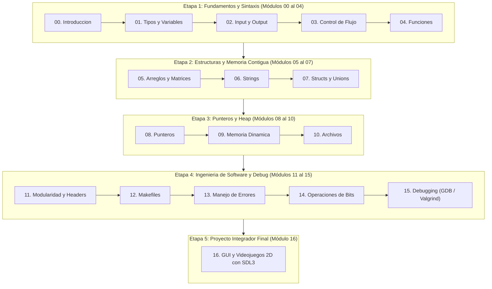

# Basic-C-Without-Tears

<div align="center">


**Aprende C moderno sin lágrimas: desde los fundamentos teóricos clásicos de K&R hasta gráficos y videojuegos 2D con SDL3.**

</div>

---

## 1. Introducción y Filosofía del Proyecto

¿Vienes de lenguajes como Python, JavaScript o Java y sientes que C es un terreno hostil lleno de trampas invisibles? No estás solo. La ausencia de recolector de basura (*garbage collector*), el tipado estricto a nivel de hardware y la gestión directa de punteros suelen causar frustración si no se explican con la técnica adecuada.

**Basic-C-Without-Tears** nace para derribar esa barrera. Este repositorio es un curso integral, práctico y libre de dolores de cabeza, diseñado para que adquieras el control total de la memoria y entiendas cómo interactúa tu código con la arquitectura del computador, aprenderás diversas nociones acerca de cómo se maneja el hardware de tu máquina, jerarquía de memoria, comparaciones entre Python y C, etc.

### La Referencia Fundacional: K&R C
Toda la base conceptual, la estructura de tipos y el rigor técnico de este material están directamente inspirados y fundamentados en la obra cumbre de la informática:

> **"The C Programming Language" (2nd Edition - ANSI C)**  
> *Brian W. Kernighan & Dennis M. Ritchie (Prentice Hall)*

Hemos tomado los principios atemporales de los creadores originales del lenguaje y los hemos actualizado al estándar contemporáneo (**C11 / C23**), incorporando buenas prácticas de seguridad de memoria, herramientas modernas de depuración (`GDB`, `Valgrind`) y programación multimedia avanzada con **SDL3**, esta guía es ideal para estudiantes universitarios de primeros años o gente que tiene nociones de programación en lenguajes más "simples" y quieren inmiscuirse por completo en la programación de sistemas, adquiriendo la capacidad de desarrollar sistemas con un nivel de complejidad medio/alto.

---

## 2. Mapa del Repositorio (Estructura de Carpetas)

El proyecto está organizado de manera modular para separar la teoría, los ejercicios prácticos, las evaluaciones y los proyectos reales:

```
Basic-C-Without-Tears/
├── Modulos/      <- 17 unidades temáticas (00 al 16), de Hello World a SDL3
├── Ejercicios/    <- Banco de problemas prácticos clasificados por conceptos
├── Proyectos/    <- Proyectos integradores (videojuegos, simulación, dashboards)
├── Examenes/     <- Guías de evaluación, preguntas tipo test y pautas en PDF/LaTeX
├── Anexos/       <- Tablas de consulta rápida, chuletas de memoria y formatos
└── LICENCIA.md   <- Términos legales bajo la Licencia de Código Abierto MIT
```

* [`Modulos/`](./Modulos/README.md): El corazón teórico y práctico del curso. Contiene las 17 unidades de aprendizaje progresivo, cada una con su código fuente y banco de pruebas local.
* [`Ejercicios/`](./Ejercicios/README.md): Baterías de problemas clasificados por áreas (Lógica y Números, Arreglos y Textos, Modelado y Memoria).
* [`Proyectos/`](./Proyectos/README.md): Proyectos de mayor envergadura para afianzar los conocimientos en escenarios del mundo real.
* [`Examenes/`](./Examenes/README.md): Material académico de evaluación con guías de preguntas teóricas, ejercicios prácticos y pautas de resolución.
* [`Anexos/`](./Anexos/README.md): Referencias rápidas sobre especificadores de formato, diagramas de memoria y comparativas de sintaxis Python vs. C.

---

## 3. Ruta Formativa (Roadmap del Curso)

El plan formativo se divide en cinco etapas incrementales:



Consulta el detalle descriptivo de cada unidad en el [Índice General de Módulos](./Modulos/README.md).

---

## 4. Requisitos y Comandos de Instalación

Para compilar y ejecutar todos los ejemplos del curso, depurar con herramientas profesionales y correr el videojuego interactivo con gráficos acelerados por GPU y audio multicanal, instala los paquetes requeridos según tu sistema operativo:

> [!TIP]
> **¿No tienes un sistema Linux?**  
> Si no cuentas con una distribución de Linux o prefieres un entorno listo para programar sin configurar todo desde cero, puedes crear fácilmente una imagen de Linux con herramientas de desarrollo preinstaladas usando la aplicación [**Rookie Linux Develop**](https://github.com/StackDs/Rookie-Linux-Develop.git).

### Arch Linux / Manjaro
```bash
sudo pacman -Syu --needed base-devel gcc gdb valgrind pkgconf sdl3 sdl3_mixer
```

### Ubuntu / Debian / Linux Mint
```bash
sudo apt update
sudo apt install -y build-essential gcc gdb valgrind pkg-config libsdl3-dev libsdl3-mixer-dev
```
> [!NOTE]
> En distribuciones basadas en Debian o Ubuntu anteriores a la inclusión oficial de paquetes SDL3 en sus repositorios principales, puedes compilar SDL3 fácilmente desde la fuente (ver sección abajo) o instalarlo mediante PPA.

### Fedora / RHEL / CentOS Stream
```bash
sudo dnf groupinstall "Development Tools" -y
sudo dnf install -y gcc gdb valgrind pkgconfig SDL3-devel SDL3_mixer-devel
```

### macOS (Homebrew)
```bash
brew update
brew install gcc make gdb pkg-config sdl3 sdl3_mixer
```

### Windows (WSL2 / MSYS2)
* **Crear tu propio entorno Linux:** Si no tienes un sistema Linux, puedes generar una máquina/imagen con entorno de desarrollo listo mediante [**Rookie Linux Develop**](https://github.com/StackDs/Rookie-Linux-Develop.git).
* **Opción con WSL2 (Ubuntu):** Instala [WSL2](https://learn.microsoft.com/es-es/windows/wsl/install) y sigue los pasos de **Ubuntu / Debian** directamente en la terminal de Linux con soporte gráfico WSLg.
* **Opción nativa (MSYS2 - UCRT64):**
  ```bash
  pacman -Syu --needed base-devel mingw-w64-ucrt-x86_64-gcc mingw-w64-ucrt-x86_64-gdb mingw-w64-ucrt-x86_64-pkgconf mingw-w64-ucrt-x86_64-sdl3 mingw-w64-ucrt-x86_64-sdl3_mixer
  ```

### Compilación desde el Código Fuente (Alternativa Universal)
Si tu distribución no dispone de paquetes precompilados de SDL3:
```bash
# 1. Compilar e instalar SDL3
git clone https://github.com/libsdl-org/SDL.git -b main --depth 1
cd SDL && mkdir build && cd build
cmake .. -DCMAKE_BUILD_TYPE=Release
cmake --build . --parallel $(nproc)
sudo cmake --install .
sudo ldconfig

# 2. Compilar e instalar SDL3_mixer
git clone https://github.com/libsdl-org/SDL_mixer.git -b main --depth 1
cd SDL_mixer && mkdir build && cd build
cmake .. -DCMAKE_BUILD_TYPE=Release
cmake --build . --parallel $(nproc)
sudo cmake --install .
sudo ldconfig
```

### Verificación del Entorno
Comprueba que el compilador, las herramientas de depuración y las bibliotecas multimedia están correctamente detectados en tu sistema:
```bash
gcc --version
make --version
pkg-config --modversion sdl3 sdl3-mixer
```

---

## 5. Cómo Utilizar este Material

1. **Clonar el Repositorio:**
   ```bash
   git clone https://github.com/StackDs/Basic-C-Without-Tears.git
   cd Basic-C-Without-Tears
   ```

2. **Seguir el Orden de los Módulos:**
   Entra a la carpeta [`Modulos/`](./Modulos/README.md) y avanza desde el Módulo 00. Cada módulo contiene su propia explicación didáctica, ejemplos prácticos comentados y su banco de pruebas ejecutable.

3. **Compilar los Ejemplos:**
   En cada submódulo encontrarás el comando directo de compilación con `gcc`. Por ejemplo:
   ```bash
   gcc -Wall -Wextra -std=c11 main.c -o programa
   ./programa
   ```

4. **Probar el Proyecto Culminante (Videojuego 2D):**
   Al llegar al Módulo 16, podrás compilar y jugar al videojuego completo mediante `make`:
   ```bash
   cd Modulos/16_GUI_SDL/06_Audio_y_Final
   make run
   ```

---

## 6. Referencias Bibliográficas

* **Kernighan, B. W., & Ritchie, D. M. (1988).** *The C Programming Language* (2nd ed.). Prentice Hall. (Referencia canónica del diseño y sintaxis de C).
* **ISO/IEC 9899:2018 / 2024.** *Information technology — Programming languages — C* (Estándares C11, C17 y C23).
* **Simple DirectMedia Layer (SDL3):** [Documentación Oficial de SDL3](https://wiki.libsdl.org/SDL3/FrontPage).
* **GNU Project:** [Documentación Oficial de GCC, Make y GDB](https://www.gnu.org/manual/).

---

## 7. Licencia y Uso de la Guía

Este material y guía práctica están publicados bajo la **Licencia MIT**.

Tienes total libertad para **usar, cambiar, modificar, adaptar y distribuir** tanto el código fuente como los contenidos explicativos de esta guía para fines educativos, académicos o personales, **siempre y cuando se mantenga la referencia y el crédito correspondiente a la fuente original de donde se obtuvo**:

> *Basado en la guía práctica **Basic-C-Without-Tears** por [StackDs](https://github.com/StackDs/Basic-C-Without-Tears).*

Para consultar los términos legales completos y el aviso de derechos de autor, revisa el archivo [`LICENCIA.md`](./LICENCIA.md).

---

<div align="center">
  <h3><a href="./Modulos/README.md">Comenzar con los Módulos ➡️</a></h3>
</div>
